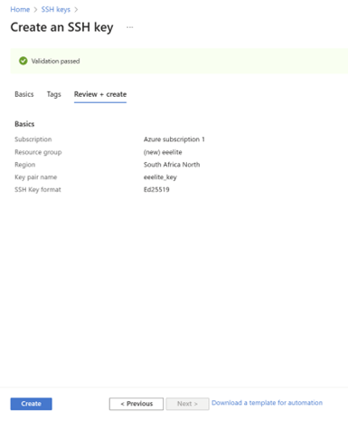
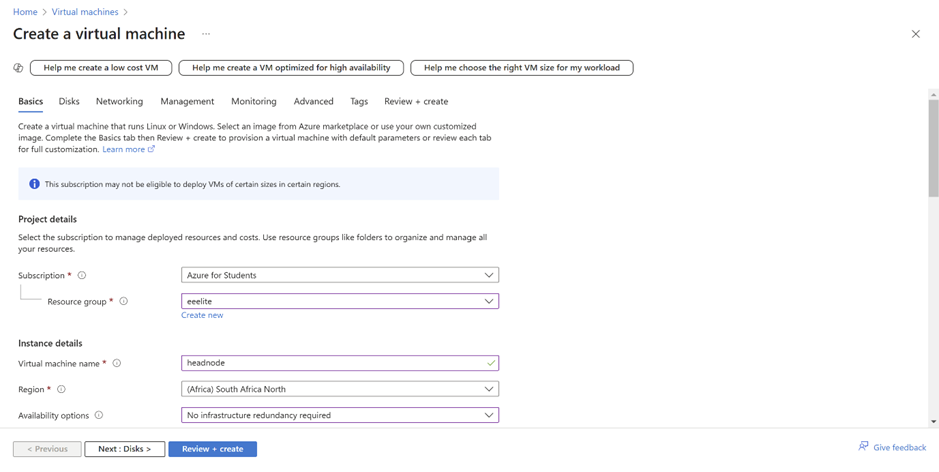
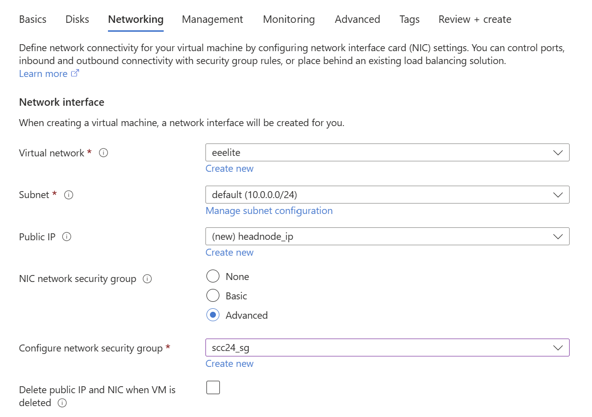
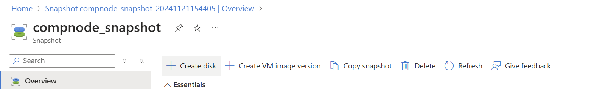

# Creating Azure Account

### Steps to creating an Azure Account

Create a free azure account using this link: <a href="https://azure.microsoft.com/en-us/pricing/purchase-options/azure-account?icid=azurefreeaccount">Sign Up for Azure</a>

Once created you should be taken to this page:<p align="center"></p>

### Generating SSH key

 SSH keys allows you to authenticate against a remote SSH server, without the use of a password.

> [!IMPORTANT]
> When you are presented with foldable code blocks, you must pick and implement only **one** of the options presented, which is suitable to your current configuration and/or circumstance.

> [!TIP]
> A number [encryption algorithms](https://en.wikipedia.org/wiki/Public-key_cryptography) exist for securing your SSH connections. [Elliptic Curve Digital Signature Algorithm (ECDSA)](https://en.wikipedia.org/wiki/Elliptic_Curve_Digital_Signature_Algorithm) is secure and simple enough should you need to copy the public key manually. Nonetheless, you are free to use whichever algorithm you choose to.

From the `Start` menu, open the Windows `PowerShell` application:
These commands are the same if you are commenting from a Linux, Unix or MacOS Terminal, and Moba XTerm.
1. Generate an SSH key pair:
   ```bash
   ssh-keygen -t ed25519
   ```
1. When prompted to _"Enter file in which to save the key"_, press `Enter`,
1. When prompted to _"Enter a passphrase"_, press `Enter`, and `Enter` again to verify it.

   <p align="center"></p>

> [!TIP]
> Below is an example using Windows PuTTY. It is hidden and you must click the heading to reveal it's contents. You are strongly encourage to use either Windows PowerShell or Moba XTerm instead.

<details>
<summary>Windows PuTTY</summary>

[PuTTY](https://putty.org/) is a Windows-based SSH and Telnet client. From the `Start` menu, open the `PuTTYgen` application.
1. Generate an SSH key pair using the `Ed25519` encryption algorithm.
1. Generate the necessary entropy by moving your mouse pointer over the `Key` section until the green bar is filled.
   <p align="center"></p>

1. Proceed to **Save** both the `Private Key` and `Public Key`.
   <p align="center"></p>
</details>

You **MUST** take note of the location and paths to **BOTH** your public and private keys. Your public key will be shared and distributed to the SSH servers you want to authenticate against. Your private key must be kept secure within your team, and must not be shared or distributed to anyone.

Once you have successfully generated an SSH key pair, navigate to `Compute` &rarr; `Key Pairs` and import the **public** key `id_ed25519.pub` into your Team's Project Workspace within Azure.

Navigate to SSH keys using the search bar .This page will appear: Click **Create SSH key.** 

You may need to create a new resource group. Under Resource group simply create a new group with an appropriate name which can be associated with all future tasks for this project. 

Fill in all the fields with your groups information and Upload the newly created public key 'id_ed25519.pub'. 

Click **review + create.** 
Ensure it passes validation and click create.



The key should then appear on your dashboard.
>[!TIP]
>If it takes time to appear, keep refreshing.

### Launching a New Instances
From the Azure dashboard, go to `Virtual machines -> Create -> Azure virtual machine.`
Within the current window assign an appropriate name which will describe what the VM's intended purpose is meant to be and help you to remember it's primary function.              

>[!TIP]
>In this case, a suitable name for your instance would be <b>headnode</b>.

Under Resource Group, pick the one created earlier and under Region, pick <b>South Africa.</b>

### Linux Flavours and Distributions

<details>
<summary>Summary of Linux Distributions</summary> 

A Linux distribution, is a collection of software that is at the very leased comprised of a [Linux kernel](https://en.wikipedia.org/wiki/Linux_kernel) and a [package manager](https://en.wikipedia.org/wiki/Package_manager). A package manager is responsible for automating the process of installing, configuring, upgrading, downgrading and removing software programs and associated components from a computer's operating system.

A number of considerations must be taken into account when deciding on choice of Linux distro as a *'daily driver'* and as well as a server. There are subtleties and nuances between the various Linux flavors. These vary from a number of factors, not least of which including:
* Support - is the project well documented and do the developers respond to queries,
* Community - is there a large and an active userbase,
* Driver Compatibility - will the distro *'natively'* run on your hardware without workarounds or custom compilation / installation of various device drivers,
* Stability and Maturity - is the intended distro and version currently actively supported and maintained, not 'End of Life' and verified to run across a number of different systems and environment configurations. Or do you intend to run a *'bleeding-edge'* distro so that you may in the future, influence the direction of application development and assist developers in identifying bugs in their releases...

You and your Team, together with input and advise from your mentors, must do some research and depending on the intended use case, decide which will be the best choice.

The following list provides a few examples of Linux distros that *may* be available on the Sebowa OpenStack cloud for you to use, and that you *might* consider using as a *'daily driver'*.

> [!TIP]
> You do not need to decide right now which Linux Flavor you and your team will be installing on you personal / school laptop and desktop computers. The list and corresponding links are provided for later reference, however for the time being you are strongly encouraged to proceed with **Rocky 9.3 image**. If you are already using or familiar with Linux, discuss this with the instructors who will advise you on how to proceed.

* **RPM** or Red Hat Package Manager is a free and open-source package management system. The name RPM refers to the `.rpm` file format and the package manager program itself. Examples include [Red Hat Enterprise Linux](https://www.redhat.com/en/technologies/linux-platforms/enterprise-linux), [Rocky Linux](https://rockylinux.org/), [Alma Linux](https://almalinux.org/), [CentOS Stream](https://www.centos.org/centos-stream/) and [Fedora](https://fedoraproject.org/). You can't go wrong with choose of either Red Hat, Alma, ***Rocky*** or CentoS Stream for the competition. You manage packages through tools such at `yum` (Yellowdog Updater, Modified) and / or `dnf` (Dandified YUM).

* **Zypper** is the package manager used by [openSUSE](https://www.opensuse.org/), [SUSE Linux Enterprise (SLE)](https://www.suse.com/), and related distributions. This is another good choice for beginners, however openSUSE is not available as an image for the competition.

* **APT**: In Debian-based distributions, the installation and removal of software are generally managed through the package management system known as the Advanced Package Tool (APT). Examples include [Debian](https://www.debian.org/), [Ubuntu](https://ubuntu.com/), [Linux Mint](https://linuxmint.com/), [Pop! OS](https://pop.system76.com/) and [Kali Linux](https://www.kali.org/). Debian or Ubuntu Based Linux distributions are fantastic options for beginners. If one of your team members are already using such a system, then you are advised to use the provided Ubuntu image for the competition.

* **PkgTool** is a menu-driven package maintenance tool provided with the [Slackware Linux distribution](http://www.slackware.com/). Listed here for interest, not recommended for beginners.

* **Pacman** is a package manager that is used in the [Arch Linux](https://archlinux.org/) distribution and its derivatives such as [Manjaro](https://manjaro.org/). Not recommended for beginners.

* **Portage** is a package management system originally created for and used by  [Gentoo Linux](https://www.gentoo.org/) and also by ChromeOS. Definitely not recommended for beginners.

* **Source-Based**: [Linux From Scratch (LFS)](https://www.linuxfromscratch.org/) is a project that teaches you how to create your own Linux system from source code, using another Linux system. Learn how to install, configure and customize LFS and BLFS, and use tools for automation and management. Once you are **very** familiar with Linux, LFS is an excellent medium term side project that you peruse in you own time. Only Linux experts need apply.
</details>

**Under Image select the desired distribution.**

### Azure Instance Sizes

An important aspect of system administration is resource monitoring, management and utilization. 


> [!TIP]
> When designing clusters, very generally speaking the *'Golden Rule'* in terms of Memory is **2 GB of RAM per CPU Core**. The storage on your head node is typically '*shared*' to your compute nodes through some form of [Network File System (NFS)](https://en.wikipedia.org/wiki/Network_File_System).

**Under Size click the desired instance size.**

### Key Pair 
Still under the Basics tab, associate the SSH Key that you created earlier to your VM, otherwise you will not be able to log into your newly created instance.


## Disks,Networking and Security 
### Disks 
Under *Disks*, ensure that the following options are configured:  
1. *OS Disk Type is set to `Standard SSD`,*
2. *Delete with VM is <b>NOT</b> checked*


### Networking and Security
Under *Networking*, ensure the following options are configured:
1. *Virtual network* is set to <b>your team’s network</b> 
2. *Subnet* can be the default 
3. *NIC network security group* is set to `Advanced` and the corresponding group is applied
    


>[!NOTE]
>If your team does not have a <b>Virtual Network or Security Group<> already configured, simply create</b> one at this stage which can be related to all future creations under the same project. 

>[!IMPORTANT]
>Verify that your instance was successfully Deployed and Launched


# Creating a Snapshot

At this point you are ready to run HPL on your cluster with two compute nodes. From your Virtual Machine dasboard on Azure, navigate to the node which you wish to create a snapshot of. Go to <b>`Disk -> Name of the actual Disk -> +Create Snapshot.`</b>


Once there, simply choose an adequate Name for the snapshot, ensure that the *Snapshot Type* is ‘Full’ and 
click **Review + Create.**

>[!TIP]
> A suitable name for the snapshot would be computenode2


Creating the actual VM from the snapshot requires two steps. First navigate to the snapshot and click **`+ Create Disk.`**

>[!TIP]
>Simply choose an adequate name (no other changes need to be made) when creating the disk. 



Then navigate to the newly created disk and click **`+ Create VM.`** Ensure that everything is set up as in Tutorial 1, choosing an adequate name once again, and then *Review + Create.*


Navigate back to the Virtual Machine dashboard and your second compute node should be <b>deployed and running.</b> 


