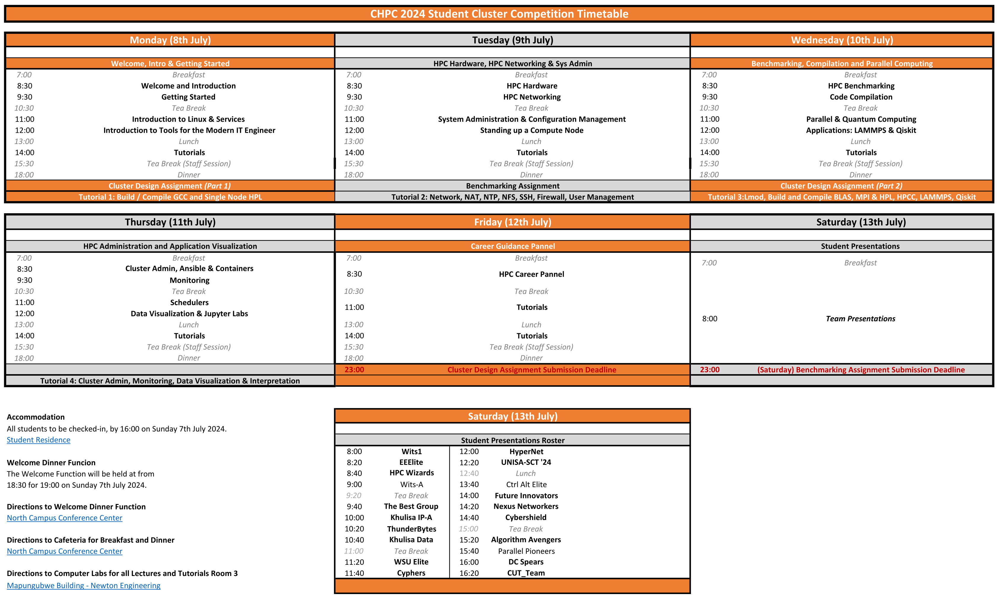
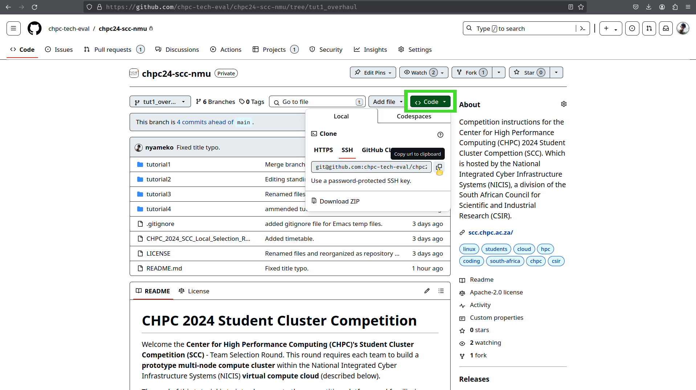

CHPC 2024 Student Cluster Competition
======================================

Welcome the **Center for High Performance Computing (CHPC)'s Student Cluster Competition (SCC)** - Team Selection Round. This round requires each team to build a **prototype multi-node compute cluster** within the National Integrated Cyber Infrastructure Systems (NICIS) **virtual compute cloud** (described below).

The goal of this document is to introduce you to the competition platform and familiarise you with some Linux and systems administration concepts. This competition provides you with a fixed set of virtual resources, that you will use to initialize a set a set of virtual machines instances based on your choice _or flavor_ of *Linux*.

# Table of Contents

<!-- markdown-toc start - Don't edit this section. Run M-x markdown-toc-refresh-toc -->
1. [Structure of the Competition](#structure-of-the-competition)
    1. [Getting Help](#getting-help)
    1. [Timetable](#timetable)
    1. [Scoring](#scoring)
    1. [Instructions for Mentors](#instructions-for-mentors)
        1. [Hands-Off Rule *(You may not touch the keyboard)*](#hands-off-rule-you-may-not-touch-the-keyboard)
    1. [Cheat Sheet](#cheat-sheet)
1. [Deliverables](#deliverables)
    1. [Cluster Design Assignment](#cluster-design-assignment)
    1. [Technical Knowledge Assessment](#technical-knowledge-assessment)
    1. [Tutorials](#tutorials)
1. [Links to Livestreams and Lecture Recordings](#links-to-livestreams-and-lecture-recordings)
1. [Contributing to the Project](#contributing-to-the-project)
    1. [Steps to follow when editing existing content](#steps-to-follow-when-editing-existing-content)
    1. [Syntax and Style](#syntax-and-style)

<!-- markdown-toc end -->

# Structure of the Competition

The CHPC invites applications from suitably qualified candidates to enter the CHPC Student Cluster Competition. The CHPC Student Cluster Competition gives undergraduate students at South African universities exposure to the High Performance Computing (HPC) Industry. The winning team will be entered into the ISC Student Cluster Competition hosted at the [2025 International Supercomputing Conference](https://www.isc-hpc.com/) held in Hamburg, Germany.

You will be accessing all of the course work and material through this GitHub repository, which you and your team must check regularly to receive updates.

## Getting Help

You are strongly encouraged to get help and even assist others by [Opening and Participating in Discussions](https://github.com/chpc-tech-eval/chpc24-scc-nmu/discussions).

> [!TIP]
> Active participation in the student discussions is an easy way to separate yourselves from the rest of the competition and make it easy for the instructors to notice you!

## Timetable

Everyday will comprise of four lectures in the mornings and tutorials taking place in the afternoons. A [PDF Version of the Timetable](resources/CHPC_2024_SCC_Local_Selection_Round_Timetable.pdf) is available for you to download.

<p align="center"></p>

## Scoring

Teams will be evaluate according to the following breakdown, with your progress in the tutorials and your final presentations carrying the most weight.

| Component                          | Weight |
|:-----------------------------------|:------:|
|                                    |        |
| Technical Knowledge Assessment     | 0.1    |
| Tutorials                          | 0.4    |
| Cluster Design Assignment (Part 1) | 0.1    |
| Cluster Design Presentation        | 0.4    |
|                                    |        |

## Instructions for Mentors

The role of mentors, instructors and volunteers is to provide leadership and guidance for the student competitors participating in this year's Center for High Performance Computing 2024 Student Cluster Competition.

In preparing your teams for the competition, your main goal is to ensure that you teach and impart knowledge to the student participants in such a way that they are empowered and enable to tackle the problems and benchmarking tasks themselves.

### Hands-Off Rule *(You may not touch the keyboard)*

Under no circumstances whatsoever may mentors touch any competition hardware belonging to either their team, or the competition hardware of another team. Mentors are encouraged to provide guidance and leadership to their *(as well as other)* teams.

Any mentors found to be directly in contravention of this rule, may result in their team incurring a penalty. Repeated infringements may result in possible disqualification of their team.

## Cheat Sheet

Below is a table with a number of Linux system commands and utilities that you *may* find useful in assisting you to debug problems that you may encounter with your clusters. Note that some of these utilities do not ship with the base deployment of a number of Linux flavors, and you may be required to install the associated packages, prior to making use of them.

| Command            | Description                                                                                                                                                                                                        |
| ---                | ---                                                                                                                                                                                                                |
| ssh                | Used from logging into the remote machine and for executing commands on the remote machine.                                                                                                                        |
| scp                | SCP copies files between hosts on a network. It uses ssh for data transfer, and uses the same authentication and provides the same security as ssh.                                                                |
| wget / curl        | Utility for non-interactive download of files from the Web.It supports HTTP, HTTPS, and FTP protocols.                                                                                                             |
| top / htop / btop  | Provides a dynamic real-time view of a running system. It can display system summary information as well as a list of processes or threads.                                                                        |
| screen / tmux      | Full-screen window manager that multiplexes a physical terminal between several processes (typically interactive shells).                                                                                          |
| ip a               | Display IP Addresses and property information                                                                                                                                                                      |
| dmesg              | Prints the message buffer of the kernel. The output of this command typically contains the messages produced by the device drivers                                                                                 |
| watch              | Execute a program periodically, showing output fullscreen.                                                                                                                                                         |
| df -h              | Report file system disk space usage.                                                                                                                                                                               |
| ping               | PING command is used to verify that a device can communicate with another on a network.                                                                                                                            |
| lynx               | Command-line based web browser (more useful than you think)                                                                                                                                                        |
| ctrl+alt+[F1...F6] | Open another shell session (multiple ‘desktops’)                                                                                                                                                                   |
| ctrl+z             | Move command to background (useful with ‘bg’)                                                                                                                                                                      |
| du -h              | Summarize disk usage of each FILE, recursively for directories.                                                                                                                                                    |
| lscpu              | Command line utility that provides system CPU related information.                                                                                                                                                 |
| lstotp             | View the topology of a Linux system.                                                                                                                                                                               |
| inxi               | Lists information related to your systems' sensors, partitions, drives, networking, audio, graphics, CPU, system, etc...                                                                                           |
| hwinfo             | Hardware probing utility that provides detailed info about various components.                                                                                                                                     |
| lshw               | Hardware probing utility that provides detailed info about various components.                                                                                                                                     |
| proc               | Information and control center of the kernel, providing a communications channel between kernel space and user space. Many of the preceding commands query information provided by proc, i.e. `cat /proc/cpuinfo`. |
| uname              | Useful for determining information about your current flavor and distribution of your operating system and its version.                                                                                            |
| lsblk              | Provides information about block devices (disks, hard drives, flash drives, etc) connected to your system and their partitioning schemes.                                                                          |
|                    |                                                                                                                                                                                                                    |

# Deliverables

You will need to submit the following for scoring and evaluation by the judges:
* Cluster Design Assignment (Part 1) *[10 %]*
* Cluster Design Assignment (Part 2) *[40 %]*
  * One PDF Presentation Slide with Team Profiles
    This slide must clearly indicate your Team Name and Institution. Below each team member's photograph, indicate their
    * Name and surname,
    * Degree and Year of study,
  * Presentation Slides
  * Short Technical Brief with Cluster Design Specifications
* Technical Knowledge Assessment *[10 %]*
* Tutorials *[40 %]*

## Cluster Design Assignment

You are tasked with designing a small cluster, with at least three nodes, to the value of R 400  000.00 (ZAR) and present your design to the judging panel. In your design you must specify hardware and software for an operational cluster and describe how it functions. The design must be based on servers and interconnects from either [HPE](https://buy.hpe.com/us/en/servers-systems) or [Dell](www.dell.com/en-us), and accessories from either [NVIDIA](https://www.nvidia.com/en-us/high-performance-computing/), or [AMD](https://www.amd.com/en/solutions/high-performance-computing.html) or [Intel](https://www.intel.com/content/www/us/en/high-performance-computing/hpc-products.html). You must use the prices you find in the [Parts List Spreadsheet](resources/CHPC_Student_Cluster_Competition_Parts_List_2024.xlsx).

The primary purpose of your HPC cluster is to run one of the following codes as efficiently as possible:
* [Amber](https://ambermd.org/)
* [ICON](https://icon-model.org/)
* [SwiftSIM](https://github.com/SWIFTSIM/SWIFT)
* [MLPerf](https://www.nvidia.com/en-us/data-center/resources/mlperf-benchmarks/)

You are not given a choice regarding the application selection. Your team will be told which application to optimize for on Wednesday. For now, you should investigate the codes above to understand their unique hardware and software requirements. You are required to submit a brief (half page) report on your findings to the competition organizers by 23:00 on Tuesday.

In addition, your choice of design must take into consideration:
* Base Platform (Server),
* Target Processing Unit (CPU / GPU),
* Memory, Networking and Storage Requirements,
* System and Application Dependency Software Requirements,
* Ease of Use (Build, Assembly, Deployment),
* Efficiency, Performance, Power Consumption and Reliability and
* Team Management, Coordination and Planning.

> [!IMPORTANT]
> You may submit an additional design, that extends upon your small R 400 000.00 cluster, up to the value of R 1 000 000.00. You may use any of the above links for this exercise, using a Dollar to Rand conversion rate or 1:20. You may use GPU's from either AMD or NVIDIA. You may utilize CPUs from either AMD or Intel. You may use either Dell or HPE as a vendor.

The 10 minute slide presentation by the whole team must include your design decisions and the features of your cluster, including: cost, hardware, software, configuration and operation. Each member of the team is required to present even though you will be assessed as a team.

After the presentation the judging panel will have an opportunity to ask questions to each member of your team. All members of your team can be questioned about any part of the cluster, so make sure you are fully familiar with the design.

## Technical Knowledge Assessment

Each Team must work together to answer and complete the [Technical Knowledge Assessment](resources/CHPC__SCC_2024_Technical_Knowledge_Assessment.docx) to the best of their ability. Team Captains must email your findings to the organizers **no later than 23:00 13th July**. You are required to demonstrate your understanding of the concepts in **YOUR OWN WORDS**. Keep your answers succinct and to the point. Your answers to each of the questions, should not exceed more than 2-3 lines.

## Tutorials

You will be evaluated on your overall progress in the tutorials. Below you will find an overview, glossary and high level breakdown of the tutorials. You must progress through four tutorials, which will be released daily. Your overall progress through the tutorials forms a large component of you score. By the end of the week you would have covered a considerable amount of content, use the links provided should you need to refer to a specific section and are having trouble remembering where is it.

**Tutorial 1** deals with introducing concepts to users and getting them started with using the virtual lab, standing up the first virtual machine instance and connecting to it remotely. The content is as follows:

1. [Checklist](tutorial1/README.md#checklist)
1. [Network Primer](tutorial1/README.md#network-primer)
    1. [Basic Networking Example (WhatIsMyIp.com)](tutorial1/README.md#basic-networking-example-whatismyipcom)
    1. [Terminal, Windows MobaXTerm and PowerShell Commands](tutorial1/README.md#terminal-windows-mobaxterm-and-powershell-commands)
1. [Launching your First Open Stack Virtual Machine Instance](tutorial1/README.md#launching-your-first-open-stack-virtual-machine-instance)
    1. [Accessing the NICIS Cloud](tutorial1/README.md#accessing-the-nicis-cloud)
    1. [Verify your Teams' Project Workspace and Available Resources](tutorial1/README.md#verify-your-teams-project-workspace-and-available-resources)
    1. [Generating SSH Keys](tutorial1/README.md#generating-ssh-keys)
    1. [Launch a New Instance](tutorial1/README.md#launch-a-new-instance)
    1. [Linux Flavors and Distributions](tutorial1/README.md#linux-flavors-and-distributions)
        1. [Summary of Linux Distributions](tutorial1/README.md#summary-of-linux-distributions)
    1. [OpenStack Instance Flavors](tutorial1/README.md#openstack-instance-flavors)
    1. [Networks, Ports, Services and Security Groups](tutorial1/README.md#networks-ports-services-and-security-groups)
    1. [Key Pair](tutorial1/README.md#key-pair)
    1. [Verify that your Instance was Successfully Deployed and Launched](tutorial1/README.md#verify-that-your-instance-was-successfully-deployed-and-launched)
    1. [Associating an Externally Accessible IP Address](tutorial1/README.md#associating-an-externally-accessible-ip-address)
    1. [Success State, Resource Management and Troubleshooting](tutorial1/README.md#success-state-resource-management-and-troubleshooting)
1. [Introduction to Basic Linux Administration](tutorial1/README.md#introduction-to-basic-linux-administration)
    1. [Accessing your VM Using SSH vs the OpenStack Web Console (VNC)](tutorial1/README.md#accessing-your-vm-using-ssh-vs-the-openstack-web-console-vnc)
    1. [Running Basic Linux Commands and Services](tutorial1/README.md#running-basic-linux-commands-and-services)
1. [Linux Binaries, Libraries and Package Management](tutorial1/README.md#linux-binaries-libraries-and-package-management)
    1. [User Environment and the `PATH` Variable](tutorial1/README.md#user-environment-and-the-path-variable)
1. [Install, Compile and Run High Performance LinPACK (HPL) Benchmark](tutorial1/README.md#install-compile-and-run-high-performance-linpack-hpl-benchmark)

# Lecture Recordings

In this section you will finds links to all of the livestreams of the lectures (Teams Meetings) and subsequent recordings for you to refer back to.

1. Day 1 - Welcome, Introduction and Getting Started
   * **08:30 - 09:30**: [Welcome and Introduction]()
   * **09:30 - 10:30**: [Getting Started]()
   * **11:00 - 12:00**: [Intro to Linux & Services]()
   * **12:00 - 13:30**: [Intro to Tools for the Modern IT Engineer]()

2. Day 2 - HPC Hardware, HPC Networking and Systems Administration
   * **08:30 - 09:30**: [HPC Hardware]()
   * **09:30 - 10:30**: [HPC Networking]()
   * **11:00 - 12:00**: [System Administration & Configuration Management]()
   * **12:00 - 13:30**: [Standing up a Compute Node]()

3. Day 3 - Benchmarking, Compilation and Parallel Computing
   * **08:30 - 09:30**: [HPC Benchmarking]()
   * **09:30 - 10:30**: [Code Compilation]()
   * **11:00 - 12:00**: [Parallel Computing and Intro to QC]()
   * **12:00 - 13:30**: [Applications: LAMMPS & Qiskit]()

4. Day 4 - HPC Administration and Application Visualization
   * **08:30 - 09:30**: [Cluster Admin, Ansible & Containers]()
   * **09:30 - 10:30**: [Monitoring]()
   * **11:00 - 12:00**: [Schedulers]()
   * **12:00 - 13:30**: [Data Visualization & Jupyter Lab]()

5. Day 5 - Career Guidance
   * **08:30 - 10:30** [HPC Career Panel]()

# Contributing to the Project

> [!IMPORTANT]
> While we value your feedback, the following sections are primarily targeted as _Contributors to the Project_. As a student participating in the competition, do **NOT** spend your time working through any of the material below. However, we would love to have your contributions to the project, *after* the competition.

You are strongly encouraged to contribute and improve the project by [Opening and Participating in Discussions](https://github.com/chpc-tech-eval/chpc24-scc-nmu/discussions), [Raising, Addressing and Resolving Issues](https://github.com/chpc-tech-eval/chpc24-scc-nmu/issues). The following guide describes [How to clone, push, and pull with git (beginners GitHub tutorial)](https://youtu.be/yxvqLBHZfXk?si=jFFdP1XafscVX9BF).

## Steps to follow when editing existing content

In order to effectively manage the various workflows and stages of development, testing and deployment, the project is comprised of three primary branches:
* `main`: *Stable* and production-ready deployment branch of the project.
* `stag`: *Staging* branch which mirrors production and is used for integration testing of new features.
* `dev`: *Development* branch for incorporating new features and bug fixes.

Editing the content directly, will require the use of Git. Using a terminal application or [Git for Windows PowerShell](https://git-scm.com/book/en/v2/Appendix-A:-Git-in-Other-Environments-Git-in-PowerShell) or [Git for MobaXTerm](https://www.geeksforgeeks.org/how-to-install-git-on-mobaxterm/).

1. [Generate an SSH Key](#tutorial1/README.md#generating-ssh-keys) (or use an existing one).
1. Add your SSH key to your Git profile.
   - Navigate to your *'Profile'* and go to *'Settings'*.
   - Under *'Access'*, navigate to *'SSH and GPG Keys'*
     <p align="center"></p>

1. `git clone` a local copy of the repository, to your personal work space.
   <p align="center"></p>

   You can copy the command from GitHub itself.

   ```bash
   git clone git@github.com:chpc-tech-eval/chpc24-scc-nmu.git
   ```
1. When starting work on a new feature or bug fix, create a feature branch off of the development branch and regularly get updates from `dev` to ensure that you remain consistent with any changes to `dev`:
   ```bash
   git checkout dev
   git pull origin dev
   ```
1. Create a new branch to work on. i.e. `git branch tutX/bugfix-or-new-feature` followed by `git checkout tutX/bugfix-or-new-feature`, or simply use a single command `git checkout -b tutX/bugfix-or-new-feature`.
   - Give the branch a sensible name.
   - You are encouraged to push the branch back to the remote so that collaborators can see what you are working on as you make the changes.
1. Make the appropriate changes and commit them locally:
   ```bash
   git add <relative_path_to_changed_file(s)>
   git commit -m "some_message_pertaining_to_changes_made"
   ```
1. When you have completed editing your feature, merge any remote changes from `dev` and then `push` your local changes, back upstream to the remote repository:
   ```bash
   git pull origin dev # (optional) it is generally a good practice to incorporate any changes in dev into your code early and often
   git pull origin feature/bugfix-or-new-feature # (optional) if you are collaborating on a specific feature with someone, it is important to incorporate their changes early and often
   git push origin feature/bugfix-or-new-feature
   ```
1. Once you are satisfied with the changes you've have been editing, eliminate all merge conflicts by pulling all remote changes and deviations into your local working copy. `git pull`.
   - If you are confident that your feature does not or has not deviated from the remote `dev` branch, use `git pull` to automatically `fetch` and `merge` remote changes from `dev` into your feature branch.
   - Alternatively, if your branch is old, or depends on / requires changes from remote use `git fetch`, to `fetch` remote changes and be able to preview them before merging.
   - Eliminate your local conflicts and merge all remote changes `git merge`.
   - Once all the conflicts have been resolved, and you've successfully merged all remote changes, push your branch upstream.
1. [Create a pull request](https://github.com/chpc-tech-eval/chpc24-scc-nmu/compare/dev...dev) to the remote `dev` branch on GitHub, to incorporate your feature.
   - Or another branch, if your feature branch was adding functionality to an existing feature branch.

## Syntax and Style

Use the following guide on [Github Markdown Syntax Editing](https://docs.github.com/en/get-started/writing-on-github/getting-started-with-writing-and-formatting-on-github).

