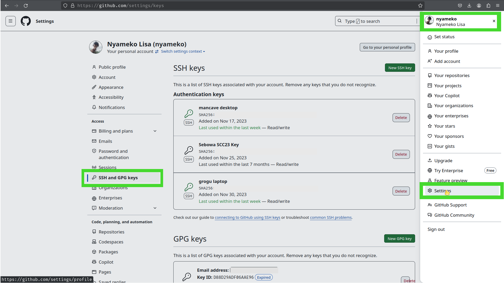

CHPC 2024 Student Cluster Competition
======================================

Welcome the **Center for High Performance Computing (CHPC)'s Student Cluster Competition (SCC)** - Team Selection Round. This round requires each team to build a **prototype multi-node compute cluster** within the National Integrated Cyber Infrastructure Systems (NICIS) **virtual compute cloud** (described below).

The goal of this tutorial is to introduce you to the competition platform and familiarise you with some Linux and systems administration concepts. This competition provides you with a fixed set of virtual resources, that you will use to initialize a set a set of virtual machines instances based on your choice _or flavor_ of **

# Table of Contents

<!-- markdown-toc start - Don't edit this section. Run M-x markdown-toc-refresh-toc -->

1. [Structure of the Competition](#sturture-of-competition)
   1. [Getting Help](#getting-help)
   1. [Timetable](#timetable)
   1. [Scoring](#scoring)
   1. [Instructions for Mentors](#instructions-for-mentors)
   1. [Cheat Sheet](#cheet-sheet)
1. [Deliverables](#deliverables)
   1. [Project](#project)
   1. [Technical Knowledge Assessment](#technical-knowledge-assessment)
1. [Links to Lecture Recordings](#links-to-lecture-recordings)
1. [Tutorial Glossary and Section Overview](#tutorial-glossary-and-section-overview)
   1. [Tutorial 1](#tutorial-1)
   1. [Tutorial 2](#tutorial-2)
   1. [Tutorial 3](#tutorial-3)
   1. [Tutorial 4](#tutorial-4)
1. [Contributing to the Project](#contributing-to-the-project)
   1. [Raising Issues and Reporting Bugs with the Tutorial Content]()
   1. [Submitting Pull Requests for Features / Bug Fixes]()
      1. [Steps to follow when editing content]()
1. [Collaborating with your Team and Storing your Progress on GitHub](#collaborating-with-your-team-and-storing-you-progress-on-github)
   1. [Forking the Tutorials into Your Own Team's Private Git Repository](#forking-the-tutorials-into-your-own-teams-private-github-repository)
      1. [Branch, Merge and Pull Requests to your Team Captain's Repository]()
      1. [Editing the Git Markdown Files to Track Your Team's Progress](#editing-the-git-markdown-files-to-track-your-teams-progress)
<!-- markdown-toc end -->

# Structure of the Competition

## Getting Help

## Timetable

<p align="center"></p>

## Scoring

| Component                      | Weight | Breakdown |
| :---                           | :---:  | :---:     |
|                                |        |           |
| Technical Knowledge Assessment |        |           |
| Tutorials                      |        |           |
| HPCC                           |        |           |
| LAMMPS                         |        |           |
|                                |        |           |

## Instructions for Mentors

The role of Mentors and Volunteers is to provide leadership and guidance for the student competitors participating in this year's Center for High Performance Computing 2024 Student Cluster Competition.

In preparing your teams for the competition, your main goal is to ensure that you teach and impart knowledge to the student participants in such a way that they are empowered and enable to tackle the problems and benchmarking tasks themselves.

### Hands-Off Rule *(You may not touch the keyboard)*

Under no circumstances whatsoever may mentors touch any competition hardware belonging to either their team, or the competition hardware of another team. Mentors are encouraged to provide guidance and leadership to their *(as well as other)* teams.

Any mentors found to be directly in contravention of this rule, may result in their team incurring a penalty. Repeated infringements may result in possible disqualification of their team.

## Cheat Sheet

Below is a table with a number of Linux system commands and utilities that you *may* find useful in assisting you to debug problems that you may encounter with your clusters. Note that some of these utilities do not ship with the base deployment of a number of Linux flavors, and you may be required to install the associated packages, prior to making use of them.

| Command            | Description                                                                                                                                                                                                        |
| ---                | ---                                                                                                                                                                                                                |
| ssh                | Used from logging into the remote machine and for executing commands on the remote machine.                                                                                                                        |
| scp                | SCP copies files between hosts on a network. It uses ssh for data transfer, and uses the same authentication and provides the same security as ssh.                                                                |
| wget / curl        | Utility for non-interactive download of files from the Web.It supports HTTP, HTTPS, and FTP protocols.                                                                                                             |
| top / htop / btop  | Provides a dynamic real-time view of a running system. It can display system summary information as well as a list of processes or threads.                                                                        |
| screen / tmux      | Full-screen window manager that multiplexes a physical terminal between several processes (typically interactive shells).                                                                                          |
| ip a               | Display IP Addresses and property information                                                                                                                                                                      |
| dmesg              | Prints the message buffer of the kernel. The output of this command typically contains the messages produced by the device drivers                                                                                 |
| watch              | Execute a program periodically, showing output fullscreen.                                                                                                                                                         |
| df -h              | Report file system disk space usage.                                                                                                                                                                               |
| ping               | PING command is used to verify that a device can communicate with another on a network.                                                                                                                            |
| lynx               | Command-line based web browser (more useful than you think)                                                                                                                                                        |
| ctrl+alt+[F1...F6] | Open another shell session (multiple ‘desktops’)                                                                                                                                                                   |
| ctrl+z             | Move command to background (useful with ‘bg’)                                                                                                                                                                      |
| du -h              | Summarize disk usage of each FILE, recursively for directories.                                                                                                                                                    |
| lscpu              | Command line utility that provides system CPU related information.                                                                                                                                                 |
| lstotp             | View the topology of a Linux system.                                                                                                                                                                               |
| inxi               | Lists information related to your systems' sensors, partitions, drives, networking, audio, graphics, CPU, system, etc...                                                                                           |
| hwinfo             | Hardware probing utility that provides detailed info about various components.                                                                                                                                     |
| lshw               | Hardware probing utility that provides detailed info about various components.                                                                                                                                     |
| proc               | Information and control center of the kernel, providing a communications channel between kernel space and user space. Many of the preceding commands query information provided by proc, i.e. `cat /proc/cpuinfo`. |
| uname              | Useful for determining information about your current flavor and distribution of your operating system and its version.                                                                                            |
| lsblk              | Provides information about block devices (disks, hard drives, flash drives, etc) connected to your system and their partitioning schemes.                                                                          |
|                    |                                                                                                                                                                                                                    |

# Deliverables

## Project

## Technical Knowledge Assessment

# Links to Lecture Recordings

## Day 1 - Welcome, Introduction and Getting Started

## Day 2 - HPC Hardware, HPC Networking and Systems Administration

## Day 3 - Benchmarking, Compilation and Parallel Computing

## Day 4 - HPC Administration and Application Visualization

## Day 5 - Career Guidance


TODO: Add objectives for each Tutorial and section. They should be editable so students check them off as they go along.

# Tutorial Glossary and Section Overview

## Tutorial 1

Tutorial 1 deals with introducing concepts to users and getting them started with using the virtual lab, setting up networking and remotely connecting. The content is as follows:

1. [Checklist](tutorial1/README.md#checklist)
1. [Network Primer](tutorial1/README.md#network-primer)
   1. [Basic Networking Example (WhatIsMyIp.com)](tutorial1/README.md#basic-networking-example-whatismyipcom)
      1. [Local WiFi Network](tutorial1/README.md#local-wifi-network)
      1. [External Cellular Network](tutorial1/README.md#external-cellular-network)
      1. [WiFi Hotspot Example](tutorial1/README.md#wifi-hotspot-example)
   1. [Windows PowerShell Commands](tutorial1/README.md#windows-powershell-commands)
      1. [`ipconfig`](tutorial1/README.md#ipconfig)
      1. [`ping 8.8.8.8`](tutorial1/README.md#ping-8888)
      1. [`route print`](tutorial1/README.md#route-print)
      1. [`tracert`](tutorial1/README.md#tracert)
1. [Launching your First Open Stack Virtual Machine Instance](tutorial1/README.md#launching-your-first-open-stack-virtual-machine-instance)
   1. [Accessing the NICIS Cloud](tutorial1/README.md#accessing-the-nicis-cloud)
   1. [Verify your Teams' Project Workspace and Available Resources](tutorial1/README.md#verify-your-teams-project-workspace-and-available-resources)
   1. [Generating SSH Keys](tutorial1/README.md#generating-ssh-keys)
   1. [Launch a New Instance](tutorial1/README.md#launch-a-new-instance)
   1. [Linux Flavors and Distributions](tutorial1/README.md#linux-flavors-and-distributions)
      1. [Desktop Usage vs Server](tutorial1/README.md#desktop-usage-vs-server)
      1. [Table of Linux Distributions](tutorial1/README.md#table-of-linux-distributions)
   1. [OpenStack Instance Flavors](tutorial1/README.md#openstack-instance-flavors)
      1. [Compute](tutorial1/README.md#compute)
      1. [Memory](tutorial1/README.md#memory)
      1. [Storage](tutorial1/README.md#storage)
      1. [Headnode Resource Allocations](tutorial1/README.md#headnode-resource-allocations)
   1. [Networks, Ports, Services and Security Groups](tutorial1/README.md#networks-ports-services-and-security-groups)
   1. [Key Pair](tutorial1/README.md#key-pair)
   1. [Verify that your Instance was Successfully Deployed and Launched](tutorial1/README.md#verify-that-your-instance-was-successfully-deployed-and-launched)
   1. [Associating an Externally Accessible IP Address](tutorial1/README.md#associating-an-externally-Accesssible-ip-address)
   1. [Success State, Resource Management and Troubleshooting](tutorial1/README.md#success-state-resource-management-and-troubleshooting)
      1. [Deleting Instances](tutorial1/README.md#deleting-instances)
      1. [Deleting Volumes](tutorial1/README.md#deleting-volumes)
      1. [Dissociating and Releasing Floating IPs](tutorial1/README.md#dissociating-and-releasing-floating-ips)
1. [Introduction to Basic Linux Administration](tutorial1/README.md#introduction-to-basic-linux-administration)
   1. [Accessing your VM Using SSH vs the OpenStack Web Console (VNC)](tutorial1/README.md#accessing-your-vm-using-ssh-vs-the-openstack-web-console-vnc)
      1. [SSH Through a Linux Terminal or Windows PowerShell](tutorial1/README.md#ssh-through-a-linux-terminal-or-windows-powershell)
      1. [Windows PuTTY](tutorial1/README.md#windows-putty)
      1. [Username and Password](tutorial1/README.md#username-and-password)
   1. [Brief Introduction to Text Editors (Vi vs Vim vs Nano)](tutorial1/README.md#brief-introduction-to-text-editors-vi-vs-vim-vs-nano)
   1. [Privilege Escalation and `sudo`](tutorial1/README.md#privilege-escalation-and-sudo)
   1. [Linux Binaries, Libraries and Package Management](tutorial1/README.md#linux-binaries-libraries-and-package-management)
   1. [Verifying Instance Hostname and `/etc/hosts` File](tutorial1/README.md#verifying-instance-hostname-and-etchosts-file)
1. [Install Dependencies and Fetch Source files for High Performance LinPACK (HPL) Benchmark](tutorial1/README.md#install-dependencies-and-fetch-source-files-for-high-performance-linpapl-benchmark)
   1. [Install the GNU Compiler Collection (GCC)](tutorial1/README.md#install-the-gnu-compiler-collection-gcc)
   1. [Install OpenMPI](tutorial1/README.md#install-openmpi)
   1. [Install ATLAS Math Library](tutorial1/README.md#install-atlas-math-library)
   1. [Fetch and Extract the HPC Source Tarball](tutorial1/README.md#fetch-and-extract-the-hpc-source-tarball)
   1. [Copy and Edit the Makefile for _your_ Target Architecture](tutorial1/README.md#copy-and-edit-the-makefile-for-_your_-target-architecture)
1. [Compile the HPL Source Code to Produce an Executable Binary](tutorial1/README.md#compile-the-hpl-source-code-to-produce-an-executable-binary)
   1. [Editing _your_ PATH Variable](tutorial1/README.md#editing-_your_-path-variable)
      1. [Dynamic and Static Libraries: Editing _Your_ ATLAS Shared Object Files](tutorial1/README.md#dynamic-and-static-libraries-editing-_your_-atlas-shared-object-files)
   1. [Configuring _Your_ `HPL.dat` File Using `lscpu` and `lsmem`](tutorial1/README.md#configuring-_your_-hpldat-file-using-lscpu-and-lsmem)

## Tutorial 2

Tutorial 2 deals with reverse proxy access for internal websites, central authentication and shared file systems.

1. [Checklist](#checklist)
1. [Spinning Up a Compute Node in OpenStack](#spinning-up-a-compute-node-in-openstack)
   1. [Compute Node Considerations](#compute-node-considerations)
1. [Accessing Your Compute Node](#accessing-your-compute-node)
   1. [IP Addresses and Routing](#ip-addresses-and-routing)
   1. [Command Line Proxy Jump Directive](#command-line-proxy-jump-directive)
   1. [Permanent `~/.ssh/config` Configuration](#permanent-sshconfig-configuration)
   1. [Verifying Networking Setup](#verifying-networking-setup)
      1. [Head Node](#head-node)
      1. [Compute Node](#compute-node)
1. [Configuring a Basic Stateful Firewall NFTABLES _(Optional)_](#configuring-a-basic-stateful-firewall-nftables-_optional_)
1. [Network Time Protocol](#network-time-protocol)
   1. [NTP Server (Head Node)](#ntp-server-head-node)
   1. [NTP Client (Compute Node)](#ntp-client-compute-node)
1. [Network File System](#network-file-system)
   1. [NFS Server (Head Node)](#nfs-server-head-node)
   1. [NFS Client (Compute Node)](#nfs-client-compute-node)
      1. [Mounting An NFS Mount](#mounting-an-nfs-mount)
      1. [Making The NFS Mount Permanent](#making-the-nfs-mount-permanent)
   1. [Passwordless SSH](#passwordless-ssh)
1. [User Account Management](#central-user-management)
   1. [Create Team Captain Account](#create-team-captain-account)
      1. [Super User Access](#super-user-access)
   1. [Out-Of-Sync Users and Groups](#out-of-sync-users-and-groups)
      1. [Example of _BAD_ Users on Nodes]
      1. [Clean Up](#clean-up)
   1. [Ansible User Declaration](#ansible-user-declaration)
      1. [Create Team Member Accounts]()
1. [WireGuard VPN Cluster Access]()


## Tutorial 3

1. [Environment Modules with Lmod](#part-1---enviroment-modules-with-lmod)
   1. [Installing Lmod](#installing-lmod)
   1. [Using Lmod](#using-lmod)
   1. [Adding modules to Lmod](#adding-modules-to-lmod)
1. [High Performance LINPACK (HPL) Benchmark](#part-2---high-performance-linpack-hpl-benchmark)
   1. [System Libraries](#system-libraries)
      1. [Static Libraries](#static-libraries)
      1. [Dynamic Libraries](#dynamic-libraries)
   1. [Message Passing Interface (MPI)](#message-passing-interface-mpi)
   1. [Installing HPL](#installing-hpl)
   1. [Adding a Second Compute Node](#adding-a-second-compute-node)
   1. [Optimizing HPL](#optimising-hpl)
      1. [Theoretical Peak Performance](#theoretical-peak-performance)
      1. [Intel OneAPI Toolkit and Compiler Suite]()
1. [HPC Challenge](#part-3---hpc-challenge)
1. [GROMACS Application Benchmark](#gromacs-application-benchmark)
   1. [Installation](#part-1---installation)
   1. [Benchmark](#part-2---benchmark)
      1. [Benchmark 1 (adh_cubic):](#benchmark-1-adh_cubic)
      1. [Benchmark 2 (1.5M_water):](#benchmark-2-15m_water)
1. [LAMMPS Application Benchmark]()
1. [Qiskit Application Benchmark]()

## Tutorial 4

1. [Overview](#overview)
1. [Prometheus]()
   1. [Edit YML Configuration File]()
   1. [SSH Port Forwarding](ssh-port-forwarding)
   1. [X11 Forwarding](#x11-forwarding)
   1. [Dynamic SOCKS Proxy](#dynamic-socks-proxy)
   1. [Configure Prometheus as a Service]()
1. [Node Exporter]()
   1. [Configure Node Exporter as a Service]()
1. [Grafana]()
   1. [Configuring Grafana Dashboards]()
1. [Slurm Workload Manager](#slurm-workload-manager)
   1. [Prerequisites](#prerequisites)
   1. [Server Setup](#server-setup)
   1. [Client Setup](#client-setup)
   1. [Configure Grafana Dashboard for SLURM]()
1. [GROMACS Application Benchmark](#gromacs-application-benchmark)
   1. [Protein Visualisation](#protein-visualisation)
1. [LAMMPS Visualization]()
1. [Qiskit Jupyter Notebook]()

# Contributing to the Project

You are strongly encouraged to contribute and improve the project by [Opening and Participating in Discussions](https://github.com/chpc-tech-eval/chpc24-scc-nmu/discussions), [Raising, Addressing and Resolving Issues](https://github.com/chpc-tech-eval/chpc24-scc-nmu/issues) and editing the course content directly. The following guide describes [How to clone, push, and pull with git (beginners GitHub tutorial)](https://youtu.be/yxvqLBHZfXk?si=jFFdP1XafscVX9BF).

## Steps to follow when editing existing content

Editing the content directly, will require the use of Git. Using a terminal application or [Git for Windows PowerShell](https://git-scm.com/book/en/v2/Appendix-A:-Git-in-Other-Environments-Git-in-PowerShell) or [Git for MobaXTerm](https://www.geeksforgeeks.org/how-to-install-git-on-mobaxterm/).

1. [Generate an SSH Key](#tutorial1/README.md#generating-ssh-keys) (or use an existing one).
1. Add your SSH key to your Git profile.
   - Navigate to your *'Profile'* and go to *'Settings'*.
   - Under *'Access'*, navigate to *'SSH and GPG Keys'*
     <p align="center"></p>
1. `git clone` a local copy of the repository, to your personal work space.
   <p align="center"></p>
   
   ``` bash
   
      git clone git@github.com:chpc-tech-eval/chpc24-scc-nmu.git
   
   ```
1. Create a new branch to work on. i.e. `git branch tutX_rework` followed by `git checkout tutX_rework`, or simply use a single command `git checkout -b tutX_rework`.
   - Give the branch a sensible name.
   - You are encouraged to push the branch back upstream so that collaborators can see what you are working on as you make the changes.
   - Should you want to make relatively small and quick changes to someone else's feature, then you should branch their branch, and merge that feature, back into that branch before they merge their branch back into main. i.e. `git checkout -b tutX_rework_fixed_typo`.
1. Make the appropriate changes.
1. `git add <relative_path_to_changed_file(s)>`
1. `git commit -m "some_message_pertaining_to_changes_made"`
1. Push your changes, back upstream to the branch you are currently working on `git push`.
1. Once you are satisfied with the changes you've have been editing, eliminate all merge conflicts by pulling all upstream changes and deviations into your local working copy. `git pull`.
   - If you are confident that your feature does or has not deviated from the upstream `main` branch, use `git pull` to automatically `fetch` and `merge` upstream changes from main into your feature branch.
   - Alternatively, if your branch is old, or depends on / requires changes from upstream use `git fetch`, to `fetch` upstream changes and be able to preview them before merging.
   - Eliminate your local conflicts and merge all upstream changes `git merge`.
   - Once all the conflicts have been resolved, and you've successfully merged all upstream changes, push your branch upstream.
1. Create a pull request to the upstream main branch, to incorporate your feature.
   - Or another branch, if your feature branch was adding functionality to an existing feature branch.

## Syntax and Style

Use the following guide on [Github Markdown Syntax Editing](https://docs.github.com/en/get-started/writing-on-.)

# Collaborating with your Team and Storing you Progress on GitHub

## Forking the Tutorials into Your Own Team's Private GitHub Repository

## Editing the Git Markdown Files to Track Your Team's Progress
