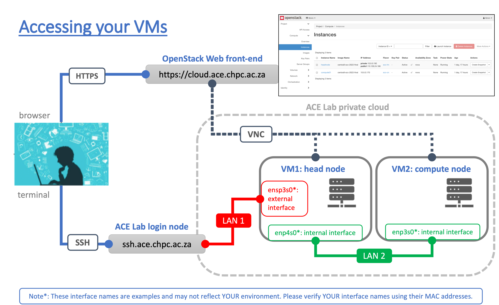
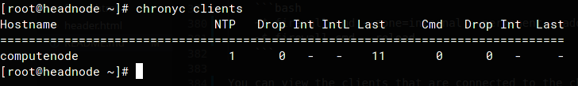

# Student Cluster Competition - Tutorial 1

## Table of Contents

1. [Overview](#overview)
1. [Accessing the Cloud](#part-1---accessing-the-cloud)
1. [Linux Flavors and Distributions]()
1. [OpenStack Instance Flavors]()
   - [Compute]()
   - [Memory]()
   - [Storage]()
1. [Generating SSH Keys]()
1. [Network Primer]()
   - [Internal Intranet vs External Internet]()
     - [WiFi Hotspot Example]()
   - [Network Ports, Services and Security Groups]()
   - [Associating an Externally Accessible Floating IP Address]()
   - [DHCP Server for Public Facing Interface on Headnode]()
     - [Routing Table and Gateway for External Interface vs Internal]()
1. [Accessing your VM Using SSH vs the OpenStack Web Console]()
1. [Introduction to Basic Linux Administration]()
   - [Username and Password]()
   - [Privilege Escalation and `Sudo`]()
   - [Linux Binaries, Libraries and Package Management]()
1. [Install the High Performance LinPack (HPL) Benchmark]()
   - [Install the GNU Compiler Collection (GCC)]()
   - [Install OpenMPI]()
   - [Install the Automatically Tuned Linear Algebra Software (ATLAS) Math Library]()
   - [Fetch and Extract the HPC Source Tarball]()
1. [Brief Introduction to Text Editors (Vi vs Vim vs Nano vs Emacs)]()
   - [Copy and Edit the Make File for _your_ Target Architecture]()
1. [Compile the HPL Source Code to Produce an Executable Binary]()
   - [Editing _your_ PATH Variable]()
   - [Dynamic and Static Libraries - Editing _your_ ATLAS Shared Object Libraries]()
1. [Capturing the Above Commands as a Shell Script]()
   - [Deploying Packages on Compute Node Using Ansible]()
1. [Collaborating with your Team and Storing your Progress on Github]()

## Overview

Welcome the **CHPC's Student Cluster Competition** - team selection round - presented by the **Advanced Computer Engineering (ACE) Lab**. This round requires each team to build a **prototype compute cluster** in the ACE Lab's **virtual compute cloud** (described below).

The goal of this tutorial is to introduce you to the competition platform and familiarise you with some Linux and systems administration concepts.

<u>Please note the following concepts:</u>

- **[Cloud computing](https://en.wikipedia.org/wiki/Cloud_computing)** is the **on-demand** delivery of **I.T. services** by a first-party (you) or third-party (external) provider over a network, possibly including the **internet**. This can allow you to access computing or other I.T. services wherever you are and at your convenience.
- **[Infrastructure as a Service (IaaS)](https://en.wikipedia.org/wiki/Infrastructure_as_a_service)** is where physical or virtual hardware is presented to a user, but the user is not exposed to the underlying technology. In other words, this competition provides you with an IaaS experience by giving you a set of virtual machines that you can use for the competition. You cannot control the cloud environment that the virtual machines are provided on.
- **Instances ([virtual machines](https://en.wikipedia.org/wiki/Virtual_machine) or 'VMs')** are software copies of virtual computers that are hosted within a physical computer (the **['host'](https://en.wikipedia.org/wiki/Host_(network))**). The host provides access to one or more virtual computers at the same time. This competition provides you with a set of virtual machines based on the **[CentOS 8](https://www.centos.org/about/)** operating system.
ppp
This tutorial will help you become familiar with Linux basics, such as navigating and configuring your hosts and network on the terminal. If you are new to Linux and need help getting more comfortable, please check out the resources tab on the learning system.

<span id="fig1" class="img_container center" style="font-size:8px;margin-bottom:20px; display: block;">
    
    <span class="img_caption" style="display: block; text-align: center;margin-top:5px;"><i>Figure 1: Layout of the ACE Lab network for SCC.</i></span>
</span>

[Figure 1](#fig1) provides an overview of the infrastructure made available to you. Please note that when you are connected to a virtual machine within this cloud, you are using the ACE Lab's **private cloud** which utilises **OpenStack** (a software cloud environment), and sits within a private network. There are two access methods for these resources:

1. **[cloud.ace.chpc.ac.za](https://cloud.ace.chpc.ac.za) (web-based)**
   - This is the web front-end to the cloud that you can access via a web browser. It will also allow graphical access to the VMs through **[Virtual Network Computing (VNC)](https://en.wikipedia.org/wiki/Virtual_Network_Computing)**.
2. **ssh.ace.chpc.ac.za (terminal-based)**
   - This is the login node for the ACE Lab. Using an **SSH ([secure-shell](https://en.wikipedia.org/wiki/Secure_Shell_Protocol), described further later)** client, you can establish a remote terminal session to the ACE Lab's network, which in turn will allow you to connect to your virtual machines.

You first need to configure the network settings of your VMs properly before you can use the **SSH** method. This will be the main way that you interact with your infrastructure.

<u>In this tutorial you will:</u>

- [ ] Learn IT concepts like cloud computing, virtualisation and remote connections.
- [ ] Learn how to use the CHPC's cloud computing environment.
- [ ] Learn what SSH is and how to use it.
- [ ] Learn about Linux password management.
- [ ] Configure Linux networks.
- [ ] Configure a Linux firewall.
- [ ] Set up your compute network names.
- [ ] Configure network time synchronisation.

<div style="page-break-after: always;"></div>

## Part 1 - Accessing the Cloud

> **! >>>** _In these tutorials, an asterisk ('\*') or a triangle brackets ('\<\>') are placeholders. You will need to fill in the correct information relevant to you. The line `~$` represents that the command following it is to be typed in a terminal and should not be included when typing the command._

In this part, you will be guided through using the ACE Lab's network to gain access to your VMs. You will primarily be using these VMs to do the tutorials. 

1. Open your web browser and visit **cloud.ace.chpc.ac.za**.
2. Use the credentials provided to you to log into the cloud platform ([OpenStack](https://www.openstack.org/)):
   - **<team_name>** for the `Username` and;
   - **<provided_password>** for the `Password`.
3. Once logged in to the web front-end, on the left navigate to `Project` and click `Instances` tab under `Compute`. You will see the VM resources provisioned for you by the ACE Lab.
4. Please note the **IP addresses** assigned to each VM.
    - Your cluster's headnode, **which is one of the VMs**, has two network interfaces attached with 2 unique IP addresses (think of it as having two network ports):
        - An external (public) interface with IP range: **10.128.24.0/24**
        - An internal (private) interface with IP range: **10.0.0.0/24**
        - **The above IP address ranges are specified in [CIDR notation](https://www.ionos.com/digitalguide/server/know-how/cidr-classless-inter-domain-routing/).**
        - The **external network** is **still private** within the ACE Lab, but it can reach the internet through the **gateway address 10.128.24.1**, using a method called **[NAT (Network Address Translation)](https://en.wikipedia.org/wiki/Network_address_translation)** which will be detailed later.
5. Access your VMs via the "Console (VNC)" utility embedded within OpenStack by clicking into one of the VMs listed in the `Compute -> Instances` tab, clicking the name of the VM instance, and navigating to the "Console" tab on the top as shown in [Figure 2](#fig2).

**Hint:** _Your headnode acts as a gateway for your compute nodes using the private virtual network (10.0.0.0/24)._


<span id="fig2" class="img_container center" style="font-size:8px;margin-bottom:20px; display: block;">
    
    <span class="img_caption" style="display: block; text-align: center;margin-top:5px;"><i>Figure 2: The Console (VNC) button and dashboard seen in the OpenStack user interface.</i></span>
</span>

<div style="page-break-after: always;"></div>

## Part 1A - IP addresses and Routing

### Configuring your VMs

The VMs are running the **CentOS 8 minimal** operating system. This means that they do not contain a graphical environment for you to use a mouse and keyboard with. You will only be able to manipulate the operating system using the command line, or terminal. 

By default, you can only access the VMs using the `root` user account. The default password for this account is **123qwe**.

Use the **[Console (VNC)](https://en.wikipedia.org/wiki/Virtual_Network_Computing)** connection in **OpenStack** to access your VMs for this section.

It is **highly recommended** that you **change your root password** for all of your VMs, as this will prevent unwanted people from getting access to them. This should be done for all of your VMs and not just the head node. You can do so using the `passwd` command.

```bash
~$ passwd
```

Use the command below to list the network interfaces and their current configuration. You will see the names of the interfaces, for example `eth1`, `enp3s0`, or something similar.

```bash
~$ ip a
```

> **! >>> It is important to note here that you will have no IP addresses listed for your network interfaces (such as enp3s0), because they have not been configured yet.**

> **! >>> Ignore and do not count the [**lo**](https://en.wikipedia.org/wiki/Localhost#Loopback) interface!**

<span id="fig3" class="img_container center" style="font-size:8px;margin-bottom:20px; display: block;">
    
    <span class="img_caption" style="display: block; text-align: center;margin-top:5px;"><i>Figure 3: What you should see when you use the "ip a" command.</i></span>
</span>

You can also check the routing table using the command below. Routing is used to allow one network to communicate with another. At this stage, it should be empty since there is not networking configured.

```bash
~$ ip route
```

   > **! >>> This should be empty, as your networks have not yet been configured.**

<div style="page-break-after: always;"></div>

#### Network Manager and Networking Setup

You have been assigned IP addresses for your VMs. To identify these, go to the OpenStack user interface and navigate to `Compute -> Instances`. In the list of virtual machines presented to you, click the name of the virtual machine instance, and navigate to the "**Interfaces**" tab (refer to [Figure 4.1 below](#fig4.1)). This list contains the IP addresses assigned to each of your VM network interfaces.

For example, if you have `enp3s0` and `enp4s0`, then you should see two IP addresses listed in the OpenStack interface, such as `10.128.24.x` and `10.0.0.x`. **You absolutely have to use the correct IP addresses for the correct interfaces, as your network may not work if you do not.**

<span id="fig4.1" class="img_container center" style="font-size:8px;margin-bottom:20px; display: block;">
    
    <span class="img_caption" style="display: block; text-align: center;margin-top:5px;"><i>Figure 4.1: The IP addresses assigned to your interfaces for inside of your VM.</i></span>
</span>

You can verify which network interface you are modifying by corroborating the [MAC-Address](https://en.wikipedia.org/wiki/MAC_address) from the `ip a` command (in your VM instances) and from those listed in OpenStack (refer to [Figure 4.2 below](#fig4.2)).

<span id="fig4.2" class="img_container center" style="font-size:8px;margin-bottom:20px; display: block;">
    
    <span class="img_caption" style="display: block; text-align: center;margin-top:5px;"><i>Figure 4.2: The MAC addresses assigned to your interfaces for inside of your VM.</i></span>
</span>

**CentOS 8** uses `Network Manager` (**NM**) to manage network settings. `Network Manager` is a service created to simplify the management and addressing of networks and network interfaces on Linux machines.

##### Head Node (`nmtui`)

For the **head node**, create a new network definition using the `nmtui` graphical tool using the following steps:

0. First we must make sure that our network interfaces are managed by `Network Manager`. By default, this should already be the case. Use the following command to check if the network interfaces are managed:

    ```bash
    ~$ nmcli dev
    ```

    You should see something **other than "unmanaged"** next to each of the interfaces (excluding `lo`). If any of your network interfaces (other than `lo`) say "unmanaged", do the following:


    ```bash
   ~$ nmcli dev set <interface> managed yes
    ```
    
1. The `nmtui` tool is a console-graphical tool used to set up and manage network connections for `Network Manager`.

    ```bash
    ~$ nmtui
    ```

2. You'll be presented with a screen, select `Edit a connection`, followed by `<Add>` and then `Ethernet`.

3. For **Profile Name**, type the name of the interface you want to assign an IP address to, like `enp3s0` or `enp4s0`, and type the same thing for **Device** (in this instance, **Device** means **interface**).

4. For **IPv4 CONFIGURATION**, change `<Automatic>` to `<Manual>`. This tells NM that we want to assign a static IP address to the connection. Hit enter on `<Show>` to the right of **IPv4 CONFIGURATION** and enter the following information:

    - **Addresses**: Hit `<Add>` and enter the IP address (found in OpenStack) for this interface. After the IP address, add the text "/24" to the end. It should read as `<ip_address>/24` with no spaces. The "/24" is the subnet mask of the IP address in [CIDR notation](#part-1---accessing-the-cloud).
    - **Gateway**: Enter the gateway address here. This will be the ACE Lab gateway for the external network of the head node.
    - **DNS servers**: Hit `<Add>` and enter `8.8.8.8`. This is the public DNS server of Google and is used to look up website names. (**NB: DNS is explained later!**)

5. Hit `<OK>` at the bottom of the screen.

6. _Repeat the above processes for any other network interface you want to give an IP address to, if there are more on your machine (you can use `ip a` to check how many there are)._

7. The networks should now be active. You can confirm this by going `<Back>` and then to `Activate a connection`. If you see stars to the left of each of the networks that you have created, then the networks are active. If not, hit enter on the selected network to active it.

8. Your **head node** should now have the correct IP addresses. Exit `nmtui` and check the networking setup is correct. To do so, use the following commands:

    ```bash
    ~$ ip a
    ~$ ip route 
    ```

    - `ip a` will show you the interfaces and their assigned IP addresses.
    - `ip route` will list the interfaces and their assigned routes.

##### Compute Node (`nmcli`)

You must also set the static IP addressing for all other nodes in your cluster. In order to explore different options for doing so, please use the `nmcli` command. This is the command-line interface (CLI) for `Network Manager`, which is an alternative to the above `nmtui`, which is simply a graphical wrapper for the CLI.

Please look at the following website in order to get the commands that you will need to create a static IP address network connection using the CLI: [https://docs.fedoraproject.org/en-US/Fedora/25/html/Networking_Guide/sec-Connecting_to_a_Network_Using_nmcli.html](https://docs.fedoraproject.org/en-US/Fedora/25/html/Networking_Guide/sec-Connecting_to_a_Network_Using_nmcli.html). Follow the **Adding a Static Ethernet Connection** section. **Note that the IP addresses used in this web guide will not be the same as the ones that you need to use for your node(s) and some of the commands may not be relevant to you.**

At this point you should test connectivity between your nodes. Using the `ping` command, you can see whether the nodes can speak to each other via the network. From your head node, try to ping your compute node:

```bash
~$ ping <compute_node_ip>
```

If you get a timeout, then things are not working. Try to check your network configurations again.

_**Please read [what-is-ip-routing](https://study-ccna.com/what-is-ip-routing/) to gain a better understanding of IP routing.**_ This will be impoortant for the rest of this competition and can help your understanding when debugging issues.

<div style="page-break-after: always;"></div>

### Connecting To Your VMs

Once you have the network configured correctly on your VMs you can move on to using the `ssh` command to access the VMs via a terminal. To access the VM network, you first need to log in to the ACE Lab's `ssh` server, as mentioned in the [overview section](#overview).

**To recap, the process is:**

```plaintext
1. You are a user trying to connect to your VM from your home or university internet.
2. You use your computer to connect to the ACE Lab login node (ssh.ace.chpc.ac.za).
3. Once logged into the ACE Lab login node, you can then connect to the head node of your virtual cluster.
4. Once connected to the head node of your virtual cluster, you can connect to the compute node of your cluster.
```

#### Linux Users

Most Linux distributions already include an `ssh` client via `openssh`. To access this, simply open a terminal session and run the command `ssh` with the parameters necessary for what you want to achieve.

1. Use the credentials that have been provided to you by the ACE Lab to log in to the ssh.ace.chpc.ac.za server.

    ```bash
    [student@home_or_school ~]$ ssh <team_name>@ssh.ace.chpc.ac.za 
    ```

2. Once logged in, from this server run the `ssh` command to the `root` user account of your head node, using the external address **10.128.24.\***, where **\*** is the last digit(s) of your head node's IP address.

    ```bash
    [team_name@ssh ~]$ ssh root@10.128.24.*
    ```

3. The compute node can then be accessed in the same way, but via the head node now, as the **ACE Lab SSH server does not have direct access to the compute node**. Please refer to [Figure 1](#fig1).


#### Microsoft Windows Users

If you are using a **Microsoft Windows** environment you can use a tool called `PuTTY` ([Click here to download](https://www.chiark.greenend.org.uk/~sgtatham/putty/latest.html)) to connect to ssh.ace.chpc.ac.za. With `PuTTY`, steps 2 and 3 should be the same.

Please note that using the command `ssh` or connecting with `PuTTY` creates a new `BASH` shell on the target machine (the machine that you are connecting to). To end this session you must exit. Using the `ssh` command over and over will nest multiple `BASH` shells inside of one another and is not recommended.

<div style="page-break-after: always;"></div>

## Part 1B - IP Tables, Firewall and NAT

`Firewalld` is a firewall management daemon (service) available for many Linux distributions which acts as a front-end for the `iptables` packet filtering system provided by the Linux kernel. This daemon manages groups of rules using entities called “zones”. **CentOS 8** comes pre-configured with `firewalld`.

**NOTE:** Only your head node has an interface (on the `10.128.24.0/24` network) that can access the internet. Therefore, you will need to **setup NAT on your head node** to allow your compute node to access the internet via your head node (this effectively treats your head node as a router). Please note that the "external" zone on `firewalld` is configured for **IP masquerading** ([click here to learn more about IP masquerading](https://tldp.org/HOWTO/IP-Masquerade-HOWTO/ipmasq-background2.1.html)) so that your internal network remains private but reachable.

**On the head node**, ensure your **external interface** is assigned to the appropriate zone:

```bash
~$ nmcli c mod <external_interface> connection.zone external 
```

Then do the same for the internal interface:

```bash
~$ nmcli c mod <internal_interface> connection.zone internal
```

You can now use `firewalld` to allow the head node to act as a router for the compute node.

```bash
~$ firewall-cmd --zone=external --add-masquerade --permanent
~$ firewall-cmd --reload 
```

Confirm that **IP forwarding** is enabled on the head node with the following:

```bash
~$ cat /proc/sys/net/ipv4/ip_forward
```
It should return a `1`.

You can then add the individual firewall rules needed:

```bash
~$ firewall-cmd --permanent --direct --add-rule ipv4 nat POSTROUTING 0 -o <external_interface> -j MASQUERADE
~$ firewall-cmd --permanent --direct --add-rule ipv4 filter FORWARD 0 -i <internal_interface> -o <external_interface> \
      -j ACCEPT
~$ firewall-cmd --permanent --direct --add-rule ipv4 filter FORWARD 0 -i <external_interface> -o <internal_interface> \ 
      -m state --state RELATED,ESTABLISHED -j ACCEPT
```

To validate that your **NAT** rules are working properly, **log into your compute node** and test if you can `ping` the ACE Lab gateway and an external server on the internet.

```bash
~$ ping 10.128.24.1  # ACE Lab gateway IP address
~$ ping 8.8.8.8      # Google external DNS server
```

Once you can ping the servers by their IPs, try ping by name - using Domain Name System (DNS) resolution.

```bash
~$ ping google.com
```

If your NAT is working correctly and your compute node's DNS was set correctly with `Network Manager`, you should now be able to ping external servers/websites using their names on all nodes.

> **! >>> Without access to a working DNS server you won't be able to install packages on your compute node (or head node for that matter), even if the internet is otherwise working.**

<div style="page-break-after: always;"></div>

## Part 2 - Hostnames

A hostname is what a computer device is called on a network. These are used to make computer addresses easier to remember. It's a lot easier to remember "**headnode.cluster.scc**" than "**10.0.0.51**"!

To make it easier to distinguish between your head node and your compute node, you should change their hostnames to something logical.

1. Use the `hostnamectl` command to set the new hostname for each machine.

    ```bash
    ~$ hostnamectl set-hostname --static <new_host_name>.cluster.scc
    ```

    A good example would be `headnode.cluster.scc`.
    
    _**This will only reflect once you log out and back into your node! So log out and log back in now.**_

2. In order to access your nodes by hostname rather than IP address (if you **aren't using your own self-controlled DNS server**), you need to populate the `/etc/hosts` file on each machine with the IP address/hostname mappings. 

    This file is used to keep track of static (non-DNS server) hostname/IP mappings. In the `/etc/hosts` file on each of your machines, add the following line:

    ```
    <ip_address_of_machine> <host_name_of_machine>.cluster.scc <host_name_of_machine> 
    ```

    **This order is important for later.**

    **For example**, if we have a head node called "headnode" with an internal (private) network IP of 10.0.0.1, we can use the following:

    ```
    10.0.0.1 headnode.cluster.scc headnode 
    ```

3. You can test connectivity between your two nodes by pinging from one to the other. For example, from your headnode:

    ```bash
    [root@headnode ~]$ ping <compute_node_ip>
    ```

4. Test that you can access your compute node by its hostname:

    ```bash
    [root@headnode ~]$ ssh <compute_node_name>
    ```

At this point your VMs and network should be correctly configured and you can continue with setting up some important Linux services.

<div style="page-break-after: always;"></div>

## Part 3 - Network Time Protocol (NTP)

**NTP** or **network time protocol** enables you to synchronise the time across all the computers in your network. This is important for HPC clusters as some applications require that system time be accurate between different nodes (imagine receiving a message 'before' it was sent).

It is also important that your timezones are also consistent across your machines. Time actions on **CentOS 8** can be controlled by a tool called `timedatectl`. For example, if you wanted to change the timezone that your system is in, you could use `timedatectl list-timezones`, find the one you want and then set it by using `timedatectl set-timezone <timezone>`. `timedatectl` can also set the current time on a local machine and more. 

You will now **setup the NTP service** (through the `chronyd` implementation) on your head node and then connect your compute nodes to it.

### On the head node

1. Install the Chrony software package using the CentOS package manager, `dnf`:

    ```bash
    [root@headnode ~]$ dnf install chrony
    ```

2. Edit the file `/etc/chrony.conf` and modify the `allow` declaration to include the internal subnet of your cluster (uncomment or remove the "#" in front of `allow` if it's there, otherwise this is ignored).

    ```conf
    allow 10.0.0.0/24
    ```

3. Chrony runs as a service (daemon) and  is included with CentOS 8 so it likely is already running. Restart the chrony daemon with `systemctl`. This will also start it if it was not yet started:

    ```bash
    [root@headnode ~]$ systemctl restart chronyd
    ```

    Ensure that the chrony service is set to start automatically the next time CentOS boots:

    ```bash
    [root@headnode ~]$ systemctl enable chronyd
    ```

4. Add chrony to the firewall exclusion list:

    ```bash
    [root@headnode ~]$ firewall-cmd --zone=internal --permanent --add-service=ntp
    [root@headnode ~]$ firewall-cmd --reload
    ```

You can view the clients that are connected to the chrony server on the head node by using the following command on the head node:

```bash
[root@headnode ~]$ chronyc clients
```

This will show empty until you do the steps below.

### On the compute node

1. Install the Chrony software package the same way as the head node.

2. Edit the file `/etc/chrony.conf`, comment out (add a "#" in front of) all the `pool` and `server` declarations and add this new line to the file:

    ```conf
    server <head_node_ip>
    ```

3. Restart the chronyd service as above.

4. Enable the chronyd service as above.

Check `chronyc clients` on the head node to see if the compute node is connected and getting information from the head node.

<span id="fig5" class="img_container center" style="font-size:8px;margin-bottom:20px; display: block;">
    
    <span class="img_caption" style="display: block; text-align: center;margin-top:5px;margin-top:5px;"><i>Figure 5: The compute node (chrony client) is a client of the head node (chrony server).</i></span>
</span>
