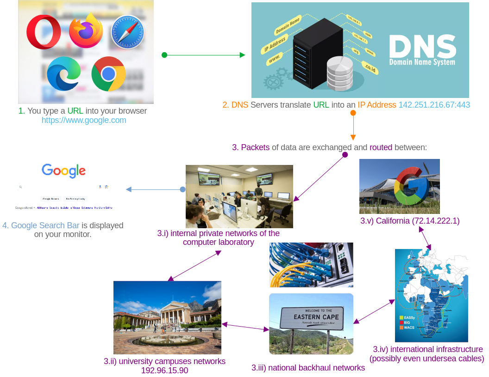
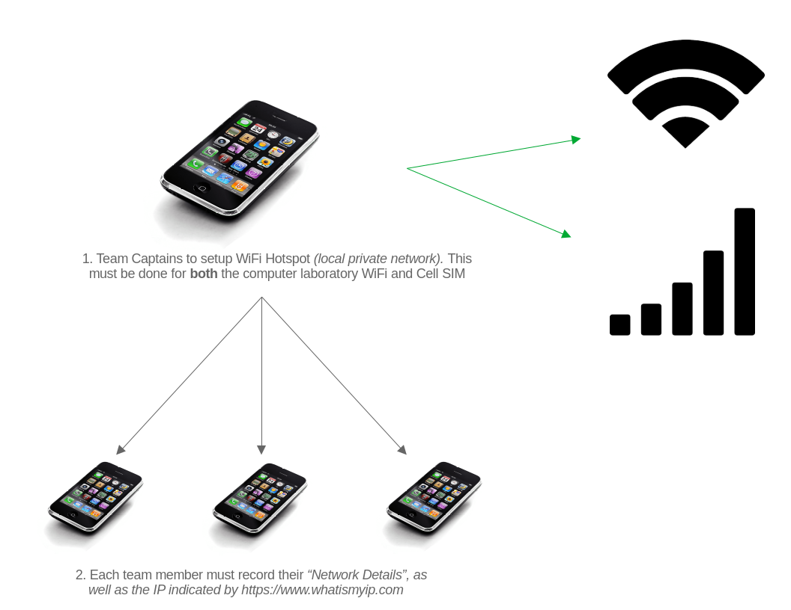
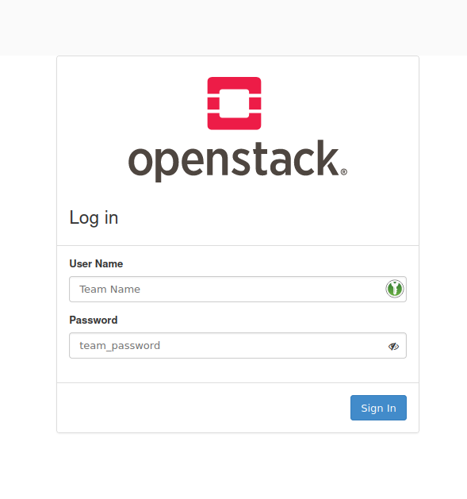
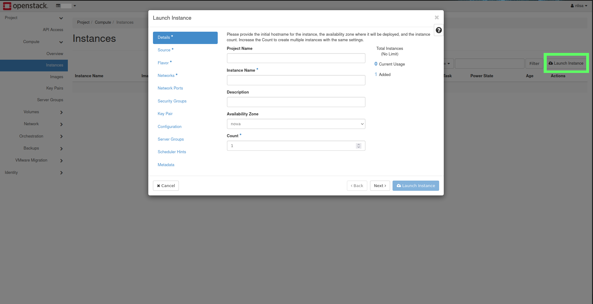

# Student Cluster Competition - Tutorial 1

## Table of Contents

<!-- markdown-toc start - Don't edit this section. Run M-x markdown-toc-refresh-toc -->
1. [Overview](#overview)
   1. [Checklist](#checklist)
1. [Network Primer](#network-primer)
   1. [Basic Networking Example (WhatIsMyIp.com)](#basic-networking-example-whatismyipcom)
      1. [Local WiFi Network](#local-wifi-network)
      1. [External Cellular Network](#external-cellular-network)
      1. [WiFi Hotspot Example](#wifi-hotspot-example)
   1. [Windows PowerShell Commands](#windows-powershell-commands)
      1. [`ipconfig`](#ipconfig)
      1. [`ping 8.8.8.8`](#ping-8888)
      1. [`route print`](#route-print)
      1. [`tracert`](#tracert)
1. [Launching your First OpenStack Virtual Machine Instance](#launching-your-first-open-stack-virtual-machine-instance)
   1. [Accessing the NICIS Cloud](#accessing-the-NICIS-cloud)
   1. [Verify your Teams' Project Workspace and Available Resources](#verify-your-teams-project-workspace-and-available-resources)
   1. [Generating SSH Keys](#generating-ssh-keys)
   1. [Launch a New Instance](#launch-a-new-instance)
   1. [Instance Name](#instance-name)
   1. [Linux Flavors and Distributions](#linux-flavors-and-distributions)
      1. [Desktop Usage vs Server](#desktop-usage-vs-server)
      1. [Table of Linux Distributions](#table-of-linux-distributions)
   1. [OpenStack Instance Flavors](#openstack-instance-flavors)
      1. [Compute](#compute)
      1. [Memory](#memory)
      1. [Storage](#storage)
   1. [Networks, Ports, Services and Security Groups](#networks-ports-services-and-security-groups)
   1. [Verify that your Instance was Successfully Deployed and Launched](#verify-that-your-instance-was-successfully-deployed-and-launched)
   1. [Associating an Externally Available IP Address](#associating-an-externally-available-ip-address)
   1. [Success State, Resource Management and Trouble Shooting](#success-state-resource-management-and-trouble-shooting)
      1. [Deleting Instances](#deleting-instances)
      1. [Deleting Volumes](#deleting-volumes)
      1. [Dissociating and Releasing Floating IPs](#dissociating-and-releasing-floating-ips)
1. [Introduction to Basic Linux Administration](#introduction-to-basic-linux-administration)
   1. [Accessing your VM Using SSH vs the OpenStack Web Console (VNC)](#accessing-your-vm-using-ssh-vs-the-openstack-web-console-vnc)
      1. [SSH Through a Linux Terminal](#ssh-through-a-linux-terminal)
      1. [PuTTY and / or Windows Power Shell](#putty-and--or-windows-power-shell)
   1. [Username and Password](#username-and-password)
   1. [Brief Introduction to Text Editors (Vi vs Vim vs Nano vs Emacs)](#brief-introduction-to-text-editors-vi-vs-vim-vs-nano-vs-emacs)
   1. [Privilege Escalation and `sudo`](#privilege-escalation-and-sudo)
   1. [Linux Binaries, Libraries and Package Management](#linux-binaries-libraries-and-package-management)
   1. [Verifying Instance Hostname and `/etc/hosts` File](#verifying-instance-hostname-and-etchosts-file)
1. [Install Dependencies and Fetch Source files for High Performance LinPACK (HPL) Benchmark](#install-dependencies-and-fetch-source-files-for-high-performance-linpapl-benchmark)
   1. [Install the GNU Compiler Collection (GCC)](#install-the-gnu-compiler-collection-gcc)
   1. [Install OpenMPI](#install-openmpi)
   1. [Install ATLAS Math Library](#install-atlas-math-library)
   1. [Fetch and Extract the HPC Source Tarball](#fetch-and-extract-the-hpc-source-tarball)
   1. [Copy and Edit the Makefile for _your_ Target Architecture](#copy-and-edit-the-makefile-for-_your_-target-architecture)
1. [Compile the HPL Source Code to Produce an Executable Binary](#compile-the-hpl-source-code-to-produce-an-executable-binary)
   1. [Editing _your_ PATH Variable](#editing-_your_-path-variable)
      1. [Dynamic and Static Libraries: Editing _Your_ ATLAS Shared Object Files](#dynamic-and-static-libraries-editing-_your_-atlas-shared-object-files)
   1. [Configuring _Your_ `HPL.dat` File Using `lscpu` and `lsmem`](#configuring-_your_-hpldat-file-using-lscpu-and-lsmem)

<!-- markdown-toc end -->

## Overview

This tutorial will help you become familiar with Cloud Computing and will also serve as an introduction to Linux. This tutorial will start with a network primer that will help you to understand the basics of public and private networks, ip addresses, ports and routing.

You will then login into the CHPC's Cloud Computing Platform and launch your own OpenStack virtual machine instances. Here you will need to make a decision on choice of Linux distribution that you will use as well as how your team will allocate your limited cloud computing resources. 

such as navigating and configuring your hosts and network on the terminal. If you are new to Linux and need help getting more comfortable, please check out the resources tab on the learning system.

Once your team has successfully launched your instances you'll login to your VM's to do some basic Linux administration.

This tutorial will conclude with you downloading, installing and running the High Performance LinPACK benchmark on your newly created VM's.

### Checklist

<u>Use the following checklist to keep track of your team's progress and to ensure that all members in your understand these concepts.</u>

- [ ] Understand IT concepts like cloud computing, virtualisation and remote connections:
  - [ ] Understand and be able to explain networking terms such as URL, DNS, IP Address, Port, Subnet, Gateway, Router, and
  - [ ] Understand the difference between a Local Private Network and an External Public Network.
- [ ] Learn how to use the CHPC's cloud computing environment:
  - [ ] Learn about different Linux Distributions and Flavors, and
  - [ ] Learn about Cloud Resource Management.
- [ ] Learn about Basic Linux Administration:
  - [ ] Learn what SSH is and how to use it,
  - [ ] Learn about Linux password management,
  - [ ] Use a Linux Console / Terminal Based Text Editors,
  - [ ] Understand Linux Privileges and the Root user,
  - [ ] Learn how to Install Packages in your Linux Environment, and
  - [ ] Learn about Configuring system files.
- [ ] Download, Configure, Install and Run HPL Benchmark:
  - [ ] Understand how to satisfy Linux Package Dependencies,
  - [ ] Download and unpack files using a terminal,
  - [ ] Editing Makefiles,
  - [ ] Compiling Sourcefiles to produce an Executable Binary,
  - [ ] Understanding the basics of the Linux Shell Environment, and
  - [ ] Understanding the basic tuning required to successfully run a benchmark in your environment.

<div style="page-break-after: always;"></div>

## Network Primer

At the core of High Performance Computing (HPC) is networking. Something as simple as browsing the internet from either your cell phone or the workstation in front of you, involves the transfer and exchange of information between many different networks. Each resource or service connected to the internet is made available through a unique address and network port. For example, https://www.google.co.za:443 is the [Uniform Resource Locator (URL)](https://en.wikipedia.org/wiki/URL) used to uniquely identify Google's search engine page on the South African [co.za]. [domain](https://en.wikipedia.org/wiki/Domain_name). The [443] is the [port number](https://en.wikipedia.org/wiki/Port_(computer_networking)) which in this instance lets you know that you're connecting to a secure [https](https://en.wikipedia.org/wiki/HTTPS) server.

When you enter this address into your browser, one of the first things that will happen is that a [Domain Name Service (DNS)](https://en.wikipedia.org/wiki/Domain_Name_System) will translate the URL [google.co.za] into it's corresponding [Internet Protocol (IP) Address](https://en.wikipedia.org/wiki/IP_address) [142.251.216.67].

A number of [routing](https://en.wikipedia.org/wiki/Router_(computing)) lookup tables will be utilized to determine an available, _and preferably optimal_ path to the resource that you'd requested, thereafter a number of routers or gateway devices will be used to exchange packets between your workstation, through all of the intermediary networks, and finally the target resource. 

At this point it is important to note that even though packets and network traffic are being exchanged between your local workstation and the Google servers, at no point is the private IP Address of your workstation exposed to the external Google Servers. Your workstation would have been assigned a private internal IP Address based on the computer laboratory. Traffic is then routed between the computer laboratory's private internal network and the rest of the university's networks through routers and gateway devices. All the internal computers and components across the campus will appear to the outside as though they have a single public IP address. This is accomplished through a process known as [Network address Translation (NAT)](https://en.wikipedia.org/wiki/Network_address_translation).



The process of browsing to https://www.google.co.za on your workstation, can be simplified and depicted in the image above and summarized as follows:
1. You open a browser on your workspace and navigate to [google.co.za](https://www.google.com).
1. A DNS Server then translates the URL [google.co.za](https://www.google.co.za) into it's corresponding IP Address [142.251.216.67](142.251.216.67).
1. With the relevant IP Address, a Routing Table is used to navigate a path between your workstation and the server housing the information / data that you're after. Packets are exchanged between your workstation and all the networks between you and your desired data:
   1. Data Packets are exchanged between your workstation and the computer laboratory's internal networks (e.g. 192.168.0.1/24 and 10.0.0.1/24 networks),
   1. Data Packets are exchanged between Universities' _internal_ networks and _publicly_ assigned IP Address Range (e.g. 192.96.15.90),
   1. Data Packets are exchanged between Universities' _public_ facing network interfaces, to the regional, national and international backbone networks and connections, and finally
   1. Data Packets are exchanged between _Regional_, _National_ and _International_ networks and those of the target [Google](https://www.google.com) domains (e.g.: _local [Google.co.za](https://www.google.co.za):_ [142.251.216.67](142.251.216.67), or _California_ [72.14.222.1](72.14.222.1))

> [!IMPORTANT]
> It is important to note that in the preceding examples, the specific IP Address and Routing Tables provided were merely an indicative oversimplification for the purposes of clarifying the related concepts.

### Basic Networking Example (WhatIsMyIp.com)

In the following examples, you will be using your Android and/or Apple Cellular devices to complete the following tasks in your respective groups. Start by ensuring that your cell phone is connected to the local WiFi. Then navigate to the _"Network Details"_ page of the WiFi connection.

<p align="center"></p>

From the _"Network Details"_ section of your own device, you should see similar information and you will have the following details:
* *Wi-Fi Type*: Your cellular device may have a WiFi radio card operating at either [2.4GHz or 5GHz](https://help.afrihost.com/entry/the-difference-between-2-4-ghz-and-5-ghz-wi-fi) or two independent radios so that it operates at _both_ frequencies,
* *MAC Address*: [Medium Access Control Address](https://en.wikipedia.org/wiki/MAC_address) which is a unique identifier that each physical network interface controller on any device will have, i.e. if your phone has both 2.4GHz and 5GHz radios, then each will have their own physical unique MAC addresses.
* *IP Address*: [Internet Protocol Address](https://en.wikipedia.org/wiki/IP_address) is the unique address assigned to a device connected to a network implementing the IP protocol for communication, _(i.e. you cell connected to the WiFi)_.
* *Gateway*: _or_ [Router](https://en.wikipedia.org/wiki/Gateway_(telecommunications)) is a hardware or software device used to transmit data between different networks_or (subnets)_, _i.e. the same way that the WiFi Router, connects your cell phone to the rest of the university and to the internet_.
* *Subnet Mask*: A [Subnet](https://en.wikipedia.org/wiki/Subnet) corresponds to the logical subdivision of a network and serves as an indication of the number of hosts available on a particular network. I.e. for the subnet mask _255.255.224.0_, there are _8192_ possible hosts over the subnets _10.31.[0-31].[1-254]_.
* *DNS*: A [Domain Name System](https://en.wikipedia.org/wiki/Domain_Name_System) is a lookup service that translates human readable domain names into the corresponding IP Addresses.

> [!IMPORTANT]
> The IP Addresses, Gateways, Subnet Masks, DNS Servers _may_ not correspond to those on _YOUR_ particular device.

Each member of your team must the *IP Address*, *Gateway*, *Subnet Mask*, and *DNS* settings from their connection to the laboratory WiFi.

#### Local WiFi Network

On your cellular device, ensure that you are connected to the *computer laboratory's WiFi network* and that all SIM card(s) are disabled. Navigate to https://WhatIsMyIp.com, explore the website and record the IP Address indicated.

<p align="center"></p>

#### External Cellular Network

On your cellular device, ensure that you are connected to your *SIM provider's network* and that all WiFi radios are disabled. Navigate to https://www.whatismyip.com and again record the IP Address indicated.

<p align="center"></p>

> [!WARNING]
> You must ensure that you are connected to the correct network when executing the above tasks.

#### WiFi Hotspot Example

Team Captains are required to setup and establish a WiFi Hotspot for their team mates. The above experiments will be repeated for the university's computer laboratory WiFi connections as well as the Team Captain's Cellular SIM provider's network.

On your cellular device, ensure that you are connected to your Team Captain's WiFi Hotspot network, *alternating for both* the *SIM provider's network* as well as the *university's computer laboratory's WiFi network*. Navigate to https://www.whatismyip.com and again record the IP Address indicated and this time you *MUST* also record your device's _"Network Settings"_.

<p align="center"></p>

> [!TIP]
> Pay careful attention to the IP Address reported by WhatIsMyIp.com. This is the unique identifier that _your_ device will be identified and recognized by externally on the internet. Use this information to assist you to understand and describe [NAT](https://en.wikipedia.org/wiki/Network_address_translation).

### Windows PowerShell Commands
#### `ipconfig`
#### `ping 8.8.8.8`
#### `route print`
#### `tracert`
## Launching your First Open Stack Virtual Machine Instance

In this section you will be configuring and launching your first [Virtual Machine](https://en.wikipedia.org/wiki/Virtual_machine) instance. This allows you to use a portion of another computer's resources, to host another [Operating System](https://en.wikipedia.org/wiki/Operating_system) as though it were running on its own dedicated hardware resources. For example, your laptops or workstations are running a Windows-based operating system, you _"could"_ use a type of computer software [Hypervisor](https://en.wikipedia.org/wiki/Hypervisor), that runs and creates _virtual machines_, to run a Linux-based operating while your are in your Windows environment.

The physical servers that you will use to spawn your VM's are housed in Rosebank, Cape Town. We will verify this later using [WhatIsMyIp](https://www.whatismyip.com).

### Accessing the NICIS Cloud

Open your web browser and navigate to the NICIS OpenStack Cloud platform  https://sebowa.nicis.ac.za/, and use the credentials that your team has been provided with to login into your team's project workspace.

<p align="center"></p>

### Verify your Teams' Project Workspace and Available Resources

Once you've successfully logged in, navigate to `Computer -> Overview` and verify that the Project Workspace corresponds to _YOUR TEAM_ and that you've been allocated the correct number of resources.

> [!NOTE]
> The following screenshot is for illustration purposes only, your actual available resources _may_ differ.
<p align="center"></p>

### Generating SSH Keys

Over the course of the lecture content and the tutorials, you will be making extensive use of [Secure Shell (SSH)](https://en.wikipedia.org/wiki/Secure_Shell) which grants you a [Command-Line Interface (CLI)](https://en.wikipedia.org/wiki/Command-line_interface) with which to access your VMs. SSH keys allows you to authenticate against a remote SSH server, without the use of a password.

> [!IMPORTANT]
> When you are presented with foldable code blocks, you must pick and implement only **one** of the options presented, which is suitable to your current configuration and/or circumstance.

> [!TIP]
> A number [encryption algorithms](https://en.wikipedia.org/wiki/Public-key_cryptography) exist for securing your SSH connections. [Elliptic Curve Digital Signature Algorithm (ECDSA)](https://en.wikipedia.org/wiki/Elliptic_Curve_Digital_Signature_Algorithm) is secure and simple enough should you need to copy the public key manually. Nonetheless however, you are free to use whichever algorithm you want to.
   
<details>
<summary>Windows with PowerShell</summary>

From the `Start` menu, open the Windows `PowerShell` application:
1. Generate an SSH key pair:
   ```shell
   ssh-keygen -t ed25519
   ```
   
1. When prompted to _"Enter file in which to save the key"_, press `Enter`,
1. When prompted to _"Enter a passphrase"_, press `Enter`, and `Enter` again to verify it.

   <p align="center"></p>

></details>

<details>
<summary>Windows PuTTY</summary>

[PuTTY](https://putty.org/) is a Windows-based SSH and Telnet client. From the `Start` menu, open the `PuTTYgen` application.
1. Generate an SSH key pair using the `Ed25519` encryption algorithm.
1. Generate the necessary entropy by moving your mouse pointer over the `Key` section until the green bar is filled.
   <p align="center"></p>
1. Proceed to **Save** both the `Private Key` and `Public Key`.
   <p align="center"></p>
</details>

<details>
<summary>Linux, Unix or MacOS Terminal</summary>

You must follow the same procedure as you would have done for the Windows PowerShell scenario.
1. Generate an SSH key pair:
   ```shell
   ssh-keygen -t ed25519
   ```

</details>

> [!NOTE]
> You **MUST** take note of the location and paths to **BOTH** your public and private keys.

### Launch a New Instance

TODO: Picture of Compute -> Instances
TODO: Picture of Compute -> Launch Instance
From your Team's OpenStack Project Workspace, navigate to `Compute -> Instance` and click `Launch Instance`.

<p align="center"></p>

### Instance Name
### Linux Flavors and Distributions

#### Desktop Usage vs Server

Daily driver

#### Table of Linux Distributions

Explain package managers

| Package Management System      | Flavor                                                                                              | Description | Versions Available as Cloud Instances | General Recommendations and Comments |
| ---                            | ---                                                                                                 | ---         | ---                                   | ---                                  |
| RPM                            | [Red Hat Enterprise Linux](https://www.redhat.com/en/technologies/linux-platforms/enterprise-linux) |             |                                       |                                      |
|                                | [Rocky Linux](https://rockylinux.org/)                                                              |             |                                       |                                      |
|                                | [Alma Linux](https://almalinux.org/)                                                                |             |                                       |                                      |
|                                | [CentOS Stream](https://www.centos.org/centos-stream/)                                              |             |                                       |                                      |
|                                | [Fedora](https://fedoraproject.org/)                                                                |             |                                       |                                      |
|                                | [OpenSUSE](https://www.opensuse.org/)                                                               |             |                                       |                                      |
| APT                            | [Debian](https://www.debian.org/)                                                                   |             |                                       |                                      |
|                                | [Ubuntu](https://ubuntu.com/)                                                                       |             |                                       |                                      |
|                                | [Linux Mint](https://linuxmint.com/)                                                                |             |                                       |                                      |
|                                | [Pop! OS](https://pop.system76.com/)                                                                |             |                                       |                                      |
|                                | [Kali Linux](https://www.kali.org/)                                                                 |             |                                       |                                      |
| Pacman                         | [Arch Linux](https://archlinux.org/)                                                                |             |                                       |                                      |
|                                | [Manjaro](https://manjaro.org/)                                                                     |             |                                       |                                      |
| Portage                        | [Gentoo](https://www.gentoo.org/)                                                                   |             |                                       |                                      |
| Source-Based                   | [Linux From Scratch](https://www.gentoo.org/)                                                       |             |                                       |                                      |
|                                |                                                                                                     |             |                                       |                                      |
 

### OpenStack Instance Flavors

Available resource distribution, headnode vs compute node

#### Compute
#### Memory
#### Storage


### Networks, Ports, Services and Security Groups

### Verify that your Instance was Successfully Deployed and Launched

TODO: Picture of Launch Instance
TODO: Picture of Power State Running

### Associating an Externally Available IP Address

TODO: Picture Actions -> Associate Floating IP
TODO: Picture +
TODO: Picture Select Pool
TODO: Associate Floating IP

### Success State, Resource Management and Trouble Shooting
#### Deleting Instances
#### Deleting Volumes
#### Dissociating and Releasing Floating IPs

## Introduction to Basic Linux Administration

### Accessing your VM Using SSH vs the OpenStack Web Console (VNC)

The VMs are running the **CentOS 8 minimal** operating system. This means that they do not contain a graphical environment for you to use a mouse and keyboard with. You will only be able to manipulate the operating system using the command line, or terminal. 

By default, you can only access the VMs using the `root` user account. The default password for this account is **123qwe**.

Use the **[Console (VNC)](https://en.wikipedia.org/wiki/Virtual_Network_Computing)** connection in **OpenStack** to access your VMs for this section.

It is **highly recommended** that you **change your root password** for all of your VMs, as this will prevent unwanted people from getting access to them. This should be done for all of your VMs and not just the head node. You can do so using the `passwd` command.

```bash
~$ passwd
```

Use the command below to list the network interfaces and their current configuration. You will see the names of the interfaces, for example `eth1`, `enp3s0`, or something similar.

```bash
~$ ip a
```

> **! >>> It is important to note here that you will have no IP addresses listed for your network interfaces (such as enp3s0), because they have not been configured yet.**

> **! >>> Ignore and do not count the [**lo**](https://en.wikipedia.org/wiki/Localhost#Loopback) interface!**

<span id="fig3" class="img_container center" style="font-size:8px;margin-bottom:20px; display: block;">
    
    <span class="img_caption" style="display: block; text-align: center;margin-top:5px;"><i>Figure 3: What you should see when you use the "ip a" command.</i></span>
</span>

You can also check the routing table using the command below. Routing is used to allow one network to communicate with another. At this stage, it should be empty since there is not networking configured.

```bash
~$ ip route
```

   > **! >>> This should be empty, as your networks have not yet been configured.**

<div style="page-break-after: always;"></div>


Once you have the network configured correctly on your VMs you can move on to using the `ssh` command to access the VMs via a terminal. To access the VM network, you first need to log in to the ACE Lab's `ssh` server, as mentioned in the [overview section](#overview).

**To recap, the process is:**

```plaintext
1. You are a user trying to connect to your VM from your home or university internet.
2. You use your computer to connect to the ACE Lab login node (ssh.ace.chpc.ac.za).
3. Once logged into the ACE Lab login node, you can then connect to the head node of your virtual cluster.
4. Once connected to the head node of your virtual cluster, you can connect to the compute node of your cluster.
```

#### SSH Through a Linux Terminal

Most Linux distributions already include an `ssh` client via `openssh`. To access this, simply open a terminal session and run the command `ssh` with the parameters necessary for what you want to achieve.

1. Use the credentials that have been provided to you by the ACE Lab to log in to the ssh.ace.chpc.ac.za server.

    ```bash
    [student@home_or_school ~]$ ssh <team_name>@ssh.ace.chpc.ac.za 
    ```

2. Once logged in, from this server run the `ssh` command to the `root` user account of your head node, using the external address **10.128.24.\***, where **\*** is the last digit(s) of your head node's IP address.

    ```bash
    [team_name@ssh ~]$ ssh root@10.128.24.*
    ```

3. The compute node can then be accessed in the same way, but via the head node now, as the **ACE Lab SSH server does not have direct access to the compute node**. Please refer to [Figure 1](#fig1).


#### PuTTY and / or Windows Power Shell

If you are using a **Microsoft Windows** environment you can use a tool called `PuTTY` ([Click here to download](https://www.chiark.greenend.org.uk/~sgtatham/putty/latest.html)) to connect to ssh.ace.chpc.ac.za. With `PuTTY`, steps 2 and 3 should be the same.

Please note that using the command `ssh` or connecting with `PuTTY` creates a new `BASH` shell on the target machine (the machine that you are connecting to). To end this session you must exit. Using the `ssh` command over and over will nest multiple `BASH` shells inside of one another and is not recommended.

<div style="page-break-after: always;"></div>

### Username and Password
### Brief Introduction to Text Editors (Vi vs Vim vs Nano vs Emacs)
### Privilege Escalation and `sudo`
### Linux Binaries, Libraries and Package Management
### Verifying Instance Hostname and `/etc/hosts` File

A hostname is what a computer device is called on a network. These are used to make computer addresses easier to remember. It's a lot easier to remember "**headnode.cluster.scc**" than "**10.0.0.51**"!

To make it easier to distinguish between your head node and your compute node, you should change their hostnames to something logical.

1. Use the `hostnamectl` command to set the new hostname for each machine.

    ```bash
    ~$ hostnamectl set-hostname --static <new_host_name>.cluster.scc
    ```

    A good example would be `headnode.cluster.scc`.
    
    _**This will only reflect once you log out and back into your node! So log out and log back in now.**_

2. In order to access your nodes by hostname rather than IP address (if you **aren't using your own self-controlled DNS server**), you need to populate the `/etc/hosts` file on each machine with the IP address/hostname mappings. 

    This file is used to keep track of static (non-DNS server) hostname/IP mappings. In the `/etc/hosts` file on each of your machines, add the following line:

    ```
    <ip_address_of_machine> <host_name_of_machine>.cluster.scc <host_name_of_machine> 
    ```

    **This order is important for later.**

    **For example**, if we have a head node called "headnode" with an internal (private) network IP of 10.0.0.1, we can use the following:

    ```
    10.0.0.1 headnode.cluster.scc headnode 
    ```

3. You can test connectivity between your two nodes by pinging from one to the other. For example, from your headnode:

    ```bash
    [root@headnode ~]$ ping <compute_node_ip>
    ```

4. Test that you can access your compute node by its hostname:

    ```bash
    [root@headnode ~]$ ssh <compute_node_name>
    ```

At this point your VMs and network should be correctly configured and you can continue with setting up some important Linux services.

<div style="page-break-after: always;"></div>


### Install Dependencies and Fetch Source files for High Performance LinPACK (HPL) Benchmark
#### Install the GNU Compiler Collection (GCC)
#### Install OpenMPI
#### Install ATLAS Math Library
Automatically Tuned Linear Algebra Software
#### Fetch and Extract the HPC Source Tarball
#### Copy and Edit the Makefile for _your_ Target Architecture
### Compile the HPL Source Code to Produce an Executable Binary
#### Editing _your_ PATH Variable
##### Dynamic and Static Libraries: Editing _Your_ ATLAS Shared Object Files
### Configuring _Your_ `HPL.dat` File Using `lscpu` and `lsmem`
