Tutorial 0: Setting Up a Virtual Environment
======================================================

This tutorial will help you become familiar with Virtual Computing and will also serve as an introduction to setting up a cluster. This tutorial will start with installing and setting up VirtualBox, an environment you can use to setup and initiate virtual machines (VM).

A virtual machine (VM) is a type of simulated machine running on top of your current laptop or desktop environment. It "emulates" what a real machine and its OS would behave like.

Here you will need to decide which Linux distribution to use, remember that your VM has very limited resources as it will share the host machine's resources.

Once you have successfully setup VirtualBox and loaded your preferred OS, we can easily add additional machines to build a makeshift cluster.


# Table of Contents

<!-- markdown-toc start - Don't edit this section. Run M-x markdown-toc-refresh-toc -->

- [Tutorial 0: Setting Up a Virtual Environment](#tutorial-0-setting-up-a-virtual-environment)
- [Table of Contents](#table-of-contents)
- [Checklist](#checklist)
- [Download and Install VirtualBox](#download-and-install-virtualbox)
  - [Navigating VirtualBox](#navigating-virtualbox)
    - [Mouse and Keyboard Capture](#mouse-and-keyboard-capture)
    - [Useful Shortcuts](#useful-shortcuts)
    - [Full Screen Mode](#full-screen-mode)
    - [More Shortcuts and Tips](#more-shortcuts-and-tips)
- [Plan Your Resource Split](#plan-your-resource-split)
  - [Headnode vs Compute Node in High Performance Computing (HPC)](#headnode-vs-compute-node-in-high-performance-computing-hpc)
  - [Check Your Laptop's Specs First](#check-your-laptops-specs-first)
  - [Suggested Spec Split](#suggested-spec-split)
    - [Headnode](#headnode)
    - [Compute Node](#compute-node)
- [Get Your Virtual Machine and Operating System](#get-your-virtual-machine-and-operating-system)
  - [Method 1: Pre-Built VM Image](#method-1-pre-built-vm-image)
    - [Which Image Type Should I Download?](#which-image-type-should-i-download)
    - [Login Credentials](#login-credentials)
    - [Steps to Import the Pre-Built Image](#steps-to-import-the-pre-built-image)
    - [Pre-Built VM Specs: What Can and Cannot Be Changed](#pre-built-vm-specs-what-can-and-cannot-be-changed)
      - [Can Be Changed](#can-be-changed)
      - [Cannot Be Changed](#cannot-be-changed)
  - [Method 2: Create a VM and Install an OS](#method-2-create-a-vm-and-install-an-os)
    - [Part A: Create a New Virtual Machine](#part-a-create-a-new-virtual-machine)
    - [Part B: Download and Attach an ISO](#part-b-download-and-attach-an-iso)
- [Setup the Cluster](#setup-the-cluster)
  - [Understanding Network Adapters](#understanding-network-adapters)
  - [Configure the Headnode Network](#configure-the-headnode-network)
  - [Configure the Compute Node](#configure-the-compute-node)
    - [Compute Node Network Configuration](#compute-node-network-configuration)
  - [Configure IP Addresses](#configure-ip-addresses)
    - [What is an IP Address?](#what-is-an-ip-address)
    - [Suggested IP Plan](#suggested-ip-plan)
    - [Setting a Permanent Static IP](#setting-a-permanent-static-ip)
    - [Test the Connection Between Nodes](#test-the-connection-between-nodes)

# Checklist

<u>Use the following checklist to keep track of your team's progress and to ensure that all members in your team understand these concepts.</u>

- [ ] Understand virtual computing, virtualisation and remote connections:
  - [ ] Understand and be able to explain virtualisation and virtual machines
  - [ ] Understand the difference between NAT, bridged, internal, and host-only adapters.
- [ ] Learn how to install an Operating System (OS):
  - [ ] Learn about different Linux Distributions and Flavors
- [ ] Learn how to setup a cluster on VirtualBox:
  - [ ] Learn how to link up different machines


# Download and Install VirtualBox

Head to your favourite search engine and search "VirtualBox download". Download [VirtualBox](https://www.virtualbox.org/wiki/Downloads) from the official Oracle site at virtualbox.org.

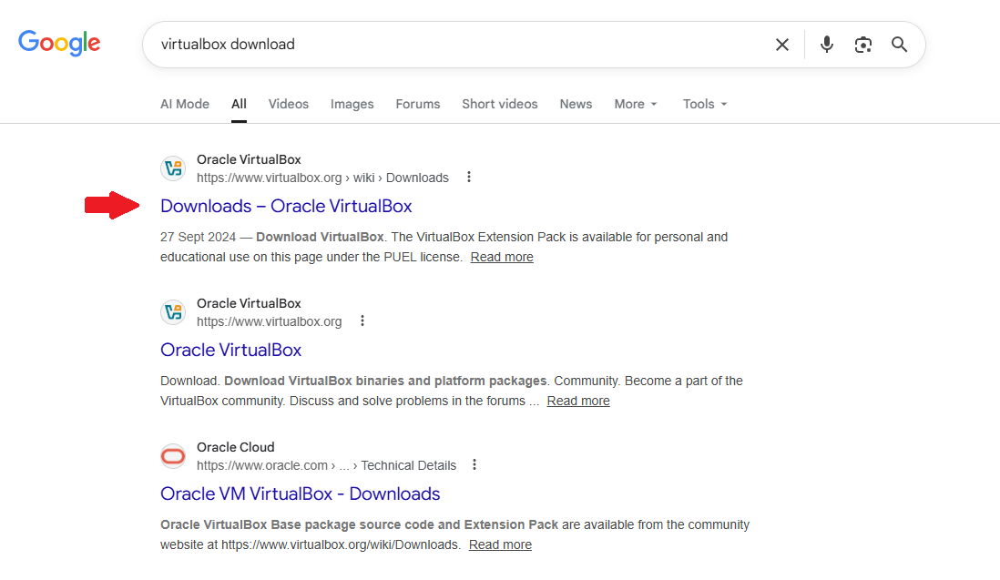

Pick the correct `VirtualBox Platform Packages` matching your host OS (OS that you are running on the machine that you are using). This set of instructions was executed on a Windows 11 machine.

> [!NOTE]
> Version of VirtualBox might be different to that showed in the image below. These instructions were tested on VirtualBox versions 7.2.6 and 7.2.8

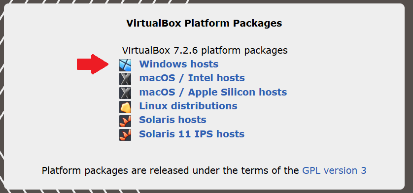

The installation is straightforward, just click *Next*, *Yes* and *Install* when prompted.

> [!TIP]
> Take note of space requirements for Virtual Box, ensure that you have enough on the machine to be able to install and run it.


## Navigating VirtualBox

Before creating any VMs, it is worth getting familiar with how to interact with VirtualBox and your virtual machines. Different components of VirtualBox to take note of have been listed below.

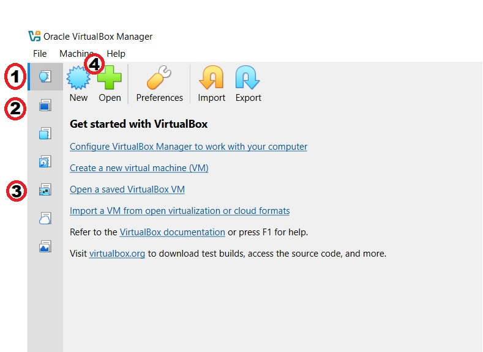

1. Home      - Takes you back to the start screen
2. Machines  - Display list of all virtual machines
3. Network   - Display all global network related settings
4. New       - Create new VM

### Mouse and Keyboard Capture

When you click inside a running VM, VirtualBox will **capture** your mouse and keyboard, meaning your inputs go to the VM and not your host machine.

To release your mouse and keyboard back to your host machine, press the
**Host Key**. By default this is:

| OS | Default Host Key |
|---|---|
| **Windows / Linux** | `Right Ctrl` |
| **Mac** | `Left Command` |

> [!TIP]
> You can see and change the Host Key at any time by going to
> **File → Preferences → Input** in VirtualBox.

### Useful Shortcuts

| Action | Shortcut |
|---|---|
| Release mouse / keyboard | `Right Ctrl` (Windows/Linux) or `Left Cmd` (Mac) |
| Toggle fullscreen | `Right Ctrl + F` |
| Toggle seamless mode | `Right Ctrl + L` |
| Take a snapshot | `Right Ctrl + T` |
| Reset the VM | `Right Ctrl + R` |
| ACPI shutdown (graceful power off) | `Right Ctrl + H` |
| Switch between VMs | Click the VM in the left panel |

### Full Screen Mode

To get the most out of your VM display, you can run it in full screen:

- Press `Right Ctrl + F` to enter full screen
- Press `Right Ctrl + F` again to exit
- When in full screen, a toolbar will appear at the top of the screen
  when you hover your mouse near the top edge — use this to access
  VirtualBox menus

> [!TIP]
> If your VM display looks too small or does not scale to fit the window,
> go to **View → Virtual Screen 1** and select **Scale to 100%** or enable
> **View → Auto-resize Guest Display**.

### More Shortcuts and Tips

For a full list of keyboard shortcuts and ways to interact with VirtualBox
7.2.x, refer to the official user manual:

- **Keyboard shortcuts:** [docs.oracle.com/en/virtualization/virtualbox/7.2/user/keyb_shortcuts.html](https://docs.oracle.com/en/virtualization/virtualbox/7.2/user/keyb_shortcuts.html)
- **Full VirtualBox 7.2 User Manual:** [docs.oracle.com/en/virtualization/virtualbox/7.2/user/index.html](https://docs.oracle.com/en/virtualization/virtualbox/7.2/user/index.html)


# Plan Your Resource Split

Before creating any VMs, it is important to understand how resources will
be divided across your cluster and why.

## Headnode vs Compute Node in High Performance Computing (HPC)

In a real HPC cluster, the **headnode** (also called the login node or master
node) is not where the heavy work happens. It is the entry point to the
cluster — it manages jobs, coordinates tasks, and directs work to the compute
nodes. The **compute nodes** are where the actual processing takes place.

This means in a real HPC environment:

> **Compute nodes are almost always more powerful than the headnode.**

We will follow this same principle in our makeshift cluster, even on a laptop.

## Check Your Laptop's Specs First

Before deciding on your split, find out what your laptop actually has:

- **Windows:** Press `Ctrl + Shift + Esc` → click the **Performance** tab
- **Mac:** Click the Apple menu → **About This Mac**
- **Linux:** Run `nproc` for CPU cores and `free -h` for RAM in the terminal

## Suggested Spec Split

Since both VMs share your laptop's hardware, you need to divide your
resources intentionally. Below are the recommended specs for each node:

### Headnode

The headnode handles coordination, scheduling, and management — it does
not need much power.

| Resource | Suggested Allocation | Why |
|---|---|---|
| **RAM** | 1–2 GB | Only runs management services, not workloads |
| **CPU Cores** | 1–2 cores | Light workload — mostly idle between jobs |
| **Disk** | 20–30 GB | Needs space for shared storage and job scripts |
| **Network** | NAT + Internal | NAT for internet, Internal to talk to compute nodes |

### Compute Node

The compute node is where jobs are executed, give it the bulk of your
laptop's available resources. At a minimum, allocate more *RAM* and *CPU Cores* to the compute node than you did to the headnode.

| Resource | Suggested Allocation | Why |
|---|---|---|
| **RAM** | As much as you can spare| This is where programs run and data is processed |
| **CPU Cores** | As many as you can spare | More cores = more parallel processing power |
| **Disk** | 15–20 GB | Needs enough for the OS and job output |
| **Network** | Internal only | Only needs to communicate with the headnode |

> [!IMPORTANT]
> **Do not allocate more than 70–80% of your total laptop resources across
> both VMs combined.** Your host OS (Windows/Mac/Linux) needs resources too,
> otherwise everything will grind to a halt.
>
> Example — if your laptop has **8 GB RAM and 4 CPU cores**:
> - Host OS: keep ~2–3 GB RAM and 1 core reserved
> - Headnode: 1 GB RAM, 1 core
> - Compute Node: 2–3 GB RAM, 2 cores

> [!NOTE]
> In a real HPC cluster there are typically many compute nodes, each more
> powerful than the headnode. In our case we are limited to one compute node
> due to laptop hardware constraints, but the concept is the same — the
> compute node should always be the more powerful of the two.

# Get Your Virtual Machine and Operating System

There are **two ways** to get a VM with an OS ready in VirtualBox. Choose
the method that suits your situation:

| Method | What it does |
|---|---|
| **Method 1: Pre-Built VM Image** | Downloads a VM with the OS already installed — no setup needed |
| **Method 2: Create a VM and Install an OS** | You create the VM yourself and install the OS from an ISO file |

>[!IMPORTANT]
> Please read through the instructions of how to implement both methods before deciding which approach to use. It is important to understand the steps involved in each method, as well as any potential limitations or trade-offs associated with them.

## Method 1: Pre-Built VM Image

Download a ready-made VirtualBox image from
**[LinuxVMImages.com](https://www.linuxvmimages.com/images/)**. Browse the
site and select the Linux distribution your team has decided to use.

>[!TIP]
> Select the Linux distribution that your team plans to use during the competition to give yourselves enough time to become familiar with the operating system beforehand.

### Which Image Type Should I Download?

| Type | Description |
|---|---|
| **Minimal** | Command-line only, no desktop GUI — smaller download |
| **Graphical** | Includes a full desktop environment — larger download |

> [!TIP]
> **For competition practice, always use the Minimal image.**
> Competition environments do not use a graphical interface — practising
> on the command line from the start will prepare you for the real thing.

### Login Credentials

The default username and password for each image are listed on the
LinuxVMImages website under **"System Details & VM Image Credentials"** on
the same download page. Check there for the exact credentials for whichever
OS image you download.


### Steps to Import the Pre-Built Image

**Step 1 — Extract the .7z file**

The downloaded file is a `.7z` archive and extract it

You will need an archive tool that can open `.7z` files:

- **Windows:** install [7-Zip](https://www.7-zip.org/), then right-click the file → **7-Zip → Extract Here**
- **Mac:** install [Keka](https://www.keka.io/) (from the App Store or website), then right-click the file → **Open With → Keka**
- **Linux:** install `p7zip` (e.g. `sudo dnf install p7zip` / `sudo apt install p7zip-full`), then run `7z x <filename>.7z`

You will get a folder containing a `.vbox` and `.vdi` file.

**Step 2 — Add the VM to VirtualBox**

1. Open **VirtualBox**
2. On the `Home` screen → Click **Open**
3. Navigate to your extracted folder
4. Select the `.vbox` file and click **Open**
5. The VM will appear in your VirtualBox list

You should see an image similar to the one shown below, with the full configuration details displayed on the right-hand side. In this example, the `Rocky 10.1` image was used. You can also view additional system specifications, including the allocated RAM, number of processors, storage capacity, and other hardware details of the VM.

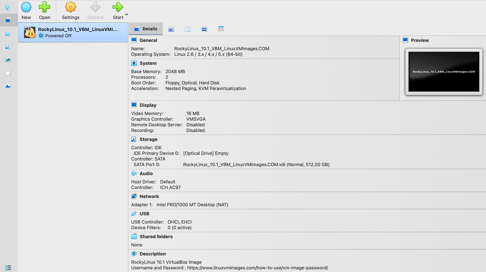

> [!CAUTION]
> Do **not** attach the `.vbox` or `.vdi` file as a DVD/optical drive that is only for ISO files. Pre-built images must be added via **Home → Open**.
> Do **not** move or delete the `.vdi` file. It is the virtual hard disk containing the OS. Both the `.vbox` and `.vdi` must stay in the same folder at all times.

### Pre-Built VM Specs: What Can and Cannot Be Changed

When you import a pre-built image, the VM comes with hardware settings already configured. You will need to adjust these to match the resource
split you planned in [Plan your resource split](#plan-your-resource-split).

> [!NOTE]
> To change any of these settings, the VM must be **powered off** first.
> Go to **Settings** on the VM in VirtualBox to make adjustments.

#### Can Be Changed

| Setting | What it means | Recommendation |
|---|---|---|
| **VM Name** | The name given to the VM | Change to the desired name|
| **RAM (Memory)** | How much of your laptop's memory the VM is allowed to use | Adjust to match your planned split|
| **CPU (Processors)** | How many CPU cores the VM can use | Adjust to match your planned split|
| **Video Memory** | Memory used for the display | Only relevant for graphical desktops — leave as is for Minimal |
| **Network Adapters** | How the VM connects to networks | You will configure these after you gain a better understanding in [Setup the cluster](#setup-the-cluster) |

#### Cannot Be Changed

| Setting | Why it is fixed |
|---|---|
| **Disk size** | The `.vdi` file is a pre-built virtual hard disk, its size is baked into the image and cannot be expanded without advanced disk tools |
| **OS and installed software** | The operating system and base packages are already installed inside the image |
| **Architecture (32-bit / 64-bit)** | Fixed by the image, your CPU must support the same architecture |

> [!CAUTION]
> **Known Issue — Kernel Panic on VirtualBox**
>
> Some users have reported a kernel panic error when running certain Linux distributions on VirtualBox 7.1.x on Windows 10. If you encounter this:
> - Make sure you are using the latest point or most stable release of your chosen OS
> - Update VirtualBox to **version 7.2.x** or later

## Method 2: Create a VM and Install an OS

If you prefer to set up everything yourself, you will first create a blank VM in VirtualBox and then install your chosen OS from an ISO file.

### Part A: Create a New Virtual Machine

Head to the *Home* screen in VirtualBox and press *New* to create a new VM.

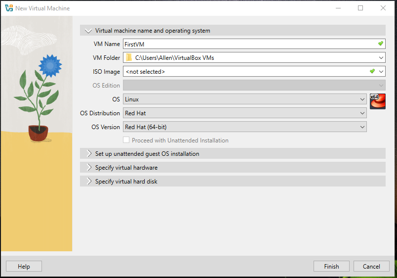

1. Select a name for your VM, in this case the VM is called *FirstVM*
2. Leave the ISO Image as *\<not selected>* — this will be loaded in Part B
3. Select the *OS* that you want to run on your VM. For this example the VM
   will run *Linux*, *Red Hat* distribution, *Red Hat (64-bit)* version

>[!TIP]
> Select the Linux distribution that your team plans to use during the competition to give yourselves enough time to become familiar with the operating system beforehand.

4. Move on to the **Specify Virtual Hardware** section, use the resource
   split you planned in [Plan your resource split](#plan-your-resource-split) to
   decide how much RAM and how many CPU cores to assign

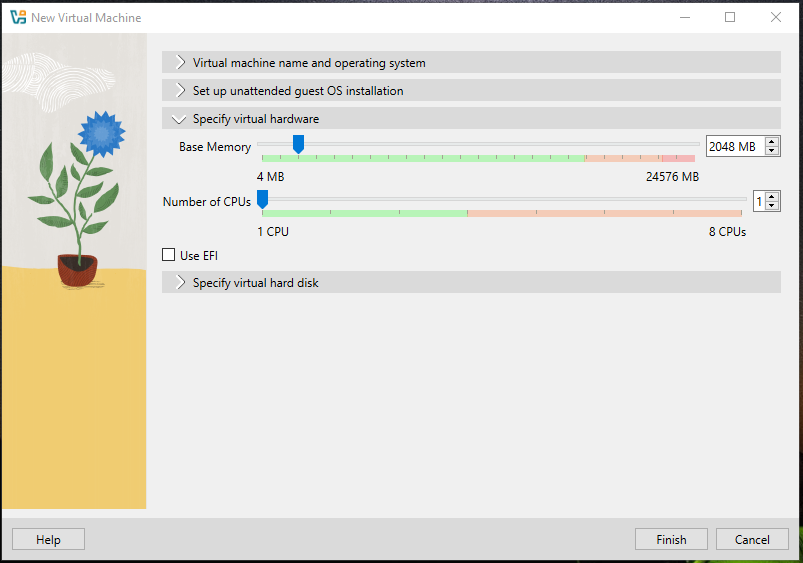

5. Move on to the **Specify Virtual Hard Disk** section, consider the suggested disk sizes mentioned in [Plan your resource split](#plan-your-resource-split).

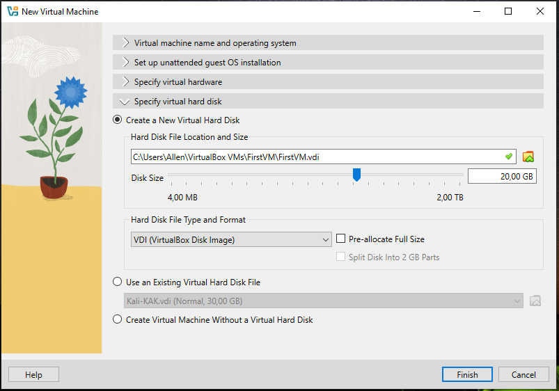

6. Click *Next* and then *Finish*

The VM will now appear on the home screen with a status of **Powered Off**.

### Part B: Download and Attach an ISO

Download an ISO file directly from your chosen Linux distribution's
official website. Below are the official download pages for the most
common distributions:

| Distribution | ISO Download Page | Recommended ISO Type |
|---|---|---|
| **Rocky Linux** | [rockylinux.org/download](https://rockylinux.org/download) | Minimal |
| **Ubuntu** | [ubuntu.com/download/server](https://ubuntu.com/download/server) | Ubuntu Server (no GUI) |
| **Arch Linux** | [archlinux.org/download](https://archlinux.org/download) | Standard ISO |

> [!WARNING]
> **For Ubuntu, do not download Ubuntu Desktop** — download **Ubuntu Server**
> instead. The Desktop edition includes a graphical interface which is not
> needed for competition practice and will use unnecessary resources on
> your laptop.

> [!CAUTION]
> **Arch Linux is not recommended for beginners.** Unlike Rocky and Ubuntu, Arch has no guided installer, everything is configured manually through the command line. Only choose Arch if your team is already comfortable with Linux.

Once downloaded, attach it to your VM:

1. Open **VirtualBox** and select your VM
2. Click **Settings → Storage**
3. Under the storage controller (usually shown as **Controller: SATA** or **Controller: IDE**), click the **CD/DVD icon with a plus sign on it** (Add Optical Drive)

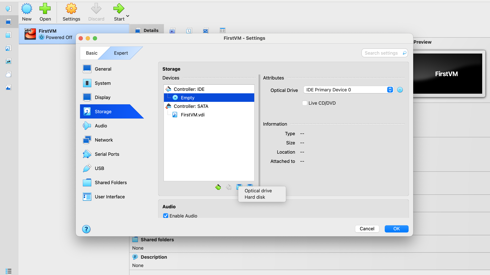

4. It will open a page where you can add a disk as seen on the image below. Select the **ADD** button and navigate to the location where the `.iso` is downloaded.

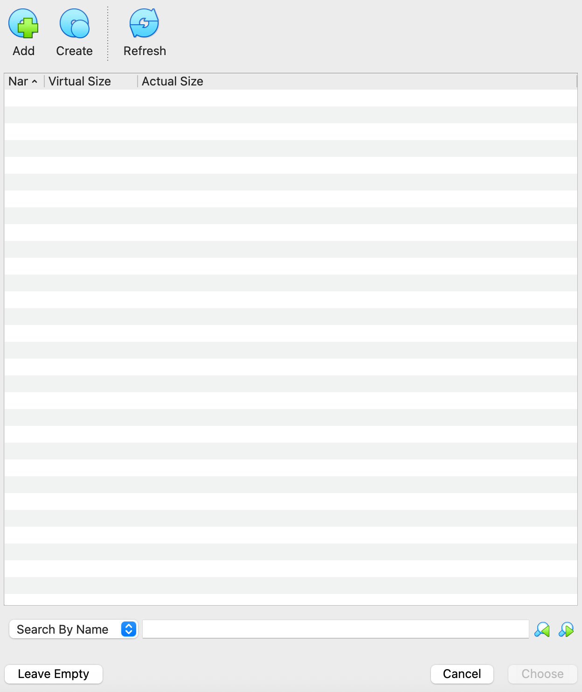

5. Select your downloaded `.iso` file then click **Open**, and it will be loaded on the disk page. This is where you will see all `.iso` files that you have loaded.
6. Make sure the `.iso` file is selected, then click **Choose**
7. Ensure that the disk is loaded and selected as seen in the image below.

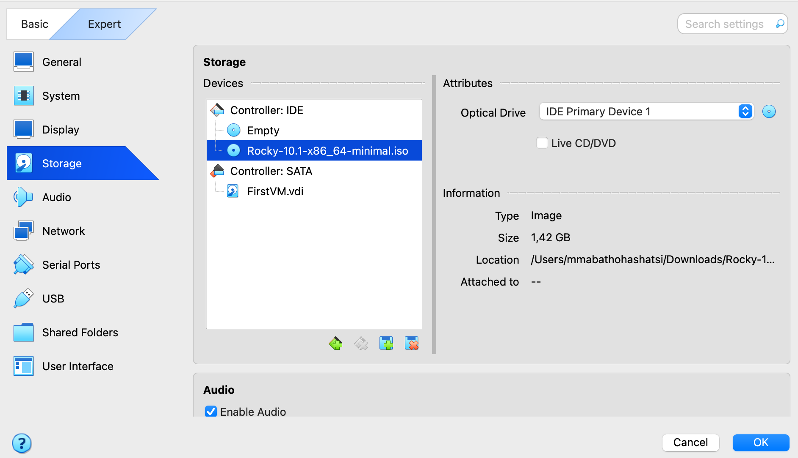

>[!IMPORTANT]
> Remove the disk that is *Empty* by clicking on the disk and then **remove** it by clicking the **CD/DVD icon with a minus sign on it**.

8. The disk that you just created with your `.iso` file should be the only one left. Click **OK**.
9. Start the VM. It will boot from the ISO and launch the installer.
10. Follow the on-screen steps to complete the installation. If this is your
first time installing a Linux OS, refer to the official installation guides
below for your chosen distribution:

| Distribution | Official Installation Guide |
|---|---|
| **Rocky Linux** | [docs.rockylinux.org/guides/installation](https://docs.rockylinux.org/guides/installation/) |
| **Ubuntu Server** | [ubuntu.com/tutorials/install-ubuntu-server](https://ubuntu.com/tutorials/install-ubuntu-server) |
| **Arch Linux** | [wiki.archlinux.org/title/Installation_guide](https://wiki.archlinux.org/title/Installation_guide) |

> [!NOTE]
> The installation process differs between distributions. Rocky Linux and Ubuntu both have guided graphical installers that walk you through each step. Arch Linux requires a fully manual setup through the command line.

>[!IMPORTANT]
> Now that you have reviewed both methods, choose the approach you would like to use and proceed with deploying your first virtual machine, which will serve as the head node.


# Setup the Cluster

With your headnode VM up and running, you are now ready to connect your VMs into a cluster. Below is the network plan we will follow.

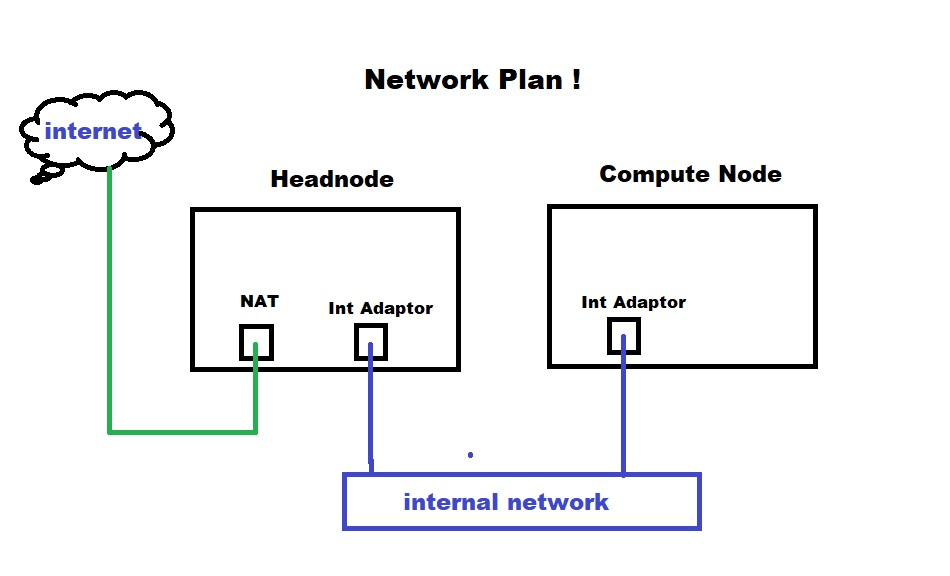

> [!NOTE]
> You can only change network settings when machines are **powered off**.

## Understanding Network Adapters

Before configuring the cluster, it is important to understand the four basic
network adapter types in VirtualBox:

1. **NAT** — Network Address Translation maps your VM to a single public IP
   for internet access. Think of this as your gateway to the internet —
   it supplies internet access only.

2. **Bridged Adapter** — Piggybacks on your host machine's network card,
   connecting the VM directly to the host network. You will have access to
   all devices on that network including routers and servers.

> [!IMPORTANT]
> **Be careful with the Bridged Adapter.** For example, if you configure
> your VM as a DHCP server it will broadcast across your entire host network.

3. **Internal Network** — Creates a named private network shared only between
   VMs. Think of this as a virtual switch that you plug VMs into.

4. **Host-Only Adapter** — Similar to Internal Network, but the **host
   machine can also reach the VMs** on this network (Internal Network is
   VM-to-VM only). VirtualBox itself can act as the DHCP server, making
   it more customizable.

Below is an example of the network adapters you can attach to a virtual machine.

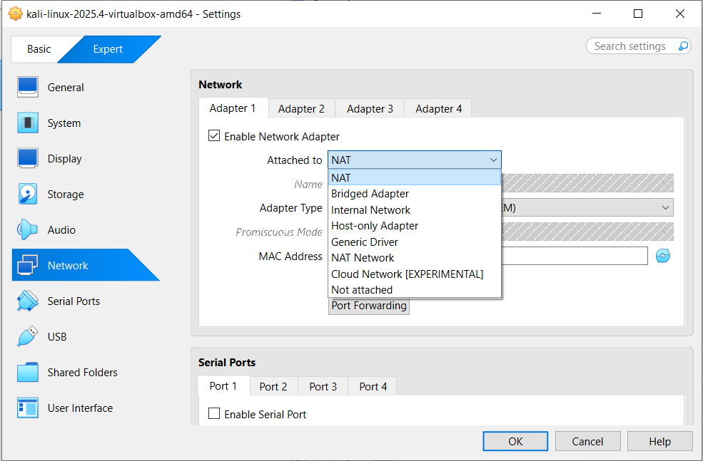

In the network tab you can customise the Host and NAT adapters further.

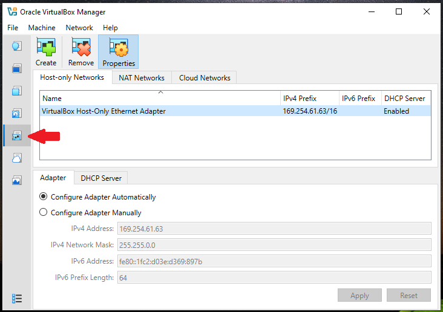

## Configure the Headnode Network

The headnode requires **two network adapters**:
- **NAT** — for internet access
- **Internal Network** — for communicating with compute nodes

With the headnode powered off, open its settings by selecting it in the
**Machines** tab and clicking **Settings**.

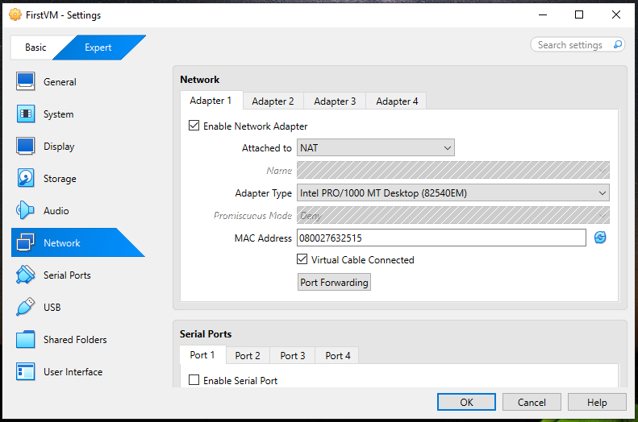

1. Go to the **Network** settings and enable a second adapter by ticking the **Enable Network Adapter** checkbox.
2. Change the **Attached to** → **Internal Network**
3. Name the internal network — in this example it is named `myNetwork`
4. Click **OK**

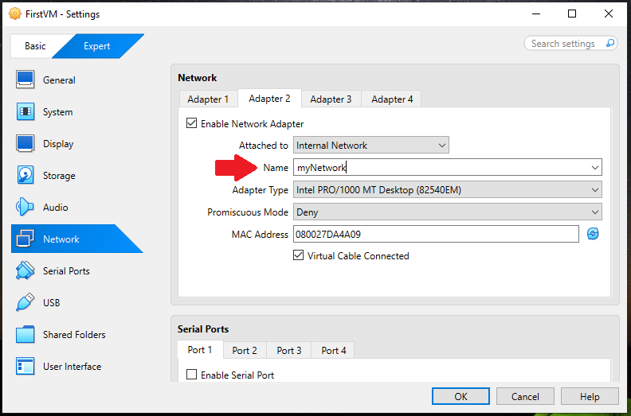

> [!IMPORTANT]
> Take note of the internal network name you set here. You must use the exact same name on the compute node to place both VMs on the same network.

## Configure the Compute Node

Before configuring the network, you need to create your compute node VM.
Follow the same method you used for the headnode in [Get your virtual machine and operating system](#get-your-virtual-machine-and-operating-system), keeping in mind the resource split you planned in [Plan your resource split](#plan-your-resource-split) section.

Some settings were already configured when creating your head node, so you can simply select them instead of repeating the steps. For example, the ISO image you previously added will now appear as an available option and can be selected directly.

> [!IMPORTANT]
> **Unattended Guest OS Installation**
>
> When creating a second VM, if you select an ISO file in the
> **Virtual Machine Name and Operating System** section, VirtualBox
> will automatically tick **Proceed with Unattended Installation**.
>
> **Untick this option before continuing.**
>
> 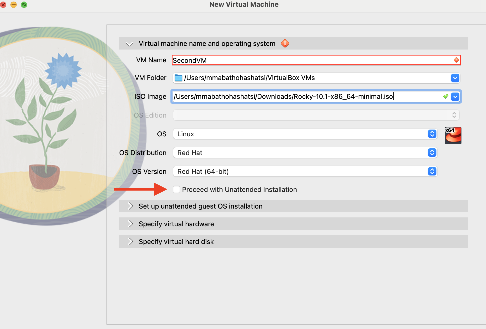
>
> Leaving it ticked can cause the installation to hang with no clear
> indication of where the problem is. When it is ticked, VirtualBox will prompt you with an **Unattended Guest OS Installation** section
> where you will manually set your login credentials for that VM:
>
> - **Username** — the account name you will use to log into the VM
> - **Password** — the password for that account
>
> Make sure to note these down as you will need them every time you
> log into that VM. Each VM has its own login, these are separate from any credentials used when setting up your headnode or from the
> pre-built image credentials in Method 1.

> [!NOTE]
> Remember that the compute node should receive the **larger share** of your laptop's resources, this is where the actual work gets done. Refer back to the suggested specs table in [Plan your resource split](#plan-your-resource-split) section for guidance.

Once your compute node VM is created and the OS is running, the installation process may take some time, **power it off** before configuring the network.

### Compute Node Network Configuration

The compute node only needs **one adapter → Internal Network** to
communicate with the headnode.

Select your compute node VM, go to **Settings → Network** and set
**Adapter 1** to **Internal Network**, using the exact same network name
as the headnode.

If the headnode was configured correctly, the internal network will
appear in the dropdown list.

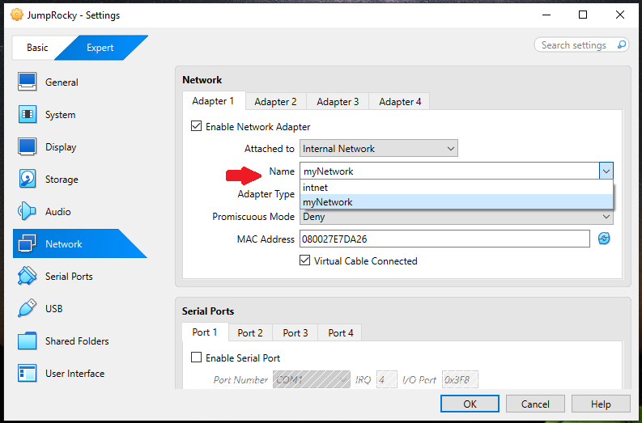

Once the network between the machines has been set up, configure the IP addresses on each VM and your cluster will be connected.

## Configure IP Addresses

With the network adapters set up, you now need to assign a static IP
address to each VM so they can communicate with each other. We use static IPs (fixed addresses that do not change) because later you will be setting up a hosts file that maps names to IP addresses. If the IPs kept changing this would break that setup.

### What is an IP Address?

An IP address is a unique address that identifies a device on a network, similar to a house address. Every device on the same network needs a unique IP so they can find and talk to each other.

For our internal cluster network we will use the **192.168.x.x** range, this is a private IP range commonly used for local networks.

### Suggested IP Plan

| Node | IP Address | Role |
|---|---|---|
| **Headnode** | `192.168.1.1` | Manages the cluster |
| **Compute Node** | `192.168.1.2` | Runs the workloads |

> [!NOTE]
> Both VMs must be on the **same network range** (192.168.1.x) to be able
> to communicate with each other.

### Setting a Permanent Static IP

Before assigning IPs, you need to identify which network interface is which. The headnode has **two interfaces** — one for NAT (internet) and one for the internal network. The compute node has **one interface** for the internal
network only.

**Run this on your VM to list all interfaces:**

```bash
ip addr show
```

You will see something like this on the headnode:

```
1: lo: ...              ← ignore this, it is the loopback interface
2: enp0s3: ...          ← this is your NAT interface (internet)
3: enp0s8: ...          ← this is your internal network interface
```

**How to tell which is which:**
- The **NAT interface** (`enp0s3`) will already have an IP starting with
  `10.x.x.x` automatically assigned by VirtualBox. **Do not touch this one.**

- The **internal network interface** (`enp0s8`) will have no IP assigned yet. This is where you assign your static IP.

> [!IMPORTANT]
> Interface names may be different than those stated in this guide, but check the IPs in order to identify which interface is NAT and which is the internal network.
> 
> Always assign your static IP to the **internal network interface**
> (`enp0s8`), never to the NAT interface (`enp0s3`). The compute node only has one interface so assign the static IP to that one.

Follow the instructions below for your chosen Linux distribution. Do this
on **both** the headnode and compute node, using the correct IP address
for each from the table above.


---

<details>
<summary> </summary>

<br>

Rocky Linux uses **NetworkManager** with `nmcli` to manage network
configuration.

**Step 1 — Check your interfaces**

```bash
ip addr show
```

The interface with a `10.x.x.x` address is your NAT interface — leave it alone. The interface with no IP is your internal network interface — this is where you assign your static IP.

**Step 2 — Create a connection profile for the internal interface**

If the interface has no connection profile yet, create one first. Replace
`<interface name>` with your actual interface (e.g. `enp0s8`). The
`con-name` is the name of the connection profile, here we keep it the
same as the interface name for clarity:

```bash
sudo nmcli con add type ethernet ifname <interface name> con-name <interface name>
```

**Step 3 — Assign the static IP**

These commands operate on the **connection name** you set above (not the
interface name — they just happen to match here):

```bash
sudo nmcli con mod <connection name> ipv4.addresses 192.168.1.x/24
sudo nmcli con mod <connection name> ipv4.method manual
sudo nmcli con up <connection name>
```

Replace `192.168.1.x` with `192.168.1.1` for the headnode or
`192.168.1.2` for the compute node.

**Step 4 — Verify the IP was applied**

```bash
ip addr show <interface name>
```

You should see your assigned IP address listed.

> For more detail see the official guide:
> [docs.rockylinux.org/guides/network/basic_network_configuration](https://docs.rockylinux.org/guides/network/basic_network_configuration/)

</details>

---

<details>
<summary> </summary>

<br>

Ubuntu Server uses **Netplan** for network configuration. Settings are
defined in a `.yaml` file.

**Step 1 — Check your interfaces**

```bash
ip addr show
```

The interface with a `10.x.x.x` address is your NAT interface — leave
it alone. The interface with no IP is your internal network interface —
this is where you assign your static IP.

**Step 2 — Edit the Netplan configuration file**

```bash
sudo nano /etc/netplan/00-installer-config.yaml
```

**Step 3 — Update the file to look like this**

Replace `<NAT interface name>` and `<internal interface name>` with the
actual names you identified in Step 1 (for example `enp0s3` and `enp0s8`).
The two keys must be **different**, otherwise YAML will only keep the
last one and the NAT interface will lose its config.

```yaml
network:
  version: 2
  ethernets:
    <NAT interface name>:
      dhcp4: true
    <internal interface name>:
      dhcp4: no
      addresses:
        - 192.168.1.x/24
```

Replace `192.168.1.x` with `192.168.1.1` for the headnode or
`192.168.1.2` for the compute node.

**Step 4 — Apply the changes**

```bash
sudo netplan apply
```

**Step 5 — Verify the IP was applied**

```bash
ip addr show <interface name>
```

> For more detail see the official guide:
> [ubuntu.com/server/docs/network-configuration](https://ubuntu.com/server/docs/network-configuration)

</details>

---

<details>
<summary> </summary>

<br>

Arch Linux uses **systemd-networkd** for network configuration.

**Step 1 — Check your interfaces**

```bash
ip addr show
```

The interface with a `10.x.x.x` address is your NAT interface — leave
it alone. The interface with no IP is your internal network interface — this is where you assign your static IP.

**Step 2 — Create a network configuration file for the internal interface**

```bash
sudo nano /etc/systemd/network/20-internal.network
```

**Step 3 — Add the following content**

```ini
[Match]
Name=<interface name>

[Network]
Address=192.168.1.x/24
```

Replace `192.168.1.x` with `192.168.1.1` for the headnode or
`192.168.1.2` for the compute node.

**Step 4 — Enable and restart systemd-networkd**

```bash
sudo systemctl enable systemd-networkd
sudo systemctl restart systemd-networkd
```

**Step 5 — Verify the IP was applied**

```bash
ip addr show <interface name>
```

> For more detail see the official guide:
> [wiki.archlinux.org/title/Network_configuration](https://wiki.archlinux.org/title/Network_configuration)

</details>

---

### Test the Connection Between Nodes

Once both VMs have their IPs set, verify they can see each other by running a ping from the headnode to the compute node:

```bash
ping 192.168.1.2
```

If you get replies, your cluster network is connected. If not, check
the following:

- Both VMs are using the **same internal network name** in VirtualBox
- The static IP is assigned to the correct interface — the **internal
  network interface**, not the NAT interface
- The internal network interface has an active configuration. If not,
  re-apply it for your distribution:
  - **Rocky:** `sudo nmcli con add type ethernet ifname <interface name> con-name <interface name>` then re-run the `nmcli con mod` steps
  - **Ubuntu:** re-check `/etc/netplan/00-installer-config.yaml` and run `sudo netplan apply`
  - **Arch:** re-check `/etc/systemd/network/20-internal.network` and run `sudo systemctl restart systemd-networkd`
- Both VMs are **powered on**.