# Launching your First Azure Virtual Machine Instance
In this section you will be configuring and launching your first Virtual Machine instance using Microsoft Azure. This allows you to use a portion of another computer's resources, to host another Operating System as though it were running on its own dedicated hardware resources.

## Accessing Microsoft Azure

Open your web browser and navigate to the Azure platform to create a free account using this link: <a href="https://azure.microsoft.com/en-us/pricing/purchase-options/azure-account?icid=azurefreeaccount">Sign Up for Azure</a>

Once created you should be taken to the Azure dashboard which will look something like this:<p align="center">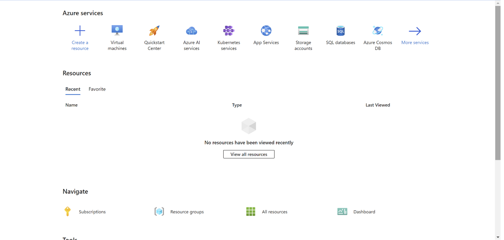</p>

## Generating SSH keys

 SSH keys allows you to authenticate against a remote SSH server, without the use of a password.

> [!IMPORTANT]
> When you are presented with foldable code blocks, you must pick and implement only **one** of the options presented, which is suitable to your current configuration and/or circumstance.

> [!TIP]
> A number [encryption algorithms](https://en.wikipedia.org/wiki/Public-key_cryptography) exist for securing your SSH connections. [Elliptic Curve Digital Signature Algorithm (ECDSA)](https://en.wikipedia.org/wiki/Elliptic_Curve_Digital_Signature_Algorithm) is secure and simple enough should you need to copy the public key manually. Nonetheless, you are free to use whichever algorithm you choose to.

From the `Start` menu, open the Windows `PowerShell` application:
These commands are the same if you are commenting from a Linux, Unix or MacOS Terminal, and Moba XTerm.
1. Generate an SSH key pair:
   ```bash
   ssh-keygen -t ed25519
   ```
1. When prompted to _"Enter file in which to save the key"_, press `Enter`,
1. When prompted to _"Enter a passphrase"_, press `Enter`, and `Enter` again to verify it.

   <p align="center">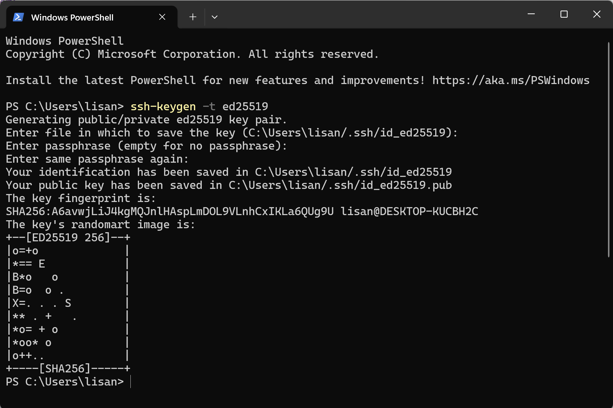</p>

> [!TIP]
> Below is an example using Windows PuTTY. It is hidden and you must click the heading to reveal it's contents. You are strongly encourage to use either Windows PowerShell or Moba XTerm instead.

<details>
<summary>Windows PuTTY</summary>

[PuTTY](https://putty.org/) is a Windows-based SSH and Telnet client. From the `Start` menu, open the `PuTTYgen` application.
1. Generate an SSH key pair using the `Ed25519` encryption algorithm.
1. Generate the necessary entropy by moving your mouse pointer over the `Key` section until the green bar is filled.
   <p align="center">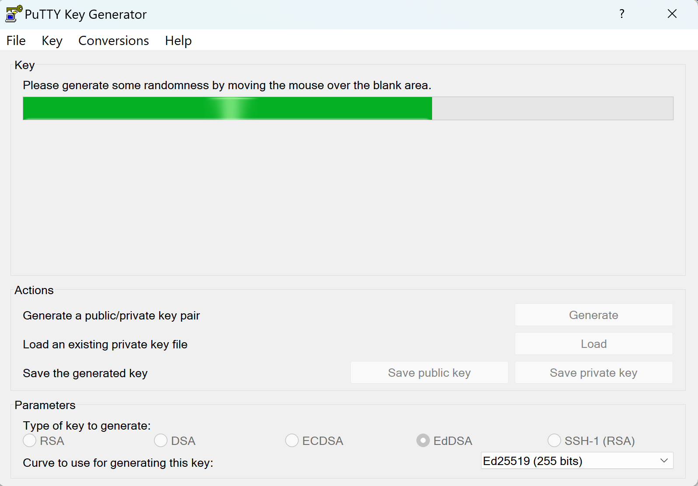</p>

1. Proceed to **Save** both the `Private Key` and `Public Key`.
   <p align="center">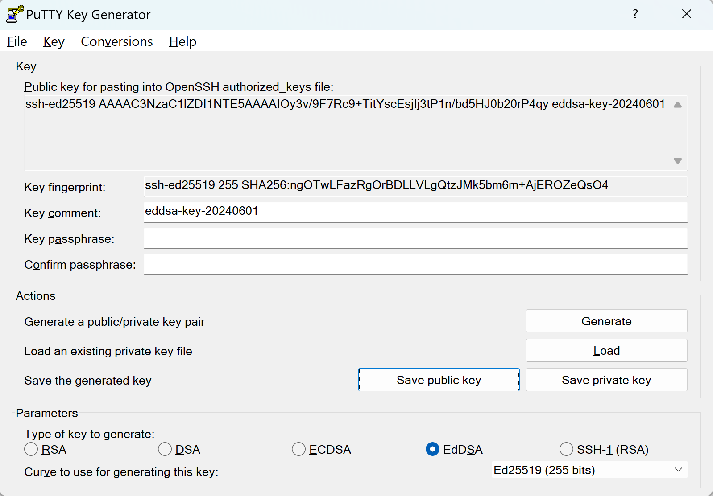</p>
</details>

You **MUST** take note of the location and paths to **BOTH** your public and private keys. Your public key will be shared and distributed to the SSH servers you want to authenticate against. Your private key must be kept secure within your team, and must not be shared or distributed to anyone.

Once you have successfully generated an SSH key pair, navigate to Azure's SSH keys page using the search bar. This page will appear:

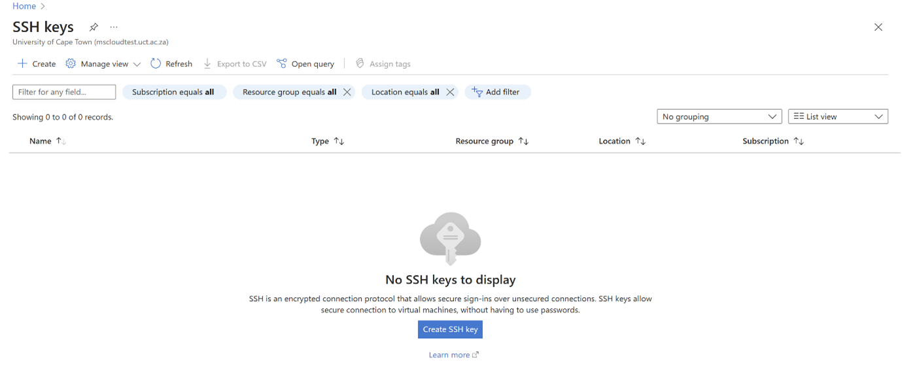 Click `Create SSH key`. 

Fill in all the required fields with your groups information as in the image below and upload the newly created public key `id_ed25519.pub`.

> [!NOTE]
> You may need to create a new resource group. Under *Resource group*, simply create a new group with an appropriate name which can be associated with all future tasks for this project. 

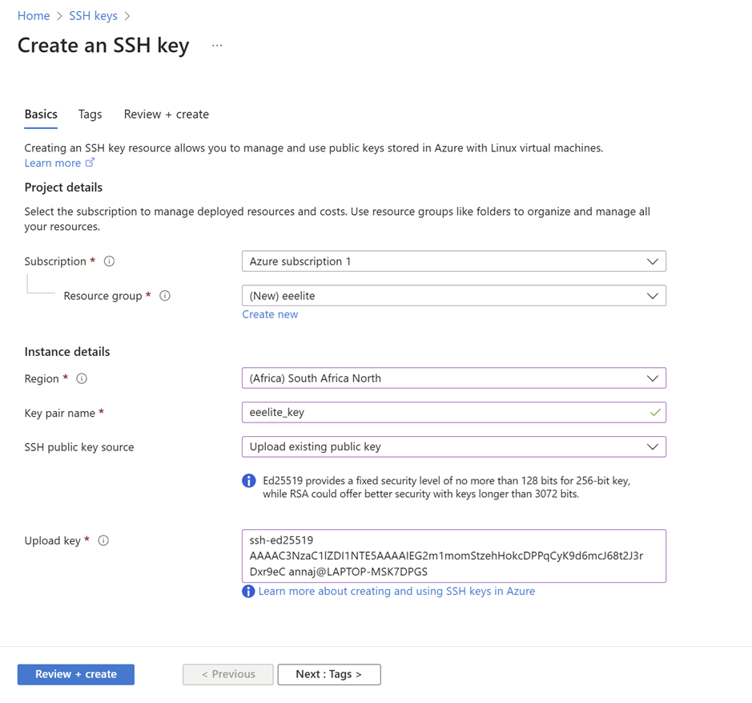

`Review + create` and ensure it passes validation before clicking `Create` again.
The key should now appear on your SSH Keys dashboard.
>[!TIP]
>If it takes time to appear, just keep refreshing.

## Launch a New Instance
From the Azure dashboard, navigate to `Virtual machines -> Create -> Azure virtual machine.`
Within the new window (as shown below), assign an appropriate name which will describe what the VM's intended purpose is meant to be and help you to remember it's primary function. In this case, a suitable name for your instance would be <b>headnode</b>.

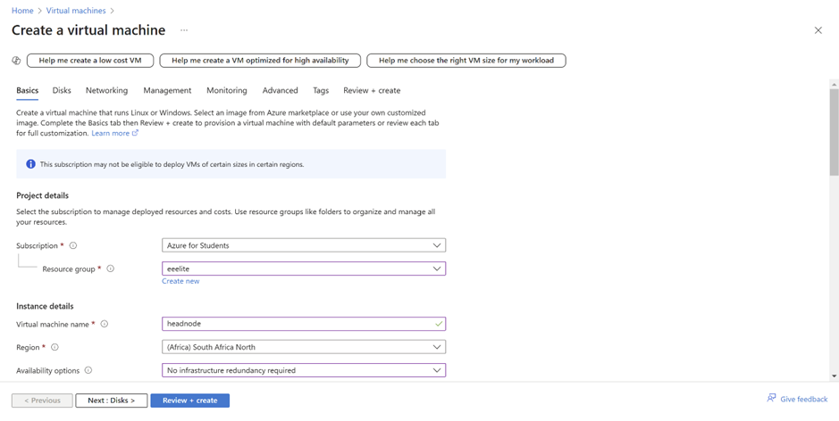
Under *Resource Group*, pick the one created earlier with the SSH Key and under *Region*, pick `South Africa North`.

## Linux Flavours and Distributions
Each team can choose the Linux distribution they are most comfortable with.

> [!NOTE]
> Below is a summary of Linux distributions to help you make an informed decision. Click the heading to reveal it's contents.

<details>
<summary><b>Summary of Linux Distributions</b></summary> 

A Linux distribution, is a collection of software that is at the very leased comprised of a [Linux kernel](https://en.wikipedia.org/wiki/Linux_kernel) and a [package manager](https://en.wikipedia.org/wiki/Package_manager). A package manager is responsible for automating the process of installing, configuring, upgrading, downgrading and removing software programs and associated components from a computer's operating system.

A number of considerations must be taken into account when deciding on choice of Linux distro as a *'daily driver'* and as well as a server. There are subtleties and nuances between the various Linux flavors. These vary from a number of factors, not least of which including:
* Support - is the project well documented and do the developers respond to queries,
* Community - is there a large and an active userbase,
* Driver Compatibility - will the distro *'natively'* run on your hardware without workarounds or custom compilation / installation of various device drivers,
* Stability and Maturity - is the intended distro and version currently actively supported and maintained, not 'End of Life' and verified to run across a number of different systems and environment configurations. Or do you intend to run a *'bleeding-edge'* distro so that you may in the future, influence the direction of application development and assist developers in identifying bugs in their releases...

You and your Team, together with input and advise from your mentors, must do some research and depending on the intended use case, decide which will be the best choice.

The following list provides a few examples of Linux distros that *may* be available on the Sebowa OpenStack cloud for you to use, and that you *might* consider using as a *'daily driver'*.

> You do not need to decide right now which Linux Flavor you and your team will be installing on you personal / school laptop and desktop computers. The list and corresponding links are provided for later reference, however for the time being you are strongly encouraged to proceed with **Rocky 9.3 image**. .

* **RPM** or Red Hat Package Manager is a free and open-source package management system. The name RPM refers to the `.rpm` file format and the package manager program itself. Examples include [Red Hat Enterprise Linux](https://www.redhat.com/en/technologies/linux-platforms/enterprise-linux), [Rocky Linux](https://rockylinux.org/), [Alma Linux](https://almalinux.org/), [CentOS Stream](https://www.centos.org/centos-stream/) and [Fedora](https://fedoraproject.org/). You can't go wrong with choose of either Red Hat, Alma, ***Rocky*** or CentoS Stream for the competition. You manage packages through tools such at `yum` (Yellowdog Updater, Modified) and / or `dnf` (Dandified YUM).

* **Zypper** is the package manager used by [openSUSE](https://www.opensuse.org/), [SUSE Linux Enterprise (SLE)](https://www.suse.com/), and related distributions. This is another good choice for beginners, however openSUSE is not available as an image for the competition.

* **APT**: In Debian-based distributions, the installation and removal of software are generally managed through the package management system known as the Advanced Package Tool (APT). Examples include [Debian](https://www.debian.org/), [Ubuntu](https://ubuntu.com/), [Linux Mint](https://linuxmint.com/), [Pop! OS](https://pop.system76.com/) and [Kali Linux](https://www.kali.org/). Debian or Ubuntu Based Linux distributions are fantastic options for beginners. If one of your team members are already using such a system, then you are advised to use the provided Ubuntu image for the competition.

* **PkgTool** is a menu-driven package maintenance tool provided with the [Slackware Linux distribution](http://www.slackware.com/). Listed here for interest, not recommended for beginners.

* **Pacman** is a package manager that is used in the [Arch Linux](https://archlinux.org/) distribution and its derivatives such as [Manjaro](https://manjaro.org/). Not recommended for beginners.

* **Portage** is a package management system originally created for and used by  [Gentoo Linux](https://www.gentoo.org/) and also by ChromeOS. Definitely not recommended for beginners.

* **Source-Based**: [Linux From Scratch (LFS)](https://www.linuxfromscratch.org/) is a project that teaches you how to create your own Linux system from source code, using another Linux system. Learn how to install, configure and customize LFS and BLFS, and use tools for automation and management. Once you are **very** familiar with Linux, LFS is an excellent medium term side project that you peruse in you own time. Only Linux experts need apply.
</details>

Once reaching a decision, under *Image* select the desired distribution as below.
<p align="center">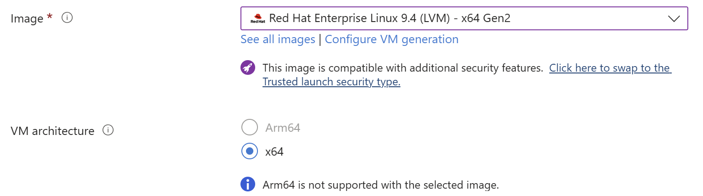</p>

## Azure Instance Sizes

An important aspect of system administration is resource monitoring, management and utilization. You will be required to manage your available resources and ensure that the resources of your clusters are utilized in such a way as to maximize system performance. Azure has a multitude of size options and you will need to decide how you are going to pick the sizing of the compute, memory and storage across your head node and compute node(s).

> [!TIP]
> When designing clusters, very generally speaking the *'Golden Rule'* in terms of Memory is **2 GB of RAM per CPU Core**. The storage on your head node is typically '*shared*' to your compute nodes through some form of [Network File System (NFS)](https://en.wikipedia.org/wiki/Network_File_System).

Once deciding on a desired size, select it under *Size* as shown below. In this case, Standard_B1s were utilised, but once again it is up to you and your cluster's needs.

<p align="center">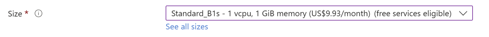</p>


## Key Pair 
Still under the Basics tab, ensure that your *Authentication type* is set to `SSH public key` and then upload the SSH Key that you created earlier as shown below. 
> [!CAUTION]
> You must ensure that you associate the SSH Key that you created earlier to your VM, otherwise you will not be able to log into your newly created instance

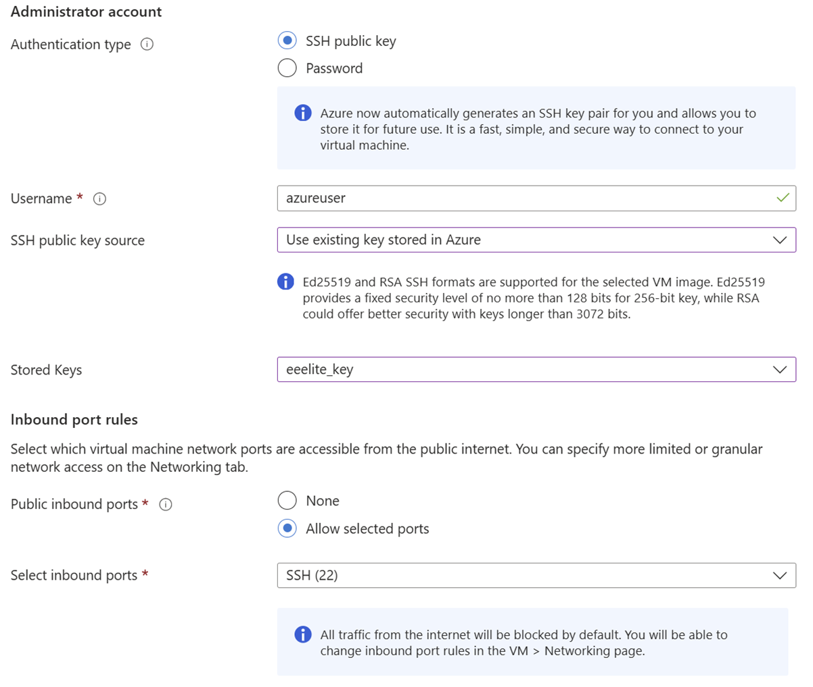

## Disks, Networking and Security 
### Disks 
Under *Disks*, ensure that the following options are configured:  
1. *OS Disk Type* is set to `Standard SSD`
2. *Delete with VM* is <b>NOT</b> checked

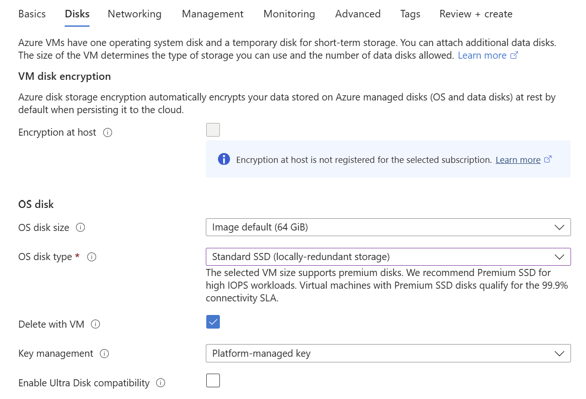

### Networking and Security
Under *Networking*, ensure the following options are configured:
1. *Virtual network* is set to `your team’s network` 
2. *Subnet* can be the default 
3. *NIC network security group* is set to `Advanced` and the corresponding group is applied
    
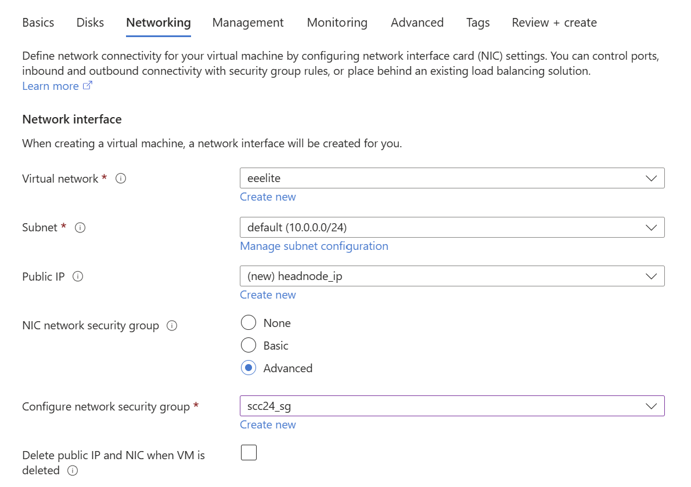

>[!NOTE]
>If your team does not have a *Virtual Network* or *Security Group* already configured, simply create one at this stage which can be related to all future creations under the same project. 

## Verify that your Instance was Successfully Deployed and Launched
Congratulations! Once your VM instance has completed it's deployment phase, and if your *Status* indicates Running, then you have successfully launched your very first Azure instance.

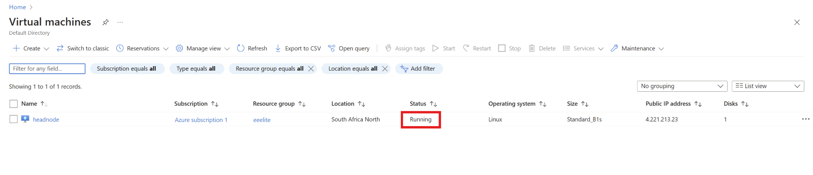


## Troubleshooting
> [!CAUTION]
> The following section is strictly for debugging and troubleshooting purposes. You **MUST** discuss your circumstances with an instructor before proceeding with this section.

* Deleting Instances

When all else fails and you would like to reattempt the creation of your nodes from a clean start, Select the VM you want to remove and click `Delete` at the top

INSERT PIC 1

* Deleting Disks and Dissociating Public IP
  
By default, your VM's storage and Public IP address have been configured to linger even after deleting. However, if you would like to remove these as well, simply check the required boxes which appear on the window when confirming the deletion of your Instance.

INSERT PIC 2
