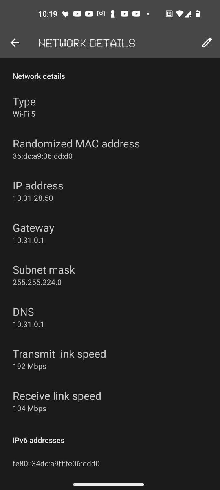
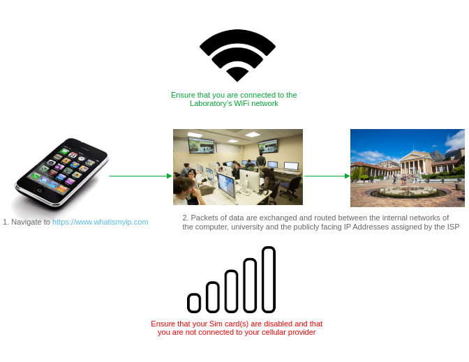
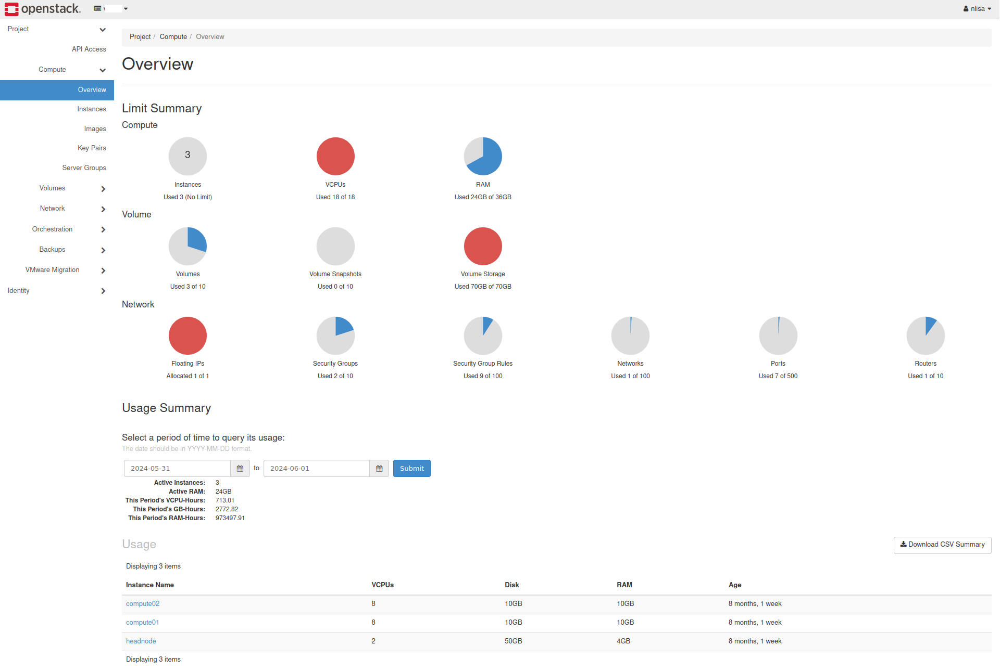
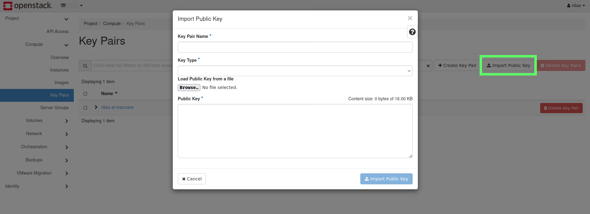
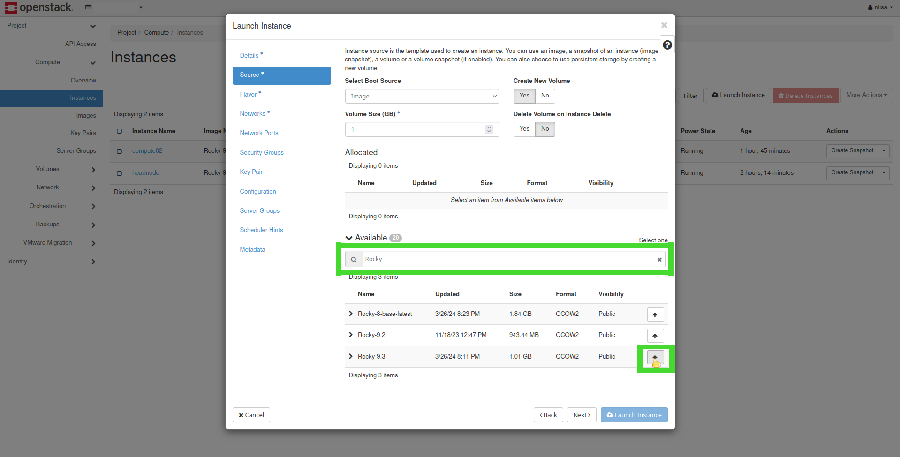
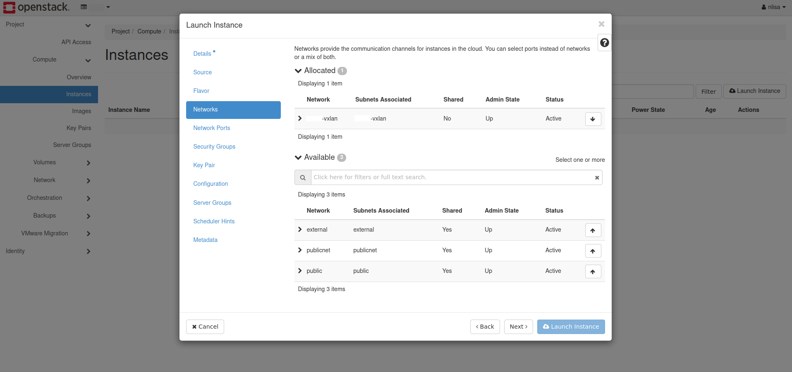
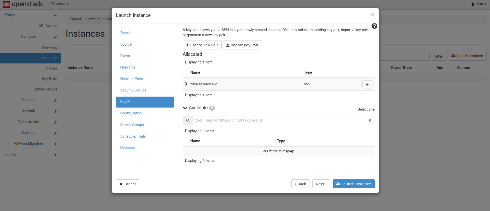
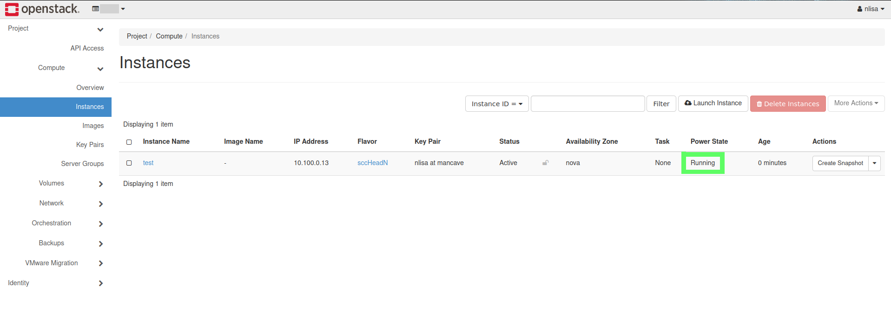
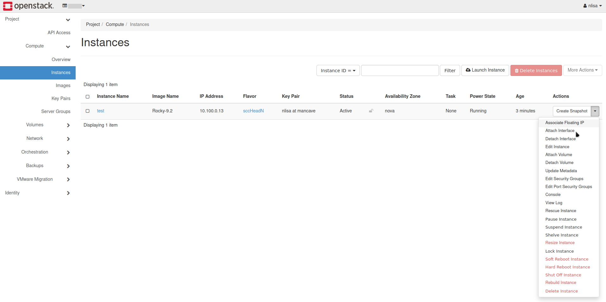
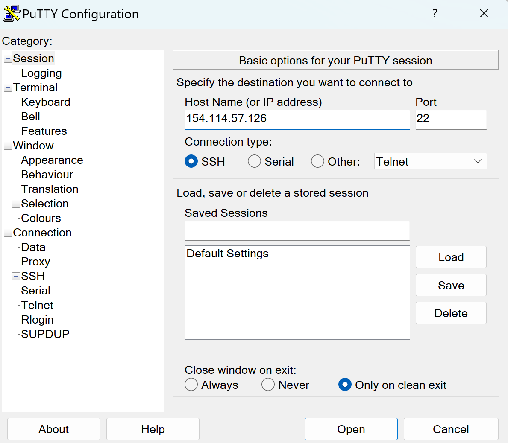

Tutorial 1: Standing Up Your Head Node and Running HPL
======================================================

This tutorial will help you become familiar with Cloud Computing and will also serve as an introduction to Linux. This tutorial will start with a network primer that will help you to understand the basics of public and private networks, ip addresses, ports and routing.

You will then login into the CHPC's Cloud Computing Platform and launch your own OpenStack virtual machine instances. Here you will need to make a decision on choice of Linux distribution that you will use as well as how your team will allocate your limited cloud computing resources.

such as navigating and configuring your hosts and network on the terminal. If you are new to Linux and need help getting more comfortable, please check out the resources tab on the learning system.

Once your team has successfully launched your instances you'll login to your VM's to do some basic Linux administration.

This tutorial will conclude with you downloading, installing and running the High Performance LinPACK benchmark on your newly created VM's.


# Table of Contents

<!-- markdown-toc start - Don't edit this section. Run M-x markdown-toc-refresh-toc -->
1. [Checklist](#checklist)
1. [Network Primer](#network-primer)
   1. [Basic Networking Example (WhatIsMyIp.com)](#basic-networking-example-whatismyipcom)
      1. [Local WiFi Network](#local-wifi-network)
      1. [External Cellular Network](#external-cellular-network)
      1. [WiFi Hotspot Example](#wifi-hotspot-example)
   1. [MobaXterm and  Windows PowerShell Commands](#mobaxterm-and-windows-powershell-commands)
      1. [`ipconfig`](#ipconfig)
      1. [`ping 8.8.8.8`](#ping-8888)
      1. [`route print`](#route-print)
      1. [`tracert`](#tracert)
1. [Launching your First OpenStack Virtual Machine Instance](#launching-your-first-open-stack-virtual-machine-instance)
   1. [Accessing the NICIS Cloud](#accessing-the-NICIS-cloud)
   1. [Verify your Teams' Project Workspace and Available Resources](#verify-your-teams-project-workspace-and-available-resources)
   1. [Generating SSH Keys](#generating-ssh-keys)
   1. [Launch a New Instance](#launch-a-new-instance)
   1. [Linux Flavors and Distributions](#linux-flavors-and-distributions)
      1. [Desktop Usage vs Server](#desktop-usage-vs-server)
      1. [Table of Linux Distributions](#table-of-linux-distributions)
   1. [OpenStack Instance Flavors](#openstack-instance-flavors)
      1. [Compute (vCPUs)](#compute-vcpus)
      1. [Memory (RAM)](#memory-ram)
      1. [Storage (DISK)](#storage-disk)
      1. [Head Node Resource Allocations](#head node-resource-allocations)
   1. [Networks, Ports, Services and Security Groups](#networks-ports-services-and-security-groups)
   1. [Key Pair](#key-pair)
   1. [Verify that your Instance was Successfully Deployed and Launched](#verify-that-your-instance-was-successfully-deployed-and-launched)
   1. [Associating an Externally Accessible IP Address](#associating-an-externally-Accessible-ip-address)
   1. [Success State, Resource Management and Troubleshooting](#success-state-resource-management-and-troubleshooting)
      1. [Deleting Instances](#deleting-instances)
      1. [Deleting Volumes](#deleting-volumes)
      1. [Dissociating and Releasing Floating IPs](#dissociating-and-releasing-floating-ips)
1. [Introduction to Basic Linux Administration](#introduction-to-basic-linux-administration)
   1. [Accessing your VM Using SSH vs the OpenStack Web Console (VNC)](#accessing-your-vm-using-ssh-vs-the-openstack-web-console-vnc)
      1. [SSH Through a Linux Terminal or Windows PowerShell](#ssh-through-a-linux-terminal-or-windows-powershell)
      1. [Windows PuTTY](#windows-putty)
      1. [Username and Password](#username-and-password)
   1. [Brief Introduction to Text Editors (Vi vs Vim vs Nano)](#brief-introduction-to-text-editors-vi-vs-vim-vs-nano)
   1. [Privilege Escalation and `sudo`](#privilege-escalation-and-sudo)
   1. [Linux Binaries, Libraries and Package Management](#linux-binaries-libraries-and-package-management)
   1. [Verifying Instance Hostname and `/etc/hosts` File](#verifying-instance-hostname-and-etchosts-file)
1. [Install Dependencies and Fetch Source files for High Performance LinPACK (HPL) Benchmark](#install-dependencies-and-fetch-source-files-for-high-performance-linpapl-benchmark)
   1. [Install the GNU Compiler Collection (GCC)](#install-the-gnu-compiler-collection-gcc)
   1. [Install OpenMPI](#install-openmpi)
   1. [Install ATLAS Math Library](#install-atlas-math-library)
   1. [Fetch and Extract the HPC Source Tarball](#fetch-and-extract-the-hpc-source-tarball)
   1. [Copy and Edit the Makefile for _your_ Target Architecture](#copy-and-edit-the-makefile-for-_your_-target-architecture)
1. [Compile the HPL Source Code to Produce an Executable Binary](#compile-the-hpl-source-code-to-produce-an-executable-binary)
   1. [Editing _your_ PATH Variable](#editing-_your_-path-variable)
      1. [Dynamic and Static Libraries: Editing _Your_ ATLAS Shared Object Files](#dynamic-and-static-libraries-editing-_your_-atlas-shared-object-files)
   1. [Configuring _Your_ `HPL.dat` File Using `lscpu` and `lsmem`](#configuring-_your_-hpldat-file-using-lscpu-and-lsmem)

<!-- markdown-toc end -->

# Checklist

<u>Use the following checklist to keep track of your team's progress and to ensure that all members in your understand these concepts.</u>

- [ ] Understand IT concepts like cloud computing, virtualisation and remote connections:
  - [ ] Understand and be able to explain networking terms such as URL, DNS, IP Address, Port, Subnet, Gateway, Router, and
  - [ ] Understand the difference between a Local Private Network and an External Public Network.
- [ ] Learn how to use the CHPC's cloud computing environment:
  - [ ] Learn about different Linux Distributions and Flavors, and
  - [ ] Learn about Cloud Resource Management.
- [ ] Learn about Basic Linux Administration:
  - [ ] Learn what SSH is and how to use it,
  - [ ] Learn about Linux password management,
  - [ ] Use a Linux Console / Terminal Based Text Editors,
  - [ ] Understand Linux Privileges and the Root user,
  - [ ] Learn how to Install Packages in your Linux Environment, and
  - [ ] Learn about Configuring system files.
- [ ] Download, Configure, Install and Run HPL Benchmark:
  - [ ] Understand how to satisfy Linux Package Dependencies,
  - [ ] Download and unpack files using a terminal,
  - [ ] Editing Makefiles,
  - [ ] Compiling Sourcefiles to produce an Executable Binary,
  - [ ] Understanding the basics of the Linux Shell Environment, and
  - [ ] Understanding the basic tuning required to successfully run a benchmark in your environment.

# Network Primer

At the core of High Performance Computing (HPC) is networking. Something as simple as browsing the internet from either your cell phone or the workstation in front of you, involves the transfer and exchange of information between many different networks. Each resource or service connected to the internet is made available through a unique address and network port. For example, https://www.google.co.za:443 is the [Uniform Resource Locator (URL)](https://en.wikipedia.org/wiki/URL) used to uniquely identify Google's search engine page on the South African [co.za]. [domain](https://en.wikipedia.org/wiki/Domain_name). The [443] is the [port number](https://en.wikipedia.org/wiki/Port_(computer_networking)) which in this instance lets you know that you're connecting to a secure [https](https://en.wikipedia.org/wiki/HTTPS) server.

When you enter this address into your browser, one of the first things that will happen is that a [Domain Name Service (DNS)](https://en.wikipedia.org/wiki/Domain_Name_System) will translate the URL [google.co.za] into it's corresponding [Internet Protocol (IP) Address](https://en.wikipedia.org/wiki/IP_address) [142.251.216.67].

A number of [routing](https://en.wikipedia.org/wiki/Router_(computing)) lookup tables will be utilized to determine an available, _and preferably optimal_ path to the resource that you'd requested, thereafter a number of routers or gateway devices will be used to exchange packets between your workstation, through all of the intermediary networks, and finally the target resource. 

At this point it is important to note that even though packets and network traffic are being exchanged between your local workstation and the Google servers, at no point is the private IP Address of your workstation exposed to the external Google Servers. Your workstation would have been assigned a private internal IP Address based on the computer laboratory. Traffic is then routed between the computer laboratory's private internal network and the rest of the university's networks through routers and gateway devices. All the internal computers and components across the campus will appear to the outside as though they have a single public IP address. This is accomplished through a process known as [Network address Translation (NAT)](https://en.wikipedia.org/wiki/Network_address_translation).


The process of browsing to https://www.google.co.za on your workstation, can be simplified and depicted in the image above and summarized as follows:
1. You open a browser on your workspace and navigate to [google.co.za](https://www.google.com).
1. A DNS Server then translates the URL [google.co.za](https://www.google.co.za) into it's corresponding IP Address [142.251.216.67](142.251.216.67).
1. With the relevant IP Address, a Routing Table is used to navigate a path between your workstation and the server housing the information / data that you're after. Packets are exchanged between your workstation and all the networks between you and your desired data:
   1. Data Packets are exchanged between your workstation and the computer laboratory's internal networks (e.g. 192.168.0.1/24 and 10.0.0.1/24 networks),
   1. Data Packets are exchanged between Universities' _internal_ networks and _publicly_ assigned IP Address Range (e.g. 192.96.15.90),
   1. Data Packets are exchanged between Universities' _public_ facing network interfaces, to the regional, national and international backbone networks and connections, and finally
   1. Data Packets are exchanged between _Regional_, _National_ and _International_ networks and those of the target [Google](https://www.google.com) domains (e.g.: _local [Google.co.za](https://www.google.co.za):_ [142.251.216.67](142.251.216.67), or _California_ [72.14.222.1](72.14.222.1))

> [!IMPORTANT]
> It is important to note that in the preceding examples, the specific IP Address and Routing Tables provided were merely an indicative oversimplification for the purposes of clarifying the related concepts.

## Basic Networking Example (WhatIsMyIp.com)

In the following examples, you will be using your Android and/or Apple Cellular devices to complete the following tasks in your respective groups. Start by ensuring that your cell phone is connected to the local WiFi. Then navigate to the _"Network Details"_ page of the WiFi connection.

<p align="center"></p>

From the _"Network Details"_ section of your own device, you should see similar information and you will have the following details:
* *Wi-Fi Type*: Your cellular device may have a WiFi radio card operating at either [2.4GHz or 5GHz](https://help.afrihost.com/entry/the-difference-between-2-4-ghz-and-5-ghz-wi-fi) or two independent radios so that it operates at _both_ frequencies,
* *MAC Address*: [Medium Access Control Address](https://en.wikipedia.org/wiki/MAC_address) which is a unique identifier that each physical network interface controller on any device will have, i.e. if your phone has both 2.4GHz and 5GHz radios, then each will have their own physical unique MAC addresses.
* *IP Address*: [Internet Protocol Address](https://en.wikipedia.org/wiki/IP_address) is the unique address assigned to a device connected to a network implementing the IP protocol for communication, _(i.e. you cell connected to the WiFi)_.
* *Gateway*: _or_ [Router](https://en.wikipedia.org/wiki/Gateway_(telecommunications)) is a hardware or software device used to transmit data between different networks_or (subnets)_, _i.e. the same way that the WiFi Router, connects your cell phone to the rest of the university and to the internet_.
* *Subnet Mask*: A [Subnet](https://en.wikipedia.org/wiki/Subnet) corresponds to the logical subdivision of a network and serves as an indication of the number of hosts available on a particular network. I.e. for the subnet mask _255.255.224.0_, there are _8192_ possible hosts over the subnets _10.31.[0-31].[1-254]_.
* *DNS*: A [Domain Name System](https://en.wikipedia.org/wiki/Domain_Name_System) is a lookup service that translates human readable domain names into the corresponding IP Addresses.

> [!IMPORTANT]
> The IP Addresses, Gateways, Subnet Masks, DNS Servers _may_ not correspond to those on _YOUR_ particular device.

Each member of your team must the *IP Address*, *Gateway*, *Subnet Mask*, and *DNS* settings from their connection to the laboratory WiFi.

### Local WiFi Network

On your cellular device, ensure that you are connected to the *computer laboratory's WiFi network* and that all SIM card(s) are disabled. Navigate to https://WhatIsMyIp.com, explore the website and record the IP Address indicated.

<p align="center"></p>

### External Cellular Network

On your cellular device, ensure that you are connected to your *SIM provider's network* and that all WiFi radios are disabled. Navigate to https://www.whatismyip.com and again record the IP Address indicated.

<p align="center"></p>

> [!WARNING]
> You must ensure that you are connected to the correct network when executing the above tasks.

### WiFi Hotspot Example

Team Captains are required to setup and establish a WiFi Hotspot for their team mates. The above experiments will be repeated for the university's computer laboratory WiFi connections as well as the Team Captain's Cellular SIM provider's network.

On your cellular device, ensure that you are connected to your Team Captain's WiFi Hotspot network, *alternating for both* the *SIM provider's network* as well as the *university's computer laboratory's WiFi network*. Navigate to https://www.whatismyip.com and again record the IP Address indicated and this time you *MUST* also record your device's _"Network Settings"_.

<p align="center"></p>

> [!TIP]
> Pay careful attention to the IP Address reported by WhatIsMyIp.com. This is the unique identifier that _your_ device will be identified and recognized by externally on the internet. Use this information to assist you to understand and describe [NAT](https://en.wikipedia.org/wiki/Network_address_translation).

## Windows PowerShell Commands
### `ipconfig`
### `ping 8.8.8.8`
### `route print`
### `tracert`
# Launching your First Open Stack Virtual Machine Instance

In this section you will be configuring and launching your first [Virtual Machine](https://en.wikipedia.org/wiki/Virtual_machine) instance. This allows you to use a portion of another computer's resources, to host another [Operating System](https://en.wikipedia.org/wiki/Operating_system) as though it were running on its own dedicated hardware resources. For example, your laptops or workstations are running a Windows-based operating system, you _"could"_ use a type of computer software [Hypervisor](https://en.wikipedia.org/wiki/Hypervisor), that runs and creates _virtual machines_, to run a Linux-based operating while your are in your Windows environment.

The physical servers that you will use to spawn your VM's are housed in Rosebank, Cape Town. We will verify this later using [WhatIsMyIp](https://www.whatismyip.com).

## Accessing the NICIS Cloud

Open your web browser and navigate to the NICIS OpenStack Cloud platform  https://sebowa.nicis.ac.za/, and use the credentials that your team has been provided with to login into your team's project workspace.

<p align="center"></p>

## Verify your Teams' Project Workspace and Available Resources

Once you've successfully logged in, navigate to `Computer -> Overview` and verify that the Project Workspace corresponds to _YOUR TEAM_ and that you've been allocated the correct number of resources.

> [!NOTE]
> The following screenshot is for illustration purposes only, your actual available resources _may_ differ.
<p align="center"></p>

## Generating SSH Keys

Over the course of the lecture content and the tutorials, you will be making extensive use of [Secure Shell (SSH)](https://en.wikipedia.org/wiki/Secure_Shell) which grants you a [Command-Line Interface (CLI)](https://en.wikipedia.org/wiki/Command-line_interface) with which to access your VMs. SSH keys allows you to authenticate against a remote SSH server, without the use of a password.

> [!IMPORTANT]
> When you are presented with foldable code blocks, you must pick and implement only **one** of the options presented, which is suitable to your current configuration and/or circumstance.

> [!TIP]
> A number [encryption algorithms](https://en.wikipedia.org/wiki/Public-key_cryptography) exist for securing your SSH connections. [Elliptic Curve Digital Signature Algorithm (ECDSA)](https://en.wikipedia.org/wiki/Elliptic_Curve_Digital_Signature_Algorithm) is secure and simple enough should you need to copy the public key manually. Nonetheless however, you are free to use whichever algorithm you choose to.

<details>
<summary>Windows with PowerShell</summary>

From the `Start` menu, open the Windows `PowerShell` application:
1. Generate an SSH key pair:
   ```shell
   
   ssh-keygen -t ed25519
   
   ```
1. When prompted to _"Enter file in which to save the key"_, press `Enter`,
1. When prompted to _"Enter a passphrase"_, press `Enter`, and `Enter` again to verify it.

   <p align="center"></p>

></details>

<details>
<summary>Windows PuTTY</summary>

[PuTTY](https://putty.org/) is a Windows-based SSH and Telnet client. From the `Start` menu, open the `PuTTYgen` application.
1. Generate an SSH key pair using the `Ed25519` encryption algorithm.
1. Generate the necessary entropy by moving your mouse pointer over the `Key` section until the green bar is filled.
   <p align="center"></p>
1. Proceed to **Save** both the `Private Key` and `Public Key`.
   <p align="center"></p>
</details>

<details>
<summary>Linux, Unix or MacOS Terminal</summary>

You must follow the same procedure as you would have done for the Windows PowerShell scenario.
1. Generate an SSH key pair:
   ```shell
   ssh-keygen -t ed25519
   ```

</details>

> [!NOTE]
> You **MUST** take note of the location and paths to **BOTH** your public and private keys. Your public key will be shared and distributed to the SSH servers you want to authenticate against. Your private key must be kept secure within your team, and must not be shared or distributed to anyone.

Once you have successfully generated an SSH key pair, navigate to `Compute` &rarr; `Key Pairs` and import the **public** key `id_ed25519.pub` into your Team's Project Workspace within OpenStack.

<p align="center"></p>

## Launch a New Instance

From your Team's OpenStack Project Workspace, navigate to `Compute` &#8594; `Instance` and click `Launch Instance**.

<p align="center"></p>

Within the popup window, enter an appropriate name for your instance that will describe what the VM's intended purpose is meant to be and help you to remember it's primary function. In this case, a suitable name for your instance would be **head node**.

## Linux Flavors and Distributions

After configuring your new VM name under instance details, you will need to select the template that will be used to create the instance from the *Source* menu. Before selection a [Linux Operating System Distribution](https://en.wikipedia.org/wiki/Linux_distribution) for your new instance, ensure that the default *Source* options are correctly configured:
1. *Select Boot Source* is set to `Image`,
1. *Create New Volume* is `Yes`,
1. *Delete Volume on Instance Delete* is `No`, and
1. *Volume Size (GB)* will be set when you configure the instance flavor.
<p align="center"></p>

There are a number of considerations that must be taken into account when selecting a Linux Distribution that will be appropriate for your requirements and needs.

### Desktop Usage vs Server

[Since June 2017](https://www.top500.org/statistics/details/osfam/1/) **all** of the systems on the Top500 list make use of a Linux-based Operating System. Familiarity and proficiency with Linux-based operating systems and their derivatives is a mandatory requirement for gaining expertise in Software Development, Systems Administration and Networking.

An argument could be made, that the best way to acquire Linux systems administration skills, is to make daily use of a Linux Distribution by running it on your personal laptop, desktop or workstation at home / school.

This is something for you and your team to investigate after the competition and will not be covered in these tutorials. If you feel that you are not comfortable completely migrating to a Linux-based environment, there are a number of methods that can be implemented to assist you in transitioning from Windows to a Linux (or macOS) based *'Daily Driver*:
* Dual-boot Linux alongside your Windows environment,
* Windows Subsystem for Linux [(WSL)](https://learn.microsoft.com/en-us/linux/install),
* Running Linux VM's locally within your Windows environment,
* Running Linux VM's through cloud-based solutions, and Virtual Private Servers [(VPS)](https://en.wikipedia.org/wiki/Virtual_private_server), as you are doing for the competition. There are many commercial and free-tier services available, e.g. [Amazon AWS](https://aws.amazon.com/free/?all-free-tier.sort-by=item.additionalFields.SortRank&all-free-tier.sort-order=asc&awsf.Free%20Tier%20Types=*all&awsf.Free%20Tier%20Categories=*all), [Google Cloud](https://cloud.google.com/free) and [Microsoft Azure](https://azure.microsoft.com/en-us/free), 

### Table of Linux Distributions

A Linux distribution, is a collection of software that is at the very leased comprised of a [Linux kernel](https://en.wikipedia.org/wiki/Linux_kernel) and a [package manager](https://en.wikipedia.org/wiki/Package_manager). A package manager is responsible for automating the process of installing, configuring, upgrading, downgrading and removing software programs and associated components from a computer's operating system.

A number of considerations must be taken into account when deciding on choice of Linux distro as a *'daily driver'* and as well as a server. There are subtleties and nuances between the various Linux flavors. These vary from a number of factors, not least of which including:
* Support - is the project well documented and do the developers respond to queries, 
* Community - is there a large and an active userbase,
* Driver Compatibility - will the distro *'natively'* run on your hardware without workarounds or custom compilation / installation of various device drivers,
* Stability and Maturity - is the intended distro and version currently actively supported and maintained, not 'End of Life' and verified to run across a number of different systems and environment configurations. Or do you intend to run a *'bleeding-edge'* distro so that you may in the future, influence the direction of application development and assist developers in identifying bugs in their releases...

You and your Team, together with input and advise from your mentors, must do some research and depending on the intended use case, decide which will be the best choice.

The following table summarizes a few Linux distros that *may* be available on the Sebowa OpenStack cloud for you to use, and that you *might* consider using as a *'daily driver'*.

| Package Management System | Flavor                                                                                              | Description | Versions Available as Cloud Instances | General Recommendations and Comments |
| ---                       | ---                                                                                                 | ---         | ---                                   | ---                                  |
|                           |                                                                                                     |             |                                       |                                      |
| RPM                       | [Red Hat Enterprise Linux](https://www.redhat.com/en/technologies/linux-platforms/enterprise-linux) |             |                                       |                                      |
|                           | [Rocky Linux](https://rockylinux.org/)                                                              |             |                                       |                                      |
|                           | [Alma Linux](https://almalinux.org/)                                                                |             |                                       |                                      |
|                           | [CentOS Stream](https://www.centos.org/centos-stream/)                                              |             |                                       |                                      |
|                           | [Fedora](https://fedoraproject.org/)                                                                |             |                                       |                                      |
|                           | [OpenSUSE](https://www.opensuse.org/)                                                               |             |                                       |                                      |
|                           |                                                                                                     |             |                                       |                                      |
|                           |                                                                                                     |             |                                       |                                      |
| PkgTool                   | [Slackware Linux](http://www.slackware.com/)                                                        |             |                                       |                                      |
|                           |                                                                                                     |             |                                       |                                      |
|                           |                                                                                                     |             |                                       |                                      |
| APT                       | [Debian](https://www.debian.org/)                                                                   |             |                                       |                                      |
|                           | [Ubuntu](https://ubuntu.com/)                                                                       |             |                                       |                                      |
|                           | [Linux Mint](https://linuxmint.com/)                                                                |             |                                       |                                      |
|                           | [Pop! OS](https://pop.system76.com/)                                                                |             |                                       |                                      |
|                           | [Kali Linux](https://www.kali.org/)                                                                 |             |                                       |                                      |
|                           |                                                                                                     |             |                                       |                                      |
|                           |                                                                                                     |             |                                       |                                      |
| Pacman                    | [Arch Linux](https://archlinux.org/)                                                                |             |                                       |                                      |
|                           | [Manjaro](https://manjaro.org/)                                                                     |             |                                       |                                      |
|                           |                                                                                                     |             |                                       |                                      |
|                           |                                                                                                     |             |                                       |                                      |
| Portage                   | [Gentoo](https://www.gentoo.org/)                                                                   |             |                                       |                                      |
|                           |                                                                                                     |             |                                       |                                      |
|                           |                                                                                                     |             |                                       |                                      |
| Source-Based              | [Linux From Scratch (LFS)](https://www.linuxfromscratch.org/)                                       |             |                                       |                                      |
|                           |                                                                                                     |             |                                       |                                      |

> [!TIP]
> The set of tutorials have been tested against **Alma Linux 8.9, 9.3**, **Arch Linux**, **CentOS Stream 9**, **Rocky Linux 8, 9.2, 9.3** and **Ubuntu Server 23.10**. 

## OpenStack Instance Flavors

An important aspect of system administration is resource monitoring, management and utilization. Each Team will be required to manage their available resources and ensure that the resources of their clusters are utilized in such a way as to maximize system performance. You have been allocated a pool of resources which you will need to decide how you are going to allocate the sizing of the compute, memory and storage across your head node and compute node(s).

### Compute (vCPUs)

You have been allocated a pool totaling **18 vCPUs**, which would permit the following configurations:
1. Head Node (2 vCPUs) and 2 x Compute Nodes (8 vCPUs each),
1. Head node (6 vCPUs) and 2 x Compute Nodes (6 vCPUs each),
1. Head node (10 vCPUs) and 1 x Compute Node (8 vCPUs).

### Memory (RAM)

You have been allocated a pool totaling **36 GB** of RAM, which would permit the following configurations:
1. Head Node (4 GB RAM) and 2 x Compute Nodes (16 GB RAM each),
1. Head node (12 GB RAM) and 2 x Compute Nodes (12 GB RAM each),
1. Head node (20 GB RAM) and 1 x Compute Node (16 GB RAM).

### Storage (DISK)

You have been allocated a pool of 50 GB of storage, which can be distributed in the following configurations:
1. Head Node (60 GB of storage) and 2 x Compute Nodes (10 GB of storage each),
1. Head Node (60 GB of storage) and 2 x Compute Nodes (10 GB of storage each), and
1. Head Node (60 GB of storage) and 1 x Compute Node (10 GB of storage).

### Head Node Resource Allocations

The following table summarizes the various permutations and allocations that can be used for designing your clusters within your Team's Project Workspace on Sebowa's OpenStack cloud platform.

| Cluster Configurations     | Instance Flavor   | Compute (vCPUS) | Memory (RAM) | Storage (Disk) |
|----------------------------|:-----------------:|:---------------:|:------------:|:--------------:|
|                            |                   |                 |              |                |
| Dedicated Head Node        | scc24.C2.M4.S60   | 2               | 4 GB         | 60 GB          |
| Compute Node 01            | scc24.C8.M16.S10  | 8               | 16 GB        | 10 GB          |
| Compute Node 02            | scc24.C8.M16.S10  | 8               | 16 GB        | 10 GB          |
|                            |                   |                 |              |                |
|                            |                   |                 |              |                |
| Hybrid Head / Compute Node | scc24.C6.M12.S60  | 6               | 12 GB        | 60 GB          |
| Compute Node 01            | scc24.C6.M12.S10  | 6               | 12 GB        | 10 GB          |
| Compute Node 02            | scc24.C6.M12.S10  | 6               | 12 GB        | 10 GB          |
|                            |                   |                 |              |                |
|                            |                   |                 |              |                |
| Hybrid Head / Compute Node | scc24.C10.M20.S60 | 10              | 20 GB        | 60 GB          |
| Compute Node 01            | scc24.C8.M16.S10  | 8               | 16 GB        | 10 GB          |
|                            |                   |                 |              |                |

> [!TIP]
> When designing clusters, very generally speaking the *'Golden Rule'* in terms of Memory is **2 GB of RAM per CPU Core**. The storage on your head node is typically '*shared*' to your compute nodes through some form of [Network File System (NFS)](https://en.wikipedia.org/wiki/Network_File_System). A selection of pregenerated instance flavors have been pre-configured for you. For the purposes of this tutorial, unless you have very good reasons for doing otherwise, you are **STRONGLY** advised to make use of the *sccHeadN** flavor with *2 vCPUs* and *4 GB RAM*.

<p align="center"></p>

## Networks, Ports, Services and Security Groups

Under the *Networks* settings, make sure to select the `vxlan` that corresponds to your Team Name.

<p align="center"></p>

No configurations are required for *Network Ports*, however you must ensure that you have selected `ssh & web services` under *Security Groups*.

<p align="center"></p>

## Key Pair

> [!CAUTION]
> You must ensure that you associate the SSH Key that you created earlier to your VM, otherwise you will not be able to log into your newly created instance 
><p align="center"></p>

## Verify that your Instance was Successfully Deployed and Launched

Congratulations! Once your VM instance has completed it's building, block device mapping  and deployment phase, and if your *Power State* indicates `Running`, then you have successfully launched your very first OpenStack instance.

<p align="center"></p>

## Associating an Externally Accessible IP Address

In order for you to be able to SSH into your newly created OpenStack instance, you'll need to associate a publicly accessible [Floating IP](https://kb.leaseweb.com/network/floating-ips/using-floating-ips) address. This allocates a *virtual IP* address to your *virtual machine*, so that you can access it directly from your laboratory workstation.

1. Select ***Associate Floating IP*** from the *Create Snapshot* dropdown menu, just below the *Actions* tab:
   <p align="center"></p>
1. From the *Manage Floating IP Associations* dialog box, click the "➕" and select *publicnet*:
   <p align="center"></p>
1. Select the `154.114.57.*` IP address allocated and click on the *Associate* button.
   <p align="center"></p>

## Success State, Resource Management and Troubleshooting

> [!CAUTION]
> The following section is strictly for debugging and troubleshooting purposes

### Deleting Instances
### Deleting Volumes
### Dissociating and Releasing Floating IPs

# Introduction to Basic Linux Administration

If you've managed to successfully build and deploy your VM instance, and you managed to successfully associate and attach a floating IP bridged over your internal interface, you are finally ready to connect to your newly created instance.

## Accessing your VM Using SSH vs the OpenStack Web Console (VNC)

The VMs are running minimalist, cloud-based operating systems that are not packaged with a graphical desktop environment. You are required to interact with the VM instance using text prompts, through a [Command-Line Interface (CLI)](https://en.wikipedia.org/wiki/Command-line_interface). By design for security reasons, the cloud images are only accessible via SSH after instantiating a VM. Once you have successfully logged into your instance, you may change the password so as to enable you to make use of the [VNC Console](https://en.wikipedia.org/wiki/Virtual_Network_Computing).

> [!NOTE]
> You will require the **PATH** to the private SSH key that you have previously [generated](#generating-ssh-keys), as well as the Floating IP address [associated](#associating-an-externally-Accessible-ip-address) to your VM. Depending on the specific distribution your Team chose to implement for your Head Node, the ***default username** will vary accordingly.

### SSH Through a Linux Terminal or Windows PowerShell

If your workstation or laptop is running a Linux-based or macOS operating system, or a version of Windows with PowerShell, then you may proceed using a terminal. Most Linux and macOS distributions come preshipped with an SSH client included via `OpenSSH`.

<details>
<summary>Alma Linux</summary>

```bash
   ssh -i ~/.ssh/id_ed25519 alma@154.114.57.<YOUR Head Node IP>
```
</details>

<details>
<summary>Arch Linux</summary>

```bash
   ssh -i ~/.ssh/id_ed25519 arch@154.114.57.<YOUR Head Node IP>
```
</details>

<details>
<summary>CentOS Stream</summary>

```bash
   ssh -i ~/.ssh/id_ed25519 centos@154.114.57.<YOUR Head Node IP>
```
</details>

<details>
<summary>Rocky Linux</summary>

```bash
   ssh -i ~/.ssh/id_ed25519 rocky@154.114.57.<YOUR Head Node IP>
```
</details>

<details>
<summary>Ubuntu Server</summary>

```bash
   ssh -i ~/.ssh/id_ed25519 ubuntu@154.114.57.<YOUR Head Node IP>
```
</details>

> [!TIP]
> The "~" in `~/.ssh/id_ed25519` is a shortcut for `/home/<username>`. Secondly, the first time you connect to a new SSH server, you will be prompted to confirm the authenticity of the host. Type 'yes' and hit 'Enter'

<p align="center"></p>

### Windows PuTTY

If your workstation or laptop is running Windows, then you may proceed using either Windows PowerShell above *(preferred)* or PuTTY. Use PuTTY only if Windows PowerShell is not available on your current system.

1. Launch the PuTTY application and from the *Session* category, enter your `<head node's IP address>`
   <p align="center"></p>
1. From the *Connection* &rarr; *Data* category, enter your `<username>`
   <p align="center"></p>
1. From the *Connection* &rarr; *SSH* &rarr; *Auth* &rarr; *Credentials* category, select `Browse` and navigate to the path where your private key is located:
   <p align="center"></p>

### Username and Password

Once you've successfully logged into your head node VM, you are encouraged to change your password so that you may access your head node through the OpenStack VNC console interface.

```bash
   sudo passwd <username>
   
```

> [!CAUTION]
> Setting up a password for any user *- especially the default user -* will make your VM's vulnerable to [Brute Force SSH Attacks](https://helpcenter.trendmicro.com/en-us/article/tmka-19689)!

Now you  can use 
ping, ip a and ip route
## Brief Introduction to Text Editors (Vi vs Vim vs Nano)
## Privilege Escalation and `sudo`
## Linux Binaries, Libraries and Package Management
## Verifying Instance Hostname and `/etc/hosts` File
hostname and etc/hosts
At this point your VMs and network should be correctly configured and you can continue with setting up some important Linux services.

## Install Dependencies and Fetch Source files for High Performance LinPACK (HPL) Benchmark
### Install the GNU Compiler Collection (GCC)
### Install OpenMPI
### Install ATLAS Math Library
Automatically Tuned Linear Algebra Software
### Fetch and Extract the HPC Source Tarball
### Copy and Edit the Makefile for _your_ Target Architecture
## Compile the HPL Source Code to Produce an Executable Binary
### Editing _your_ PATH Variable
#### Dynamic and Static Libraries: Editing _Your_ ATLAS Shared Object Files
## Configuring _Your_ `HPL.dat` File Using `lscpu` and `lsmem`
