Tutorial 1: Standing Up Your Head Node and Running HPL
======================================================

This tutorial will help you become familiar with Cloud Computing and will also serve as an introduction to Linux. This tutorial will start with a network primer that will help you to understand the basics of public and private networks, ip addresses, ports and routing.

You will then login into the CHPC's Cloud Computing Platform and launch your own Digital Ocean virtual machine instances. Here you will need to make a decision on choice of Linux distribution that you will use as well as how your team will allocate your limited cloud computing resources.

Once your team has successfully launched your instances you'll login to your VM's to do some basic Linux administration, such as navigating and configuring your hosts and network on the terminal. If you are new to Linux and need help getting more comfortable, please check out the resources tab on the learning system.

This tutorial will conclude with you downloading, installing and running the High Performance LinPACK benchmark on your newly created VM's.

# Table of Contents

<!-- markdown-toc start - Don't edit this section. Run M-x markdown-toc-refresh-toc -->

1. [Checklist](#checklist)
1. [Network Primer](#network-primer)
    1. [Basic Networking Example (WhatIsMyIp.com)](#basic-networking-example-whatismyipcom)
    1. [Terminal, Windows MobaXTerm and PowerShell Commands](#terminal-windows-mobaxterm-and-powershell-commands)
1. [Launching your First Digital Ocean Virtual Machine Instance](#launching-your-first-digital-ocean-virtual-machine-instance)  
    1. [Creating Your DigitalOcean Account and Project](#creating-your-digitalocean-account-and-project)
    1. [Launching Your First Droplet (Head Node)](#launcing-your-first-droplet-(head-node))
1. [Launching your First IBM Cloud Virtual Machine Instance](#launching-your-first-ibm-cloud-virtual-machine-instance)
    1. [Creating Your IBM Cloud Account and Project](#creating-your-ibm-cloud-account-and-project)
    1. [Launching Your First Virtual Server Instance (Head Node)](#launching-your-first-virtual-server-instance-head-node)
1. [Introduction to Basic Linux Administration](#introduction-to-basic-linux-administration)
    1. [Accessing Your Droplet via SSH MobaXTerm](#accessing-your-droplet-via-ssh-mobaxterm)
    1. [Accessing Your Virtual Server Instance via SSH MobaXTerm](#accessing-your-virtual-server-instance-via-ssh-mobaxterm)
    1. [Running Basic Linux Commands and Services](#running-basic-linux-commands-and-services)
1. [Linux Binaries, Libraries and Package Management](#linux-binaries-libraries-and-package-management)
    1. [User Environment and the `PATH` Variable](#user-environment-and-the-path-variable)
1. [Install, Compile and Run High Performance LinPACK (HPL) Benchmark](#install-compile-and-run-high-performance-linpack-hpl-benchmark)

<!-- markdown-toc end -->

# Checklist

<u>Use the following checklist to keep track of your team's progress and to ensure that all members in your understand these concepts.</u>

- [ ] Understand IT concepts like cloud computing, virtualisation and remote connections:
  - [ ] Understand and be able to explain networking terms such as URL, DNS, IP Address, Port, Subnet, Gateway, Router, and
  - [ ] Understand the difference between a Local Private Network and an External Public Network.
- [ ] Learn how to use the CHPC's cloud computing environment:
  - [ ] Learn about different Linux Distributions and Flavors, and
  - [ ] Learn about Cloud Resource Management.
- [ ] Learn about Basic Linux Administration:
  - [ ] Learn what SSH is and how to use it,
  - [ ] Learn about Linux password management,
  - [ ] Use a Linux Console / Terminal Based Text Editors,
  - [ ] Understand Linux Privileges and the Root user,
  - [ ] Learn how to Install Packages in your Linux Environment, and
  - [ ] Learn about Configuring system files.
- [ ] Download, Configure, Install and Run HPL Benchmark:
  - [ ] Understand how to satisfy Linux Package Dependencies,
  - [ ] Download and unpack files using a terminal,
  - [ ] Editing Makefiles,
  - [ ] Compiling Sourcefiles to produce an Executable Binary, and
  - [ ] Understanding the basics of the Linux Shell Environment.

# Network Primer

At the core of High Performance Computing (HPC) is networking. Something as simple as browsing the internet from either your cell phone or the workstation in front of you, involves the transfer and exchange of information between many different networks. Each resource or service connected to the internet is made available through a unique address and network port. For example, https://www.google.co.za:443 is the [Uniform Resource Locator (URL)](https://en.wikipedia.org/wiki/URL) used to uniquely identify Google's search engine page on the South African [co.za]. [domain](https://en.wikipedia.org/wiki/Domain_name). The [443] is the [port number](https://en.wikipedia.org/wiki/Port_(computer_networking)) which in this instance lets you know that you're connecting to a secure [https](https://en.wikipedia.org/wiki/HTTPS) server.

When you enter this address into your browser, one of the first things that will happen is that a [Domain Name Service (DNS)](https://en.wikipedia.org/wiki/Domain_Name_System) will translate the URL [google.co.za] into it's corresponding [Internet Protocol (IP) Address](https://en.wikipedia.org/wiki/IP_address) [142.251.216.67].

A number of [routing](https://en.wikipedia.org/wiki/Router_(computing)) lookup tables will be utilized to determine an available, _and preferably optimal_ path to the resource that you'd requested, thereafter a number of routers or gateway devices will be used to exchange packets between your workstation, through all of the intermediary networks, and finally the target resource.

At this point it is important to note that even though packets and network traffic are being exchanged between your local workstation and the Google servers, at no point is the private IP Address of your workstation exposed to the external Google Servers. Your workstation would have been assigned a private internal IP Address based on the computer laboratory. Traffic is then routed between the computer laboratory's private internal network and the rest of the university's networks through routers and gateway devices. All the internal computers and components across the campus will appear to the outside as though they have a single public IP address. This is accomplished through a process known as [Network address Translation (NAT)](https://en.wikipedia.org/wiki/Network_address_translation).

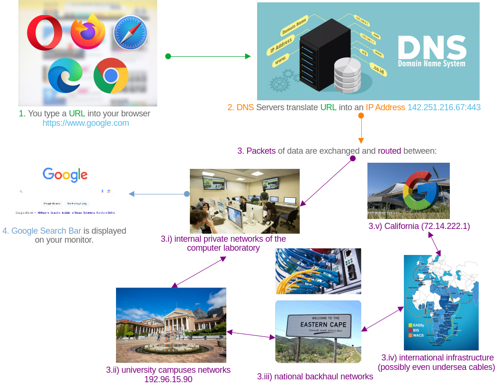

The process of browsing to https://www.google.co.za on your workstation, can be simplified and depicted in the image above and summarized as follows:
1. You open a browser on your workspace and navigate to [google.co.za](https://www.google.com).
1. A DNS Server then translates the URL [google.co.za](https://www.google.co.za) into it's corresponding IP Address [142.251.216.67](142.251.216.67).
1. With the relevant IP Address, a Routing Table is used to navigate a path between your workstation and the server housing the information / data that you're after. Packets are exchanged between your workstation and all the networks between you and your desired data:
   1. Data Packets are exchanged between your workstation and the computer laboratory's internal networks (e.g. 192.168.0.1/24 and 10.0.0.1/24 networks),
   1. Data Packets are exchanged between Universities' _internal_ networks and _publicly_ assigned IP Address Range (e.g. 192.96.15.90),
   1. Data Packets are exchanged between Universities' _public_ facing network interfaces, to the regional, national and international backbone networks and connections, and finally
   1. Data Packets are exchanged between _Regional_, _National_ and _International_ networks and those of the target [Google](https://www.google.com) domains (e.g.: _local [Google.co.za](https://www.google.co.za):_ [142.251.216.67](142.251.216.67), or _California_ [72.14.222.1](72.14.222.1))

> [!IMPORTANT]
> It is important to note that in the preceding examples, the specific IP Address and Routing Tables provided were merely an indicative oversimplification for the purposes of clarifying the related concepts.

## Basic Networking Example (WhatIsMyIp.com)

In the following examples, you will be using your Android and/or Apple Cellular devices to complete the following tasks in your respective groups. Start by ensuring that your cell phone is connected to the local WiFi. Then navigate to the _"Network Details"_ page of the WiFi connection.

<p align="center">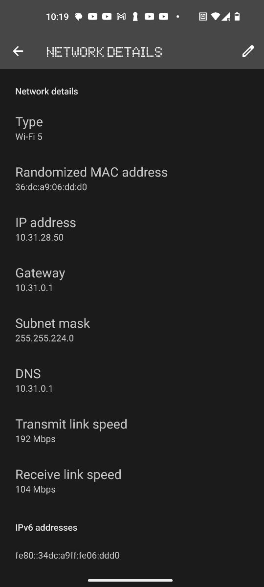</p>

From the _"Network Details"_ section of your own device, you should see similar information and you will have the following details:
* *Wi-Fi Type*: Your cellular device may have a WiFi radio card operating at either [2.4GHz or 5GHz](https://help.afrihost.com/entry/the-difference-between-2-4-ghz-and-5-ghz-wi-fi) or two independent radios so that it operates at _both_ frequencies,
* *MAC Address*: [Medium Access Control Address](https://en.wikipedia.org/wiki/MAC_address) which is a unique identifier that each physical network interface controller on any device will have, i.e. if your phone has both 2.4GHz and 5GHz radios, then each will have their own physical unique MAC addresses.
* *IP Address*: [Internet Protocol Address](https://en.wikipedia.org/wiki/IP_address) is the unique address assigned to a device connected to a network implementing the IP protocol for communication, _(i.e. you cell connected to the WiFi)_.
* *Gateway*: _or_ [Router](https://en.wikipedia.org/wiki/Gateway_(telecommunications)) is a hardware or software device used to transmit data between different networks_or (subnets)_, _i.e. the same way that the WiFi Router, connects your cell phone to the rest of the university and to the internet_.
* *Subnet Mask*: A [Subnet](https://en.wikipedia.org/wiki/Subnet) corresponds to the logical subdivision of a network and serves as an indication of the number of hosts available on a particular network. I.e. for the subnet mask _255.255.224.0_, there are _8192_ possible hosts over the subnets _10.31.[0-31].[1-254]_.
* *DNS*: A [Domain Name System](https://en.wikipedia.org/wiki/Domain_Name_System) is a lookup service that translates human readable domain names into the corresponding IP Addresses.

> [!IMPORTANT]
> The IP Addresses, Gateways, Subnet Masks, DNS Servers _may_ not correspond to those on _YOUR_ particular device. You must ensure that you are connected to the correct network when executing the next set of tasks. Each member of your team must record the *IP Address*, *Gateway*, *Subnet Mask*, and *DNS* settings from their connection when completing this short exercise.

1. Testing the Local WiFi Connection Network

   On your cellular device, ensure that you are connected to the *computer laboratory's WiFi network* and that all SIM card(s) are disabled. Navigate to https://WhatIsMyIp.com, explore the website and record the IP Address indicated.

   <p align="center"></p>

1. Testing the External Cellular Network

   On your cellular device, ensure that you are connected to your *SIM provider's network* and that all WiFi radios are disabled. Navigate to https://www.whatismyip.com and again record the IP Address indicated.

   <p align="center"></p>

1. WiFi Hotspot Example

   Team Captains are required to setup and establish a WiFi Hotspot for their team mates. The above experiments will be repeated for the university's computer laboratory WiFi connections as well as the Team Captain's Cellular SIM provider's network.

   On your cellular device, ensure that you are connected to your Team Captain's WiFi Hotspot network, *alternating for both* the *SIM provider's network* as well as the *university's computer laboratory's WiFi network*. Navigate to https://www.whatismyip.com and again record the IP Address indicated and this time you *MUST* also record your device's _"Network Settings"_.

   <p align="center">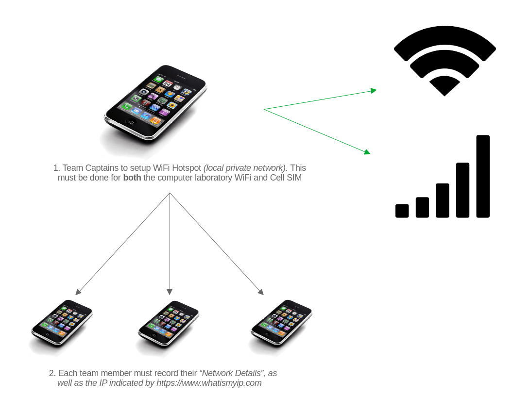</p>

> [!TIP]
> Pay careful attention to the IP Address reported by WhatIsMyIp.com. This is the unique identifier that _your_ device will be identified and recognized by externally on the internet. Use this information to assist you to understand and describe [NAT](https://en.wikipedia.org/wiki/Network_address_translation).

## Terminal, Windows MobaXTerm and PowerShell Commands

You should familiarize yourself with a few basic networking commands that can be utilized on your local shell, as well as your compute nodes. These commands are useful as a first step in debugging network related connection issues.

* `ip a` or `ipconfig`:
   The ip a command (short for ip addr) is used to display all IP addresses assigned to all network interfaces on a Linux system. It provides detailed information about the state of the network interfaces, including the IP address, broadcast address, subnet mask, and other relevant details.

* `ping 8.8.8.8`:
   The ping command is used to test the reachability of a host on an IP network. The 8.8.8.8 is a well-known public DNS server provided by Google. By sending ICMP Echo Request messages to 8.8.8.8, you can determine if the server is reachable and measure the round-trip time of the packets.

* `ip route` or `route print`:
   The ip route command is used to display or manipulate the routing table on a Linux system. It shows the kernel's routing table, which dictates how packets should be routed through the network. This includes the default gateway, subnet routes, and any other custom routing rules.

* `tracepath` or `tracert`:
   The tracepath command is used to trace the network path to a destination, showing the route that packets take to reach it. Unlike traceroute, tracepath does not require root privileges and is often easier to use. It provides details about each hop along the route, including the IP address and round-trip time.

> [!TIP]
> Refer to the [Q&A Discussion on GitHub](https://github.com/chpc-tech-eval/scc/discussions/48) for an example. Post a similar screenshot of your team executing these commands as a comment to that discussion.

# Launching your First Digital Ocean Virtual Machine Instance

In this section, you will be configuring and launching your first **Virtual Machine (VM)** instance. This allows you to use a portion of another computer's resources to host an **Operating System** as though it were running on its own dedicated hardware.

##  **What is a Virtual Machine?**
- A **Virtual Machine** allows you to run another operating system within your current environment
- For example: Running a **Linux-based OS** while in a **Windows environment** using a **Hypervisor**
- The physical servers hosting your VMs are located in **London**
---

## **Creating Your DigitalOcean Account and Project**

### **STEP 1: Create a Free Account**
- Navigate to: **https://www.digitalocean.com/**
- Click **"Sign Up"** and create your account using your email address
<p align="center">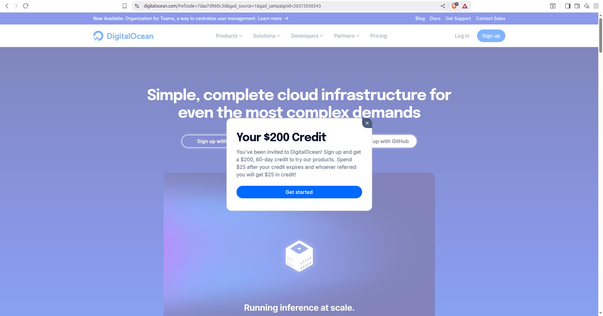</p>

### **STEP 2: Add Billing Information**
- After signing up, you will be prompted to add a **payment method**
- Insert a valid **credit card** - a **$1 verification charge** will be made (refundable)
- Upon successful verification, you will receive **$200 in free credit** to use over 60 days

<p align="center">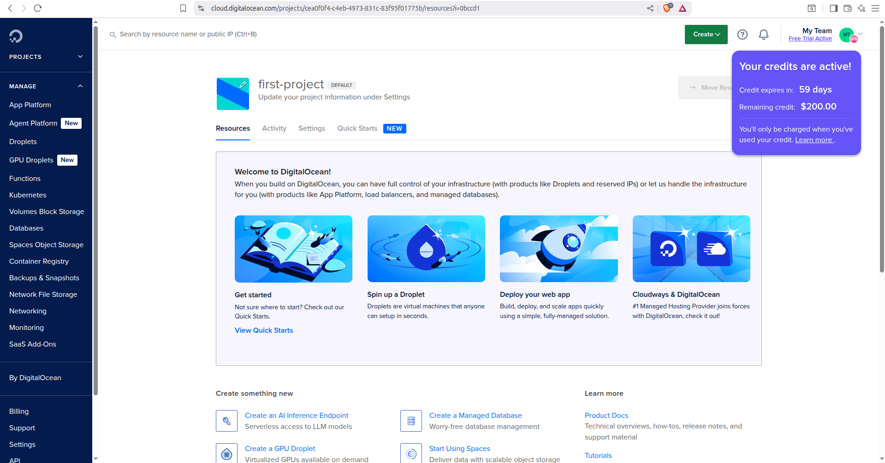</p>

### **STEP 3: Create a Project**
- DigitalOcean automatically creates **"first-project"** for you
- **Projects** help organize your resources (Droplets, volumes, etc.)
- You can use the default project or create a new one

---

## **Launching Your First Droplet (Head Node)**

In this section, you will create your first cloud server, which we will call the **"Head Node"**.

### **STEP 4: Create a Droplet**
- From your DigitalOcean control panel, click the **"Create"** button and select **"Droplets"**

<p align="center">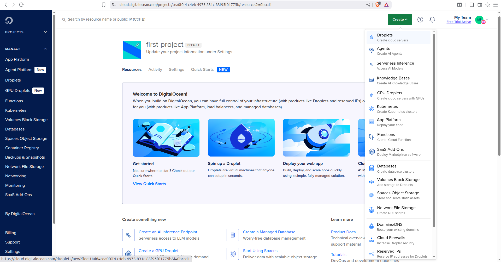</p>

#### **Configuration Options:**

**Choose an Image:**
- Select the **Distribution** tab
- Choose **Rocky Linux**
- Select the **latest version** (e.g., Rocky Linux 9.x)

<p align="center">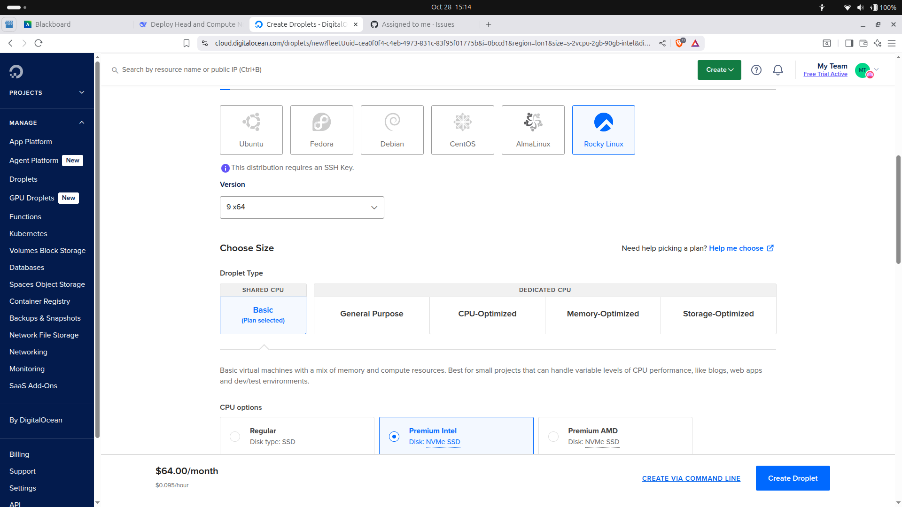</p>

**Choose a Plan:**
- Select the **Basic** plan type
- Choose the **$16/month** option (2 GB / 1 Intel CPU) - ideal for learning

<p align="center">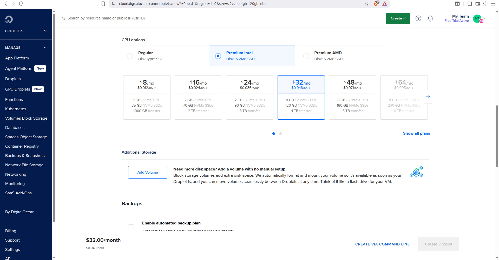</p>

**Choose a Datacenter Region:**
- Select a region **geographically close to you** (e.g., New York or San Francisco)
- This helps reduce **network latency**

**Authentication:**
- For security, select **SSH Keys**
- Use existing SSH keys or generate new ones (next step)
---

### **STEP 5: Generating an SSH Key (if you don't have one)**

You need an **SSH key** to securely connect to your Droplet.

#### **Generate SSH Key:**
**On Linux/macOS or Windows (PowerShell/WSL):**
```bash
ssh-keygen -t ed25519
```  
When prompted to "Enter file in which to save the key" - press Enter for default location.  
When prompted for a passphrase - press Enter twice (for no passphrase)  
View and Copy Public Key:  
```bash
cat ~/.ssh/id_ed25519.pub
```  
Copy the entire output (starts with ssh-ed25519...)  

**Add Key to DigitalOcean**:
- Back in the Droplet creation window, click "New SSH Key"
- Paste your public key into the text box
- Give it a descriptive name (e.g., "My Laptop Key")
- Click "Add SSH Key"

<p align="center">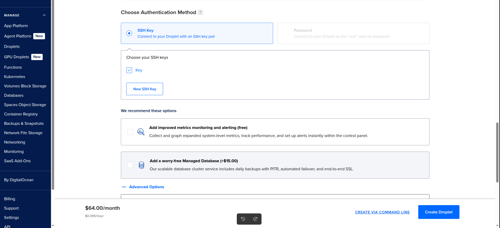</p>

**Finalize the Droplet**:  
Leave all other settings at defaults (VPC Network, no block storage, no backups)
- Rename your Droplet to head
- Click "Create Droplet"

<p align="center">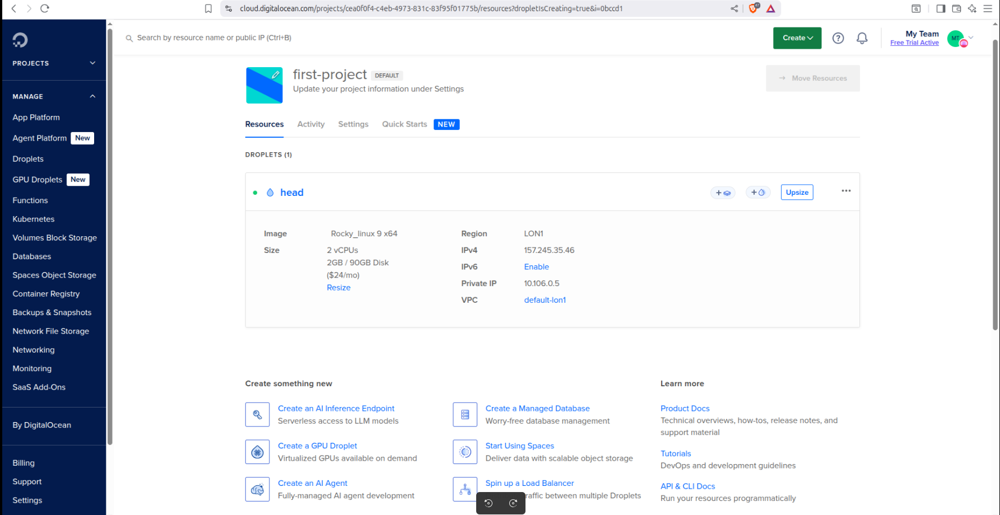</p>

**Provisioning Complete**  
Your Droplet will now provision (takes 30-60 seconds)  
You will see its public IP address once ready (e.g., 143.110.189.123)  
Your first DigitalOcean Virtual Machine is now ready! 

  
# Launching your First IBM Cloud Virtual Machine Instance

In this section, you will be configuring and launching your first **Virtual Machine (VM)** instance on IBM Cloud. This allows you to use a portion of IBM's cloud resources to host an **Operating System** as though it were running on its own dedicated hardware.

---

## **Creating Your IBM Cloud Account and Project**

### **STEP 1: Create a Free Account**
- Navigate to: **https://cloud.ibm.com/registration**
- Click **"Create an IBM Cloud Account"** and create your account using your email address

<p align="center">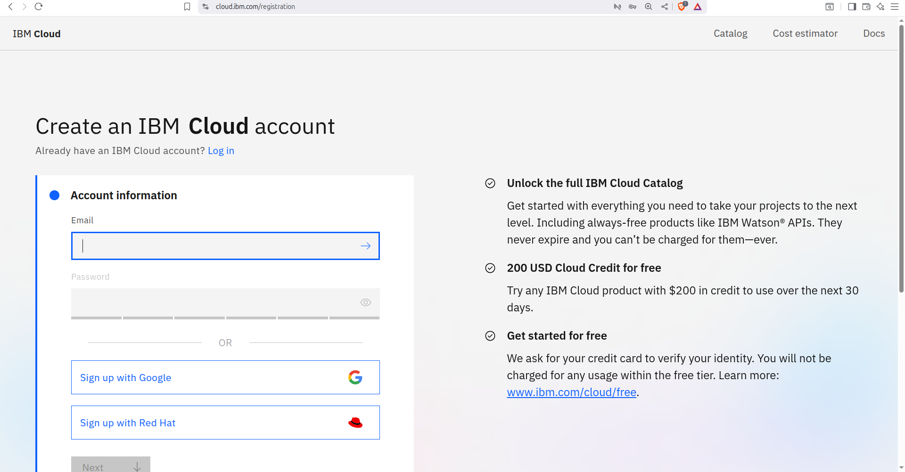</p>

### **STEP 2: Verify Your Email and Add Billing Information**
- After signing up, you will receive a verification email - enter the code to verify your account
- You will be prompted to add a **payment method** for identity verification
- Insert a valid **credit card** - a small verification charge may be made (refundable)
- Upon successful verification, you will receive **$200 in free credit** to use over 30 days

<p align="center">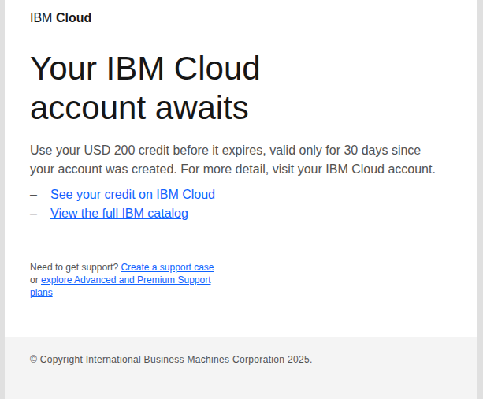</p>

### **STEP 3: Access IBM Cloud Console**
- Log in to your account at **https://cloud.ibm.com**
- You will have access to the IBM Cloud catalog with various services and Lite plans

<p align="center">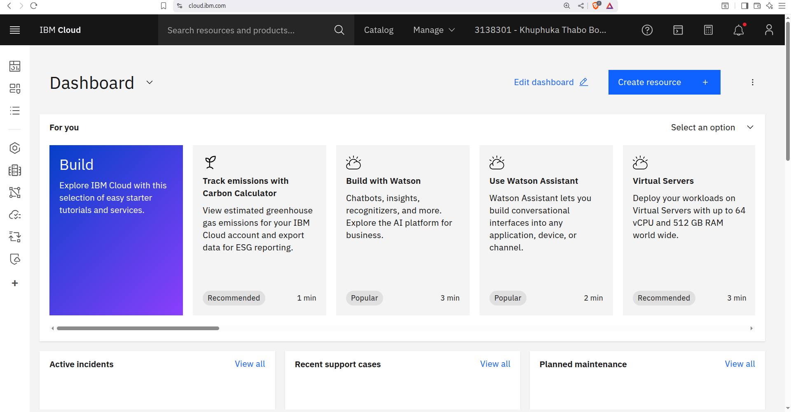</p>

---

## **Launching Your First Virtual Server Instance (Head Node)**

In this section, you will create your first cloud server, which we will call the **"Head Node"**.

### **STEP 4: Create a Virtual Server Instance**
- From your IBM Cloud dashboard, navigate to the left menu bar and click **"Infrastructure"**
- Go to **"Compute"** → **"Virtual Server Instances"**

<p align="center">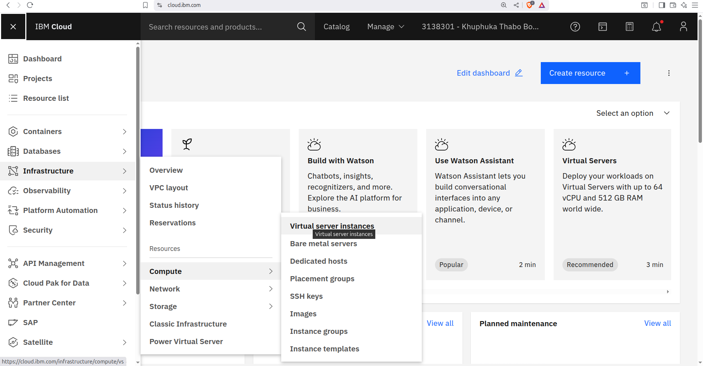</p>

#### **Configuration Options:**

**Configure Instance Basics:**
- **Instance name**: `head`
- **Resource group**: Default
- **Location**: Choose a region geographically close to you (e.g., London eu-gb)

<p align="center">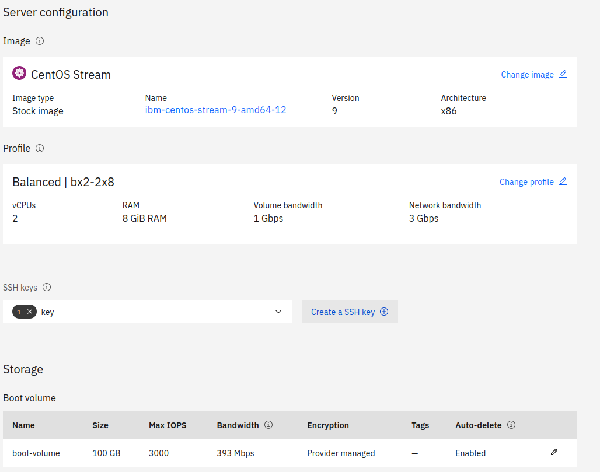</p>

**Choose an Image:**
- Select **CentOS Stream 9 - Minimal Install**
- This provides a stable, enterprise-grade Linux distribution ideal for HPC workloads

**Choose a Profile:**
- Select the **Balanced** profile type
- Choose the **bx2-2x8** option (2 vCPUs, 8GB RAM) - ideal for learning and HPC workloads

<p align="center">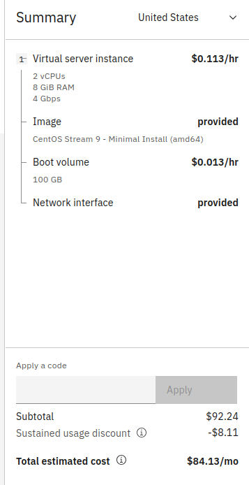</p>

**Authentication:**
- For security, configure **SSH Keys**
- Use existing SSH keys or generate new ones (next step)

---

### **STEP 5: Generating an SSH Key (if you don't have one)**

You need an **SSH key** to securely connect to your Virtual Server Instance.

#### **Generate SSH Key:**
**On Linux/macOS or Windows (PowerShell/WSL):**
```bash
ssh-keygen -t rsa -b 4096 -C "your_email@example.com"
```
When prompted to "Enter file in which to save the key" - press Enter for default location.  
When prompted for a passphrase - press Enter twice (for no passphrase)  
View and Copy Public Key:  
```bash
cat ~/.ssh/id_rsa.pub
```  
Copy the entire output (starts with ssh-rsa...)  

**Add Key to IBM Cloud**:
- Back in the Virtual Server creation window, under SSH keys, click "Add SSH key"
- Paste your public key into the text box
- Give it a descriptive name (e.g., "My Laptop Key")
- Click "Add SSH Key"

**Configure Storage**:
- **Boot volume**: 100GB
- **Auto-delete**: Enabled

**Finalize the Instance**:  
- Review the configuration and estimated cost (approximately $84.13/month after sustained usage discount)
- Click "Create Virtual Server Instance"

<p align="center">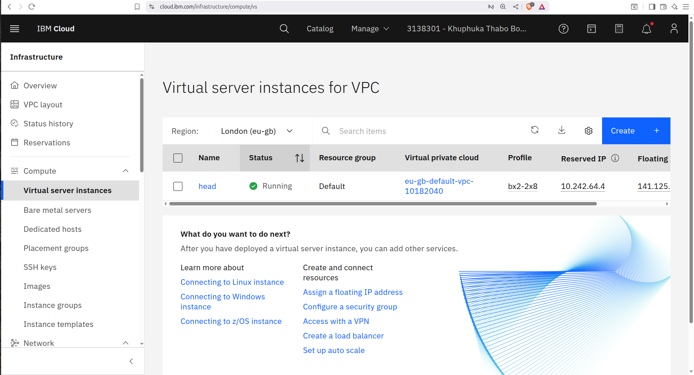</p>  

**Provisioning Complete**  
Your Virtual Server Instance will now provision (takes a few minutes)  
You will see its status change to "Running" once ready  
Your first IBM Cloud Virtual Machine is now ready! 

### **STEP 6: Reserve and Assign Floating IP**

1. **Reserve Floating IP**
   - Navigate to "Network" → "IP addresses" → "Reserve IP"
   - Reserve a new floating IP address
   - Cost: Approximately $2 per month

2. **Assign Floating IP to Head Node**
   - Go to your Virtual Server Instance details
   - Click "Attach floating IP"
   - Select the reserved floating IP
   - Confirm assignment

# Introduction to Basic Linux Administration

If you've managed to successfully build and deploy your VM instance, and you managed to successfully associate and attach a floating IP bridged over your internal interface, you are finally ready to connect to your newly created instance.

## Accessing Your Droplet via SSH MobaXTerm  
### **STEP 6: Connect to Your Head Node**  
Open a terminal on your local machine (Linux/macOS) or use PowerShell/WSL/MobaXTerm on Windows.  
Connect using the following commands.  
1. Open MobaXTerm
2. Click Session
3. Click SSH and under SSH:
    - Write public ip by ip
    - Enter username "root"
    - Under Advanced Settings add your private key  

The first time you connect, you will see a warning about the host's authenticity. Click yes and Enter.  

<p align="center">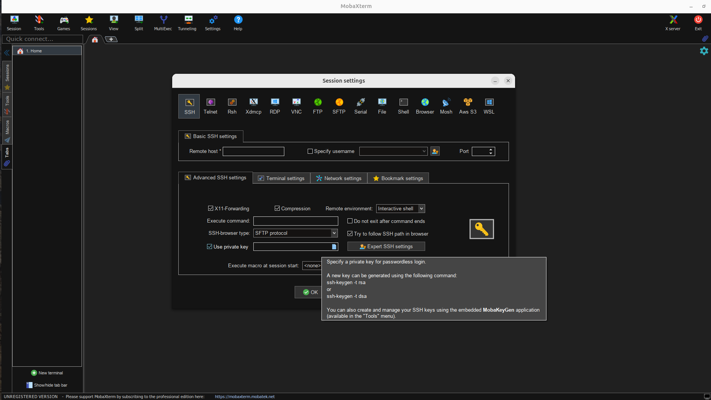</p>

Congratulations! You are now logged into your cloud-based Head Node.
  
## Accessing Your Virtual Server Instance via SSH MobaXTerm  
### **STEP 7: Connect to Your Head Node**  
Open a terminal on your local machine (Linux/macOS) or use PowerShell/WSL/MobaXTerm on Windows.  
Connect using the following commands.  

1. Open MobaXTerm
2. Click Session
3. Click SSH and under SSH:
    - Enter your floating IP address
    - Enter username "root"
    - Under Advanced Settings add your private key  

The first time you connect, you will see a warning about the host's authenticity. Click yes and Enter.  

<p align="center"></p>

Congratulations! You are now logged into your cloud-based Head Node.  

## Running Basic Linux Commands and Services

Once logged into your head node, you can now make use of the [previously discussed basic networking commands](#terminal-mobaxterm-and-windows-powershell-commands): `ip a`, `ping`, `ip route` and `tracepath`, refer to [Discussion on GitHub](https://github.com/chpc-tech-eval/scc/discussions/48) for example out, and to also post your screenshots as comments.

Here is a list of further basic Linux / Unix commands that you must familiarize yourselves and become comfortable with in order to be successful in the competition.

* Manual Pages `man`: On Linux systems, information about commands can be found in a manual page. This document is accessible via a command called `man` short term for manual page. For example, try running `man sudo`, scroll up and down then press `q` to exit the page.

* The `-h` Switch: You can make use of the `--help or -h` flag to see which options are available for a specific command. Similarly, to the above, try running `sudo -h`

* Piping and Console Redirection

  `>`  replaces the content of an output file with all input content
  `>>` appends the input content to the end of the output file.

  For example to create a file called `students.txt` and add a name to the file, use:
  ```bash
  # You can create new files using the `touch` command or the `>` redirect.
  touch students.txt
  echo "zama" >> students.txt
  echo "<TEAM_CAPTAIN>" >> students.txt
  echo "zama lecturer" >> students.txt
  echo "<TEAM_MEMBERS" >> students.txt
  ```

  Pipe `|` through `grep` can be used when searching the content of the file, if it exist it will be printed on the screen, if the search does not exist nothing will show on the screen.
  ```bash
  cat students.txt
  cat students.txt | grep "zama"
  ```

* Reading and Editing Documents: Linux systems administration essentially involves file manipulation. [Everything in a Linux is a file](https://en.wikipedia.org/wiki/Everything_is_a_file). Familiarize yourself with the basic use of `nano`.

* The GNU `history` command shows all commands you have executed so far, the feedback is numbered, use `!14` to rerun the 14th command.

Make sure that you try some of these commands to familiarize yourself and become comfortable with the Linux terminal shell and command line. You can find sample outputs and are strongly encouraged to post your teams screenshots of at least one of the above commands on the [Discussion Page on GitHub](https://github.com/chpc-tech-eval/scc/discussions/49).

* Understanding `journalctl` and `systemctl`

  Both `journalctl` and `systemctl` are two powerful command-line utilities used to manage and view system logs and services on Linux systems, respectively. Both are part of the systemd suite, which is used for system and service management.
  * `journalctl` is used to query and display logs from the journal, which is a component of systemd that provides a centralized location for logging messages generated by the `system` and services.
  * `systemctl` is used to examine and control the `systemd` system and service manager. It provides commands to start, stop, restart, enable, disable, and check the status of services, among other functionalities.

  For example to query the status of the `systemd-networkd` daemon / service, use:
  ```bash
  sudo systemctl status systemd-networkd
  ```

Verify some of your system's configuration settings and post a screenshot as a comment to this [Discussion Page on GitHub](https://github.com/chpc-tech-eval/scc/discussions/56).

> [!CAUTION]
> It is **CRITICAL** that you are always aware and sure which node or server your are working on. As you can see in the examples above, you can run *similar* commands in a Linux terminal on your workstation, on the console prompt of your head node, and as you will see later, on the console prompt of your compute node.

# Linux Binaries, Libraries and Package Management

Understanding Linux binaries, libraries, and package managers is crucial for effective software development and system management on Linux systems.

> [!NOTE]
> The following discussion around the concepts of binaries and libraries does not need to be fully understood at this stage and will be covered in more detail in later tutorials and lectures.

* **Binaries** are executable files created from source code, often written in languages like C or C++, through a process called compilation. These files contain machine code that the operating system can execute directly.
  * **Executable Files**: These are typically found in directories like `/bin`, `/sbin`, `/usr/bin`, and `/usr/sbin`.
  * **Shared Libraries**: These are files containing code that can be shared by multiple programs. They usually have extensions like `.so` (shared object) and are found in directories like `/lib` and `/usr/lib`.

* **Libraries** provide a way to share code among multiple programs to avoid redundancy and ease maintenance. They come in two main types:
  * **Static Libraries (`.a` files)** are linked into the executable at compile time, resulting in a larger binary. Do not require the library to be present at runtime.
  * **Shared (Dynamic) Libraries (.so files)** are linked at runtime, reducing the binary size. The executable will need the shared library to be present on the system at runtime.

* **Package Managers** are tools that automate the process of installing, updating, configuring, and removing software packages. They handle dependencies and ensure that software components are properly integrated into the system.
    * **Repositories** are online servers storing software packages. Package managers download packages from these repositories.
    * **Dependencies** are binaries, libraries or other packages that software depends on to function correctly. Package managers resolve, install and remove dependencies automatically.

From this point onward, you're going to need to pay extra attention to the commands that have been issued and you must ensure that they correspond to the distribution that you are using.

> [!WARNING]
> Do not try to type the following arbitrary commands into your head node's terminal. They are merely included here for illustration purposes.

* DNF / YUM
```bash
# RHEL, Alma, Rocky, Centos
# You are strongly recommended to use one of the distros mentioned above.
# This will always be the first example use case given for any scenario and
# the recommended approach to follow

sudo dnf update
sudo dnf install <PACKAGE_NAME>
sudo dnf remove <PACKAGE_NAME>
```
* APT-based systems
```bash

# Ubuntu
# Another really good choice and strong recommendation to adopt is Ubuntu.
# Ubuntu has many users, and many first time Linux users, start their
# journeys into Linux through APT (or Ubuntu) based distros.
# Moreover Ubuntu has it's origins in South Africa...

sudo apt update
sudo apt install <PACKAGE_NAME>
sudo apt remove <PACKAGE_NAME>
```
* Pacman-based systems
```bash

# Arch-Like Linux
# Arch Linux is one of the most "flexible and succinct" Linux distros
# available today. It popularity stems not only from the fact that is has
# excellent documentation, but it's "keep it straight and simple" approach.
# Not recommend for beginners, unless you have previous Linux expertise or
# unless you are looking for a challenge.

sudo pacman -Syu
sudo pacman -S <PACKAGE_NAME>
sudo pacman -R <PACKAGE_NAME>
```

## User Environment and the `PATH` Variable

Understanding the user environment and the `PATH` variable is crucial for effective command-line operations and software management on Linux systems. The user environment in Linux refers to the collection of settings and variables that define how the system behaves for a user. These settings include environment variables, configuration files, and shell settings.
```bash
# For example, to view the `USER` and `HOME` variables
echo $USER
echo $HOME
```

The `PATH` variable is one of the most important environment variables. It specifies a list of directories that the shell searches to find executable files for commands. When you type a command in the terminal, the shell looks for an executable file with that name in the directories listed in `PATH`.
```
# View the contents of your PATH variable
echo $PATH

# List the contents of your HOME directory
ls $HOME

# Find the location of the ls command
which ls
```

# Install, Compile and Run High Performance LinPACK (HPL) Benchmark

HPL is a crucial tool in the HPC community for benchmarking and comparing the performance of supercomputing systems. The benchmark is a software package designed to solve a dense system of linear equations using double-precision floating-point arithmetic. It is commonly used to measure the performance of supercomputers, providing a standardized way to assess their computational power.

You will now install and run HPL on your **head node**.

> [!WARNING]
> You are advised to skip this section if you have fallen behind the pace recommended by the course coordinators. Skipping this section will *NOT* stop you from completing the remainder of the tutorials. You will be repeating this exercise during tutorial 3.
>
> However, familiarizing yourselves with this material now, will make things easier for you and your team in the subsequent tutorials and their respective sections.

1. Update the system and install dependencies

   You are going to be installing tools that will allow you to compile applications using the `make` command. You will also be installing a maths library to compute matrix multiplications, and an `mpi` library for communication between processes, in this case mapped to CPU cores.
   * DNF / YUM
   ```bash
   # RHEL, Rocky, Alma, Centos Steam
   sudo dnf update -y
   sudo dnf install openmpi atlas openmpi-devel atlas-devel -y
   sudo dnf install wget nano -y
   ```
   * APT
   ```bash
   # Ubuntu
   sudo apt update
   sudo apt install build-essential openmpi-bin libopenmpi-dev libatlas-base-dev
   ```
   * Pacman
   ```bash
   # Arch
   sudo pacman -Syu
   sudo pacman -S base-devel openmpi atlas-lapack nano wget
   ```
1. Fetch the HPL source files

   You will download the HPL source files. This is why you installed `wget` in the previous step.
   ```bash
   # Download the source files
   wget http://www.netlib.org/benchmark/hpl/hpl-2.3.tar.gz

   # Extract the files from the tarball
   tar -xzf hpl-2.3.tar.gz

   # Move and go into the newly extracted folder
   mv hpl-2.3 ~/hpl
   cd ~/hpl

   # list the contents of the folder
   ls
   ```
1. Configure HPL

   Copy and edit your own `Make.<TEAM_NAME>` file in the `hpl` directory to suit your system configuration.
   ```bash
   cp setup/Make.Linux_PII_CBLAS_gm Make.<TEAM_NAME>
   nano Make.<TEAM_NAME>
   ```

   You need to carefully edit your `Make.<TEAM_NAME>` file, ensuring that you make the following changes:
   * RHEL, Rocky, Alma, CentOS Stream based systems
     ```conf
     ARCH               = <TEAM_NAME>

     MPdir              = /usr/lib64/openmpi

     LAdir              = /usr/lib64/atlas
     LAlib              = $(LAdir)/libtatlas.so $(LAdir)/libsatlas.so

     CC                 = mpicc

     LINKER             = mpicc
     ```
   * Ubuntu based systems
     ```conf
     ARCH               = <TEAM_NAME>

     MPdir              = /usr/lib/x86_64-linux-gnu/openmpi

     LAdir              = /usr/lib/x86_64-linux-gnu/atlas/
     LAlib              = $(LAdir)/libblas.so $(LAdir)/liblapack.so

     CC                 = mpicc

     LINKER             = mpicc
     ```

1. Temporarily edit your `PATH` variable

   You are almost ready to compile HPL, you will need to modify your path variable in order for your MPI C Compiler `mpicc` to be a recognized binary.
   Check to see if `mpicc` is currently detected:
   ```bash
   # The following command will return a command not found error.
   which mpicc

   # Temporarily append openmpi binary path to your PATH variable
   # These settings will reset after you logout and re-login again.
   export PATH=/usr/lib64/openmpi/bin:$PATH

   # Rerun the which command to confirm that the `mpicc` binary is found
   which mpicc
   ```
1. Compile HPL

   You are finally ready to compile HPL. Should you encounter any errors and need to make adjustments and changes, first run a `make clean arch=<TEAM_NAME>`.
   ```bash
   make arch=<TEAM_NAME>

   # Confirm that your `xhpl` binary has been successfully built
   ls bin/<TEAM_NAME>
   ```

1. Configure your `HPL.dat`

   Make the following changes to your `HPL.dat` file:
   ```bash
   cd bin/<TEAM_NAME>
   nano HPL.dat
   ```

   Carefully edit you `HPL.dat` file and verify the following changes:
   ```conf
   1            # of process grids (P x Q)
   1            Ps
   1            Qs
   ```
1. Running HPL on a Single CPU

   For now, you will be running HPL on your head node, on a single CPU. Later you will learn how to run HPL over multiple CPUs, each with multiple cores, across multiple nodes...
   ```bash
   # Excute the HPL binary
   ./xhpl
   ```

> [!TIP]
> Note that when you want to configure and recompile HPL for different architectures, compilers and systems, adapt and the `Make.<NEW_CONFIG>` and recompile that architecture or configuration.
>
> If you compile fails and you would like to try to fix your errors and recompile, you must ensure that you reset to a clean start with `make clean`.

Congratulations!

You have successfully completed you first HPL benchmark.
