Tutorial 2: Standing Up a Compute Node and Configuring Users and Services
=========================================================================

# Table of Contents

<!-- markdown-toc start - Don't edit this section. Run M-x markdown-toc-refresh-toc -->

1. [Checklist](#checklist)
1. [Spinning Up a Compute Node in OpenStack](#spinning-up-a-compute-node-in-openstack)
    1. [Compute Node Considerations](#compute-node-considerations)
1. [Accessing Your Compute Node](#accessing-your-compute-node)
    1. [IP Addresses and Routing](#ip-addresses-and-routing)
    1. [Command Line Proxy Jump Directive](#command-line-proxy-jump-directive)
        1. [Setting a Temporary Password on your Compute Node](#setting-a-temporary-passworwd-on-your-compute-node)
    1. [Generating SSH Keys on your Head Node](#generating-ssh-keys-on-your-head-node)
1. [Understanding the Roles of the Head Node and Compute Nodes](#understanding-the-roles-of-the-head-node-and-compute-nodes)
    1. [Basic System Monitoring](#basic-system-monitoring)
    1. [Terminal Multiplexers](#terminal-multiplexers)
1. [Manipulating Files and Directories](#manipulating-files-and-directories)
    1. [List Directory `ls`](#list-directory-ls)
    1. [Change Directory `cd`](#change-directory-cd)
    1. [Copy File or Directory `cp`](#copy-file-or-directory-cp)
    1. [Move File or Directory `mv`](#move-file-or-directory-mv)
    1. [Make a New Directory `mkdir`](#make-a-new-directory-mkdir)
    1. [Remove File or Directory `rm`](#remove-file-or-directory-rm)
    1. [Recommended Project Folder Structure](#recommended-project-folder-structure)
1. [Verifying Networking Setup](#verifying-networking-setup)
    1. [Head Node](#head-node)
    1. [Compute Node](#compute-node)
    1. [Editing `/etc/hosts` File](#editing-etchosts-file)
    1. [Permanent `~/.ssh/config` Configuration](#permanent-sshconfig-configuration)
1. [Configuring a Simple Stateful Firewall](#configuring-a-simple-stateful-firewall)
    1. [IPTables](#iptables)
    1. [NFTables](#nftables)
    1. [Front-end Firewall Application Managers](#front-end-firewall-application-managers)
1. [Network Time Protocol](#network-time-protocol)
    1. [NTP Server (Head Node)](#ntp-server-head-node)
    1. [NTP Client (Compute Node)](#ntp-client-compute-node)
1. [Network File System](#network-file-system)
    1. [NFS Server (Head Node)](#nfs-server-head-node)
    1. [NFS Client (Compute Node)](#nfs-client-compute-node)
        1. [Mounting An NFS Mount](#mounting-an-nfs-mount)
        1. [Making The NFS Mount Permanent](#making-the-nfs-mount-permanent)
    1. [Passwordless SSH](#passwordless-ssh)
        1. [Understanding `~/.ssh/authorized_keys`](#understanding-ssh/authorized_keys)
        1. [User Permissions and Ownership](#user-permissions-and-ownership)
1. [User Account Management](#user-account-management)
    1. [Create Team Captain User Account](#create-team-captain-user-account)
        1. [Head Node](#head-node-1)
        1. [Compute Node](#compute-node-1)
        1. [Super User Access](#super-user-access)
    1. [Out-Of-Sync Users and Groups](#out-of-sync-users-and-groups)
        1. [Head Node](#head-node-2)
        1. [Compute Node](#compute-node-2)
        1. [Clean Up](#clean-up)
    1. [Ansible User Declaration](#ansible-user-declaration)
        1. [Installing and Configuring Ansible](#installing-and-configuring-ansible)
        1. [Create Team Member Accounts](#create-team-member-accounts)
1. [Remote Access to Your Cluster and Tunneling](#remote-access-to-your-cluster-and-tunneling)
    1. [Local Port Forwarding](#local-port-forwarding)
    1. [Dynamic Port Forwarding](#dynamic-port-forwarding)
        1. [Web Browser and SOCKS5 Proxy Configuration](#web-browser-and-socks5-proxy-configuration)
    1. [WirGuard VPN Cluster Access](#wirguard-vpn-cluster-access)
    1. [ZeroTier](#zerotier)
    1. [X11 Forwarding](#x111-forwarding)
    1. [(Delete)FreeIPA ](#deletefreeipa-img-srcresourcesfreeipapng-width21-)
        1. [FreeIPA Server (Head Node)](#freeipa-server-head-node)
        1. [FreeIPA Client (Compute Node)](#freeipa-client-compute-node)
        1. [FreeIPA Web Interface](#freeipa-web-interface)
            1. [Dynamic SSH Tunnel](#dynamic-ssh-tunnel)
            1. [Firefox and Proxy Configuration](#firefox-and-proxy-configuration)
            1. [Creating a User](#creating-a-user)
                1. [Creating the Group](#creating-the-group)
                1. [Creating the Users](#creating-the-users)

<!-- markdown-toc end -->

## Checklist

TODO: Fix checklist

This tutorial will demonstrate how to access web services that are on your virtual cluster via the web browser on your local computer. It will also cover basic authentication and central authentication.

<u>In this tutorial you will:</u>

- [ ] Install a web server.
- [ ] Create an SSH tunnel to access your web service.
- [ ] Create new local user accounts.
- [ ] Add local system users to sudoers file for root access.
- [ ] Share directories between computers.
- [ ] Connect to machines without a password using public key based authentication.
- [ ] Install and use central authentication.


## Spinning Up a Compute Node in OpenStack

### Manually from openstack dashboard 
To launch your compute node vm, go to `Compute-> Instances` click `launch instance` and follow the headnode vm launch process on Tutorial 1. **remember** to use `compute` flavors and `local_team_keys`  used when launching the headnode on Tutorial 1.


### scripting and automation to test out differnet configurations

As previously discussed in [Tutorial 1: OpenStack Flavors](../tutorial1/README.md#openstack-instance-flavors), an important aspect of system administration is resource monitoring, management and utilization. Once you have successfully stood up your head node, your team will need to plan and manage the resources remaining which will be available for your compute node(s).

You would have seen in [Tutorial: Head Node Resource Allocations](../tutorial1/README.md#head-node-resource-allocations), that there are a number of potentially _(in)_valid configurations that you can utilize for your cluster design.

> [!TIP]
> You are encourage to **strongly** encouraged to automate the deployment, installation and configuration of your cluster nodes through the use of either at least basic shell scripts or more advanced Ansible playbooks. This will allow you to rapidly experiment with and test the performance of different configurations in order to determine an optimum cluster for the applications you're required to evaluate.

### Compute Node Considerations

While the head node is responsible for administrative and management related tasks, such as authenticating user logins into the cluster, managing services, hosting a network file system, workload management and load balancing, while compute nodes are responsible executing compute intensive tasks.

Sensible default instance flavors have already been identified and configured for you. The choice your team made for your head node will determine and inform sensible decisions for the compute node(s) instance flavors.

One important distinction between your head node and compute node(s), is that the compute nodes will **not** have a floating IP associated to them. Your head node will act as a ***Gateway*** for your Compute Node(s), and ***Route*** traffic between the internet and your cluster, using a method referred to as ***Network Address Translation (NAT)***, which was discussed in the [WiFi Hotspot Example](../tutorial1/README.md#wifi-hotspot-example).

The final important consideration that must be made for your compute node is that you must not forget to configure an SSH key, so that you may access it after it has successfully launched. For ease of access and to simplify your configuration, you are *strongly* advised to use the same SSH key that you'd [previously generated](../tutorial1/README.md#generating-ssh-keys) on your local machine/laptop.

### Accessing Your Compute Node

After you have successfully [Launched Your Second OpenStack VM Instance](../tutorial1/README.md#launching-your-first-openstack-virtual-machine-instance), you can SSH into your new compute node VM instance using your head node as a [Jump Box](https://goteleport.com/blog/ssh-proxyjump-ssh-proxycommand/).

### IP Addresses and Routing

Before your access your compute node, we must verify a few details on the head node. Your will already be familiar with many of these commands.

<p align="center"></p>

TODO: High level explanation of OpenStack's automatic network configuration and basically how it creates virtual switch for their private network

TODO: Maybe remove the default routing table on compute node and route through headnode?

### Command Line Proxy Jump Directive 

From you workstation, using either MobaXTerm or Windows Powershell, you can `ssh` directly into your compute node by first making an **ssh** connection too your head node and then establishing a TCP forwarding connection to your compute node. Using this method, the SSH keys for both your head node and compute node must reside on your local workstation:

<details>
<summary>Head node and compute node deployed with the *SAME* ssh key</summary>

```bash
ssh -i <path to ssh key> -J <user>@<head node publicly accessible ip> <user>@<compute node private internal ip>
```

<p align="center"></p>

For example, in the screenshot above, the head node `scc24_arch_hn` and the compute node `scc24_arch_cn` have been created with the same key pair `nlisa at grogu`. The head node has a public facing IP address of **154.114.57.126** and the compute node has an private, internal IP address of **10.100.0.191**, then you would connect to this compute node using:

```bash
ssh -i ~/.ssh/id_ed25519_sebowa -J arch@154.114.57.126 arch@10.100.0.191
```

> [!NOTE]
> Remember to use the **ssh keys**, **usernames** and **ip addresses** corresponding to *your* nodes.

</details>

<details>
<summary>Head node and compute nods deployed using different key pairs</summary>

```bash
ssh -o ProxyCommand="ssh -i <path to head node ssh key> -l <user> -W %h:%p <head node ip>" -i <path to  compute node ip> <user>@<compute node ip> 
```

</details>

### Setting a Temporary Password on your Compute Node

Once you have successfully logged into your compute node, you can set a password for the default user:
```bash
sudo passwd <user>
```

<p align="center">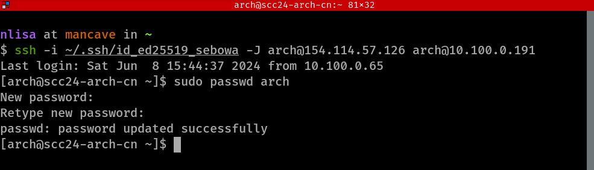</p>


### Generating SSH Keys on your Head Node

Just as you did so in the previous tutorial when you generated SSH keys [on your workstation](../tutorial1/README.md#generating-ssh-keys), you're now going to do the same on your head node. You're then going to copy the newly created key onto you head node and test the new SSH connection, by logging into your compute node.

1. Generate an SSH key on your **head node**:

   ```bash
   ssh-keygen -t ed25519
   ```
   
   - *Enter file in which to save the key* - Press `Enter`,
   - *Enter passphrase (empty for no passphrase)* - Leave empty and press `Enter`,
   - *Enter same passphrase again* - Leave empty and press `Enter` again,
1. Copy the newly created SSH key to your **compute node**:

   ```bash
   ssh-copy-id ~/.ssh/id_ed25519 <user>@<compute node ip>
   ```
   
1. From your **head node**, SSH into your **compute node**:
   ```bash
   
   ssh <user>@<compute node ip>
   
   ```
1. Once you've successfully logged into your **compute node**, list and examine the contents of the `~/.ssh/authorized_keys` file:
   ```bash
   ls -l ~/.ssh/id_ed25519
   cat ~/.ssh/id_ed25519
   ```

<p align="center">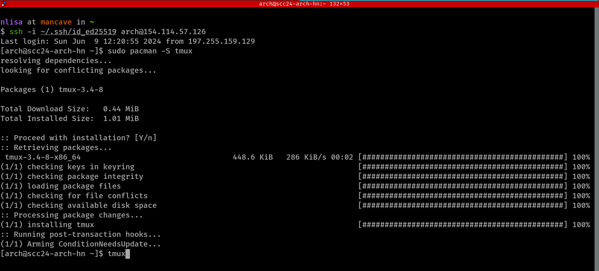</p>


### Understanding the Roles of the Head Node and Compute Node
Networking Diagram and client server model
headnode (hd) and compute node (cn) relationship follow a server (hd) - client (cn) relations, the headnode carries the systems services and compute node does all the computations
System software need to be installed on both head node and compute nodes
Do not ssh endlessly between head and compute nodes, one terminal example or multiplexing (screen sessions via `tmux`)


### Terminal Multiplexers

Discuss GNU Screen and [tmux](https://github.com/tmux/tmux/wiki)


Install `tmux` on your **head node***:

<details>
<summary>Installing `tmux` using pacman</summary>

```bash
sudo pacman -Syu tmux
```
</details>

<details>
<summary>Installing `tmux` using `yum`</summary>

```bash
sudo yum update
sudo yum install tmux
```
</details>

<details>
<summary>Installing `tmux` using `dnf`</summary>

```bash
sudo dnf update
sudo dnf install tmux
```
</details>

<details>
<summary>Installing `tmux` using `apt-get`</summary>
```bash
sudo apt-get update
sudo apt-get install tmux
```
</details>

<p align="center">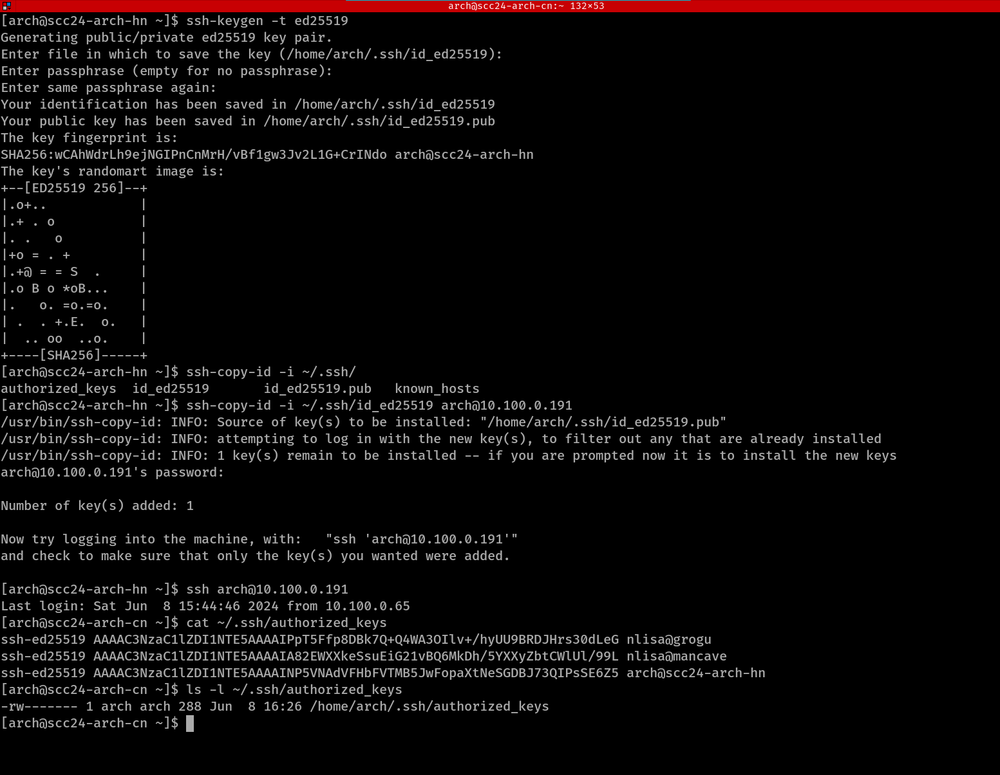</p>

To start a new `tmux` session on your **head node**:

```bash
tmux new -s session_name 
```

#### Working on your Head Node and Compute Node in Two Adjacent Panes

Once you've started a new `tmux` session or daemon or server, on your head node, there are a number of very useful tools you can utilize.

1. Split the terminal vertically into two separate panes:
   Press and hold `Ctrl` together with `b`. Then release `Ctrl` + `b` and press `"` (i.e. `Shift` + `'`) . The combination of `Ctrl + b` `"`, is denoted by:
   
   ```bash
   C-b "
   ```
1. You can switch between the two panes using `Ctrl` + `b` and `o`:

   ```bash
   C-b o
   ```
1. Install `btop` on your **head node**. Depending on the Linux distribution you chose to install:
   ```bash
   sudo dnf install btop
   ```
   **OR**
   ```bash
   sudo yum install btop
   ```
   **OR**
   ```bash
   sudo pacman -S btop
   ```
   **OR**
   ```bash
   sudo apt-get install btop
   ```
1. Move to the second pane, and ssh into your **compute node** using `Ctrl` + `b` and `o`.
   ```bash
   C-b o
   ```
1. Ssh into your **compute node** and install `htop`:
   ```bash
   ssh <user>@<compute node ip>
   
   ```
   <p align="center">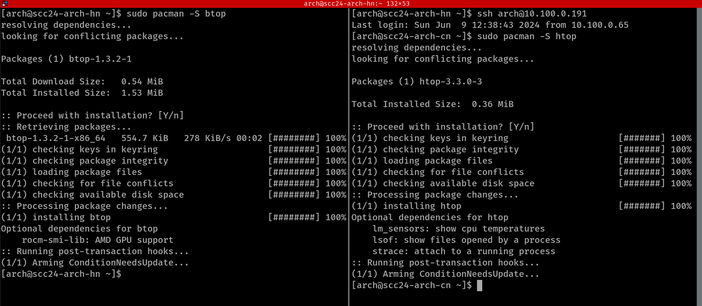</p>
   
1. Create a new window within `tmux` using `Ctrl` + `b` and 'c':
   ```bash
   C-b c
   ```
1. You can cycle between the two windows using `Ctrl` + `b` and `n`:
   ```bash
   # Cycle to the next window
   C-b n
   
   # Or cycle to windows 0 and 1 respectively  
   C-b 0
   C-b 1
   ```
1. Split the new window pane horizontally using `Ctrl` + `b` and `%`.
   - Run `btop` on your **head node** on one of your panes.
   - Ssh into your **compute node*** and run `htop` on the other pane.
   <p align="center">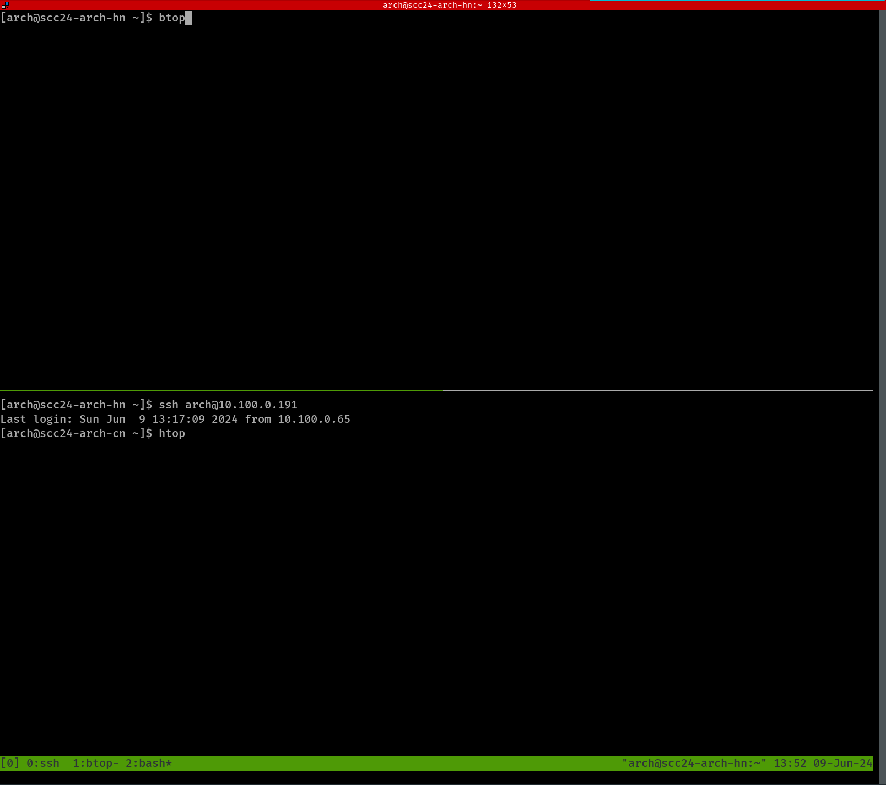</p>
   <p align="center">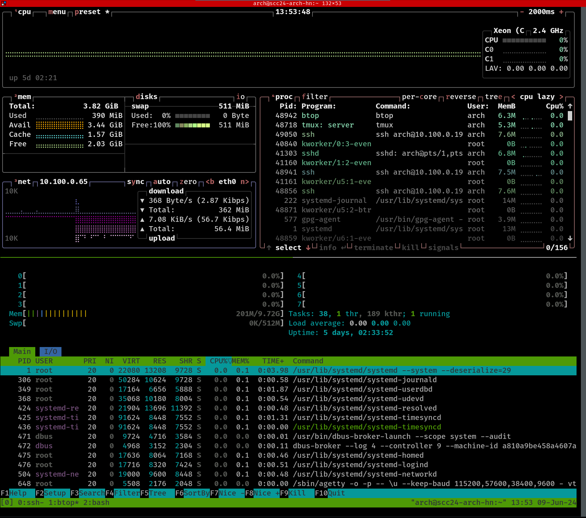</p>

1. There are many more utilities available within `tmux`. Check the built-in help documentation using `Ctrl` + `b` and `?` (i.e. `Shift` + `/`):
   ```bash
   C-b ?
   ```
1. Your team must decide which tool you will be using for basic monitoring of your cluster. Choose between `top`, `htop` and `btop` and make sure your choice of application is installed across your cluster.

#### Attaching and Detaching Sessions

Should your terminal application close, or if you relocate from the laboratores... write a schlept about remote sessions and servers here

To connect to an existing `tmux` session on your **head node**:

```bash
tmux a -t session_name 
```


## Basic Linux commands   

#### Basic System Monitoring  
`top` `htop` are system built commands used to monitor server resource suage. for `htop` first install epel source repository then install htop 
https://docs.rockylinux.org/gemstones/htop/ 

```bash
sudo dnf -y install epel-release
sudo dnf makecache
sudo dnf -y install htop
htop 
```

<p align="center">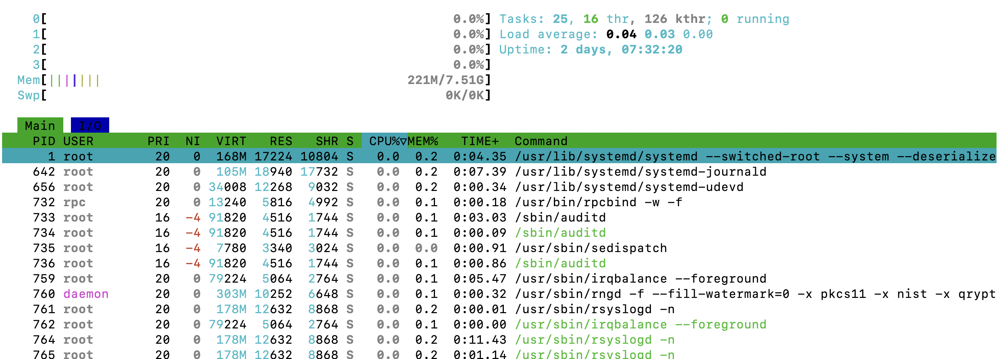</p>


#### Print current working space 
If you are lost and don't know where you currently working use `pwd` (print working directory), it will show you your current woring space 

```bash
pwd 
```


### Manipulating Files and Directories

#### Make a New Directory 

`mkdir` command is used to create folders or directories, the `-p` flag means create the directory path `mnu/2024` if it does not exits before creating `SCC` directory. 

```bash
mkdir SCC
mkdir -p mnu/2024/SCC
```


#### creating new Files 
The following commands are used to create and edit files 
`touch` create a new file(s) 

`vi, vim, nano ` file editor commands and are used to edit existing files, but if a file does not exist it will create the file and open it for editing. 


```bash
touch file
vi file1
```


#### List Directory 
`ls` (list) command used to list the content of directory/folder.

```bash
ls mnu/2024/SCC
```

`ls` list or prints the content of the current working directory 
`ls mnu/2024/SCC`  list or print the content of the last `SCC` directory 


#### Change Directory 

`cd` commad allow you move from directory to directory 

```bash

cd mnu/2024/SCC
```

`cd mnu/2024/SCC` means moving to `SCC`  directory, you can verify your current working directory by `pwd` command 

<p align="center">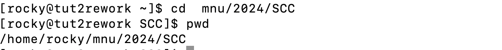</p>


#### Copy File or Directory 

`cp` copy files/directories from source to destinations, it works like windows `copy and paste`. 

```bash
mkdir -p mnu/2024/team
cp -r mnu/2024/SCC mnu/2024/team/

```

`mkdir -p mnu/2024/team` creates a team directory/folder under mnu/2024 directoy path. 

`cp -r mnu/2024/SCC mnu/2024/team/` will recursilvely copy the `SCC` directory and it content to `mnu/2024/team/` directory. 


<p align="center">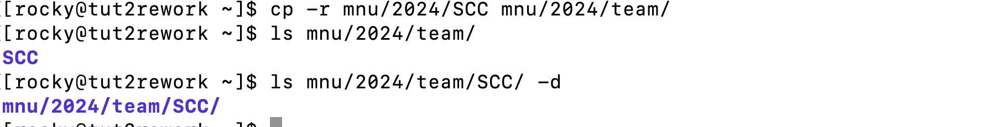</p>


#### Move File or Directory 

`mv` command literally moves files/directories from source to destinations, it work like windows `cut and paste`. 


```bash
mv staff_list.txt mnu/2024/team/SCC
```

`staff_list.txt` file is being moved to SCC directory 


 <p align="center">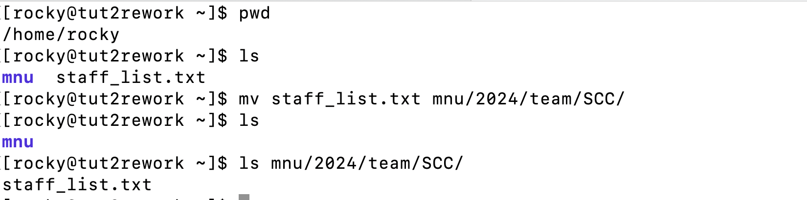</p>


#### Remove File or Directory 

`rm` remove command used to delete files, directory with `-r` flag

```bash
rm  mnu/2024/team/SCC/staff_list.txt
rm -r mnu/2024/team/SCC

```


<p align="center">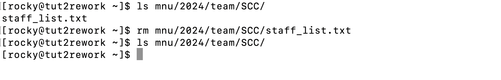</p>

<p align="center">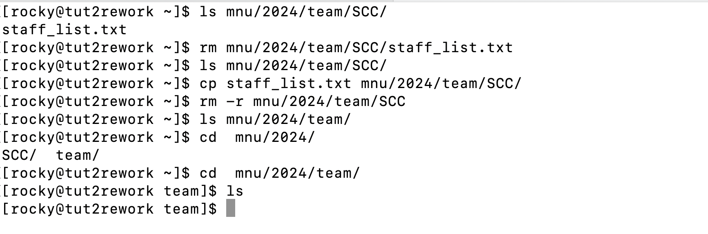</p>


#### The history Command

`history` command shows all commands you have executed so far, the feedback is numbered, use `!14` to rerun the 20th command  
 

 <p align="center">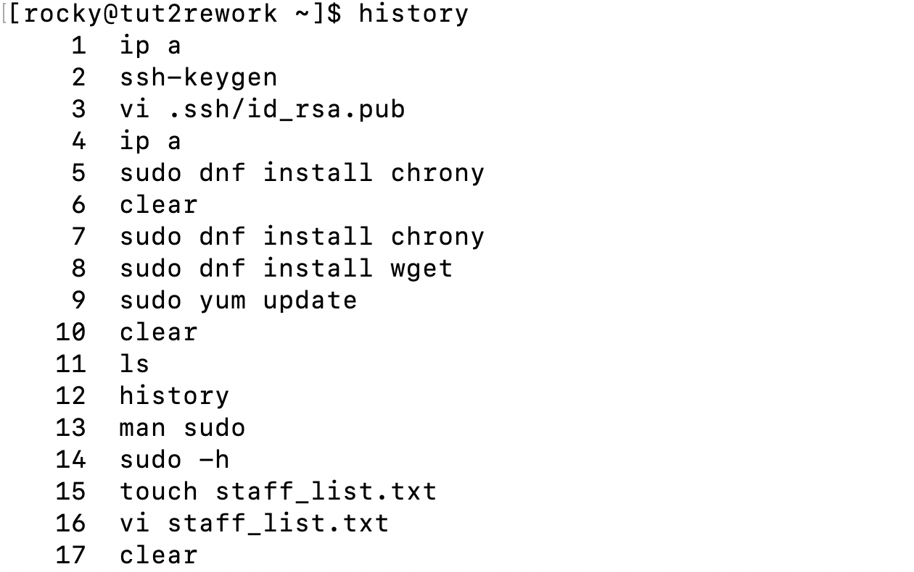</p>


 <p align="center">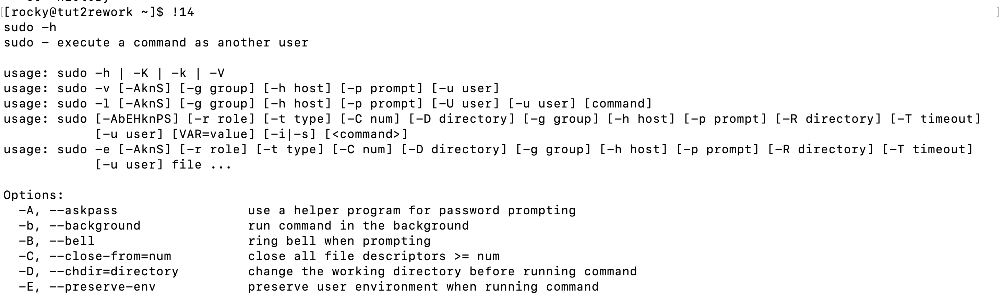</p>


#### The virtual environment Command 

`virtualenv` command helps you run multiple services with conflicting packages without any problems. each virtual enviroment is treated as an independant entity. 
Below is how you create and source or access a virtual enviroment then deactivate to exit, ensure to use sensible names.
https://www.digitalocean.com/community/tutorials/how-to-install-python-3-and-set-up-a-programming-environment-on-rocky-linux-9 

```bash
python -m venv env
source env/bin/activate
deactivate 
```


## Recommended Project Folder Structure
#### Verifying Networking Setup

Your VMs have been assigned IP addresses,to identify these, navigate to `Compute -> Instances` on your openstack dashboard. Click the any name of the virtual machine instance to see an overview of your virtual machine specifications, under `IP Addresses` you will see two IP addresses (IPs) (for the headnode) and one IP address (for compute node) with their respective networks  

The headnode IP addresses will look like `10.100.50.x` and `154.114.57.x` where `x` is your specific vm address number. `10.100.50.x` network is for internal use and `154.114.57.x` is for public facing usage. 

You can check your network interfaces by using the `ip a` command after logging in to your headnode or commpute node. 


 <p align="center"></p>


**Rocky 9.3** uses `Network Manager` (**NM**) to manage network settings. `Network Manager` is a service created to simplify the management and addressing of networks and network interfaces on Linux machines.

You can read the ff links for more information or better understanding: 
https://docs.rockylinux.org/gemstones/network/RL9_network_manager/  
https://docs.rockylinux.org/guides/network/basic_network_configuration/ 


**Rocky 9** uses `Network Manager` (**NM**) to manage network settings. `Network Manager` is a service created to simplify the management and addressing of networks and network interfaces on Linux machines.


#### Head Node (`nmtui`)

For the **head node**, create a new network definition using the `nmtui` graphical tool using the following steps:

First we must make sure that our network interfaces are managed by Network Manager. By default, this should already be the case. Use the following command to check if the network interfaces are managed:

```bash
nmcli dev
```

You should see something other than "unmanaged" next to each of the interfaces (excluding lo). If any of your network interfaces (other than lo) say "unmanaged", do the following:

```bash
nmcli dev set <interface> managed yes

```

The `nmtui` tool is a console-graphical tool used to set up and manage network connections for Network Manager.

```bash
sudo nmtui

```

You'll be presented with a screen, select Edit a connection, followed by <Add> and then Ethernet.

For Profile Name, type the name of the interface you want to assign an IP address to, like `eth0` or `ens3`, and type the same thing for Device (in this instance, Device means interface).
For IPv4 CONFIGURATION, change <Automatic> to <Manual>. This tells NM that we want to assign a static IP address to the connection. Hit enter on <Show> to the right of IPv4 CONFIGURATION and enter the following information:

Addresses: Hit <Add> and enter the IP address (found in OpenStack) for this interface. After the IP address, add the text "/24" to the end. It should read as <ip_address>/24 with no spaces. The "/24" is the subnet mask of the IP address in CIDR notation.

***Gateway***: Enter the gateway address here. This will be either the internal network (10.100.50.x) gateway or external network (154.114.57.x) of the head node gateway.

DNS servers: Hit <Add> and enter 8.8.8.8. This is the public DNS server of Google and is used to look up website names. (NB: DNS is explained later!)
Hit <OK> at the bottom of the screen.

Repeat the above processes for any other network interface you want to give an IP address to, if there are more on your machine (you can use `ip a` to check how many there are).

The networks should now be active. You can confirm this by going <Back> and then to Activate a connection. If you see stars to the left of each of the networks that you have created, then the networks are active. If not, hit enter on the selected network to active it.

Your head node should now have the correct IP addresses. Exit `nmtui` and check the networking setup is correct. To do so, use the following commands:

```bash
ip a
ip route
```

- `ip a` will show you the interfaces and their assigned IP addresses.
- `ip route` will list the interfaces and their assigned routes.


#### Compute Node

You must also set the static IP addressing for all other nodes in your cluster. You can explore different options for doing so, use the `nmcli` command. This is the command-line interface (CLI) for Network Manager, which is an alternative to the above nmtui, which is simply a graphical wrapper for the CLI.

Open and read the following link on `Method-6: Set Static IP Address using NMCLI on Rocky Linux` comandline steps:

https://www.golinuxcloud.com/set-static-ip-rocky-linux-examples/  


  Note that the IP addresses used in this web guide will not be the same as the ones that you need to use for your node(s) and some of the commands may not be relevant to you.

At this point you should test connectivity between your nodes. Using the ping command, you can see whether the nodes can speak to each other via the network. From your head node, try to ping your compute node:

```bash
ping <compute_node_ip>

```


If you get a timeout, then things are not working. Try to check your network configurations again.


_**Please read [what-is-ip-routing](https://study-ccna.com/what-is-ip-routing/) to gain a better understanding of IP routing.**_ This will be impoortant for the rest of this competition and can help your understanding when debugging issues.

#### Editing `/etc/hosts` File

In the absence of a DNS server for translation IP address into hostnames and vice versa.
we can archive the same result by editing the `/etc/hosts`.
first check the current hostname then change it to headnode and computend for headnode and compute node respectively 

```bash
#get current hostname 
nmcli general hostname

#change hostname to headnode
sudo nmcli general hostname headnode

#verify 
nmcli general hostname

#edit /etc/hosts file for permanent setting
sudo vi /etc/hosts 

# refresh changes 
sudo systemctl restart systemd-hostnamed

```


<p align="center"></p>

<p align="center"></p>


#### permanent Configuration with `~/.ssh/config`
you can explore `~/.ssh/config` permanent Configuration: 
https://www.cyberciti.biz/faq/create-ssh-config-file-on-linux-unix/ 


## Configuring a Simple Stateful Firewall
In the realm of network security, shielding your system against unauthorized access and ensuring data integrity are paramount. the below  tools `iptables, nftables and firewalld` serves as a system's gatekeepers, managing incoming and outgoing traffic.


#### IPTables `iptables`

legacy tool that works by setting up rules in different tables. To secure your network with iptables, you would typically manipulate the following tables:

- `Filter`: The default table for managing general packet filtering rules.
- `NAT`: For network address translation, crucial when dealing with private network address ranges.
- `Mangle`: Allows alteration of packet headers. Used for specialized packet handling.


```bash
# Block a specific IP address
sudo iptables -A INPUT -s 10.50.100.8 -j DROP

# Allow all incoming SSH traffic
sudo iptables -A INPUT -p tcp --dport 22 -j ACCEPT

```


#### NFTables `nftables` 
Successor to iptables, designed to replace iptables.  It integrates all the functionalities provided by the separate iptables tools into a single framework, streamlining the process of configuring tables, chains, and rules. 

- Here's how you can use nftables to control network traffic:

```bash
# Add a table
sudo nft add table ip filter

# Add a chain
sudo nft add chain ip filter input { type filter hook input priority 0 \; }

# Add a rule to block an IP address
sudo nft add rule ip filter input ip saddr 10.50.100.8 drop

# Allow incoming SSH connections
sudo nft add rule ip filter input tcp dport 22 accept
```

- `ip`: Matches only IPv4 packets. This is the default if you do not specify an address family.
- `ip6`: Matches only IPv6 packets.
- `inet`: Matches both IPv4 and IPv6 packets.

*** It's important to note that while nftables is the future, iptables is still widely used and supported, so understanding both is beneficial.**


####  Dynamic Front-end Firewall Application Managers `firewalld`

`firewalld` is a firewall management daemon (service) available for many Linux distributions which acts as a front-end for the `iptables` packet filtering system provided by the Linux kernel. This daemon manages groups of rules using entities called “zones”.  Read more : https://www.digitalocean.com/community/tutorials/how-to-set-up-a-firewall-using-firewalld-on-rocky-linux-9 

**NOTE:** Only your head node has an interface (on the `154.114.57.0/24` network) that can access the internet. Sebowa comes with  ***NAT already setup on your head node** to allow your compute node to access the internet via your head node (this effectively treats your head node as a router). No need to set it up but it is important to learn how to setup NAT because for the next round (in Decmeber) you will need to set it up. 

Please note that the "external" zone on `firewalld` is configured for **IP masquerading** ([click here to learn more about IP masquerading](https://tldp.org/HOWTO/IP-Masquerade-HOWTO/ipmasq-background2.1.html)) so that your internal network remains private but reachable.


**On the head node**, ensure your **external interface** is assigned to the appropriate zone:

```bash
nmcli c mod <external_interface> connection.zone external
```

Then do the same for the internal interface:

```bash
nmcli c mod <internal_interface> connection.zone internal
```

You can now use `firewalld` to allow the head node to act as a router for the compute node. 

To use `firewalld` on **rocky 9** you will need to install it, start and enable the services to start after a reboot 

```bash
 sudo dnf install firewalld 
 sudo systemctl start firewalld
 sudo systemctl enable firewalld
```

allow the head node to act as a router for the compute node

```bash
firewall-cmd --zone=external --add-masquerade --permanent
firewall-cmd --reload
```

Confirm that **IP forwarding** is enabled on the head node with the following:

```bash
cat /proc/sys/net/ipv4/ip_forward
```
It should return a `1`.

You can then add the individual firewall rules needed:

```bash
firewall-cmd --permanent --direct --add-rule ipv4 nat POSTROUTING 0 -o <external_interface> -j MASQUERADE
firewall-cmd --permanent --direct --add-rule ipv4 filter FORWARD 0 -i <internal_interface> -o <external_interface> \
      -j ACCEPT
firewall-cmd --permanent --direct --add-rule ipv4 filter FORWARD 0 -i <external_interface> -o <internal_interface> \ 
      -m state --state RELATED,ESTABLISHED -j ACCEPT
```

To validate that your **NAT** rules are working properly, **log into your compute node** and test if you can `ping` an external server like google public DNS on the internet.

```bash
ping 8.8.8.8   
```

Once you can ping the servers by their IPs, try ping by name - using Domain Name System (DNS) resolution.

```bash
ping google.com
```

If your NAT is working correctly and your compute node's DNS was set correctly with `Network Manager`, you should now be able to ping external servers/websites using their names on all nodes.

> **! >>> Without access to a working DNS server you won't be able to install packages on your compute node (or head node for that matter), even if the internet is otherwise working.**

<div style="page-break-after: always;"></div>


## Network Time Protocol

**NTP** or **network time protocol** enables you to synchronise the time across all the computers in your network. This is important for HPC clusters as some applications require that system time be accurate between different nodes (imagine receiving a message 'before' it was sent).

It is also important that your timezones are also consistent across your machines. Time actions on **rocky 9** can be controlled by a tool called `timedatectl`. For example, if you wanted to change the timezone that your system is in, you could use `timedatectl list-timezones`, find the one you want and then set it by using `timedatectl set-timezone <timezone>`. `timedatectl` can also set the current time on a local machine and more.

You will now **setup the NTP service** (through the `chronyd` implementation) on your head node and then connect your compute nodes to it.

Compute nodes need to access the internet for package installation.
To test if your compute node can access the internet, you can ping google DNS by IP and domain name.

```bash
ping 8.8.8.8      # Google external DNS server
ping google.com
```


### NTP Server (Head Node)

1. Install the Chrony software package using the Rocky package manager, `dnf`:

```bash
 sudo dnf install chrony 
```

2. Edit the file `/etc/chrony.conf` and modify the `allow` declaration to include the internal subnet of your cluster (uncomment or remove the "#" in front of `allow` if it's there, otherwise this is ignored).

```bash
 allow 10.50.100.0/24
```

3. Chrony runs as a service (daemon) and  is included with CentOS 8 so it likely is already running. Restart the chrony daemon with `systemctl`. This will also start it if it was not yet started:


```bash
#start service 
sudo systemctl restart chronyd 
#enable service
 sudo systemctl enable chronyd
```


6. Ensure `firewalld` is installed and enabled 

```bash
sudo dnf install firewalld -y
sudo systemctl start firewalld
sudo systemctl enable firewalld
```

5. Add chrony to the firewall exclusion list:


```bash
sudo firewall-cmd --zone=internal --permanent --add-service=ntp
sudo firewall-cmd --reload
```

5. You can view the clients that are connected to the chrony server on the head node by using the following command on the head node:

```bash
sudo chronyc clients
```

6. Confirm the NTP synchronization status.

```bash
sudo chronyc tracking
```

This will show empty until ntp client (compute nodes) are configured


<p align="center">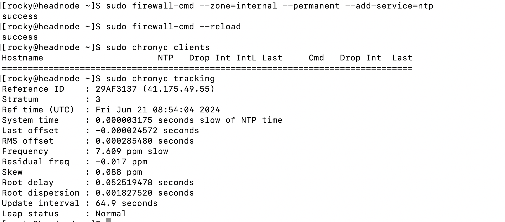</p>


### NTP Client (Compute Node)

1. Install the Chrony software package as shwon on headnode.

2. Edit the file `/etc/chrony.conf`, comment out (add a "#" in front of) all the `pool` and `server` declarations and add this new line to the file:

```bash
server <headnode_ip>
```

3. Restart the chronyd service as above.

4. Enable the chronyd service as above.

Check `chronyc clients` on the head node to see if the compute node is connected and getting information from the head node.


***add picture of ntp clients on headnode*** 


## Network File System

Network File System (NFS) enables you to easily share files and directories over the network. NFS is a distributed file system protocol that we will use to share files between our nodes across our private network. It has a server-client architecture that treats one machine as a server of directories, and multiple machines (clients) can connect to it.

This tutorial will show you how to export a directory on the head node and mount it through the network on the compute nodes. With the shared file system in place it becomes easy to enable **public key based ssh authentication**, which allows you to ssh into all the computers in your cluster without requiring a password.

### NFS Server (Head Node)

The head node will act as the NFS server and will export the `/home/` directory to the compute node. The `/home/` directory contains the home directories of all the the non-`root` user accounts on most default Linux operating system configurations. For more information read the this link https://docs.rockylinux.org/guides/file_sharing/nfsserver/  


1. NFS requires two services to function:
        The network service (of course)
        The rpcbind service

2. Install the NFS service on the head node:

```bash
sudo dnf install nfs-utils
```


3. Check the status of the rpcbind services:

```bash
sudo sudo systemctl status rpcbind
```


 4. Verify the version of NFS installation.

```bash
sudo cat /proc/fs/nfsd/versions 
 -2 +3 +4 +4.1 +4.2
```

 *** NFS versions 3 and 4 are enabled by default, and version 2 is disabled. NFSv2 is pretty old and outdated, and hence you can see the -ve sign in front of it.** 
 
 
5. NFS shares (directories on the NFS server) are configured in the `/etc/exports` file. Here you specify the directory you want to share, followed by the IP address or range you want to share to and then the options for sharing. We want to export the `/home` directory, so edit `/etc/exports` and add the following:

```conf
 /home    10.100.50.0/24(rw,async,no_subtree_check,no_root_squash) 
```


    Let us go through all the options for NFS exports.
       - rw - gives the client machine read and write access on the NFS volume.
        - async - this option forces NFS to write changes to the disk before replying. This option is considered more reliable. However, it also reduces the speed of file operations.

        - no_subtree_check - this option prevents subtree checking, a process where the host must check whether the file is available along with permissions for every request. It can also cause issues when a file is renamed on the host while still open on the client. Disabling it improves the reliability of NFS.

        - no_root_squash - By default, NFS translates requests from a root user on the client into a non-privileged user on the host. This option disables that behavior and should be used carefully to allow the client to gain access to the host.


6. Start and enable the `nfs-server` service using `systemctl`.

```bash
   sudo systemctl enable --now nfs-server rpcbind
```


7. NFS on Rocky Linux makes use of three different services, and they all need to be allowed through your firewall. You can add these rules with firewall-cmd:

```bash
   sudo firewall-cmd --add-service={nfs,mountd,rpc-bind} --permanent
   sudo firewall-cmd --reload
 ```


### NFS Client (Compute Node)

The compute node acts as the client for the NFS, which will mount the directory that was exported from the server (`/home`). Once mounted, the compute node will be able to interact with and modify files that exist on the head node and it will be synchronised between the two.

#### Mounting An NFS Mount

The `nfs-utils, nfs4-acl-tools` packages need to be installed before you can do anything NFS related on the compute node. 

```bash
  sudo dnf install nfs-utils nfs4-acl-tools
 ```

Since the directory we want to mount is the `/home` directory, the user can not be in that directory.


1. Mount the /home directory from the head node using the `mount` command:

 ```bash
   sudo mount -t nfs <headnode_ip_or_hostname>:/home /home
 ```

2. Once done, you can verify that the `/home` directory of the head node is mounted by using `df -h`:

```bash
    df -h
```


With this mounted, it effectively replaces the `/home` directory of the compute node with the head node's one until it is unmounted. To verify this, create a file on the compute node's `rocky` user home directory (`/home/rocky`) and see if it is also automatically on the head node. If not, you may have done something wrong and may need to redo the above steps!

#### Making The NFS Mount Permanent

Using `mount` from the command line will not make the mount permanent. It will not survive a reboot. To make it permanent, we need to edit the `/etc/fstab` file on the compute node. This file contains the mappings for each mount of any drives or network locations on boot of the operating system.

1. First we need to unmount the mount we made:

```bash
     sudo umount /home
```

2. Now we need to edit the `/etc/fstab` file and add this new line to it (be careful not to modify the existing lines!):


```bash
   headnode.cluster.scc:/home    /home     nfs auto,nofail,noatime,nolock,tcp,actimeo=1800,intr    0 0
```

 The structure is: `<host>:<filesystem_dir> <local_location> <filesystem_type> <filesystem_options> 0 0`. The last two digits are not important for this competition and can be left at 0 0.

For the description of nfs options listed above see the link: https://cheatography.com/baa/cheat-sheets/fstab-nfs/#google_vignette

3. With this done, we can mount the new `/etc/fstab` entry:

```bash
 sudo mount -a 
```

4. Once again, you can verify that the `/home` directory of the head node is mounted by using `df -h`:

```bash
    df -h
```


### Passwordless SSH

When managing a large fleet of machines or even when just logging into a single machine repeatedly, it can become very time consuming to have to enter your password repeatedly. Another issue with passwords is that some services may rely on directly connecting to another computer and can't pass a password during login. To get around this, we can use [public key based authentication](https://www.ssh.com/academy/ssh/public-key-authentication) for passwordless login.


1. Generate an SSH key-pair for your user. This will create a public and private key for your user in `/home/<username>/.ssh`. The private key is your identity and the public key is what you share with other computers.

```bash
   ssh-keygen
   #press enter on all prompt
```

<p align="center"></p>

2. Copy the public key generated by `ssh-keygen` into the `authorized_keys` file in the same directory.

```bash
    [rocky@headnode ~]$ cd ~/.ssh
    [rocky@headnode .ssh]$ cat id_rsa.pub > authorized_keys
```

Since your `/home` directory is shared with your compute node, this will look the same on the compute node.

3. SELinux, the security engine, may complain about permissions for this directory if you try to use public key authentication now. To fix this, run the following commands:

 ```bash
    [rocky@headnode ~]$ chmod 700 ~/.ssh/
    [rocky@headnode ~]$ chmod 600 ~/.ssh/authorized_keys
    [rocky@headnode ~]$ sudo restorecon -R -v ~/.ssh
```

4. SSH to the **compute node** passwordless If you are prompted with a password it means that something is not set up correctly. 
run the following command:

```bash
    [rocky@computenode ~]$ sudo setsebool -P use_nfs_home_dirs 1
```

5. Exit **back to the head node**
6. You can do the same thing for passwordless login from compute node to headnode 


### Understanding `~/.ssh/authorized_keys`

How this works is that you copy the public key to the computer that you want to connect to without a password `authorized_keys` file. When you SSH to the machine that you copied your public key to, the `ssh` tool will send a challenge that can only be decrypted if the target machine has the public key and the local machine has the private key. If this succeeds, then you are who you say you are to the target computer and you do not require a password. [Please read this for more detailed information](https://www.ssh.com/academy/ssh/public-key-authentication).

### User Permissions and Ownership
> **! >>> `chmod` and `chown` are Linux permission and ownership modification commands. To learn more about these commands and how they work, please go to the following link: [https://www.unixtutorial.org/difference-between-chmod-and-chown/](https://www.unixtutorial.org/difference-between-chmod-and-chown/).**


## User Account Management

In enterprise systems and HPC, it's common to manage user accounts from one central location. These network accounts are then synchronised to the machines in your fleet via the network. This is done for safely, security and management purposes.

When creating a user account locally on a Linux operating system, it's provided with a user ID (uid) and a group ID (gid). These are used to tell the operating system which user this is and which groups of permissions they belong to. When you create a user with the default settings of the built-in user creation tools, it will generally increment on from the last UID used. This can be different for different systems. If UID/GID numbers do not match up across the nodes in your cluster, there can be all sorts of headaches for some of the tools and services that we will set up later in this competition.

We're going to demonstrate some of this.

Right now you have one user: `root`. `root` is the default super-user of Linux operating systems. It is all powerful. It is generally **NOT recommended** to operate as `root` for the majority of things you would do on a system. This is to prevent things from going wrong.

When logged in to the head node or compute node, check the UID and GID of `root` by using the `id` command.

```bash
#change to root
sudo su

 id
uid=0(root) gid=0(root) groups=0(root) context=unconfined_u:unconfined_r:unconfined_t:s0-s0:c0.c1023
```

This shows that `root` is the user `0` and it's primary group (GID) is group `0`. It also states that it only belongs to one group, which is the `root` group (`0`).


### Create Team Captain User Account

#### Head Node

Let us now create a user account on the head node:

1. Log into the head node

2. Use the `adduser` command to create a new user called `captain` and then give it a password.

 ```bash
    [root@headnode ~]$ adduser -U -m captain
    [root@headnode ~]$ passwd captain
```

`-U` tells `adduser` to create a group for the user and `-m` means to create the user home directory.

3. Check the ID of the new user

```bash
[root@headnode ~]$ id captain
uid=1000(captain) gid=1000(captain) groups=1000(captain)
```

As you can tell, it has a different ID for the user and group than `root`.

#### Compute Node

Log into the compute node and try to verify that the `captain` user **does NOT exist** there:

```bash
[root@computenode ~]$ id captain
```

You'll be prompted with an error:

```bash
id: ‘captain’: no such user
```

We will now create the same user here. Follow the steps above for creating the `captain` user on the compute node.

#### Super User Access

The `captain` user will not have the privileges to do anything that modify system files or configurations. Many Linux operating systems come with a program called `sudo` which manages and allows normal user accounts to access `root` privileges.

A user is only able to evoke root privileges if their account has been explicitly added to at least one of the following:
- the default sudo users group (the actual term of this group varies across Linux variants, such as **wheel** **sudoers** etc.)
- a newly created sudo users group,
- or, if the user has been explicitly added as a privileged user directly in the Sudo configuration file.


The `sudo` program is controlled by a file located at `/etc/sudoers`. This file specifies which users and/or groups can access superuser privileges. It specifies that the user `root` is allowed to run all actions and any user in the `wheel` group is also allowed to:

```ini
# Allow root to run any commands anywhere
root	ALL=(ALL) 	ALL

# Allows members of the 'sys' group to run networking, software,
# service management apps and more.
 %sys ALL = NETWORKING, SOFTWARE, SERVICES, STORAGE, DELEGATING, PROCESSES, LOCATE, DRIVERS

# Allows people in group wheel to run all commands without a password
%wheel	ALL=(ALL)	ALL  NOPASSWD: ALL
```

To avoid modifying `/etc/sudoers` directly, we can just add `captain` to the `wheel` group.

**On each of your nodes**, add the `captain` user to the `wheel` group:

```bash
 [root@node ~]$  usermod -aG wheel captain 
```

Now log out and then log back into your node as `captain`. You can use `sudo` one of two ways:

1. To become a `root` user:

```bash
    [centos@headnode ~]$ sudo su
```

2. To run a command with superuser privileges:

 ```bash
    [centos@headnode ~]$ sudo <command>
```

> **! >>> From now on, you should use the `captain` user for all the configuration you can and should avoid logging in as the `root` user.**

<div style="page-break-after: always;"></div>


### Out-Of-Sync Users and Groups

When managing a large cluster of machines, it gets really complicated to manage user ID and group ID mappings. With things like shared file systems (e.g. NFS), if user account names are the same, but IDs don't match across machines then we get permission problems. 

If users are created out-of-sync across the cluster then this becomes a problem very quickly. Let us take Alice and Bob for example:

1. Alice and Bob are both system administrators working on a cluster.
2. There is no central authentication and user/group accounts are made manually.
3. Alice creates a user `alice` on the head node using the `adduser` command listed in this tutorial.
4. While Alice does this, Bob creates user `bob` on the compute node in the same way.
5. Alice then creates user `alice` on the compute node.
6. Bob creates `bob` on the head node.

Even though the names are the same:

- `alice` on the **head node** has a UID/GID of `1000`/`1000`
- `bob` on the **head node** has a UID/GID of `1001`/`1001`
- `alice` on the **compute node** has a UID/GID of `1001`/`1001`.
- `bob` on the **compute node** has a UID/GID of `1000`/`1000`.

These do not match, so if Alice wants to create a file on the head node and access that file on the compute node she will get permission errors as `1000` is not the same as `1001`.

User- and group- names do not matter to Linux, only the numerical IDs. Let us demonstrate this now.

#### Head Node

1. Create a new user on the head node, let's call it `outofsync`. If you check it's IDs with `id outofsync`, you should see it belongs to UID/GID `1001`. 

2. Set the password for this user and log in as this user.

3. Create a file in the home directory of `outofsync` (`/home/outofsync`) called `testfile.txt` and put some words in it.

#### Compute Node

1. Create a new user on the compute node called `unwittinguser`. If you check the ID of this user, you will see that `unwittinguser` has UID/GID of `1001`.

2. Create a new user on the compute node called `outofsync`. If you check the ID of this user, you will see that `outofsync` has UID/GID of `1002`.

3. Set the password for the `outofsync` user.

4. Log into the compute node as `outofsync`.

5. You will see that the terminal complains about permission errors and that you aren't logged into the user's home directory.

6. You will not be able to read the `testfile.txt` file in `/home/outofsync/testfile.txt` if you tried.

This happens because you have an NFS mount for `/home`, replacing (while mounted) the compute node's `/home` with the head node's `/home` and the UID/GID for `outofsync` on the compute node does not match the one on the head node.

Check `ls -ln /home/outofsync` on the **head node** and you'll see that the `testfile.txt` belongs to `1001`, not `1002`.

<span id="fig3" class="img_container center" style="font-size:8px;margin-bottom:0px; display: block;">
    
    <span class="img_caption" style="display: block; text-align: center; margin-left: auto;
    margin-right: auto; width: 45%;"><i>Figure 3: The head node's `testfile.txt` is owned by user 1001, which is user `outofsync` on the head node.</i></span>
</span>

#### Clean Up

**Before proceeding, you must delete the users that you have created on the machines.**

To delete a user you can use the command below:

```bash
sudo userdel -r <username>
```

Do this command for:

- `outofsync` on the head node.
- `unwittinguser` on the compute node.
- `outofsync` on the compute node.


## Ansible User Declaration

Ansible is a powerful configuration management tool used for automating the deployment, configuration, and management of software systems. It allows you to control many different systems from one central location. 

In this tutorial we will install ansible and use it to automate the creation of user accounts as well a other system task 

### Installing and Configuring Ansible
Prerequisites :
 1. ansible control host should be able connect to ansible clients over SSH preferably passwordless,
 2. via a user account with sudo or root privileges 
 3. atleast one ansible client

#### Installing ansible 
1. Ensure that the Rocky Linux 9 EPEL repository is installed using `dnf`:

```bash
sudo dnf install epel-release
```

2. Once the repository is install ansible 

```bash
sudo dnf install ansible
```

#### configuring ansible 

1. setup ansible host file  with hosts/client machines ansible should connect to, add all hosts to `/etc/ansible/hosts` file. The file has a lot of example to help you learn ansible configurations 

```bash
#open ansible host file 
sudo vi /etc/ansible/hosts

#add ansible hosts/clients under servers group
[servers]
compute1 ansible_ssh_host=10.100.50.5
compute2 ansible_ssh_host=10.100.50.10

```
The servers is a group_name tag that lets you refer to any host (ansible clients) listed under it with one word. 

2. setup a ansible user with sudo or root privileges that ansible will use to execute ansible tasks and connect with other ansible clients, the user must also exist on all ansible clients on ansible hosts under `servers` group

create a directory `group_vars` under ansible configuration structure `/etc/ansible` for creating YAML-formatted config files for each group you want to configure  

```bash
sudo mkdir /etc/ansible/group_vars

#create a servers file for configuring servers in the ansible hosts file 
vi mkdir /etc/ansible/group_vars/servers
```

Add the following code to the file. YAML files start with ---

```text
---
ansible_ssh_user: ansibe_user
```

save and exit the file. In vi, you can do this by pressing ESC and then :x.
If the user you are currenlty logged in as has sudo privileges and exists on all ansible hosts then there no need to do number 2.  

3. test ansible if ansible control host can access all clients hosts under group servers in the ansible host file 

```bash
#access as a group 
ansible -m ping servers 

#access as an individual host
ansible -m ping compute

#run command on hosts 
ansible -m shell -a 'free -m' compute
```
<p align="center"></p>

<p align="center">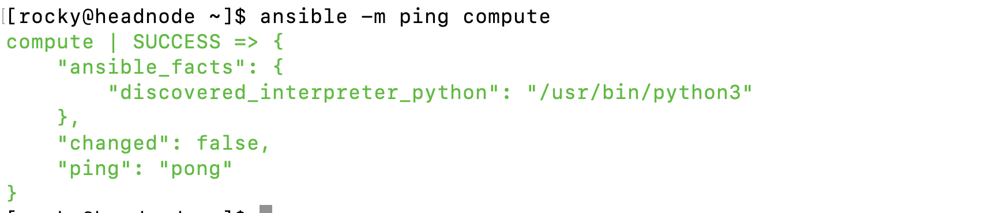</p>

<p align="center">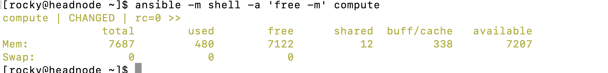</p>


### Create Team Member Accounts
We will use ansible to create user accounts on remote ansible clients, to achive this we need to create ansible YML scripts called `ansible playbooks` used for automating admin tasks. 

In this section you will learn to:
Create a playbook that will perform the following actions on all Ansible hosts/clients:
    1. Create a new sudo user and granting sudo priviledges.
    2. Copy a local SSH public key and include it in the `authorized_keys` file for the new administrative user on the remote host.


1. Create an ansible working directory in your `/home/rocky`, this is where all ansible playbooks will reside.

```bash
#create the ansible playbooks directory
sudo mkdir -p /home/rocky/ansible/playbooks

#creating the sudo users ansible playbook script, 
vi /home/rocky/ansible/playbooks/sudo_users.yml

# add the below content
---
- hosts: all
  become: true
  vars:
    created_username: team_lead

```

The above says in `all hosts` create user team_lead, `become` states whether commands are done with sudo priviledges. `var` stores data in variables so that you only edit that line when you decide to change 

Granting user team_lead with sudo privileges by adding:

```bash

# create user team_lead, execute tasks to grand sudo priviledge 
---
- hosts: all
  become: true
  vars:
    created_username: team_lead
  
  tasks:
    - name: create user with sudo priviledges 
      user: 
        name: "{{ created_username }}"
        state: present 
        groups: wheel
        append: true
        create_home: true 
    
    - name: Set authorized key for remote user
      ansible.posix.authorized_key:
        user: "{{ created_username }}"
        state: present
        key: "{{ lookup('file', lookup('env','HOME') + '/.ssh/id_rsa.pub') }}"
     
```

Run the playbook script 

```bash
ansible-playbook /home/rocky/ansible/playbooks/sudo_users.yml -l servers
```

<p align="center">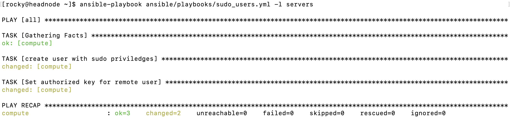</p>

Verify user `team_lead` was created and on compute node and it on wheel group 

<p align="center">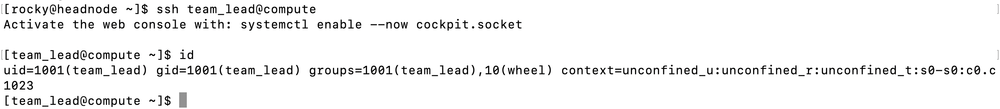</p>


# Remote Access to Your Cluster and Tunneling

## Local Port Forwarding

## Dynamic Port Forwarding
### Web Browser and SOCKS5 Proxy Configuration

## WirGuard VPN Cluster Access

## ZeroTier

## X11 Forwarding


#### Dynamic SSH Tunnel

The FreeIPA web interface is hosted on the head node and available on port `443 (https)`. You won't be able to access this interface using the SSH Tunnel technique described in [Part 1](#part-1---remote-web-service-access)), as when you enter the address to access the forwarded port (something like http://127.0.0.1:1234) FreeIPA's web interface will automatically redirect you to `https://headnode.cluster.scc`. Since `headnode.cluster.scc` (or whatever your head node name is), does not exist on your local network at home, this will result in your browser telling you that it can't find that server.

We'll need to use a **dynamic SSH tunnel** ([SOCKS proxy](https://en.wikipedia.org/wiki/SOCKS)) to get around this. This allows SSH to forward **ALL remote (target) port traffic** to and from a port on your local machine, and can include remote DNS.

0. First, open two terminals on your personal computer.

1. In terminal one, type:

    ```bash
    ssh -L 1234:<headnode_ip>:22 <team_name>@ssh.ace.chpc.ac.za
    ```

    And sign in with your team password.

2. Leave that terminal open, go to the second terminal and type:

    ```bash
    ssh -p 1234 -D 1235 centos@127.0.0.1
    ```

    The `-p 1234` tells `ssh` to use `1234` as the SSH port instead of the default `22`.
    The `-D 1235` tells `ssh` to open `1235` on your local computer for sending and receiving all port traffic to and from the target machine (`127.0.0.1:1234`, which in this case is `<headnode_ip>:22` because of the `-L`.)

You are essentially **hopping through** `ssh.ace.chpc.ac.za` into your head node directly.

**Windows user with PuTTY, please read the following PDF: https://webdevolutions.blob.core.windows.net/blog/pdf/how-to-configure-an-ssh-tunnel-on-putty.pdf. Please refer to Step 4.**

#### Firefox and Proxy Configuration

The Firefox browser will allow the easiest proxy configuration. Please download and install Firefox from here: [https://www.mozilla.org/en-US/firefox/download/](https://www.mozilla.org/en-US/firefox/download/).

Once downloaded and opened, go to the `three line menu` at the top right and click on `Preferences`. In the `Find in Preferences` search bar type "proxy" and click `Settings` next to the **Network Settings** option.

<span id="fig1" class="img_container center" style="font-size:8px;margin-bottom:0px; display: block;">
    
    <span class="img_caption" style="display: block; text-align: center; margin-left: auto;
    margin-right: auto; width: 45%;"><i>Figure 4: The Network Settings section of the Firefox Preferences.</i></span>
</span>

In this pop-up, change The proxy setting to `Manual Proxy Configuration` and delete `HTTP Proxy`, `HTTPS Proxy` and `FTP Proxy` and set their port numbers to `0`. 

In `SOCKS Host` enter `127.0.0.1` and for the port enter `1235`.

Select `SOCKS v5` and **tick on** `Proxy DNS when using SOCKS v5`.

Now click `OK` and open a new tab in Firefox.

Now you can enter https://headnode.cluster.scc/ipa/ui in your browser and you'll get access to the FreeIPA Web interface. With this, you can log in using the FreeIPA admin user and password.

> **! >>> Keep both of the SSH sessions open while you use the proxy on Firefox**

> **! >>> Remember to set your proxy settings back to `No Proxy` if you want to use your own local internet on Firefox.**

#### Creating a User

With the proxy up and set in Firefox, go to https://headnode.cluster.scc/ipa/ui and log in with the `admin` user and the password you set up for **IPA admin password**.

Once logged in, you'll see that by default there is an `admin` user with some UID assigned to it. We can ignore this user for now. 

We need to do two things here:

- Create a group and give it superuser permissions.
- Create a user to replace the `centos` user.
- Add the new user to the above mentioned group.

##### Creating the Group

1. In the main menu, click "Groups".

2. Under "User Groups", click "+ Add" and name the group "sysadmin" (short for systems administrator, that's what you are!).

3. Click "Add" at the bottom.

4. Now at the top, click the "Policy" button and go to the "Sudo" -> "Sudo Rules" section.

5. Click "+ Add", name it "sysadmin sudo" and click "Add and Edit".

6. Click "+ Add" next to "User Groups" under **"Who"**, tick the "sysadmin" group, click the `>` arrow and click "Add".

7. 8. Click the "Any Host" button under **"Run Commands"**.


8. Click the "Any Command" button under **"Run Commands"**.

9. Click the "Anyone" and "Any Group" buttons under **"As Whom"**.

10. Click the "Save" button at the top of the page (under "Settings").

##### Creating the Users

Make sure that you go back to the main menu by clicking the "Identity" button.

1. In the main menu, click the "+ Add" button on the top right.

2. Create a user account for each of your team members (one at a time).
    - Give the user a user name (User login). Make it the first letter of their first name followed by the full surname. As an example: if your name is Bob John, you could make it bjohn.
    - Enter the first and last name in the boxes.
    - Specify a new password and repeat that in the "verify password" box (this is a temporary password and you will be requested to change it on login.)
    - Leave everything else empty.
    - Click "Add and Edit" at the bottom.

3. Click User Groups, "+ Add" and add the "sysadmin" group to the user. Click "Add". 

4. Repeat the above 1-3 for each user in your team.

You should now be able able to log into your user accounts and access root. Please use your own account when interacting with the cluster going forward. **You may need to repeat the ssh keypair-based authentication for your users in order to log in to the compute node without a password, test it first.**
