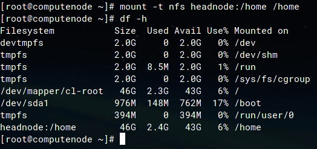
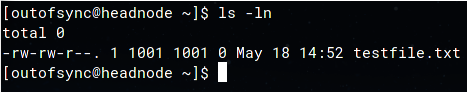
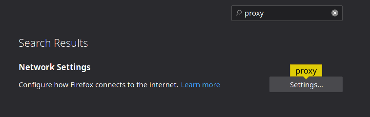

Tutorial 2: Standing Up a Compute Node and Configuring Users and Services
=========================================================================

# Table of Contents

<!-- markdown-toc start - Don't edit this section. Run M-x markdown-toc-refresh-toc -->
1. [Checklist](#checklist)
1. [Spinning Up a Compute Node in OpenStack](#spinning-up-a-compute-node-in-openstack)
   1. [Compute Node Considerations](#compute-node-considerations)
1. [Accessing Your Compute Node](#accessing-your-compute-node)
   1. [IP Addresses and Routing](#ip-addresses-and-routing)
   1. [Command Line Proxy Jump Directive](#command-line-proxy-jump-directive)
   1. [Permanent `~/.ssh/config` Configuration](#permanent-sshconfig-configuration)
   1. [Verifying Networking Setup](#verifying-networking-setup)
      1. [Head Node](#head-node)
      1. [Compute Node](#compute-node)
1. [Configuring a Basic Stateful Firewall NFTABLES](#configuring-a-basic-stateful-firewall-nftables)
1. [Network Time Protocol](#network-time-protocol)
   1. [NTP Server (Head Node)](#ntp-server-head-node)
   1. [NTP Client (Compute Node)](#ntp-client-compute-node)
1. [Network File System](#network-file-system)
   1. [NFS Server (Head Node)](#nfs-server-head-node)
   1. [NFS Client (Compute Node)](#nfs-client-compute-node)
      1. [Mounting An NFS Mount](#mounting-an-nfs-mount)
      1. [Making The NFS Mount Permanent](#making-the-nfs-mount-permanent)
   1. [Passwordless SSH](#passwordless-ssh)
1. [User Account Management](#central-user-management)
   1. [Create Team Captain Account](#create-team-captain-account)
      1. [Super User Access](#super-user-access)
   1. [Out-Of-Sync Users and Groups](#out-of-sync-users-and-groups)
      1. [Example of _BAD_ Users on Nodes]
      1. [Clean Up](#clean-up)
   1. [Ansible User Declaration](#ansible-user-declaration)
      1. [Create Team Member Accounts]()
1. [WireGuard VPN Cluster Access]()
   1. [(Delete)FreeIPA ](#deletefreeipa-img-srcresourcesfreeipapng-width21-)
      1. [FreeIPA Server (Head Node)](#freeipa-server-head-node)
      1. [FreeIPA Client (Compute Node)](#freeipa-client-compute-node)
      1. [FreeIPA Web Interface](#freeipa-web-interface)
         move to tut 4
         1. [Dynamic SSH Tunnel](#dynamic-ssh-tunnel)
            1. [Firefox and Proxy Configuration](#firefox-and-proxy-configuration)
            1. [Creating a User](#creating-a-user)
               1. [Creating the Group](#creating-the-group)
               1. [Creating the Users](#creating-the-users)

TODO: give a primer on shell scripting and history bash etc..

<!-- markdown-toc end -->

# Checklist

TODO: Fix checklist

This tutorial will demonstrate how to access web services that are on your virtual cluster via the web browser on your local computer. It will also cover basic authentication and central authentication.

<u>In this tutorial you will:</u>

- [ ] Install a web server.
- [ ] Create an SSH tunnel to access your web service.
- [ ] Create new local user accounts.
- [ ] Add local system users to sudoers file for root access.
- [ ] Share directories between computers.
- [ ] Connect to machines without a password using public key based authentication.
- [ ] Install and use central authentication.

# Spinning Up a Compute Node in OpenStack

play around

scripting and automation to test out differnet configurations

As previously discussed in [Tutorial 1: OpenStack Flavors](../tutorial1/README.md#openstack-instance-flavors), an important aspect of system administration is resource monitoring, management and utilization. Once you have successfully stood up your head node, your team will need to plan and manage the resources remaining which will be available for your compute node(s).

You would have seen in [Tutorial: Head Node Resource Allocations](../tutorial1/README.md#head-node-resource-allocations), that there are a number of potentially _(in)_valid configurations that you can utilize for your cluster design.

> [!TIP]
> You are encourage to **strongly** encouraged to automate the deployment, installation and configuration of your cluster nodes through the use of either at least basic shell scripts or more advanced Ansible playbooks. This will allow you to rapidly experiment with and test the performance of different configurations in order to determine an optimum cluster for the applications you're required to evaluate.

## Compute Node Considerations

While the head node is responsible for administrative and management related tasks, such as authenticating user logins into the cluster, managing services, hosting a network file system, workload management and load balancing, compute nodes are responsible executing compute intensive tasks.

Sensible default Instance Flavors have already been identified and configured for you. The choice your team made for your head node will determine and inform sensible decisions for the compute node(s) instance flavors.

# Accessing Your Compute Node


## IP Addresses and Routing
## Command Line Proxy Jump Directive
## Permanent `~/.ssh/config` Configuration
## Verifying Networking Setup

You have been assigned IP addresses for your VMs. To identify these, go to the OpenStack user interface and navigate to `Compute -> Instances`. In the list of virtual machines presented to you, click the name of the virtual machine instance, and navigate to the "**Interfaces**" tab (refer to [Figure 4.1 below](#fig4.1)). This list contains the IP addresses assigned to each of your VM network interfaces.

For example, if you have `enp3s0` and `enp4s0`, then you should see two IP addresses listed in the OpenStack interface, such as `10.128.24.x` and `10.0.0.x`. **You absolutely have to use the correct IP addresses for the correct interfaces, as your network may not work if you do not.**

<span id="fig4.1" class="img_container center" style="font-size:8px;margin-bottom:20px; display: block;">
    
    <span class="img_caption" style="display: block; text-align: center;margin-top:5px;"><i>Figure 4.1: The IP addresses assigned to your interfaces for inside of your VM.</i></span>
</span>

You can verify which network interface you are modifying by corroborating the [MAC-Address](https://en.wikipedia.org/wiki/MAC_address) from the `ip a` command (in your VM instances) and from those listed in OpenStack (refer to [Figure 4.2 below](#fig4.2)).

<span id="fig4.2" class="img_container center" style="font-size:8px;margin-bottom:20px; display: block;">
    
    <span class="img_caption" style="display: block; text-align: center;margin-top:5px;"><i>Figure 4.2: The MAC addresses assigned to your interfaces for inside of your VM.</i></span>
</span>

**CentOS 8** uses `Network Manager` (**NM**) to manage network settings. `Network Manager` is a service created to simplify the management and addressing of networks and network interfaces on Linux machines.

p### Head Node

For the **head node**, create a new network definition using the `nmtui` graphical tool using the following steps:

0. First we must make sure that our network interfaces are managed by `Network Manager`. By default, this should already be the case. Use the following command to check if the network interfaces are managed:

    ```bash
    ~$ nmcli dev
    ```

    You should see something **other than "unmanaged"** next to each of the interfaces (excluding `lo`). If any of your network interfaces (other than `lo`) say "unmanaged", do the following:


    ```bash
   ~$ nmcli dev set <interface> managed yes
    ```

1. The `nmtui` tool is a console-graphical tool used to set up and manage network connections for `Network Manager`.

    ```bash
    ~$ nmtui
    ```

2. You'll be presented with a screen, select `Edit a connection`, followed by `<Add>` and then `Ethernet`.

3. For **Profile Name**, type the name of the interface you want to assign an IP address to, like `enp3s0` or `enp4s0`, and type the same thing for **Device** (in this instance, **Device** means **interface**).

4. For **IPv4 CONFIGURATION**, change `<Automatic>` to `<Manual>`. This tells NM that we want to assign a static IP address to the connection. Hit enter on `<Show>` to the right of **IPv4 CONFIGURATION** and enter the following information:

    - **Addresses**: Hit `<Add>` and enter the IP address (found in OpenStack) for this interface. After the IP address, add the text "/24" to the end. It should read as `<ip_address>/24` with no spaces. The "/24" is the subnet mask of the IP address in [CIDR notation](#part-1---accessing-the-cloud).
    - **Gateway**: Enter the gateway address here. This will be the ACE Lab gateway for the external network of the head node.
    - **DNS servers**: Hit `<Add>` and enter `8.8.8.8`. This is the public DNS server of Google and is used to look up website names. (**NB: DNS is explained later!**)

5. Hit `<OK>` at the bottom of the screen.

6. _Repeat the above processes for any other network interface you want to give an IP address to, if there are more on your machine (you can use `ip a` to check how many there are)._

7. The networks should now be active. You can confirm this by going `<Back>` and then to `Activate a connection`. If you see stars to the left of each of the networks that you have created, then the networks are active. If not, hit enter on the selected network to active it.

8. Your **head node** should now have the correct IP addresses. Exit `nmtui` and check the networking setup is correct. To do so, use the following commands:

    ```bash
    ~$ ip a
    ~$ ip route
    ```

    - `ip a` will show you the interfaces and their assigned IP addresses.
    - `ip route` will list the interfaces and their assigned routes.

### Compute Node

You must also set the static IP addressing for all other nodes in your cluster. In order to explore different options for doing so, please use the `nmcli` command. This is the command-line interface (CLI) for `Network Manager`, which is an alternative to the above `nmtui`, which is simply a graphical wrapper for the CLI.

Please look at the following website in order to get the commands that you will need to create a static IP address network connection using the CLI: [https://docs.fedoraproject.org/en-US/Fedora/25/html/Networking_Guide/sec-Connecting_to_a_Network_Using_nmcli.html](https://docs.fedoraproject.org/en-US/Fedora/25/html/Networking_Guide/sec-Connecting_to_a_Network_Using_nmcli.html). Follow the **Adding a Static Ethernet Connection** section. **Note that the IP addresses used in this web guide will not be the same as the ones that you need to use for your node(s) and some of the commands may not be relevant to you.**

At this point you should test connectivity between your nodes. Using the `ping` command, you can see whether the nodes can speak to each other via the network. From your head node, try to ping your compute node:

```bash
~$ ping <compute_node_ip>
```

If you get a timeout, then things are not working. Try to check your network configurations again.

_**Please read [what-is-ip-routing](https://study-ccna.com/what-is-ip-routing/) to gain a better understanding of IP routing.**_ This will be impoortant for the rest of this competition and can help your understanding when debugging issues.

<div style="page-break-after: always;"></div>


# Local User Account Management

In enterprise systems and HPC, it's common to manage user accounts from one central location. These network accounts are then synchronised to the machines in your fleet via the network. This is done for safely, security and management purposes.

When creating a user account locally on a Linux operating system, it's provided with a user ID (uid) and a group ID (gid). These are used to tell the operating system which user this is and which groups of permissions they belong to. When you create a user with the default settings of the built-in user creation tools, it will generally increment on from the last UID used. This can be different for different systems. If UID/GID numbers do not match up across the nodes in your cluster, there can be all sorts of headaches for some of the tools and services that we will set up later in this competition.

We're going to demonstrate some of this.

Right now you have one user: `root`. `root` is the default super-user of Linux operating systems. It is all powerful. It is generally **NOT recommended** to operate as `root` for the majority of things you would do on a system. This is to prevent things from going wrong.

When logged in to the head node or compute node, check the UID and GID of `root` by using the `id` command.

```bash
~$ id
```

You should see something like the following:

```bash
uid=0(root) gid=0(root) groups=0(root) context=unconfined_u:unconfined_r:unconfined_t:s0-s0:c0.c1023
```

This shows that `root` is the user `0` and it's primary group (GID) is group `0`. It also states that it only belongs to one group, which is the `root` group (`0`).

## Create Team User Account

### Head Node

Let us now create a user account on the head node:

1. Log into the head node

2. Use the `adduser` command to create a new user called `centos` and then give it a password.

    ```bash
    [root@headnode ~]$ adduser -U -m centos
    [root@headnode ~]$ passwd centos
    ```

    `-U` tells `adduser` to create a group for the user and `-m` means to create the user home directory.

3. Check the ID of the new user

    ```bash
    [root@headnode ~]$ id centos
    ```

    You'll see something like the following:

    ```bash
    uid=1000(centos) gid=1000(centos) groups=1000(centos)
    ```

    As you can tell, it has a different ID for the user and group than `root`.

### Compute Node

Log into thetest compute node and try to verify that the `centos` user **does NOT exist** there:

```bash
[root@computenode ~]$ id centos
```

You'll be prompted with an error:

```bash
id: ‘centos’: no such user
```

We will now create the same user here. Follow the steps above for creating the `centos` user on the compute node.

### Super User Access

The `centos` user will not have the privileges to do anything that modify system files or configurations. Many Linux operating systems come with a program called `sudo` which manages and allows normal user accounts to access `root` privileges.

A user is only able to evoke root privileges if their account has been explicitly added to at least one of the following:
- the default sudo users group (the actual term of this group varies across Linux variants, such as **wheel** **sudoers** etc.)
- a newly created sudo users group,
- or, if the user has been explicitly added as a privileged user directly in the Sudo configuration file.


The `sudo` program is controlled by a file located at `/etc/sudoers`. This file specifies which users and/or groups can access superuser privileges. In this file for a default **CentOS 8** installation, it specifies that the user `root` is allowed to run all actions and any user in the `wheel` group is also allowed to:

```ini
# Allow root to run any commands anywhere
root	ALL=(ALL) 	ALL

# Allows members of the 'sys' group to run networking, software,
# service management apps and more.
 %sys ALL = NETWORKING, SOFTWARE, SERVICES, STORAGE, DELEGATING, PROCESSES, LOCATE, DRIVERS

# Allows people in group wheel to run all commands
%wheel	ALL=(ALL)	ALL
```

To avoid modifying `/etc/sudoers` directly, we can just add `centos` to the `wheel` group.

**On each of your nodes**, add the `centos` user to the `wheel` group:

```bash
[root@node ~]$ gpasswd -a centos wheel
```

Now log out and then log back into your node as `centos`. You can use `sudo` one of two ways:

1. To become the `root` user:

    ```bash
    [centos@headnode ~]$ sudo su
    ```

2. To run a command with superuser privileges:

    ```bash
    [centos@headnode ~]$ sudo <command>
    ```

`sudo` will prompt you for the `centos` user password when you run it.

> **! >>> From now on, you should use the `centos` user for all the configuration you can and should avoid logging in as the `root` user.**

<div style="page-break-after: always;"></div>

# Configuring a Basic Stateful Firewall NFTABLES

`Firewalld` is a firewall management daemon (service) available for many Linux distributions which acts as a front-end for the `iptables` packet filtering system provided by the Linux kernel. This daemon manages groups of rules using entities called “zones”. **CentOS 8** comes pre-configured with `firewalld`.

**NOTE:** Only your head node has an interface (on the `10.128.24.0/24` network) that can access the internet. Therefore, you will need to **setup NAT on your head node** to allow your compute node to access the internet via your head node (this effectively treats your head node as a router). Please note that the "external" zone on `firewalld` is configured for **IP masquerading** ([click here to learn more about IP masquerading](https://tldp.org/HOWTO/IP-Masquerade-HOWTO/ipmasq-background2.1.html)) so that your internal network remains private but reachable.

**On the head node**, ensure your **external interface** is assigned to the appropriate zone:

```bash
~$ nmcli c mod <external_interface> connection.zone external
```

Then do the same for the internal interface:

```bash
~$ nmcli c mod <internal_interface> connection.zone internal
```

You can now use `firewalld` to allow the head node to act as a router for the compute node.

```bash
~$ firewall-cmd --zone=external --add-masquerade --permanent
~$ firewall-cmd --reload
```

Confirm that **IP forwarding** is enabled on the head node with the following:

```bash
~$ cat /proc/sys/net/ipv4/ip_forward
```
It should return a `1`.

You can then add the individual firewall rules needed:

```bash
~$ firewall-cmd --permanent --direct --add-rule ipv4 nat POSTROUTING 0 -o <external_interface> -j MASQUERADE
~$ firewall-cmd --permanent --direct --add-rule ipv4 filter FORWARD 0 -i <internal_interface> -o <external_interface> \
      -j ACCEPT
~$ firewall-cmd --permanent --direct --add-rule ipv4 filter FORWARD 0 -i <external_interface> -o <internal_interface> \ 
      -m state --state RELATED,ESTABLISHED -j ACCEPT
```

To validate that your **NAT** rules are working properly, **log into your compute node** and test if you can `ping` the ACE Lab gateway and an external server on the internet.

```bash
~$ ping 10.128.24.1   ACE Lab gateway IP address
~$ ping 8.8.8.8       Google external DNS server
```

Once you can ping the servers by their IPs, try ping by name - using Domain Name System (DNS) resolution.

```bash
~$ ping google.com
```

If your NAT is working correctly and your compute node's DNS was set correctly with `Network Manager`, you should now be able to ping external servers/websites using their names on all nodes.

> **! >>> Without access to a working DNS server you won't be able to install packages on your compute node (or head node for that matter), even if the internet is otherwise working.**

<div style="page-break-after: always;"></div>


# Network Time Protocol

**NTP** or **network time protocol** enables you to synchronise the time across all the computers in your network. This is important for HPC clusters as some applications require that system time be accurate between different nodes (imagine receiving a message 'before' it was sent).

It is also important that your timezones are also consistent across your machines. Time actions on **CentOS 8** can be controlled by a tool called `timedatectl`. For example, if you wanted to change the timezone that your system is in, you could use `timedatectl list-timezones`, find the one you want and then set it by using `timedatectl set-timezone <timezone>`. `timedatectl` can also set the current time on a local machine and more. 

You will now **setup the NTP service** (through the `chronyd` implementation) on your head node and then connect your compute nodes to it.

## NTP Server (Head Node)

1. Install the Chrony software package using the CentOS package manager, `dnf`:

    ```bash
    [root@headnode ~]$ dnf install chrony
    ```

2. Edit the file `/etc/chrony.conf` and modify the `allow` declaration to include the internal subnet of your cluster (uncomment or remove the "#" in front of `allow` if it's there, otherwise this is ignored).

    ```conf
    allow 10.0.0.0/24
    ```

3. Chrony runs as a service (daemon) and  is included with CentOS 8 so it likely is already running. Restart the chrony daemon with `systemctl`. This will also start it if it was not yet started:

    ```bash
    [root@headnode ~]$ systemctl restart chronyd
    ```

    Ensure that the chrony service is set to start automatically the next time CentOS boots:

    ```bash
    [root@headnode ~]$ systemctl enable chronyd
    ```

4. Add chrony to the firewall exclusion list:

    ```bash
    [root@headnode ~]$ firewall-cmd --zone=internal --permanent --add-service=ntp
    [root@headnode ~]$ firewall-cmd --reload
    ```

You can view the clients that are connected to the chrony server on the head node by using the following command on the head node:

```bash
[root@headnode ~]$ chronyc clients
```

This will show empty until you do the steps below.

## NTP Client (Compute Node)

1. Install the Chrony software package the same way as the head node.

2. Edit the file `/etc/chrony.conf`, comment out (add a "#" in front of) all the `pool` and `server` declarations and add this new line to the file:

    ```conf
    server <head_node_ip>
    ```

3. Restart the chronyd service as above.

4. Enable the chronyd service as above.

Check `chronyc clients` on the head node to see if the compute node is connected and getting information from the head node.

<span id="fig5" class="img_container center" style="font-size:8px;margin-bottom:20px; display: block;">
    
    <span class="img_caption" style="display: block; text-align: center;margin-top:5px;margin-top:5px;"><i>Figure 5: The compute node (chrony client) is a client of the head node (chrony server).</i></span>
</span>


# Network File System

Network File System (NFS) enables you to easily share files and directories over the network. NFS is a distributed file system protocol that we will use to share files between our nodes across our private network. It has a server-client architecture that treats one machine as a server of directories, and multiple machines (clients) can connect to it.

This tutorial will show you how to export a directory on the head node and mount it through the network on the compute nodes. With the shared file system in place it becomes easy to enable **public key based ssh authentication**, which allows you to ssh into all the computers in your cluster without requiring a password.

## NFS Server (Head Node)

The head node will act as the NFS server and will export the `/home/` directory to the compute node. The `/home/` directory contains the home directories of all the the non-`root` user accounts on most default Linux operating system configurations.

1. Firstly, install the NFS service on the head node:

    ```bash
    [centos@headnode ~]$ sudo dnf install nfs-utils
    ```

2. We're going to simplify the configuration of NFS by using the older version, 3. To do so, edit the file (you might need to create it) `/etc/sysconfig/nfs` and add the following:

    ```conf
    MOUNTD_NFS_V3="yes"
    RPCNFSDARGS="-N 4"
    ```

3. NFS shares (directories on the NFS server) are configured in the `/etc/exports` file. Here you specify the directory you want to share, followed by the IP address or range you want to share to and then the options for sharing. We want to export the `/home` directory, so edit `/etc/exports` and add the following:

    ```conf
    /home    10.0.0.0/24(rw,async,insecure,no_root_squash)
    ```

4. Start and enable the `nfs-server` service using `systemctl`.

5. Since we trust our internal network, for the future of this competition we're going to allow all ports of the internal cluster network to be unblocked. **This is not recommended in production environments!**:

    ```bash
    [centos@headnode ~]$ sudo firewall-cmd --permanent --zone=internal --set-target=ACCEPT
    [centos@headnode ~]$ sudo firewall-cmd --reload
    ```

## NFS Client (Compute Node)

The compute node acts as the client for the NFS, which will mount the directory that was exported from the server (`/home`). Once mounted, the compute node will be able to interact with and modify files that exist on the head node and it will be synchronised between the two.

### Mounting An NFS Mount

The `nfs-utils` package needs to be installed before you can do anything NFS related on the compute node. Since the directory we want to mount is the `/home` directory, the user can not be in that directory.

1. Once installed, mount the /home directory from the head node using the `mount` command:

    ```bash
    [centos@computenode ~]$ sudo mount -t nfs <headnode_ip_or_hostname>:/home /home
    ```

2. Once done, you can verify that the `/home` directory of the head node is mounted by using `df -h`:

    ```bash
    [centos@computenode ~]$ df -h
    ```

<span id="fig1" class="img_container center" style="font-size:8px;margin-bottom:0px; display: block;">
    
    <span class="img_caption" style="display: block; text-align: center; margin-left: auto;
    margin-right: auto; width: 45%;"><i>Figure 2: The output of the `df -h` command shows that the `/home` directory of the head node is mounted on the `/home` directory of the compute node.</i></span>
</span>

With this mounted, it effectively replaces the `/home` directory of the compute node with the head node's one until it is unmounted. To verify this, create a file on the compute node's `centos` user home directory (`/home/centos`) and see if it is also automatically on the head node. If not, you may have done something wrong and may need to redo the above steps!

### Making The NFS Mount Permanent

Using `mount` from the command line will not make the mount permanent. It will not survive a reboot. To make it permanent, we need to edit the `/etc/fstab` file on the compute node. This file contains the mappings for each mount of any drives or network locations on boot of the operating system.

1. First we need to unmount the mount we made:

    ```bash
    [centos@computenode ~]$ sudo umount /home
    ```

2. Now we need to edit the `/etc/fstab` file and add this new line to it (be careful not to modify the existing lines!):

    ```text
    headnode.cluster.scc:/home    /home     nfs    vers=3,_netdev,intr    0 0
    ```

    The structure is: `<host>:<filesystem_dir> <local_location> <filesystem_type> <filesystem_options> 0 0`. The last two digits are not important for this competition and can be left at 0 0.

    For the nfs options listed above:

    - `vers=3` means that we want to force NFSv3.
    - `_netdev` tells the operating system to only mount the device once network has been established (it's a network device).
    - `intr` allows NFS operations to be interrupted in the case that the server is unreachable.

3. With this done, we can mount the new `/etc/fstab` entry:

    ```bash
    [centos@computenode ~]$ sudo mount -a 
    ```

4. Once again, you can verify that the `/home` directory of the head node is mounted by using `df -h`:

    ```bash
    [centos@computenode ~]$ df -h
    ```

<div style="page-break-after: always;"></div>

# Passwordless SSH

When managing a large fleet of machines or even when just logging into a single machine repeatedly, it can become very time consuming to have to enter your password repeatedly. Another issue with passwords is that some services may rely on directly connecting to another computer and can't pass a password during login. To get around this, we can use [public key based authentication](https://www.ssh.com/academy/ssh/public-key-authentication) to replace passwords.

1. Generate an SSH key-pair for your user. This will create a public and private key for your user in `/home/<username>/.ssh`. The private key is your identity and the public key is what you share with other computers.

    ```bash
    [centos@headnode ~]$ ssh-keygen
    ```

    You can hit enter with the defaults/empty for all the prompts.

2. Copy the public key generated by `ssh-keygen` into the `authorized_keys` file in the same directory.

    ```bash
    [centos@headnode ~]$ cd ~/.ssh
    [centos@headnode .ssh]$ cat id_rsa.pub > authorized_keys
    ```

    Since your `/home` directory is shared with your compute node, this will look the same on the compute node.

3. SELinux, the security engine that **CentOS 8** uses, may complain about permissions for this directory if you try to use public key authentication now. To fix this, run the following commands:

    ```bash
    [centos@headnode ~]$ chmod 700 ~/.ssh/
    [centos@headnode ~]$ chmod 600 ~/.ssh/authorized_keys
    [centos@headnode ~]$ sudo restorecon -R -v ~/.ssh
    ```

4. SSH to the **compute node** and run the following command:

    ```bash
    [centos@computenode ~]$ sudo setsebool -P use_nfs_home_dirs 1
    ```

5. Exit **back to the head node**

6. SSH to your compute node without a password and land on the shared filesystem. If you are prompted with a password it means that something is not set up correctly.

> **! >>> `chmod` and `chown` are Linux permission and ownership modification commands. To learn more about these commands and how they work, please go to the following link: [https://www.unixtutorial.org/difference-between-chmod-and-chown/](https://www.unixtutorial.org/difference-between-chmod-and-chown/).**

How this works is that you copy the public key to the computer that you want to connect to without a password's `authorized_keys` file. When you SSH to the machine that you copied your public key to, the `ssh` tool will send a challenge that can only be decrypted if the target machine has the public key and the local machine has the private key. If this succeeds, then you are who you say you are to the target computer and you do not require a password. [Please read this for more detailed information](https://www.ssh.com/academy/ssh/public-key-authentication).

<div style="page-break-after: always;"></div>

# Central User Management

## Out-Of-Sync Users and Groups

When managing a large cluster of machines, it gets really complicated to manage user ID and group ID mappings. With things like shared file systems (e.g. NFS), if user account names are the same, but IDs don't match across machines then we get permission problems. 

If users are created out-of-sync across the cluster then this becomes a problem very quickly. Let us take Alice and Bob for example:

1. Alice and Bob are both system administrators working on a cluster.
2. There is no central authentication and user/group accounts are made manually.
3. Alice creates a user `alice` on the head node using the `adduser` command listed in this tutorial.
4. While Alice does this, Bob creates user `bob` on the compute node in the same way.
5. Alice then creates user `alice` on the compute node.
6. Bob creates `bob` on the head node.

Even though the names are the same:

- `alice` on the **head node** has a UID/GID of `1000`/`1000`
- `bob` on the **head node** has a UID/GID of `1001`/`1001`
- `alice` on the **compute node** has a UID/GID of `1001`/`1001`.
- `bob` on the **compute node** has a UID/GID of `1000`/`1000`.

These do not match, so if Alice wants to create a file on the head node and access that file on the compute node she will get permission errors as `1000` is not the same as `1001`.

User- and group- names do not matter to Linux, only the numerical IDs. Let us demonstrate this now.

### Head Node

1. Create a new user on the head node, let's call it `outofsync`. If you check it's IDs with `id outofsync`, you should see it belongs to UID/GID `1001`. 

2. Set the password for this user and log in as this user.

3. Create a file in the home directory of `outofsync` (`/home/outofsync`) called `testfile.txt` and put some words in it.

### Compute Node

1. Create a new user on the compute node called `unwittinguser`. If you check the ID of this user, you will see that `unwittinguser` has UID/GID of `1001`.

2. Create a new user on the compute node called `outofsync`. If you check the ID of this user, you will see that `outofsync` has UID/GID of `1002`.

3. Set the password for the `outofsync` user.

4. Log into the compute node as `outofsync`.

5. You will see that the terminal complains about permission errors and that you aren't logged into the user's home directory.

6. You will not be able to read the `testfile.txt` file in `/home/outofsync/testfile.txt` if you tried.

This happens because you have an NFS mount for `/home`, replacing (while mounted) the compute node's `/home` with the head node's `/home` and the UID/GID for `outofsync` on the compute node does not match the one on the head node.

Check `ls -ln /home/outofsync` on the **head node** and you'll see that the `testfile.txt` belongs to `1001`, not `1002`.

<span id="fig3" class="img_container center" style="font-size:8px;margin-bottom:0px; display: block;">
    
    <span class="img_caption" style="display: block; text-align: center; margin-left: auto;
    margin-right: auto; width: 45%;"><i>Figure 3: The head node's `testfile.txt` is owned by user 1001, which is user `outofsync` on the head node.</i></span>
</span>

### Clean Up

**Before proceeding, you must delete the users that you have created on the machines.**

To delete a user you can use the command below:

```bash
~$ sudo userdel -r <username>
```

Do this command for:

- `outofsync` on the head node.
- `unwittinguser` on the compute node.
- `outofsync` on the compute node.

## Ansible User Declarationx
## (Delete)FreeIPA 

FreeIPA is a collection of tools that work together to provide central user account management. It provides identity and authentication services for Linux environments. It can also manage DNS and NTP, but we won't use it for that purpose in this tutorial series. Using FreeIPA, you will be able to keep your cluster user account IDs synchronised and manage everything from one central place.

> **! >>> Learn about LDAP, Kerberos and other authentication tools which make up FreeIPA here: [https://www.freeipa.org/page/About](https://www.freeipa.org/page/About).**

### FreeIPA Server (Head Node)

> **! >>> It is recommended to run the commands below in a `screen` or `tmux` session as some of them run for extended periods of time.**

The FreeIPA server is provided via the "Identity Management DL1" module of **CentOS 8** AppStream. To enable that, use the command below:

```bash
[centos@headnode ~]$ sudo dnf module enable idm:DL1
```

You can now install the FreeIPA server:

```bash
[centos@headnode ~]$ sudo dnf install ipa-server
```

Once the software is installed, we can initialise the FreeIPA server.

<div style="page-break-after: always;"></div>

```bash
[centos@headnode ~]$ sudo ipa-server-install --mkhomedir --no-ntp --no-dns-sshfp --no-host-dns
```

You'll be asked a couple of questions, for them answer as follows:

| Prompt  | Your Answer  |
|---|---|
| Do you want to configure integrated DNS (BIND)? | no |
| Enter the fully qualified domain name of the computer... | `headnode.cluster.scc` |
| Please confirm the domain name | `cluster.scc` |
| Please provide a realm name | `CLUSTER.SCC` |
| Directory Manager password | `<choose_your_own>` |
| IPA admin password | `<choose_your_own>` |

Confirm the details that pop up in the summary screen. If you are happy, type `yes` for `Continue to configure the system with these values?`.

The setup will now take some time. Please be patient and do not cancel it.

Once done, you will be prompted to provide the `centos` user with an admin kerberos ticket. A user needs an administrative kerberos ticket to have the ability to manage FreeIPA. This allows the given user to address FreeIPA via the command line. However, the more interesting way of managing FreeIPA is with the web interface which is discussed later.

If you are not prompted by the installer automatically, you can manually initialise this step afterwards by running the following command:

```bash
[centos@headnode ~]$ kinit admin
```

Lastly, run the following command:

```bash
[centos@headnode ~]$ ipa config-mod --defaultshell=/bin/bash
```

### FreeIPA Client (Compute Node)

> **! >>> It is recommended to run the commands below in a `screen` or `tmux` session as some of them run for extended periods of time.**

The FreeIPA client is provided via the "Identity Management client" module of **CentOS 8** AppStream. To enable that, use the command below:

```bash
[centos@computenode ~]$ sudo dnf module enable idm:client
```

Install the FreeIPA client packages.

```bash
[centos@computenode ~]$ sudo dnf install ipa-client
```

Now, to add this compute node to the FreeIPA server you need to run the `ipa-client-install` tool with some parameters related to your server.

```bash
[centos@computenode ~]$ sudo ipa-client-install --principal=admin --domain=cluster.scc \
                        --server=headnode.cluster.scc --realm=CLUSTER.SCC -W --mkhomedir \
                        --ntp-server=headnode.cluster.scc --no-dns-sshfp
```

You will be prompted with a question "**Proceed with fixed values and no DNS discovery?**. Type `yes` and hit enter.

Verify that the information is correct in the next prompt. If so, type `yes` and hit enter.

When prompted with the password for `admin@CLUSTER.SCC`, enter the **IPA admin password** and hit enter. After the install is successful, verify that it is working bu running `id admin`. You should see the user admin that belongs to the admins group.

**Congratulations!** You've just configured central authentication. The user `admin` exists on the head node and the compute node as managed by FreeIPA.

### FreeIPA Web Interface

#### Dynamic SSH Tunnel

The FreeIPA web interface is hosted on the head node and available on port `443 (https)`. You won't be able to access this interface using the SSH Tunnel technique described in [Part 1](#part-1---remote-web-service-access)), as when you enter the address to access the forwarded port (something like http://127.0.0.1:1234) FreeIPA's web interface will automatically redirect you to `https://headnode.cluster.scc`. Since `headnode.cluster.scc` (or whatever your head node name is), does not exist on your local network at home, this will result in your browser telling you that it can't find that server.

We'll need to use a **dynamic SSH tunnel** ([SOCKS proxy](https://en.wikipedia.org/wiki/SOCKS)) to get around this. This allows SSH to forward **ALL remote (target) port traffic** to and from a port on your local machine, and can include remote DNS.

0. First, open two terminals on your personal computer.

1. In terminal one, type:

    ```bash
    ssh -L 1234:<headnode_ip>:22 <team_name>@ssh.ace.chpc.ac.za
    ```

    And sign in with your team password.

2. Leave that terminal open, go to the second terminal and type:

    ```bash
    ssh -p 1234 -D 1235 centos@127.0.0.1
    ```

    The `-p 1234` tells `ssh` to use `1234` as the SSH port instead of the default `22`.
    The `-D 1235` tells `ssh` to open `1235` on your local computer for sending and receiving all port traffic to and from the target machine (`127.0.0.1:1234`, which in this case is `<headnode_ip>:22` because of the `-L`.)

You are essentially **hopping through** `ssh.ace.chpc.ac.za` into your head node directly.

**Windows user with PuTTY, please read the following PDF: https://webdevolutions.blob.core.windows.net/blog/pdf/how-to-configure-an-ssh-tunnel-on-putty.pdf. Please refer to Step 4.**

#### Firefox and Proxy Configuration

The Firefox browser will allow the easiest proxy configuration. Please download and install Firefox from here: [https://www.mozilla.org/en-US/firefox/download/](https://www.mozilla.org/en-US/firefox/download/).

Once downloaded and opened, go to the `three line menu` at the top right and click on `Preferences`. In the `Find in Preferences` search bar type "proxy" and click `Settings` next to the **Network Settings** option.

<span id="fig1" class="img_container center" style="font-size:8px;margin-bottom:0px; display: block;">
    
    <span class="img_caption" style="display: block; text-align: center; margin-left: auto;
    margin-right: auto; width: 45%;"><i>Figure 4: The Network Settings section of the Firefox Preferences.</i></span>
</span>

In this pop-up, change The proxy setting to `Manual Proxy Configuration` and delete `HTTP Proxy`, `HTTPS Proxy` and `FTP Proxy` and set their port numbers to `0`. 

In `SOCKS Host` enter `127.0.0.1` and for the port enter `1235`.

Select `SOCKS v5` and **tick on** `Proxy DNS when using SOCKS v5`.

Now click `OK` and open a new tab in Firefox.

Now you can enter https://headnode.cluster.scc/ipa/ui in your browser and you'll get access to the FreeIPA Web interface. With this, you can log in using the FreeIPA admin user and password.

> **! >>> Keep both of the SSH sessions open while you use the proxy on Firefox**

> **! >>> Remember to set your proxy settings back to `No Proxy` if you want to use your own local internet on Firefox.**

#### Creating a User

With the proxy up and set in Firefox, go to https://headnode.cluster.scc/ipa/ui and log in with the `admin` user and the password you set up for **IPA admin password**.

Once logged in, you'll see that by default there is an `admin` user with some UID assigned to it. We can ignore this user for now. 

We need to do two things here:

- Create a group and give it superuser permissions.
- Create a user to replace the `centos` user.
- Add the new user to the above mentioned group.

##### Creating the Group

1. In the main menu, click "Groups".

2. Under "User Groups", click "+ Add" and name the group "sysadmin" (short for systems administrator, that's what you are!).

3. Click "Add" at the bottom.

4. Now at the top, click the "Policy" button and go to the "Sudo" -> "Sudo Rules" section.

5. Click "+ Add", name it "sysadmin sudo" and click "Add and Edit".

6. Click "+ Add" next to "User Groups" under **"Who"**, tick the "sysadmin" group, click the `>` arrow and click "Add".

7. 8. Click the "Any Host" button under **"Run Commands"**.


8. Click the "Any Command" button under **"Run Commands"**.

9. Click the "Anyone" and "Any Group" buttons under **"As Whom"**.

10. Click the "Save" button at the top of the page (under "Settings").

##### Creating the Users

Make sure that you go back to the main menu by clicking the "Identity" button.

1. In the main menu, click the "+ Add" button on the top right.

2. Create a user account for each of your team members (one at a time).
    - Give the user a user name (User login). Make it the first letter of their first name followed by the full surname. As an example: if your name is Bob John, you could make it bjohn.
    - Enter the first and last name in the boxes.
    - Specify a new password and repeat that in the "verify password" box (this is a temporary password and you will be requested to change it on login.)
    - Leave everything else empty.
    - Click "Add and Edit" at the bottom.

3. Click User Groups, "+ Add" and add the "sysadmin" group to the user. Click "Add". 

4. Repeat the above 1-3 for each user in your team.

You should now be able able to log into your user accounts and access root. Please use your own account when interacting with the cluster going forward. **You may need to repeat the ssh keypair-based authentication for your users in order to log in to the compute node without a password, test it first.**
