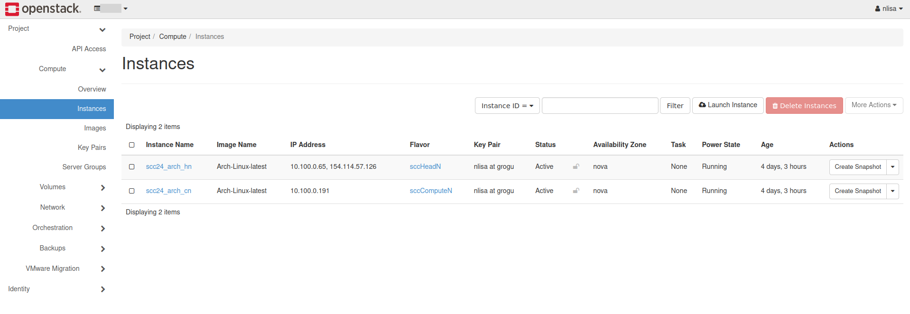
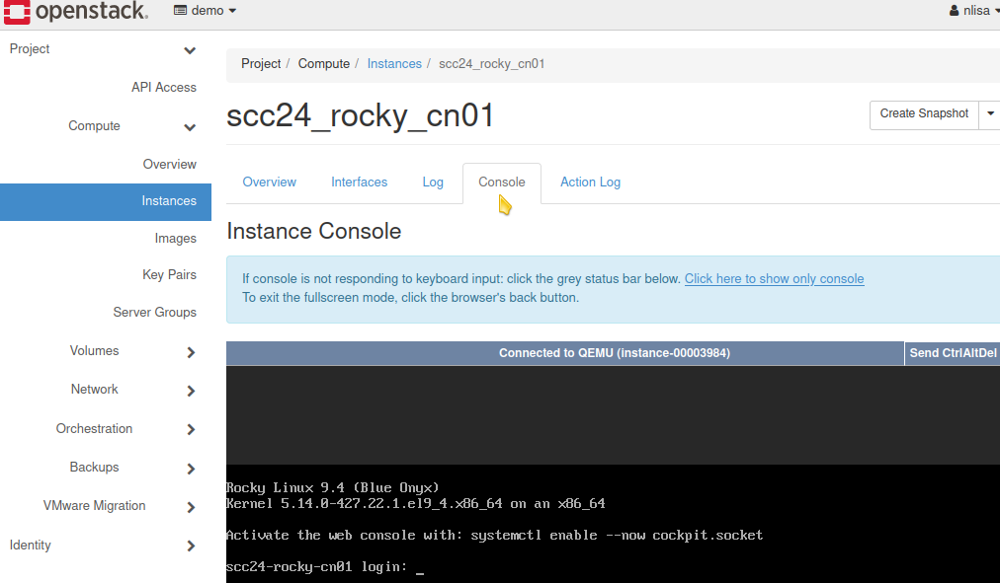
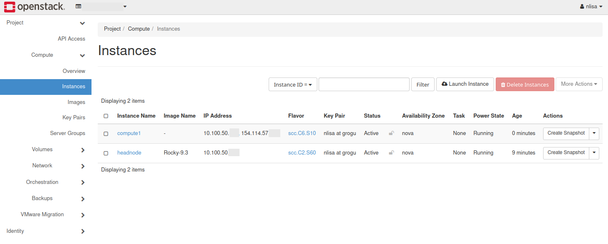
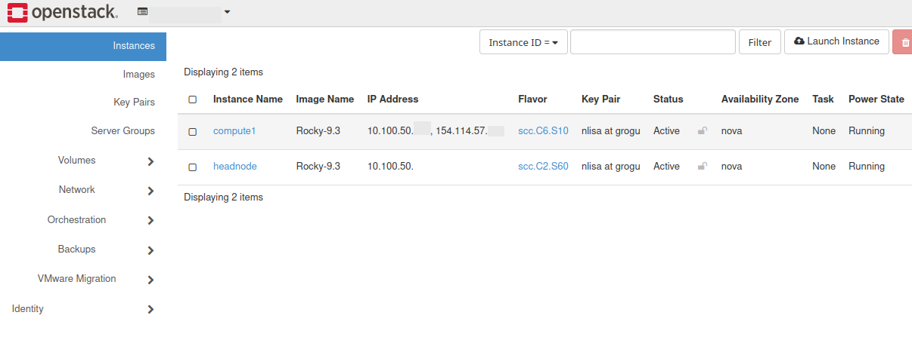
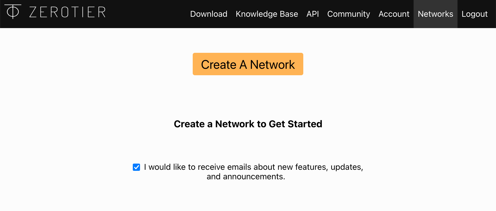
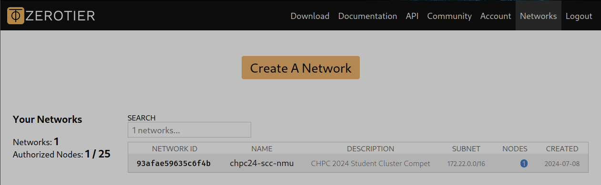
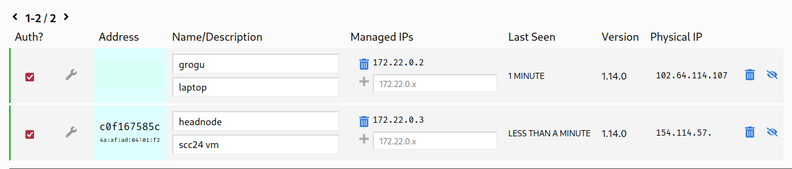

Tutorial 2: Standing Up a Compute Node and Configuring Users and Services
=========================================================================

# Table of Contents
<!-- markdown-toc start - Don't edit this section. Run M-x markdown-toc-refresh-toc -->

1. [Checklist](#checklist)
1. [Spinning Up a Compute Node on Sebowa(OpenStack)](#spinning-up-a-compute-node-on-sebowaopenstack)
    1. [Compute Node Considerations](#compute-node-considerations)
1. [Accessing Your Compute Node Using `ProxyJump` Directive](#accessing-your-compute-node-using-proxyjump-directive)
    1. [Setting a Temporary Password on your Compute Node](#setting-a-temporary-password-on-your-compute-node)
1. [Understanding the Roles of the Head Node and Compute Node](#understanding-the-roles-of-the-head-node-and-compute-node)
    1. [Terminal Multiplexers and Basic System Monitoring](#terminal-multiplexers-and-basic-system-monitoring)
1. [Manipulating Files and Directories](#manipulating-files-and-directories)
1. [Verifying Networking Setup](#verifying-networking-setup)
1. [Configuring a Simple Stateful Firewall Using nftables](#configuring-a-simple-stateful-firewall-using-nftables)
1. [Network Time Protocol](#network-time-protocol)
1. [Network File System](#network-file-system)
1. [Generating an SSH Key for your NFS `/home`](#generating-an-ssh-key-for-your-nfs-home)
1. [User Account Management](#user-account-management)
    1. [Out-Of-Sync Users and Groups](#out-of-sync-users-and-groups)
1. [Ansible User Declaration](#ansible-user-declaration)
    1. [Create User Accounts](#create-user-accounts)
1. [WirGuard VPN Cluster Access](#wirguard-vpn-cluster-access)
1. [ZeroTier](#zerotier)

<!-- markdown-toc end -->

# Checklist

This tutorial will demonstrate how to setup, configure and deploy your **compute node.** From the previous Tutorial, you should have a good understanding of the requirements and considerations to take into account when deploying additional nodes.

You will also learn more about [Public Key Cryptography](https://en.wikipedia.org/wiki/Public-key_cryptography), as you'll be using SSH directives to `ProxyJump` through your head node, whereby you're going to be transparently creating an SSH forwarding tunnel, prior to accessing your compute node.

Once you can access your compute node, you will learn additional Linux systems administrations and experiment with a number of useful tasks and utilities. It is crucial, that you understand and appreciate the specific roles of the head node and your compute node(s).

You will then be deploying a number of fundamental services, that are central to the functioning of your virtual cluster. These include setup and configuration of a firewall, networked time protocol and a network file system. You will also be deploying Ansible, for user account management. Lastly you'll explore two methods for accessing your virtual cluster over a VPN.

<u>In this tutorial you will:</u>

- [ ] Deploy a Compute Node.
- [ ] Create an SSH tunnel to access your compute node from your workstation.
- [ ] Understand the roles and purposes of your head node and compute node(s).
- [ ] Learn additional Linux administration and test a number of utilities.
- [ ] Configure a simple stateful firewall.
- [ ] Install and configure a network time service.
- [ ] Install and configure a network file sharing service.
- [ ] Understand the interaction between an NFS exported `/home` directly and your SSH keys.
- [ ] Install, configure and deploy Ansible, and use it to manage your users.
- [ ] Deploy a VPN service to join (or route) traffic between your workstation and cluster's internal networks.

# Spinning Up a Compute Node on Sebowa(OpenStack)

As previously discussed in [Tutorial 1: OpenStack Flavors](../tutorial1/README.md#openstack-instance-flavors), an important aspect of system administration is resource monitoring, management and utilization. Once you have successfully stood up your head node, your team will need to plan and manage the resources remaining which will be available for your compute node(s).

You would have seen in [Tutorial: Head Node Resource Allocations](../tutorial1/README.md#head-node-resource-allocations), that there are a limited number of potentially valid configurations that you can utilize for your cluster design.

> [!TIP]
> You are **strongly** encouraged to automate the deployment, installation and configuration of your cluster nodes through the use of either at least basic shell scripts or more advanced Ansible playbooks, as you will be shown later in this tutorial. This will allow you to rapidly experiment with and test the performance of different configurations in order to determine an optimum cluster for the applications you're required to evaluate.

## Compute Node Considerations

While the head node is responsible for administrative and management related tasks, such as authenticating user logins into the cluster, managing services, hosting a network file system, workload management and load balancing, while compute nodes are responsible executing compute intensive tasks.

Sensible default instance flavors have already been identified and configured for you. The choice your team made for your head node will determine and inform sensible decisions for the compute node(s) instance flavors.

One important distinction between your head node and compute node(s), is that the compute nodes will **not** have a floating IP associated to them. Your head node will act as a ***Gateway*** for your Compute Node(s), and ***Route*** traffic between the internet and your cluster, using a method referred to as ***Network Address Translation (NAT)***, which was discussed in the [WiFi Hotspot Example](../tutorial1/README.md#wifi-hotspot-example).

The final important consideration that must be made for your compute node is that you must not forget to configure an SSH key, so that you may access it after it has successfully launched. For ease of access and to simplify your configuration, **you are *strongly* advised to use the same SSH key** that you'd [previously generated](../tutorial1/README.md#generating-ssh-keys) on your local machine/laptop.

# Accessing Your Compute Node Using `ProxyJump` Directive

After you have successfully [Launched Your Second OpenStack VM Instance](../tutorial1/README.md#launching-your-first-openstack-virtual-machine-instance), you can SSH into your new compute node VM instance using your head node with the use of the SSH [ProxyJump Directive](https://goteleport.com/blog/ssh-proxyjump-ssh-proxycommand/). From you workstation, using either MobaXTerm or Windows PowerShell, you can SSH directly into your compute node by first making an SSH connection to your head node and then establishing a TCP forwarding connection to your compute node. Using this method, the SSH keys for both your head node and compute node must reside on your local workstation:

```bash
ssh -i <path to ssh key> -J <user>@<head node publicly accessible ip> <user>@<compute node private internal ip>
```

<p align="center"></p>

For example, in the screenshot above, the head node `scc24_arch_hn` and the compute node `scc24_arch_cn` have been created with the same key pair `nlisa at grogu`. The head node has a public facing IP address of **154.114.57.126** and the compute node has an private, internal IP address of **10.100.0.191**, then you would connect to this compute node using:

```bash
ssh -i ~/.ssh/id_ed25519_sebowa -J arch@154.114.57.126 arch@10.100.0.191
```

The following diagram may facilitate the discussion and illustrate the scenario:

```css
[workstation] ---- SSH ----> [head node] ---- SSH ----> [compute node]

# First an SSH connection is made to the head node
[workstation] ---- SSH ----> [head node]

# Then an SSH connection is made to the compute node using the head node as an SSH forwarding tunnel
[workstation] ---- TCP Forwarding Connection through head node ----> [compute node]
```

> [!NOTE]
> Remember to use the **SSH keys**, **usernames** and **ip addresses** corresponding to *your* nodes! You have been **STRONGLY** advised to make use of the **SAME SSH KEY** on your compute node as you had used on your head node. Should you insist on using different SSH keys for you nodes, refer to the hidden description that follows. Reveal the hidden text by clicking on the description.

<details>
<summary>Head node and compute node deployed using different SSH key pairs</summary>

```bash
ssh -o ProxyCommand="ssh -i <path to head node ssh key> -l <user> -W %h:%p <head node ip>" -i <path to  compute node ip> <user>@<compute node ip>
```
</details>

## Setting a Temporary Password on your Compute Node

Once you have successfully logged into your compute node, you can set a password for the default user, which would be ***rocky*** in the case of Rocky Linux VM instances. This is an optional step that you are advised to do so that you may access your VM's through the VNC console should you break your SSH access whilst configuring NFS.
```bash
sudo passwd <user>
```

In the event that you manage to lock yourselves out of your VMs, from your team's Sebowa OpenStack workspace, navigate to `Instances` and click on the problematic VM. There after navigate to `Console`, where you will be free to login using the password you've just created.

<p align="center"></p>

> [!IMPORTANT]
> You will not be able to login into your SSH servers on your head (and *generally speaking* your compute) nodes using a password. This is a security feature by default. Should you have a ***very good reason*** for wanting to utilize password enabled SSH access, discuss this with the instructors.
>
> The reason why you are setting a password at this stage, is because the following set of tasks could potentially break your SSH access and lock you out of your node(s).
>
> * Edit your /etc/ssh/sshd_config and enable password authentication
> ```bash
> sudo nano /etc/ssh/sshd_config
> ```
> * And uncomment #PasswordAuthentication
> ```conf
> PasswordAuthentication yes
> ```
> * Restart the SSH daemon on your compute node
> ```bash
> sudo systemctl restart sshd
> ```

# Understanding the Roles of the Head Node and Compute Node

When designing a cluster, a publicly accessible administrative SSH login node acts as a gateway to an internal network of compute and storage servers. This section will describe a breakdown of the roles and interactions between your head and compute(s) nodes.

<p align="center"></p>

* **Head Node**:
  * **Gateway to Internal Network**: This node serves as the only publicly accessible point for administrators and authorized users to access the internal network.
  * **Security Barrier**: By exposing only this single node to the internet, it minimizes the attack surface, making the overall infrastructure more secure.
  * **Authentication and Access Control**: It handles user authentication and can enforce security policies before granting access to internal resources.
  * **Logging and Monitoring**: It acts as a centralized point for logging access attempts and monitoring user activities, enhancing the ability to detect and respond to potential security incidents.
  * **Cluster Administration and Management**: Your head node is used to administer and control the rest of your cluster and resources.
  * **Storage Server**: For this use case, you head node is also used as a network storage server. *This is not always the case in real-world scenarios, but will be for you in the entirety of the competition.*
  * **Task / Job Submission**: This VM is used as a means and mechanism for submitting tasks and jobs to your compute node(s).

* **Compute Node(s)**:
  * **Task / Job Execution**: These servers (VMs) are responsible for running computations, executing code, and handling data processing tasks.
  * **Isolation from Public Access**: They are not directly accessible from the internet, reducing their exposure to potential attacks.
  * **Resource Allocation**: They manage CPU, memory, and other computational resources required for executing various jobs.
  * **Client Services**: Your compute node(s) act as *'clients'* to a number of services provided by your head node.

A typical workflow example may involve the followings interactions and steps:
1. **User Access**: As an administrator or authorized user, you connect to the login node via SSH from *your* local workstation.
1. **Authentication**: The login node authenticates you as an authorized user and grants access to the internal network.
1. **Administration and Maintenance**: As an *administrator*, you complete a number of administrative and maintenance tasks.
1. **Job Submission**: As a *user*, you submit computational tasks to the compute servers from the login node.
1. **Data Interaction**: Your compute node(s) fetch necessary data from the storage servers (head node) and perform the required computations.
1. **Result Storage**: The output data is stored back on the head node over network storage, or locally on the compute node(s).
1. **Data Retrieval**: You retrieve results from the head node to your local workstation.

To facilitate your understanding of the roles and interactions between your head node and your compute node(s), you will now install and work with terminal multiplexers and basic system monitoring tools.

## Terminal Multiplexers and Basic System Monitoring

[GNU Screen](https://www.gnu.org/software/screen/) and [tmux](https://github.com/tmux/tmux/wiki) are both terminal multiplexers, tools that allow you to manage multiple terminal sessions within a single window or remote terminal session. They are particularly useful for Linux system administration as they enable you to run multiple commands simultaneously, keep sessions alive after disconnecting, and organize terminal workspaces efficiently. Tmux is generally preferred for its modern interface and advanced capabilities, but GNU Screen remains a solid choice, especially in environments where it is already in use.

For the tutorials you are encouraged to use tmux.

1. Install `tmux` on your head node:
   * DNF / YUM
   ```bash
   # RHEL, Rocky, Alma, CentOS Stream
   sudo dnf update
   sudo dnf install tmux
   ```
   * APT
   ```bash
   # Ubuntu
   sudo apt install tmux
   ```
   * Pacman
   ```bash
   # Arch
   sudo pacman -Syu tmux
   ```

1. To start a new `tmux` session on your head node:

   ```bash
   tmux

   # To open a new session and give it a <name>
   # tmux new -s <name>
   ```

1. Working on your head node and compute node in two adjacent panes

   Once you've started a new `tmux` session (daemon / server), on your head node, there are a number of very useful tools and functionality you can utilize.

1. Split the terminal vertically into two separate panes:
   Press and hold `Ctrl` together with `b`. Then release `Ctrl` + `b` and press `"` (i.e. `Shift` + `'`). The combination of `Ctrl + b` `"`, is denoted by:

   ```bash
   C-b "
   ```
1. You can switch between the two panes using `Ctrl` + `b` and `o`:

   ```bash
   C-b o
   ```
1. Install [`btop`](https://github.com/aristocratos/btop) on your **head node**. Depending on the Linux distribution you chose to install:
   * DNF / YUM
   ```bash
   # RHEL, Rocky, Alma, Centos
   sudo dnf install epel-release
   sudo dnf makecache
   sudo dnf install btop
   ```
   * APT
   ```bash
   # Ubuntu
   sudo apt install btop
   ```
   * Pacman
   ```bash
   # Arch
   sudo pacman -S btop
   ```

1. Move to the second pane, and SSH into your **compute node** using `Ctrl` + `b` and `o`.
   ```bash
   C-b o
   ```

1. SSH into your **compute node** and install [`htop`](https://htop.dev/):
   ```bash
   ssh <user>@<compute node ip>
   ```

   Once you are successfully logged into your compute node:
   * DNF / YUM
   ```bash
   # RHEL, Rocky, Alma, CentOS Stream
   sudo dnf -y install epel-release
   sudo dnf makecache
   sudo dnf -y install htop
   ```
   * APT
   ```bash
   # Ubuntu
   sudo apt install htop
   ```
   * Pacman
   ```bash
   sudo pacman -S htop
   ```

1. Create a new window within `tmux` using `Ctrl` + `b` and `c`:
   ```bash
   C-b c
   ```

1. You can cycle between the two windows using `Ctrl` + `b` and `n`:
   ```bash
   # Cycle to the next window
   C-b n

   # Or cycle to windows 0 and 1 respectively
   C-b 0
   C-b 1
   ```

1. There are many more utilities available within `tmux`. Check the built-in help documentation using `Ctrl` + `b` and `?` (i.e. `Shift` + `/`):
   ```bash
   C-b ?
   ```
Your team must decide which tool you will be using for basic monitoring of your cluster. Choose between `top`, `htop` and `btop` and make sure your choice of application is installed across your cluster. Participate and reply in this [Discussion on GitHub](https://github.com/chpc-tech-eval/chpc24-scc-nmu/discussions/95) and post a screenshot of your team running two different applications in two different panes.

> [!IMPORTANT]
> Using `tmux` is an excellent way to ensure your work continues even if your SSH connection breaks between your workstation and the login node. To connect to an existing `tmux` session on your head node:
> ```bash
> tmux attach
>
> # If you have multiple, named sessions, use
> # tmux a -t session_name
> ```

# Manipulating Files and Directories

Here is a list of Linux commands and utilities that you will use often during the course of the competition. You should become familiar with these commands.

* `pwd` *print* the path of your current *working directory*.

* `mkdir` create or *make* new folders or *directories*, the `-p` flag can be used to create additional parent folders and directories.

* Both commands and text editors can be used to create and edit files. For example `touch <filename>` creates a new file. Similarly the text editors `vi`, `vim` and `nano` are used to create and / or edit files.

* `ls` *list* the content of directory / folder.

* `cd` move or *change* between *directories*.

* `cp` *copy* files and / or directories from source to destinations. Consider it's functionality to be similar to those of `copy and paste` from Windows.

* `mv` *move* files / directories from source to destinations. Consider it's functionality to be similar to those of `cut and paste` from Windows.

* Remove File or Directory `rm` remove command is used to delete files, and directory with `-r` or `--recursive` flag.

# Verifying Networking Setup

Your VMs have been assigned an external or publicly facing, floating IP address. Navigate to `Compute  ->  Instances` on your OpenStack dashboard. Click the any name of the virtual machine instance to see an overview of your virtual machine specifications, under `IP Addresses` you will see two IP addresses (IPs) (for your head node) and one IP address (for your compute node) with their respective networks. The head node's IP addresses will look like `10.100.50.x` and `154.114.57.y` where `x` denotes your specific VM's address on the respective subnet. Each team has been allocated a private `10.100.50.*` network is for internal, private use and a public facing IP address `154.114.57.x` for external access from your local workstation.

<p align="center"></p>

You can check your network interfaces by using the `ip a` command after logging in to your head node or commpute node.

> [!TIP]
> **Rocky 9** uses [Network Manager](https://docs.rockylinux.org/guides/network/basic_network_configuration/) to manage network settings. `NetworkManager` is a service created to simplify the management and addressing of networks and network interfaces on Linux machines.

* Head Node

  * Verify that your network interfaces are indeed managed by `NetworkManager`.

  ```bash
  nmcli dev
  ```

  * `nmtui` is a terminal or console-based tool used to configure and manage network connections for Network Manager.

  ```bash
  sudo nmtui
  ```

  * Example Editing Network Configuration

    You'll be presented with a screen, select `Edit a connection` and click on the interface that you had identified previously with `ip a`. This will most likely be `eth0` or `ens3`, or something similar.

  * Configure the DNS Servers

    - You will now configure the connection to make use of Google's free public DNS servers. Hit enter on <Show> to the right of <IPv4 CONFIGURATION> and scroll down to the DNS servers> section.

    - Click <Add> and enter <8.8.8.8>, then click <OK> at the bottom of the screen.

    - Exit `nmtui` and check the networking setup is correct.

> [!CAUTION]
> Configuring and managing you network setup is a crucial and fundamental aspect that you will need to understand in order to be successful in this competition. Your VM instances make use of a virtual network (or VLAN), that manages the routing and configuration aspects on your behalf.
>
> The example configuration steps above will have little to no impact on your existing network setup, however you must appreciate that `nmtui` and / or `nmcli`, (i.e. Network Manger), are power tools that can add and bring interface, configure static IP address, configure routing tables, and much more. Please refer to [Set Static IP Rocky Linux Examples](https://www.golinuxcloud.com/set-static-ip-rocky-linux-examples/) and [What is IP Routing](https://study-ccna.com/what-is-ip-routing/) for detailed explanations.

# Configuring a Simple Stateful Firewall Using nftables

In the realm of network security, shielding your system against unauthorized access and ensuring data integrity are paramount. A firewall serves as a system's gatekeepers, managing incoming and outgoing traffic. `nftables` is a framework by the Netfilter Project that provides packet filtering, network address translation (NAT), and other packet mangling capabilities for Linux. It is a successor and replacement for the older `iptables`, `ip6tables`, `arptables`, and `ebtables` frameworks, consolidating their functionality into a single system, streamlining the process of configuring tables, chains, and rules.

Stateful packet inspection, also referred to as dynamic packet filtering, is a network-based firewall that individually tracks sessions of network connections traversing it. You will now deploy a stateful firewall on your **head node** using `nftables`, since it is only your head node which has an interface (on the `154.114.57.0/24` network) that is vulnerable to attacks from the internet. Join the [Discussion on GitHub](https://github.com/chpc-tech-eval/chpc24-scc-nmu/discussions/102), by commenting and posting a screenshot of `sudo journalctl | grep sshd` on your head node.

> [!WARNING]
> You must ensure that you have [configured a password so you can access your head node through VNC](../tutorial1/README.md#accessing-your-vm-using-ssh-vs-the-openstack-web-console-vnc), as there is a high risk of locking yourself out of SSH.
>
> You may skip this section and it will not hinder your progress throughout the remainder of the tutorials, however you are strongly advised to complete this section as it contains a number of key fundamentals that you must learn not only for HPC, but for general systems administration, IT and cloud engineering.

1. Install the userspace utilities package
   * DNF / YUM
   ```bash
   # RHEL, Rocky, Alma, CentOS
   sudo dnf install nftables
   ```
   * APT
   ```bash
   # Ubuntu
   sudo apt install nftables
   ```
   * Pacman
   ```bash
   # Arch
   sudo pacman -S nftables
   ```
1. Check and clear the existing firewall configuration
   ```bash
   sudo nft list ruleset
   sudo nft flush ruleset
   ```
1. Some basic concepts and terminology to be familiar with before proceeding:
   * **Tables** are logical containers for `chains` and `rules`. Tables can be of different families (e.g., inet, ip, ip6).
   * **Chains** are ordered lists of `rules` that match packets. Chains can be of different types (e.g., filter, nat).
   * **Rules** are the individual packet processing instructions within chains.

1. Create a new `table` to house the rules for your head node
   ```bash
   sudo nft add table inet hn_table
   ```
1. Add the `input`, `forward`, and `output` base chains.
   * `input` chain refers to inbound packets and traffic arriving *into* your head node,
   * `forward` chain refers to packets and traffic passing *through* your head node, and
   * `output` chain refers to outbound packets and traffic originating *from* your head node.

   The policy for `input` and `forward` will be initially set to `accept`, and then `drop` thereafter. The policy for `output` will be to `accept`.
   ```bash
   # If you set this to drop now, you will not be able to access your head node via ssh
   sudo nft add chain inet hn_table hn_input '{ type filter hook input priority 0 ; policy accept ; }'
   sudo nft add chain inet hn_table hn_forward '{ type filter hook forward priority 0 ; policy accept ; }'
   sudo nft add chain inet hn_table hn_output '{ type filter hook output priority 0 ; policy accept ; }'
   ```

1. Specific rules for TCP and UDP will be managed by additional chains
   ```bash
   sudo nft add chain inet hn_table hn_tcp_chain
   sudo nft add chain inet hn_table hn_udp_chain
   ```
1. Accept `related` and `established` traffic while dropping all `invalid` traffic
   ```bash
   sudo nft add rule inet hn_table hn_input ct state related,established accept
   sudo nft add rule inet hn_table hn_input ct state invalid drop
   ```
1. Accept all traffic on the loopback (lo) interface
   ```bash
   sudo nft add rule inet hn_table hn_input iif lo accept
   ```
1. Accept ICMP and IGMP traffic
   ```bash
   sudo nft add rule inet hn_table hn_input meta l4proto icmp accept
   sudo nft add rule inet hn_table hn_input ip protocol igmp accept
   ```
1. `new` udp and tcp is configured to `jump` to there respective chains
   ```bash
   sudo nft add rule inet hn_table hn_input meta l4proto udp ct state new jump hn_udp_chain

   sudo nft add rule inet hn_table hn_input 'meta l4proto tcp tcp flags & (fin|syn|rst|ack) == syn ct state new jump hn_tcp_chain'
   ```
1. All traffic that failed to be processed by any other rules is `rejected`
   ```bash
   sudo nft add rule inet hn_table hn_input meta l4proto udp reject

   sudo nft add rule inet hn_table hn_input meta l4proto tcp reject with tcp reset
   sudo nft add rule inet hn_table hn_input counter reject with icmpx port-unreachable
   ```
1. Finally, add a rule to accept SSH traffic
   ```bash
   sudo nft add rule inet hn_table hn_tcp_chain tcp dport 22 accept
   ```
1. You can now save your configuration to an output file
   ```bash
   sudo nft -s list ruleset | tee hn.nft
   ```
1. Edit your head node's nft file and modify the policy for `input` and `forward ` to be `drop`
   ```bash
   nano hn.nft

   sudo mv hn.nft /etc/nftables/
   ```
1. Amend the configuration file to include your changes when the service is restarted
   * Edit `nftables.conf`
   ```bash
   sudo nano /etc/sysconfig/nftables.conf
   ```
   * Add the following:
   ```conf
   flush ruleset
   include "/etc/nftables/hn.nft"
   ```
Restart and enable the `nftables` service.

> [!NOTE]
> Your infrastructure on Sebowa's OpenStack cloud has already preconfigured NAT and [IP masquerading](https://tldp.org/HOWTO/IP-Masquerade-HOWTO/ipmasq-background2.1.html) so that your internal network remains private but reachable. Suppose that you were given a physical head node with two network interfaces, an `<internal private LAN>` and a `<public facing WAN>`. You would configure NAT and IP Masquerading with the following configuration `/etc/nftables/hn_masq.nft`.
>```conf
>table inet my_nat {
>  chain my_masquerade {
>    type nat hook postrouting priority srcnat;
>    oifname "<public facing WAN>" masquerade
>  }
>}
># Remember to include this file in /etc/sysconfig/nftables.conf and to restart the nftables service.
>```

# Network Time Protocol

NTP let's you to synchronise the time across all the computers in your network. This is important for HPC clusters as some applications require that system time be accurate between different nodes (imagine receiving a message 'before' it was sent). You will configure the NTP service through `chronyd` on your head node and then connect your compute nodes as its clients.

1. Install `chrony` on both your head and compute nodes

   ```bash
   sudo dnf install chrony
   ```

1. Head Node
   * Edit the file `/etc/chrony.conf`

     Modify the `allow` declaration to include the internal subnet of your cluster (uncomment or remove the "#" in front of `allow` if it's there, otherwise this is ignored).

   ```bash
   allow 10.100.50.0/24
   ```
   * Start and enable the `chronyd` service
   ```bash
   sudo systemctl enable chronyd

   # The service may be automatically started and enabled after installtion
   # Thus you may need to restart is for changes to take effect.
   sudo systemctl restart chronyd
   ```
   * Verify the NTP synchronization status and that there are no clients connected as yet
   ```bash
   sudo chronyc tracking
   sudo chronyc clients
   ```

1. Compute Node
   * Edit the file `/etc/chrony.conf`

     Comment out (add a "#" in front of) all the `pool` and `server` declarations and add this new line to the file:
   ```bash
   server <headnode_ip>
   ```
   * Restart and enable the `chronyd` service
   ```bash
   sudo systemctl enable chronyd
   sudo systemctl restart chronyd
   ```
   * Verify the sources of the NTP server
     ```bash
     #
     sudo chronyc sources
     ```

1. Firewall Configure on Head Node
   * Check `chronyc clients` again
   * Edit `/etc/nftables/hn.nft` and accept incoming traffic on port 123 UDP
     ```conf
     chain hn_udp_chain {
             udp dport 123 accept
     }
     ```
   * Restart `nftables`

1. Restart `chronyd` daemon on your compute node and recheck `chronyc sources`.
1. Verify that `chronyc clients` is now working correctly on your head node.

# Network File System

Network File System (NFS) enables you to easily share files and directories over the network. NFS is a distributed file system protocol that we will use to share files between our nodes across our private network. It has a server-client architecture that treats one machine as a server of directories, and multiple machines as clients that can connect to it.

This tutorial will show you how to export a directory on the head node and mount it through the network on the compute nodes. With the shared file system in place it becomes easy to enable **public key based SSH authentication**, which allows you to SSH into all the computers in your cluster without requiring a password.

The head node will act as the [NFS server](https://docs.rockylinux.org/guides/file_sharing/nfsserver/) and will export the `/home/` directory to the compute node. The `/home/` directory contains the home directories of all the the non-`root` user accounts on most default Linux operating system configurations. For more information read the this link


1. Install the NFS Utilities on both the head node and compute node(s):
   ```bash
   sudo dnf install nfs-utils
   ```

1. Edit `/etc/exports` on the head node

   NFS shares (directories on the NFS server) are configured in the `/etc/exports` file. Here you specify the directory you want to share, followed by the IP address or range you want to share to and then the options for sharing. We want to export the `/home` directory, so edit `/etc/exports` and add the following:

   ```conf
   /home    10.100.50.0/24(rw,async,no_subtree_check,no_root_squash)
   ```
   * `rw` gives the client machine read and write access on the NFS volume.
   * `async` forces NFS to write changes to the disk before replying. This option is considered more reliable. However, it also reduces the speed of file operations.
   * `no_subtree_check` prevents a process where the host must check whether the file is available along with permissions for every request. It can also cause issues when a file is renamed on the host while still open on the client. Disabling it improves the reliability of NFS.
   * `no_root_squash` disables the default behavior where NFS translates requests from a root user on the client, into a non-privileged user on the host. Great care should be taken when allowing the client to gain access to the host with this setting.

1. Open TCP port 2049 on your head node's firewall by editing `/etc/nftables/hn.nft`, and restarting the `nftables` service

1. Export the shares, then start and enable the `nfs-server` service using `systemctl` on the head node.
   ```bash
   exportfs -ar
   sudo systemctl enable nfs-server
   ```
1. Mount the NFS export on your compute node
   ```bash
   # You cannot mount /home while you are occupying it
   cd /
   sudo mount -t nfs <headnode_ip>:/home /home
   ```
1. Verify that you successfully mounted `/home` export
   ```bash
   df -h
   ```
1. Edit your `/etc/fstab` to make the effect persist after a restart. Add this entry to the end of your fstab:
   ```conf
   <headnode_ip>:/home /home  nfs   defaults,timeo=1800,retrans=5,_netdev	0 0
   ```
# Generating an SSH Key for your NFS `/home`

Just as you did so in the previous tutorial when you generated SSH keys [on your workstation](../tutorial1/README.md#generating-ssh-keys), you're now going to do the same on *either* your head node or your compute node. However, you will be exploiting the fact that we have a NFS mounted `/home` directory. You'll test the new SSH connection, by logging into your compute node.

1. Generate an SSH key

   *(You must be able to explain why it does not matter whether this command is run on your compute node or your head node)*

   ```bash
   ssh-keygen -t ed25519
   ```
   - *Enter file in which to save the key* - Press `Enter`,
   - *Enter passphrase (empty for no passphrase)* - Leave empty and press `Enter`,
   - *Enter same passphrase again* - Leave empty and press `Enter` again,

1. Copy the public key generated by `ssh-keygen` into the `authorized_keys` file in the same directory.

   ```bash
   cd ~/.ssh
   cat id_ed25519.pub >> authorized_keys
   ```

   Since your `/home` directory is shared with your compute node, this will look the same on the compute node.

1. SELinux, the security engine, may complain about permissions for this directory if you try to use public key authentication now. To fix this, run the following commands on your **head node**:

   ```bash
   chmod 700 ~/.ssh/
   chmod 600 ~/.ssh/authorized_keys
   sudo restorecon -R -v ~/.ssh
   ```

1. SSH to the **compute node** passwordless If you are prompted with a password it means that something is not set up correctly. Login through the VNC session and run the following command:

   ```bash
   sudo setsebool -P use_nfs_home_dirs 1
   ```
1. Editing `/etc/hosts` File

   You can avoid having to try an memorize your node's IP addressing, by making the following amendments to your `/etc/hosts` file on both head and compute nodes:
   ```conf
   <headnode_ip>     <headnode_name>
   <compute_node_ip> <compute_node_name>
   ```

   Use your OpenStack workspace to determine you **Instances Names** and **Internal Private IP Addresses**.

   <p align="center"></p>

# User Account Management

In enterprise systems and HPC, it's common to manage user accounts from one central location. These network accounts are then synchronised to the machines in your fleet via the network. This is done for safely, security and management purposes.

When creating a user account locally on a Linux operating system, it's provided with a user ID (uid) and a group ID (gid). These are used to tell the operating system which user this is and which groups of permissions they belong to. When you create a user with the default settings of the built-in user creation tools, it will generally increment on from the last UID used. This can be different for different systems. If UID / GID numbers do not match up across the nodes in your cluster, there can be all sorts of headaches for some of the tools and services that we will set up later in this competition.

Right now you have two users, on of them being `root`, which is the default super-user of Linux operating systems. It is all powerful. It is generally **NOT recommended** to operate as `root` for the majority of things you would do on a system. This is to prevent things from going wrong.

When logged in to the head node or compute node, check the UID and GID of `root` by using the `id` command.

## Out-Of-Sync Users and Groups

When managing a large cluster of machines, it gets really complicated to manage user ID and group ID mappings. With things like shared file systems (e.g. NFS), if user account names are the same, but IDs don't match across machines then we get permission problems.

If users are created out-of-sync across the cluster then this becomes a problem very quickly. Let us take Alice and Bob for example:

* Alice and Bob are both system administrators working on a cluster.
* There is no central authentication and user/group accounts are made manually.
* Alice creates a user `alice` on the head node using the `adduser` command listed in this tutorial.
* While Alice does this, Bob creates user `bob` on the compute node in the same way.
* Alice then creates user `alice` on the compute node.
* Bob creates `bob` on the head node.
* Even though the names are the same:
  - `alice` on the **head node** has a UID/GID of `1000`/`1000`
  - `bob` on the **head node** has a UID/GID of `1001`/`1001`
  - `alice` on the **compute node** has a UID/GID of `1001`/`1001`.
  - `bob` on the **compute node** has a UID/GID of `1000`/`1000`.

These do not match, so if Alice wants to create a file on the head node and access that file on the compute node she will get permission errors as `1000` is not the same as `1001`.

User and group names do not matter to Linux, only the numerical IDs. Let us demonstrate this now.

1. Create a new user on the head node, let's call it `outofsync`. If you check it's IDs with `id outofsync`, you should see it belongs to UID/GID `1001`.
   ```bash
   sudo adduser outofsync
   ```

1. Set the password for this user and log in as this user.
   ```bash
   sudo passwd outofsync
   ```

1. Create a file in the home directory of `outofsync` (`/home/outofsync`) called `testfile.txt` and put some words in it.
   ```bash
   nano testfile.txt
   ```

1. Create a new user on your **compute node** called `unwittinguser`. If you check the ID of this user, you will see that `unwittinguser` has UID/GID of `1001`.

1. Create a new user on the compute node called `outofsync`. If you check the ID of this user, you will see that `outofsync` has UID/GID of `1002`.

1. Set the password for the `outofsync` user.

1. Log into the compute node as `outofsync`.

1. You will see that the terminal complains about permission errors and that you aren't logged into the user's home directory.

1. You will not be able to read the `testfile.txt` file in `/home/outofsync/testfile.txt` if you tried.

This happens because you have an NFS mount for `/home`, replacing (while mounted) the compute node's `/home` with the head node's `/home` and the UID/GID for `outofsync` on the compute node does not match the one on the head node.

Check `ls -ln /home/outofsync` on the **head node** and you'll see that the `testfile.txt` belongs to `1001`, not `1002`.

> [!TIP]
> Before proceeding, you must delete the users that you have created on the machines. To delete a user you can use the command below:
>```bash
>sudo userdel -r <username>
>```
>
>Do this command for:
>
>- `outofsync` on the head node.
>- `unwittinguser` on the compute node.
>- `outofsync` on the compute node.

# Ansible's Builtin User Module

Ansible is a powerful configuration management tool used for automating the deployment, configuration, and management of software systems. It allows you to control many different systems from one central location.

In this tutorial you will be installing Ansible and using it to automate the creation of user accounts as well as completing a number of administrative tasks. Your Ansible control host (head node) must be able connect to Ansible clients (compute nodes) over SSH, *preferably passwordless*.

1. Install Ansible on your head node (it is not required on your compute node)
   * DNF / YUM
   ```bash
   # RHEL, Rocky, Alma, CentOS Stream
   sudo dnf install epel-release
   sudo dnf install python ansible
   ```
   * APT
   ```bash
   # Ubuntu
   sudo apt update
   sudo apt install software-properties-common
   sudo add-apt-repository --yes --update ppa:ansible/ansible
   sudo apt install python ansible
   ```
   * Pacman
   ```bash
   # Arch
   sudo pacman -Syu ansible
   ```

1. Configure your inventory file

   Setup an Ansible inventory file which contains a list of nodes or *hosts*, that you will be managing.
   * Open a file in your `/home` directory
   ```bash
   nano ~/inventory
   ```
   * Describe your custom inventory file using your cluster's internal network, in the `INI` format
   ```ini
   [head]
   # Only the head node's IP or hostname, when you need stricly management tasks
   10.100.50.10

   [compute]
   # List of all of your COMPUTE nodes
   # Depending on your cluster design, your head node may also be compute
   10.100.50.20
   10.100.50.30
   ```

1. Test to see if your Ansible control host can access all nodes listed in the inventory file

   ```bash
   # access as a group
   ansible -i inventory compute -m ping

   #access as an individual host
   ansible -m ping compute

   #run command on hosts
   ansible -m shell -a 'free -m' compute
   ```

## Create User Accounts

You will now use Ansible to create user accounts on ***all*** clients. To achieve this you will need to create Ansible YML scripts called `ansible playbooks` used for automating administrative tasks.

> [!TIP]
> You could use an LDAP service or something similar for identities management, such as [FreeIPA](https://www.freeipa.org/page/Main_Page), however due to the small scale of your cluster, and the limited number of users, [Ansible's Builtin User Module](https://docs.ansible.com/ansible/latest/collections/ansible/builtin/user_module.html) is more than adequate for managing your team's user accounts.


You will now create a new user and add them to the `wheel` group so they have `sudo` or `root` privileges.

1. Create an Ansilble working directory in your user's `/home`, to house your playbooks

   ```bash
   # Create the ansible playbooks directory
   mkdir -p ~/playbooks

   # Creating the sudo users ansible playbook script
   nano ~/playbooks/create_sudo_users.yml
   ```

1. Add your user name to the `YML` file. A typical convention will have you user your initial and surname, for example "Zama Mtshali" would have username "zmtshali".

   ```yml
   # Add the below content
   ---
   - hosts: all
     become: true
     vars:
       add_sudo_user: zmtshali
       del_user: unwittinguser

     tasks:

       - name: Ensure sudo user is present on system
         user:
           name: "{{ add_sudo_user }}"
           state: present
           groups: wheel
           append: true
           create_home: true

       - name: Remove user from system
         user:
           name: "{{ del_user }}"
           state: absent
           remove: yes
   ```

   * Where the keyword `all` is used to apply the playbook to all hosts, `become` determines whether commands are executed with `sudo` privileges and `vars` defines variables for the playbook.

   * The playbook is comprised of a two `tasks`, that are given a `name` and in this instance, make use of the [ansible.builtin.user](https://docs.ansible.com/ansible/latest/collections/ansible/builtin/user_module.html) module.

1. Run the playbook

   ```bash
   ansible-playbook -i inventory ~/playbooks/create_sudo_users.yml
   ```

1. SSH into your other nodes and verify that the users have been correctly

   Congratulations on successfully running your first Ansible playbook.

# WirGuard VPN Cluster Access

WireGuard is a modern, high-performance, and easy-to-use VPN (Virtual Private Network) protocol that aims to provide a simple yet secure way to create encrypted network connections. WireGuard uses a combination of public and private keys for each peer.

Each device generates its own key pair, and peers exchange public keys. This key exchange process is secure and ensures that only authorized devices can communicate. WireGuard is stateless between packets, which means that it does not maintain session state between the communication of two peers, meaning that sessions persist even when roaming or through network disruptions.

Some of the benefits and key features of WireGuard include:

* **Ease of Setup and Management**: WireGuard is designed to be easy to configure and deploy. Its configuration is straightforward and involves only a few steps, making it accessible even for users who are not experts in networking.

* **Cross-Platform Compatibility**: WireGuard is cross-platform and can run on various operating systems, including Linux, Windows, macOS, iOS, and Android. This makes it versatile and suitable for a wide range of devices.

* **Security**: WireGuard employs modern, state-of-the-art cryptographic primitives. This ensures robust security for all communications.

* **Simplicity**: WireGuard is designed to be simple and minimalistic, with a codebase that is significantly smaller than other VPN protocols like OpenVPN and IPSec. This simplicity helps in reducing the attack surface and makes the protocol easier to audit and maintain.

* **Performance**: WireGuard is known for its high performance and low overhead. It uses state-of-the-art cryptographic algorithms and efficient networking techniques to ensure fast and secure connections.

* **Open Source**: WireGuard is free and open-source, which allows for transparency, community contributions, and customization.

The following steps can be employed to utilize WireGuard in order to setup a basic tunnel between two or more peers:

| Peer               | External (Public) IP Address | New Internal (WireGuard) IP Address | Port      |
|--------------------|------------------------------|-------------------------------------|-----------|
| Peer A (head node) | 154114.57.x                  | 10.0.0.1/24                         | UDP/9993  |
| Peer B (desktop)   | 102.64.114.107               | 10.0.0.2/24                         | UDP/51900 |
| Peer C (laptop)    | *dynamic*                    | 10.0.0.3/24                         | UDP/51902 |
|                    |                              |                                     |           |

> [!TIP]
> The UDP Ports do not have to be different. The same UDP port could have been used for all three peers.

1. Installation
   * DNF / YUM
   ```bash
   # RHEL, Rocky, Alma CentOS Stream
   sudo dnf install epel-release
   sudo dnf install wireguard-tools
   ```
   * APT
   ```bash
   # Ubuntu
   sudo apt update
   sudo apt install wireguard-tools
   ```
   * Pacman
   ```bash
   sudo pacman -S wireguard-tools
   ```
1. Create a private and public key for **each** peer
   * Create a private key
   ```bash
   # We want to restrict reading and writing to the owner, so we temporarily alter the umask with the sub-shell.
   (umask 0077; wg genkey > headnode.key)
   ```
   * Create a public key
   ```bash
   wg pubkey < headnode.key > peerA.pub
   ```
1. Peer Configuration

   In this setup, your *head node* is listening on port 9993 (remember to open this UDP port), and will accept connections from  your *laptop* / *desktop*.
   ```bash
   # Create a new WireGuard connection and bind an IP address to it
   sudo ip link add dev wg0 type wireguard
   sudo ip addr add 10.0.0.1/24 dev wg0

   # Create a WireGuard "Server" on your head node
   sudo wg set wg0 listen-port 9993 private-key /path/to/peer_A.key

   # If you were staying at the City Lodge in Gqeberha, for exmaple, you endpoint (public ip) would be as follows:
   sudo wg set wg0 peer PEER_B_PUBLIC_KEY endpoint 102.64.114.107:51900 allowed-ips 10.0.0.2/32

   # Your laptop is roaming "dynamic" and does not have a fixed IP or endpoint
   sudo wg set wg0 peer PEER_C_PUBLIC_KEY allowed-ips 10.0.0.3/32

   # Bring up your new WireGuard tunnel device
   sudo ip link set wg0 up
   ```

   Your head node is now listening for incoming connections.

1. Verify the configuration settings
   ```bash
   # Verify that the device has been correctly created
   ip a

   # Check to see whether your head node is listening for incoming connections
   wg
   ```

1. Repeat the above steps for Peers B and C.
   * This time when you run the `wg` to verify the configuration settings, you should see active connections.

1. Test the WirGuard Connection
   ```bash
   # From your head node
   ping 10.0.0.2
   ping 10.0.0.3

   # Similarly, do the same from the other nodes
   ```
You have successfully configured your WireGuard VPN Tunnel.

# ZeroTier

> [!CAUTION]
> If you have successfully configured WireGuard, generally speaking you will not need additional VPN configurations. Disable the WireGuard service to continue to experiment with this example. You and your team will then decide on the preferred method.

ZeroTier is a software-based network virtualization solution that allows you to create and manage secure virtual networks across different devices and platforms. It combines features of traditional VPNs with modern software-defined networking (SDN) to provide a flexible, efficient, and secure way to connect devices over the internet.

Some of the benefits and key features of ZeroTier include:
* **Easy Setup and Management**: ZeroTier simplifies the process of setting up virtual networks. It provides a user-friendly interface for creating and managing networks, adding devices, and configuring settings.

* **Cross-Platform Compatibility**: ZeroTier works on a variety of operating systems, including Windows, macOS, Linux, Android, and iOS. This ensures that you can connect virtually any device to your network.

* **Security**: ZeroTier uses strong encryption to secure your connections, ensuring that data transmitted between devices is protected from unauthorized access.

* **Performance**: Unlike traditional VPNs that can introduce latency and reduce performance, ZeroTier is designed to optimize network performance by using peer-to-peer technology and intelligent routing.

    * **Scalability**: ZeroTier can scale from small home networks to large enterprise deployments. Its flexible architecture allows it to handle a wide range of network sizes and configurations.

* **Open Source**: The core ZeroTier engine is open source, which allows for transparency, community contributions, and customization.

* **Use Cases**: ZeroTier can be used for a variety of purposes, such as remote access, site-to-site VPNs, IoT networking, multiplayer gaming, and secure peer-to-peer communications. You will be using ZeroTier to create a VPN between your laptops and your head node, regardless of where you are in the world...

You will be able to create Virtual Private Networks (VPN) between systems you might have local network access to, but where you traditionally do not have external network access to. Let's demonstrate this with an example by creating your first ZeroTier network:

1. Create a service account

   Navigate to [my.zerotier.com](https://my.zerotier.com/) and create an account.

1. Create a `zerotier` network from the Networks tab

   Click the `Create A Network` button.
   <p align="center"></p>

1. Configure and edit your new network, by clicking on it

   Give it an appropriate name and description

   <p align="center"></p>

   * Scroll down to the `Members Section`

1. Install ZeroTier on each device that you intend to connect to your new ZeroTier network

   * Use the respective app store for mobile devices
   * Navigate to [Download ZeroTier](zerotier.com/download) for other devices

     For example, on your head node:
   ```bash
   curl -s https://install.zerotier.com | sudo bash
   ```
1. Copy the network id from the Networks tab, on your [ZeroTier account page](https://my.zerotier.com)

   i.e. `93afae59635c6f4b` in this example.

1. Join your ZeroTier network from your devices

   * On macOS, Windows, Android and iOS: Use the menu / tray / app icon and `join` your network using your network id.
   * On your head node and other Linux machines
   ```bash
   # You must take note of the unique address indicated from the `info` switch
   sudo zerotier-cli info

   # Join you zerotier network
   sudo zerotier-cli join 93afae59635c6f4b

   # Verify whether or not your client is authorized
   sudo zerotier-cli listnetworks
   ```

1. Go back to the `Members Section` on your account page:

   * Authorize the devices that you would like to join your ZeroTier network
   * Provide a name and description to the devices
   * Assigned `Managed IPs` if they are not automatically assigned

   <p align="center"></p>

1. Confirm the status on your devices

   Should now read `OK` instead of `ACCESS DENIED`
   ```bash
   sudo zerotier-cli listnetworks
   ```

1. Test connectivity between the *Managed IPs* using `ping`.

   * Make sure to open *UDP Port 9993* on your head node and restart the `nfstables` service.

You have successfully created a ZeroTier VPN network.
