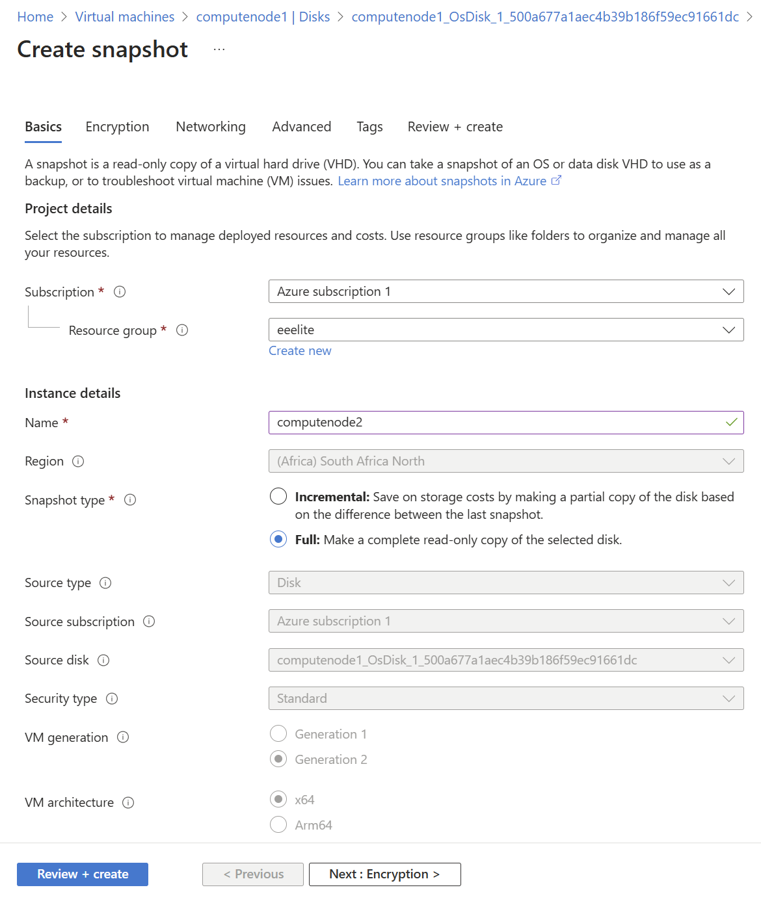
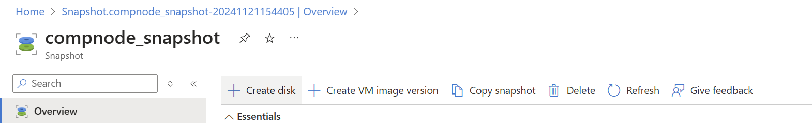

# Spinning Up a Second Compute Node Using a Snapshot

At this point you are ready to run HPL on your cluster with two compute nodes. From your Virtual Machine dasboard on Azure, navigate to the node which you wish to create a snapshot of and go to `Disk` &rarr; `Name of the actual Disk` &rarr; `+ Create Snapshot` to reach the window shown below:



Once there, simply choose an adequate Name for the snapshot, ensure that the *Snapshot Type* is `Full` and click `Review + Create`. A suitable name for the snapshot would be <b>computenode2</b>


Creating the actual VM from the snapshot requires two more steps. First navigate to the snapshot you just created (should be visible on your Azure Dashboard or simply search for it) and click `+ Create Disk` as shown below. When creating the disk, simply choose an adequate name (no other changes need to be made).



Then navigate to the newly created disk and click `+ Create VM` as shown below. Ensure that everything is set up as in Tutorial 1, choosing an adequate name once again, and then `Review + Create`.


Navigate back to the Virtual Machine dashboard and your second compute node should be <b>deployed and running.</b> 

## Running HPL Across Multiple Nodes

Everything is now in place for you to run HPL across your two compute nodes. You must ensure that all libraries and dependencies are satisfied across your cluster. You must also ensure that your passwordless SSH is properly configured. Your NFS mounted `/home` directory must be properly configured.

* Configuring OpenMPI Hosts File

  You must configure a `hosts` (or `machinefile`) file which contains the IP addresses or hostnames of your compute nodes.
  ```conf
  # The slots value indicates the number of processes to run on each node.
  # Adjust this number based on the number of CPU cores available on each node.
  compute01 slots=1
  compute02 slots=1
  ```

* Runtime and Environment Configuration Options for `mpirun`

  You compute nodes each have a single CPU with multiple OpenMP threads. It is critical that your `environment` is correctly configured to you to run HPL across your two compute nodes.

  * Navigate to the directory where your HPL executable and `HPL.dat` file are located. Use `mpirun` to run HPL across the nodes specified in the hosts file
  * Edit your `~/.profile` to set environment variables when `mpirun` creates a new shell
  * Execute `mpirun`
  ```bash
  mpirun -np 2 --hostfile hosts ./xhpl
  ```
