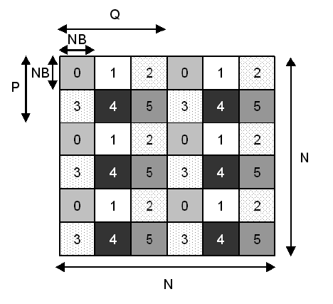

Student Cluster Competition - Tutorial 3

## Table of Contents

<!-- markdown-toc start - Don't edit this section. Run M-x markdown-toc-refresh-toc -->

1. [Checklist](#checklist)
1. [Managing Your Environment](#managing-your-environment)
    1. [NFS Mounted Shared `home` folder and the `PATH` Variable](#nfs-mounted-shared-home-folder-and-the-path-variable)
1. [Install Lmod](#install-lmod)
    1. [Lmod Usage](#lmod-usage)
1. [Running the High Performance LINPACK (HPL) Benchmark on Your Compute Node](#running-the-high-performance-linpack-hpl-benchmark-on-your-compute-node)
    1. [System Libraries](#system-libraries)
    1. [Configure and Run HPL on Compute Node](#configure-and-run-hpl-on-compute-node)
1. [Building and Compiling OpenBLAS and OpenMPI Libraries from Source](#building-and-compiling-openblas-and-openmpi-libraries-from-source)
1. [Intel oneAPI Toolkits and Compiler Suite](#intel-oneapi-toolkits-and-compiler-suite)
    1. [Configure and Install Intel oneAPI Base and HPC Toolkits](#configure-and-install-intel-oneapi-base-and-hpc-toolkits)
    1. [Configuring and Running HPL with Intel oneAPI Toolkit and MKL](#configuring-and-running-hpl-with-intel-oneapi-toolkit-and-mkl)
1. [LinPACK Theoretical Peak Performance](#linpack-theoretical-peak-performance)
    1. [Top500 List](#top500-list)
1. [Spinning Up a Second Compute Node Using a Snapshot](#spinning-up-a-second-compute-node-using-a-snapshot)
    1. [Running HPL Across Multiple Nodes](#running-hpl-across-multiple-nodes)
1. [HPC Challenge](#hpc-challenge)
1. [Application Benchmarks and System Evaluation](#application-benchmarks-and-system-evaluation)
    1. [GROMACS (ADH Cubic)](#gromacs-adh-cubic)
    1. [LAMMPS (Lennard-Jones)](#lammps-lennard-jones)
    1. [Qiskit (Quantum Volume)](#qiskit-quantum-volume)

<!-- markdown-toc end -->

# Checklist

Tutorial 3 demonstrates environment variable manipulation through the use of modules and the compilation and optimization of HPC benchmark software. This introduces the reader to the concepts of environment management and workspace sanity, as well as compilation of various software applications on Linux.

In this tutorial, you will also be _spinning up and connecting a second compute node_ in order to further extend the capabilities of your small VM cluster. More importantly, you will given detailed specifics on exactly how to go about running application benchmarks across multiple nodes.

In this tutorial you will:

- [ ] Understand the importance of having a consistent environment across your cluster.
- [ ] Understand the difference between system software and user _(local to the user's `home` directory)_ installed software.
- [ ] Install, configure and use Lmod.
- [ ] Understand some of the fundamental considerations around optimizing HPL.
- [ ] Understand the pros and cons of compiling libraries from source.
- [ ] Install and make use of Intel's oneAPI framework to run HPL.
- [ ] Understand theoretical system peak performance.
- [ ] Appreciate the significance of the Top500 list and benchmarking.
- [ ] Standup and Configure a Second Compute Node, and running applications across a cluster.
- [ ] Download and compile the High Performance Computing Challenge (HPCC) benchmark.
- [ ] Understand that scientific computer applications are primarily used to conduct scientific research, and can also evaluate system performance.

# Managing Your Environment

One of the most central and fundamental problems that you and your team will need to tackle, will be that of managing you environment. When you run an application, there are a number of locations that are searched to determine the binary to execute.

For example, if you wanted to know _"which"_ GNU C Compiler your VM's are using by default:
```bash
# If you completed the HPL excercise in tutorial1, you would have installed
# a system-wide GCC on your head node, and can expect and out of /usr/bin/gcc

which gcc
```
We see that for this particular system, the `gcc` that will be invoked by default is located in the directory `/usr/bin/`.

> [!TIP]
> Try the above command on your compute node, and you should notice that `no gcc in $PATH` is found...

## NFS Mounted Shared `home` folder and the `PATH` Variable

You will recall that you were required to configure an [NFS Mounted home dir](../tutorial2/README.md#network-file-system). This means that any software that you install into your `/home/<USER_DIRECTORY>` on your head node, will also automatically be available on your compute nodes.

In order for this to work as expected, there are two important conditions that must be satisfied:
1. Firstly, you must ensure that you're `PATH` variable is correctly configured on your head node and must similarly have a corresponding configuration on your compute node(s). For example, to see a colon (`:`) separated list of directories that are searched whenever you execute a binary:
   ```bash
   echo $PATH
   ```
1. Secondly, you must ensure that any system dependencies are correctly installed on **each** of your nodes. For example, this would be a good time to install `gcc` on your **compute node**:
   ```bash
   sudo dnf install gcc
   ```

<details>
<summary>Instructions for APT (Ubuntu) and Pacman (Arch)</summary>

```bash
# APT
sudo apt install gcc

# Pacman
sudo pacman -S gcc
```
</details>

> [!IMPORTANT]
> Software on one node will not automatically be installed across all nodes. For example, if you want to monitor the system performance of your head node, you must install and/or run `top # or htop or btop` on your head node. Similarly if you want to do this for your compute node(s), you must install and run the application on all of your compute node(s).

In the next few sections you will be installing and deploying Lmod across your cluster. You will be configuring, building and compiling Lmod from a directory in your `/home/<USER>` directory. This will mean that the Lmod binary will be available across your cluster, however in order to run Lmod on your compute nodes for example, you must ensure that all Lua system dependencies are installed across all you nodes.

# Install Lmod

Environment Modules provide a convenient way to dynamically change a user's environment through _modulefiles_ to simplify software and library use when there are multiple versions of a particular software package (e.g. Python2.7 and Python 3.x) installed on the system. Environment Module parameters typically involve, among other things, modifying the `PATH` environment variable for locating a particular package (such as dynamically changing the path to Python from `/usr/local/bin/python2.7` to `/usr/local/bin/python3`).

In this section, you are going to be building and compiling Lmod from source. Lmod is a Lua-based environment module tool for users to easily manipulate their HPC software environment and is used on thousands of HPC systems around the world. Carefully follow these instructions, as there are prerequisites and dependencies that are required to build Lmod, which are slightly different to those required to execute the Lmod binary.

> [!IMPORTANT]
> You can build Lmod on either your head node or one of your compute nodes. Since your compute node(s), _will generally speaking_ have **more CPUs for compute**, they will typically be able to build and compile applications much much faster than your administrative (or login) _head node_.

1. Install prerequisites required to build Lmod:
   From one of your **compute nodes**, install the following dependencies
   * DNF / YUM
     ```bash
     # Rocky (or similar RPM based systems: RHEL, Alma, CentOS Stream)
     sudo dnf install -y epel-release
     sudo dnf install -y git gcc make
     ```
   * APT
     ```bash
     # Ubuntu (or similar APT based systems)
     sudo apt update
     sudo apt install -y git gcc make
     ```
   * Pacman
     ```bash
     # Arch
     sudo pacman -S git gcc make
     ```
1. Install dependencies for running and using Lmod:
   You will need to install these on all the nodes you intend to use with Lmod
   * DNF / YUM
     ```bash
     # Rocky (or similar RPM based systems: RHEL, Alma, CentOS Stream)
     sudo dnf install -y epel-release
     sudo dnf install -y tcl-devel tcl tcllib  bc
     sudo dnf install -y lua lua-posix lua-term
     sudo dnf --enable-repo=devel install lua-devel
     ```
   * APT
     ```bash
     # Ubuntu (or similar APT based systems)
     sudo apt update
     sudo apt install -y tcl tcl-dev lua5.3 lua-posix bc
     ```
   * Pacman
     ```bash
     # Arch
     sudo pacman -S lua lua-filesystem lua-posix bc
     ```
1. Compile, Build and Install Lmod
   The following instructions will be the same regardless of the system you are using. You will be using the Lmod repo from the Texas Advanced Computing Center at the University of Texas, to build and compile Lmod from source into your own `home` directory:
   ```bash
   # Clone the repository
   git clone https://github.com/TACC/Lmod.git

   # Navigate into the Lmod directory
   cd Lmod

   # Run the configuration script and install into you home directory
   ./configure --prefix=$HOME/lmod

   # Build and install Lmod
   make -j$(nproc)
   make install

   # If you are on Rocky 9.3 and receive an error about "lua.h",
   # You can install Lmod from the DNF / YUM package repos.
   ```

   * `--prefix`: This directive instructs the `./configure` command, to install Lmod into a specific directory, where the `$HOME` variable is used as a shortcut for `/home/<user>`.
   * `-j$(nproc)`: This directive instructs the `make` command to build and compile use the maximum number of processors on the system.

> [!TIP]
> You and your team are **STRONGLY** encouraged to review and make sure you understand the Compile, Build and Installation instructions for Lmod as these steps will apply to virtually all application benchmarks you will encounter in this competition.

## Lmod Usage

With Lmod installed, you'll now have some new commands on the terminal. Namely, these are: `module <subcommand>`. The important ones for you to know and use are: `module avail`, `module list`, `module load` and `module unload`. These commands do the following:

| Command                       | Operation                                            |
|-------------------------------|------------------------------------------------------|
| `module avail`                | Lists all modules that are available to the user.    |
| `module list`                 | Lists all modules that are loaded by the user.       |
| `module load <module_name>`   | Loads a module to the user's environment.            |
| `module unload <module_name>` | Removes a loaded module from the user's environment. |

Lmod also features a shortcut command `ml` which can perform all of the above commands:

| Command             | Operation                                         |
|---------------------|---------------------------------------------------|
| `ml`                | Same as `module list`                             |
| `ml avail`          | Same as `module avail`                            |
| `ml <module_name>`  | Same as `module load <module_name>`               |
| `ml -<module_name>` | Same as `module unload <module_name>`             |
| `ml foo`            | Same as `module load foo`                         |
| `ml foo -bar`       | Same as `module load foo` and `module unload bar` |

> [!NOTE]
> Some installed packages will automatically add environment modules to the Lmod system, while others will not and will require you to manually add definitions for them. For example, the `Intel oneAPI Toolkits` package that we will install from source later in this tutorial will have automatic configuration scripts to add module files to the system for loading via Lmod.

# Running the High Performance LINPACK (HPL) Benchmark on Your Compute Node

The High Performance LINPACK (HPL) benchmark is used to measure a system's floating point number processing power. The resulting score (in Floating Point Operations Per Second, or FLOPS for short) is often used to roughly quantify the computational power of an HPC system. HPL requires math libraries to perform its floating point operations as it does not include these by itself and it also requires an MPI installation for communication in order to execute in parallel across multiple CPU cores (and hosts).

## System Libraries

A library is a collection of pre-compiled code that provides functionality to other software. This allows the re-use of common code (such as math operations) and simplifies software development. You get two types of libraries on Linux: `static` and `dynamic` libraries.

* Static Libraries

  Static libraries are embedded into the binary that you create when you compile your software. In essence, it copies the library that exists on your computer into the executable that gets created at **compilation time**. This means that the resulting program binary is self-contained and can operate on multiple systems without them needing the libraries installed first. Static libraries are normally files that end with the `.a` extension, for "archive".

  Advantages here are that the program can potentially be faster, as it has direct access to the required libraries without having to query the operating system first, but disadavanges include the file size being larger and updating the library requires recompiling (and linking the updated library) the software.

* Dynamic Libraries

  Dynamic libraries are loaded into a compiled program at **runtime**, meaning that the library that the program needs is **not** embedded into the executable program binary at compilation time. Dynamic libraries are files that normally end with the `.so` extension, for "shared object".

  Advantages here are that the file size can be much smaller and the application doesn't need to be recompiled (linked) when using a different version of the library (as long as there weren't fundamental changes in the library). However, it requires the library to be installed and made available to the program on the operating system.

> [!NOTE]
> Applications (such as HPL) can be configured to use static or dynamic libraries for its math and MPI communication, as mentioned above.

* Message Passing Interface (MPI)

  MPI is a message-passing standard used for parallel software communication. It allows for software to send messages between multiple processes. These processes could be on the local computer (think multiple cores of a CPU or multiple CPUs) as well as on networked computers. MPI is a cornerstone of HPC. There are many implementations of MPI in software such as OpenMPI, MPICH, MVAPICH2 and so forth. To find out more about MPI, please read the following: [https://www.linuxtoday.com/blog/mpi-in-thirty-minutes.html](https://www.linuxtoday.com/blog/mpi-in-thirty-minutes.html)

* Basic Linear Algebra Subprograms Libraries

  Basic Linear Algebra Subprograms (BLAS) libraries provide low-level routines for performing common linear algebra operations such as vector and matrix multiplication. These libraries are highly optimized for performance on various hardware architectures and are a fundamental building block in many numerical computing applications.

## Configure and Run HPL on Compute Node

We need to install the statically `($(LIBdir)/libhpl.a)` and dynamically`($(LAdir)/libtatlas.so $(LAdir)/libsatlas.so)` linked libraries that HPL expects to have, as well as the software for MPI. The MPI implementation we're going to use here is OpenMPI and we will use the Automatically Tuned Linear Algebra Software (ATLAS) math library.

> [!IMPORTANT]
> Remember that since the MPI and BLAS libraries are dynamically linked, you need to ensure that ALL of our nodes that you expect to run HPL on have the expected MPI and BLAS libraries.
>
> If you've managed to successfully [build, compile and run HPL in tutorial 1]((../tutorial1/README.md#install-compile-and-run-high-performance-linpack-hpl-benchmark)), and you've managed to successfully configure your [NFS `home` directory export in tutorial 2](../tutorial2/README.md##network-file-system), then you may proceed. Otherwise you **must** discuss with, and seek advice from an instructor.

1. Install the necessary dependencies on your **compute node**:
   * DNF / YUM
     ```bash
     # RHEL, Rocky, Alma, Centos
     sudo dnf update -y
     sudo dnf install openmpi atlas openmpi-devel atlas-devel -y
     sudo dnf install wget nano -y
     ```
   * APT
     ```bash
     # Ubuntu
     sudo apt update
     sudo apt install openmpi libatlas-base-dev
     sudo apt install wget nano
     ```
   * Pacman
     ```bash
     # Arch
     sudo pacman -Syu
     sudo pacman -S base-devel openmpi atlas-lapack nano wget
     ```

1. Configuring and Tuning HPL

   The `HPL.dat` file (in the same directory as `xhpl`) defines how the HPL benchmark solves a large dense linear array of double precision floating point numbers. Therefore, selecting the appropriate parameters in this file can have a considerable effect on the GFLOPS score that you obtain. The most important parameters are:
   * `N` which defines the length of one of the sides of the 2D array to be solved. It follows therefore:
     * ***"Problem Size"*** is proportional to `N x N`,
     * ***"Runtime"*** is proportional to `N x N`,
     * ***"Memory Usage"*** is proportional to `N x N`.

   <p align="center"></p>
   The image depicts an example of P by Q partitioning of an HPL matrix in 6 processes. In this case they've been decomposed into 2 x 3. The image is from a journal article publication, [Gaining asynchrony by using hybrid UPC SMPSs](https://www.researchgate.net/publication/228524393_Gaining_asynchrony_by_using_hybrid_UPCSMPSs)

    We can observe that if you we to *double* `N`, your run would take **four** times as long. If you **tippled** `N`, your run would use **nine times as much** memory. If you made `N` **ten times larger**, your run would use **hundred times** more memory, and would take **hundred times** as long to run.
   * `NB` defines the block (or chunk) size into which the array is divided. The optimal value is determined by the CPU architecture such that the block fits in cache. For best performance `N` should be a multiple of `NB`.
   * `P x Q` define the domains (in two dimensions) for how the array is partitioned on a distributed memory system. Therefore `P x Q` typically should equate more or less to the number of MPI ranks, or number of nodes, or number of NUMA domains. For example, if you have 4 single CPU nodes, the permutations for `P` and `Q` include [1, 4] and [2, 2]. Similarly, if you have 4 dual socket nodes, the permutations for `P` and `Q` include [1,8], [2, 4], etc...

1. Prepare your environment to rerun your `xhpl` binary on your **compute node**

   Make sure to open an additional ssh session to your compute node, so that you can monitor your CPU utilization using `top # preferably btop / htop`.

   ```bash
   # Export the path to the OpenMPI Library
   export PATH=/usr/lib64/openmpi/bin:$PATH

   # Edit your HPL.dat file with the following changes
   cd ~/hpl/bin/<TEAM_NAME>
   nano HPL.dat
   ```

1. Make the following changes to your `HPL.dat` file:
   ```conf
   22000                    Ns
   164                      NBs
   ```

1. Finally, rerun `xhpl` and record your GFLOPS score:
   ```bash
   ./xhpl
   ```
> [!TIP]
> You can find [online calculators](https://www.advancedclustering.com/act_kb/tune-hpl-dat-file/) that will generate an `HPL.dat` file for you *as a starting point*, but you will still need to do some tuning if you want to squeeze out maximum performance.

# Building and Compiling OpenBLAS and OpenMPI Libraries from Source

> [!CAUTION]
> Compiling your entire application stack and tool-chains from source, can provide you with a tremendous performance improvement. Compiling applications from source _'can'_ take a very long time and can also be a very tricky process. For this reason the compilation of `gcc` is omitted for the competition.
>
> You are advised to skip this section if you have fallen behind the pace recommended by the course coordinators. Skipping this section will *NOT* stop you from completing the remainder of the tutorials.

You now have a functioning HPL benchmark. However, using math libraries (BLAS, LAPACK, ATLAS) from a repository (`dnf`) will not yield optimal performance, because these repositories contain generic code compiled to work on all x86 hardware. If you were monitoring your compute during the execution of `xhpl`, you would have noticed that the OpenMPI and Atlas configurations restricted HPL to running with no more than two OpenMP threads.

Code compiled specifically for HPC hardware can use instruction sets like `AVX`, `AVX2` and `AVX512` (if available) to make better use of the CPU. A (much) higher HPL result is possible if you compile your math library (such as ATLAS, GOTOBLAS, OpenBLAS or Intel MKL) from source code on the hardware you intend to run the code on.

1. Install dependencies
   ```bash
   # DNF / YUM (RHEL, Rocky, Alma, Centos Stream)
   sudo dnf group install "Development Tools"
   sudo dnf install gfortran git gcc wget

   # APT (Ubuntu)
   sudo apt install build-essential hwloc libhwloc-dev libevent-dev gfortran wget

   # Pacman
   sudo dnf install base-devel gfortran git gcc wget
   ```

1. Fetch and Compile OpenBLAS Source Files
   ```bash
   # Fetch the source files from the GitHub repository
   git clone https://github.com/xianyi/OpenBLAS.git
   cd OpenBLAS

   # Tested against version 0.3.26, you can try an build `develop` branch
   git checkout v0.3.26

   # You can adjust the PREFIX to install to your preferred directory
   make
   make PREFIX=$HOME/opt/openblas install
   ```

1. Fetch, Unpack and Compile OpenMPI Source Files
   ```bash
   # Fetch and unpack the source files
   wget https://download.open-mpi.org/release/open-mpi/v4.1/openmpi-4.1.4.tar.gz
   tar xf openmpi-4.1.4.tar.gz
   cd openmpi-4.1.4

   # Pay careful attention to tuning options here, and ensure they correspond
   # to your compute node's processor.
   #
   # If you are unsure, you can replace the `cascadelake` architecture option
   # with `native`, however you are expected to determine your compute node's
   # architecture using `lscpu` or similar tools.
   #
   # Once again you can adjust the --prefix to install to your preferred path.
   CFLAGS="-Ofast -march=cascadelake -mtune=cascadelake" ./configure --prefix=$HOME/opt/openmpi

   # Use the maximum number of threads to compile the application
   make -j$(nproc)
   make install
   ```

1. Compile and Configure HPL
   ```bash
   # Copy the Makefile `Make.<TEAM_NAME>` that you'd previously prepared
   # and customize it to utilize the OpenBLAS and OpenMPI libraries that
   # you have just compiled.
   cd ~/hpl
   cp Make.<TEAM_NAME> Make.compile_BLAS_MPI
   nano Make.compile_BLAS_MPI
   ```

1. Edit the platform identifier *(architecture)*, MPI and BLAS paths, and add compiler optimization flags:
   ```conf
   ARCH         = compile_BLAS_MPI

   MPdir        = $(HOME)/opt/openmpi
   MPinc        = -I$(MPdir)/include
   MPlib        = $(MPdir)/lib/libmpi.so

   LAdir        = $(HOME)/opt/openblas
   LAinc        =
   LAlib        = $(LAdir)/lib/libopenblas.a

   CC           = mpicc
   CCFLAGS      = $(HPL_DEFS) -O3 -march=cascadelake -mtune=cascadelake -fopenmp -fomit-frame-pointer -funroll-loops -W -Wall
   LDFLAGS      = -O3 -fopenmp

   LINKER       = $(CC)
   ```

1. You can now compile your new HPL:
   ```bash
   # You will also need to temporarily export the following environment
   # variables to make OpenMPI available on the system.

   export MPI_HOME=$HOME/opt/openmpi
   export PATH=$MPI_HOME/bin:$PATH
   export LD_LIBRARY_PATH=$MPI_HOME/lib:$LD_LIBRARY_PATH

   # Remember that if you make a mistake and need to recompile, first run
   # make clean arch=compile_BLAS_MPI

   make arch=compile_BLAS_MPI
   ```

1. Edit HPL to take advantage of your custom compiled MPI and Math Libraries
   Verify that a `xhpl` executable binary was in fact produced and configure your `HPL.dat` file with reference to the [Official HPL Tuning Guide](https://netlib.org/benchmark/hpl/tuning.html):
   ```bash
   cd bin/compile_BLAS_MPI

   # As a starting point when running HPL on a single node, with a single CPU
   # Try setting Ps = 1 and Qs = 1, and Ns = 21976 and NBs = 164
   nano HPL.dat
   ```

1. Finally, you can run your `xhpl` binary with custom compiled libraries.
   ```bash
   # There is no need to explicitly use `mpirun`, nor do you have to specify
   # the number of cores by exporting the `OMP_NUM_THREADS`.
   # This is because OpenBLAS is multi-threaded by default.

   ./xhpl
   ```

> [!TIP]
> Remember to open a new ssh session to your compute node and run either `top # preferably htop / btop`. Better yet, if you are running `tmux` in your current session, open a new tmux window using `C-b c` then ssh to your compute node from there, and you can cycle between the two tmux windows using `C-b n`.

Join the [Discussion](https://github.com/chpc-tech-eval/chpc24-scc-nmu/discussions/61) by replying to the thread with a screenshot of your compute node's CPU threads hard at work.

# Intel oneAPI Toolkits and Compiler Suite

Intel oneAPI Toolkits provide a comprehensive suite of development tools that span various programming models and architectures. These toolkits help developers optimize their applications for performance across CPUs, GPUs, FPGAs, and other accelerators, visit [Intel oneAPI Toolkits](https://www.intel.com/content/www/us/en/developer/tools/oneapi/toolkits.html) for more information.

## Configure and Install Intel oneAPI Base and HPC Toolkits

> [!CAUTION]
> The Intel oneAPI Base and HPC Toolkits can provide considerable improvements of your benchmarking results. However, they can be tricky to install and configure. You are advised to skip this section if you have fallen behind the pace recommended by the course coordinators. Skipping this section will *NOT* stop you from completing the remainder of the tutorials.

You will need to install and configure Intel's oneAPI Base Toolkit which includes Intel's optimized Math Kernel Libraries and Intel's C/C++ Compilers. Additionally, you will also need to install Intel's HPC Toolkit which extends the functionality of the oneAPI Base Toolkit and includes Intel's optimized FORTRAN and MPI Compilers.

You will be making use of the **2024-2** versions of the Intel oneAPI and HPC Toolkits.

1. *Optionally* the following prerequisites and install dependencies, to make use of Intel's VTune Profiler for a graphical user interface.
   ```bash
   # DNF / YUM (RHEL, Rocky, Alma, CentOS Stream)
   sudo dnf install libdrm gtk3 libnotify xdg-utils libxcb mesa-libgbm at-spi2-core

   # APT (Ubuntu)
   sudo apt install libdrm2 libgtk-3-0 libnotify4 xdg-utils libxcb-dri3-0 libgbm1 libatspi2.0-0

   # Pacman (Arch)
   sudo pacman -S libdrm gtk3 libnotify xdg-utils libxcb mesa-libgbm at-spi2-core
   ```
1. Download the offline installers into your `HOME` directory
   * Intel oneAPI Base Toolkit
     ```bash
     wget https://registrationcenter-download.intel.com/akdlm/IRC_NAS/9a98af19-1c68-46ce-9fdd-e249240c7c42/l_BaseKit_p_2024.2.0.634_offline.sh
     ```

   * Intel oneAPI HPC Toolkit
     ```bash
     wget https://registrationcenter-download.intel.com/akdlm/IRC_NAS/d4e49548-1492-45c9-b678-8268cb0f1b05/l_HPCKit_p_2024.2.0.635_offline.sh
     ```

1. Use `chmod` to make the scripts executable
   ```bash
   # First make the Basekit executable
   chmod +x l_BaseKit_p_2024.2.0.634_offline.sh

   # Then make the HPCkit executable
   chmod +x l_HPCKit_p_2024.2.0.635_offline.sh
   ```
1. Run the installation script using the following command line parameters:
   * `-a`: List of arguments to follow...
   * `--cli`: Executing the installer on a Command Line Interface.
   * `--eula accept`: Agree to accept the end user license agreement.
   More details about the [Command Line Arguments](https://www.intel.com/content/www/us/en/docs/oneapi/installation-guide-linux/2024-2/install-with-command-line.html) can be found within Intel's installation guide.

   These must be run separately and you will need to navigate through a number of CLI text prompts and accept the end-user license agreement.
   ```bash
   # Run Intel oneAPI Basekit installation script
   ./l_BaseKit_p_2024.2.0.634_offline.sh -a --cli --eula accept
   ```

   Should there be any missing dependencies, use your systems' Package manager to install them
   ```bash
   # Run Intel oneAPI HPCkit installation script
   ./l_HPCKit_p_2024.2.0.635_offline.sh -a --cli --eula accept
   ```
1. Configure your Environment to use Intel oneAPI Toolkits
   You can either use the `setvars.sh` configuration script or modulefiles:
   * To have your environment automaticaly prepared for use with Intel's oneAPI Toolkit append the following line either to your `/etc/profile` or your `~/.bashrc` or your `~/.profile` or run the command every time you login to your node
      ```bash
      source ~/intel/oneapi/setvars.sh
      ```
   * If you managed to successfully configure Lmod, then you can make use of Intel oneAPI modulefile configuration script:
      ```bash
      # Navigate to the location of your Intel oneAPI installation
      cd ~/intel/oneapi/

      # Execute the modulefiles setup script
      ./modulefiles-setup.sh

      # Return to the top level of your $HOME directory and
      # configure Lmod to make use of the newly created modules
      # Alternatively, this line can be appended to /etc/profile or your .bashrc
      ml use $HOME/modulefiles

      # Make sure the newly created modules are available to use and have been correclty configured
      ml avail
      ```

> [!IMPORTANT]
> You will need to configure your environment each time you login to a new shell, as is the case when you use `mpirun` over multiple nodes. You will be shown how to do this automatically when you run HPL over multiple nodes.

You have successfully installed the Intel oneAPI Base and HPC Toolkits, including Intel Compiler Suite and Math Kernel Libraries.

## Configuring and Running HPL with Intel oneAPI Toolkit and MKL

After you've successfully completed the previous section, you will be ready to recompile HPL with Intel's `icx` compiler and `mkl` math kernel libraries.

1. Copy and Edit the `Make.Linux_Intel64`

   From your `~/hpl` folder, with a properly configured environment, copy and edit the configuration
   ```bash
   # Copy a setup configuration script to use as a template
   cp setup/Make.Linux_Intel64 ./

   # Edit the configuration file to make use of your Intel oneAPI Toolkit
   nano Make.Linux_Intel64
   ```

1. Configure your `Make.Linux_Intel64`

   Ensure that you make the following changes and amendments:
   ```conf
   CC       = mpiicx
   OMP_DEFS = -qopenmp
   CCFLAGS  = $(HPL_DEFS) -O3 -w -ansi-alias -z noexecstack -z relro -z now -Wall
   ```

1. Compile your HPL Binary using the Intel oneAPI Toolkit
   ```bash
   make arch=Linux_Intel64
   ```

1. Reuse your `HPL.dat` from when you compiled OpenMPI and OpenBLAS from source.

> [!TIP]
> Remember to use tmux to open a new tmux window, `C-b c`. You can cycle between the tmux windows using `C-b n`.

# LinPACK Theoretical Peak Performance

It is useful to know what the theoretical FLOPS performance (RPeak) of your hardware is when trying to obtain the highest benchmark result (RMax). RPeak can be derived from the formula:

**RPeak = CPU Frequency [GHz] x Num CPU Cores x OPS/cycle**

Newer CPU architectures allow for 'wider' instruction sets which execute multiple instructions per CPU cycle. The table below shows the floating point operations per cycle of various instruction sets:

| CPU Extension | Floating Point Operations per CPU Cycle |
|---------------|-----------------------------------------|
| SSE4.2        | 4                                       |
| AVX           | 8                                       |
| AVX2          | 16                                      |
| AVX512        | 32                                      |

You can determine your CPU model as well as the instruction extensions supported on your **compute node(s)** with the command:

```bash
lscpu
```

For model name, you should see something along the lines "Intel Xeon Processor (Cascadelake)",

You can determine the maximum and base frequency of your CPU model on the Intel Ark website. Because HPL is a demanding workload, assume the CPU is operating at its base frequency and **NOT** the boost/turbo frequency. You should have everything you need to calculate the RPeak of your cluster. Typically an efficiency of at least 75% is considered adequate for Intel CPUs (RMax / RPeak > 0.75).

## Top500 List

The [TOP500 list](https://top500.org/lists/top500/2024/06/) is a project that ranks and details the 500 most powerful supercomputers in the world. The ranking is based on the High-Performance Linpack (HPL) benchmark, which measures a system's floating point computing power.

1. Go the the Top500 List and compare your results

   Populate the following table by recording your Rmax from HPL results, and calculating your expected Rpeak value.

| Rank | System                                          | Threads   | Rmax (GFlops/s)       | Rpeak (GFlops/s)         |
|------|-------------------------------------------------|-----------|-----------------------|--------------------------|
| 1    | Frontier - HPE - United States                  | 8 699 904 | 1206 x 10<sup>6</sup> | 1714.81 x 10<sup>6</sup> |
|      |                                                 |           |                       |                          |
| 2    |                                                 |           |                       |                          |
| 3    |                                                 |           |                       |                          |
|      | Head node                                       | 2         |                       |                          |
|      | Compute node using head node `xhpl` binary      |           |                       |                          |
|      | Compute node using custom compiled MPI and BLAS |           |                       |                          |
|      | Compute node using Intel oneAPI Toolkits        |           |                       |                          |
|      | Across two compute nodes                        |           |                       |                          |

> [!IMPORTANT]
> You do **NOT** need to try and Rank you VM's HPL performance. Cores and threads are used interchangeably in this context. Following the recommended configuration and guides, your head node has one CPU package with two compute cores (or threads). Continuing this same analogy, your compute node has one CPU with six cores (or threads).

# Spinning Up a Second Compute Node on AWS Using a Snapshot

To launch a compute node using a snapshot, follow these steps:

## Step 1: Create a Snapshot
Start by creating a snapshot of the volume you want to use.

1. Navigate to the **Volumes** section in the AWS Management Console.
2. Select the volume you want to create a snapshot from.

<p align="center">
  
</p>

3. Click on the **Action** tab in the top-right corner and select **Create Snapshot**.

<p align="center">
  
</p>

## Step 2: Wait for the Snapshot to Complete
1. After creating the snapshot, its status will initially show as **Pending**.
2. Wait for the status to change to **Completed**.

## Step 3: Create an Image from the Snapshot
1. Once the snapshot is complete, select it.
2. Click the **Action** button and choose **Create Image**.

<p align="center">
  
</p>

## Step 4: Launch a New Instance
1. Use the AMI (Amazon Machine Image) created from the snapshot to launch a new instance.
2. During the instance launch process, select the AMI you created from the snapshot.

<p align="center">
  
</p>

---

You have now successfully created a snapshot and launched a new compute node using the AMI created from it.


## Running HPL Across Multiple Nodes

Everything is now in place for you to run HPL across your two compute nodes. You must ensure that all libraries and dependencies are satisfied across your cluster. You must also ensure that your passwordless SSH is properly configured. Your NFS mounted `/home` directory must be properly configured.

* Configuring OpenMPI Hosts File

  You must configure a `hosts` (or `machinefile`) file which contains the IP addresses or hostnames of your compute nodes.
  ```conf
  # The slots value indicates the number of processes to run on each node.
  # Adjust this number based on the number of CPU cores available on each node.
  compute01 slots=1
  compute02 slots=1
  ```

* Runtime and Environment Configuration Options for `mpirun`

  You compute nodes each have a single CPU with multiple OpenMP threads. It is critical that your `environment` is correctly configured to you to run HPL across your two compute nodes.

  * Navigate to the directory where your HPL executable and `HPL.dat` file are located. Use `mpirun` to run HPL across the nodes specified in the hosts file
  * Edit your `~/.profile` to set environment variables when `mpirun` creates a new shell
  * Execute `mpirun`
  ```bash
  mpirun -np 2 --hostfile hosts ./xhpl
  ```
# HPC Challenge

HPC Challenge (or HPCC) is benchmark suite which contains 7 micro-benchmarks used to test various performance aspects of your cluster. HPCC includes HPL which it uses to access FLOPs performance. Having successfully compiled and executed HPL, the process is fairly straight forward to setup HPCC (it uses the same Makefile structure).

1. Download HPCC from https://icl.utk.edu/hpcc/software/index.html

1. Extract the file, then enter the `hpcc/` sub-directory.

1. Copy and modify the `Makefile.<arch>` as your did for the HPL benchmark

1. Compile HPCC from the base directory using
   ```bash
   make arch=<arch>
   ```
1. Edit the `hpccinf.txt` file

   HPCC replies on the input parameter file `hpccinf.txt` (same as `HPL.dat`). Run HPCC as you did HPL.

1. Prepare and format your output

   Run the [format.pl script](resources/format.pl) with to format your benchmark results into a readable format. Compare your HPL score with your standalone HPL.
   ```bash
   # You may need to install perl
   ./format.pl -w -f hpccoutf.txt
   ```
Have the output `hpccoutf.txt` and your `Make.<architecture>` ready for the instructors to view on request.

# Application Benchmarks and System Evaluation

HPC applications are widely used in scientific research and systems evaluation or benchmarking to address complex computational problems. These applications span various fields, including computational chemistry, computational fluid dynamics, cosmology / astrophysics, quantum mechanics, weather forecasting, genomics, to name a few...

These applications are integral to advancing scientific research, enabling researchers to solve complex problems that are otherwise computationally prohibitive. They are also essential for evaluating and benchmarking the performance of high-performance computing systems, ensuring that they meet the demands of cutting-edge research and industrial applications.

You will now build, compile, install and run a few such examples.

## GROMACS (ADH Cubic)

GROMACS is a versatile package to perform molecular dynamics, i.e. simulate the Newtonian equations of motion for systems with hundreds to millions of particles. It is primarily designed for biochemical molecules like proteins, lipids and nucleic acids that have a lot of complicated bonded interactions, but since GROMACS is extremely fast at calculating the nonbonded interactions (that usually dominate simulations) many groups are also using it for research on non-biological systems, such as polymers.

Detailed installation instructions can be found at: http://manual.gromacs.org/current/install-guide/index.html, but here's a general installation overview:

1. Ensure you have an up-to-date `cmake` available on your system.

2. You will also require a compiler such as the GNU `gcc`, Intel `icc` or other, and **MPI (OpenMPI, MPICH, Intel MPI or other)** be installed on system. Your **PATH** & **LD_LIBRARY_PATH** environment variables should be set up to reflect this.

3. Compile GROMACS **with MPI support** from source using `cmake`.

The benchmark **(adh_cubic)** should complete within a few minutes and has a small memory footprint, it is intended to demonstrate that your installation is working properly. The metric which will be used to assess your performance is the **ns/day** (number of nanoseconds the model is simulated for per day of computation), quoted at the end of the simulation output. **Higher is better**.

Ensure that your GROMACS /**bin** directory is exported to your **PATH**. You should be able to type `gmx_mpi --version` in your terminal and have the application information displayed correctly. The first task is to pre-process the input data into a usable format, using the `grompp` tool:

```bash
gmx_mpi grompp -f pme_verlet.mdp -c conf.gro -p topol.top -o md_0_1.tpr

#export PATH and LD_LIBRARY_PATH
mpirun gmx_mpi mdrun -nsteps 5000 -s md_0_1.tpr -g gromacs.log
```

Then execute the script from you head node, which will in turn launch the simulation using MPI and write output to the log file `gromacs_log`.

You may modify the `mpirun` command to optimise performance (significantly) but in order to produce a valid result, the simulation must run for **5,000 steps**. Quoted in the output as:

```text
"5000 steps,     10.0 ps."
```

> [!NOTE]
> Please be able to present the instructors with the output of `gmx_mpi --version`. Also be able to present the instructors with your Slurm batch script and `gromacs_log` files for the **adh_cubic** benchmark.

## LAMMPS (Lennard-Jones)

[LAMMPS](https://docs.lammps.org) (Large-scale Atomic/Molecular Massively Parallel Simulator) is a classical molecular dynamics simulation code designed for simulating particles in a variety of fields including materials science, chemistry, physics, and biology. It was originally developed at Sandia National Laboratories and is now maintained by a community of developers. LAMMPS runs on single processors or in parallel using message-passing techniques and a spatial-decomposition of the simulation domain.

The purpose of this benchmark is to demonstrate to you that there are often multiple way to build and compile many applications.

1. Configure prerequisites and install dependencies
   * DNF / YUM
   ```bash
   # RHEL, Rocky, Alma, CentOS Stream
   sudo dnf groupinstall 'Development Tools' -y
   sudo dnf install cmake git -y
   sudo dnf install fftw-devel libjpeg-devel libpng-devel libtiff-devel libX11-devel libXext-devel libXrender-devel -y
   ```
   * APT
   ```bash
   # Ubuntu
   sudo apt install build-essential cmake git -y
   sudo apt install libfftw3-dev libjpeg-dev libpng-dev libtiff-dev libx11-dev libxext-dev libxrender-dev -y
   ```
   * Pacman
   ```bash
   # Arch
   sudo pacman -S base-devel cmake git -y
   sudo pacman -S fftw libjpeg-turbo libpng libtiff libx11 libxext libxrender -y
   ```
1. Clone, build and compile LAMMPS with `make`

   Building LAMMPS with traditional Makefiles requires that you have a `Makefile.<machine>` file appropriate for your system in either the `src` folder.
   ```bash
   # Ensure that the correct paths are exported

   git clone -b stable https://github.com/lammps/lammps.git
   cd lammps/src

   # List the different make options
   make

   # Build a serial LAMMPS executable using GNU g++
   # Remember to monitor top / htop / btop in another tmux pane
   make serial

   # Build a parallel LAMMPS executable with MPI
   # If you were frustrated at how long the previous make build took,
   # try to build and compile using the -j<num_threads> switch
   make mpi
   ```
1. Copy the executable binaries to the benchmarks folder
   ```bash
   cp lmp_serial ../bench
   cp lmp_mpi ../bench
   ```

1. Execute the Lennard Jones benchmarks
   ```bash
   cd ../bench

   # Verify that only one thread is utilized
   ./lmp_serial -in in.lj

   # Verify the number of OpenMP threads utilized
   export OMP_NUM_THREADS=<num_threads>
   mpirun -np <num_procs> lmp_mpi -in in.lj
   ```
1. Rerun your binaries against the Rhodopsin Structure benchmark

   The Lennard Jones benchmark might be too short for proper evaluation. These small bencharks are often used for an installation validation test.
   ```bash
   # Save the output for submission
   ./lmp_serial < in.rhodo > lmp_serial_rhodo.out
   mpirun -np <num_procs> lmp_mpi -in in.rhodo > lmp_mpi_rhodo.out
   ```

> [!IMPORTANT]
> The following section is included here for illustrative purposes. If you feel that you are falling behind in the competition, you may read through this section without completing it. Limited instructions will be provided, and you will be required to take decisions in terms of choice of compiler, MPI implementation, FFTW library. This will be good practice for what benchmarks *might* look like in the Nationals Round of the Student Cluster Competition.
>
> 1. Build LAMMPS with GCC, OpenMP and OpenMPI using CMake
>   * In addition to a choice of `gcc`, `MPI` implementation and an `FFTW` library, you'll need to also install `cmake`.
>   * If you're using the same checkout as before, you need to purge your `src` directory
>   ```bash
>   cd lammps/src
>
>   # Remove conflicting files from the previous build, uninstall all packages
>   # make no-all purge
>   ```
>   * Configure the build with CMake, then compile and install
>   ```bash
>   cmake ../cmake -D BUILD_MPI=on -D BUILD_OMP=on -D CMAKE_C_COMPILER=gcc -D CMAKE_CXX_COMPILER=g++ -D MPI_C_COMPILER=mpicc -D MPI_CXX_COMPILER=mpicxx
>
>   make -j$(nproc)
>
>   make DESTDIR=/<path-to-install-dir> install
>   ```
>   * Rerun the benchmarks
>   ```bash
>   export OMP_NUM_THREADS=<num_threads>
>   mpirun -np <num_procs> ./lmp -in <input_file>
>   ```

## Qiskit (Quantum Volume)

IBM's Qiskit is an open-source [Software Development Kit (SDK)](https://www.ibm.com/quantum/qiskit) for working with quantum computers at the level of circuits, pulses, and algorithms. It provides tools for creating and manipulating quantum programs and running them on prototype quantum devices on IBM Quantum Platform or on simulators on a local computer.

[Qiskit-Aer](https://github.com/Qiskit/) is an extension to the Qiskit SDK for using high performance computing resources to simulate quantum computers and programs. It provides interfaces to run quantum circuits with or without noise using a number of various simulation methods. *Qiskit-Aer* supports leveraging *MPI* to improve the performance of simulation.

**Quantum Volume (QV)** is a single-number metric that can be measured using a concrete protocol on near-term quantum computers of modest size. The QV method quantifies the largest random circuit of equal width and depth that the computer successfully implements. Quantum computing systems with high-fidelity operations, high connectivity, large calibrated gate sets, and circuit rewriting tool chains are expected to have higher quantum volumes. Simply put, Quantum Volume is a single number meant to encapsulate the performance of today’s quantum computers, like a classical computer’s transistor count.

For this benchmark, we will be providing you with the details of the script that you will need to write yourself, or [download](resources/qv_experiment.py) from the competition GitHub repository in order to successfully conduct the (Quantum Volume Experiment)(https://qiskit.org/ecosystem/experiments/dev/manuals/verification/quantum_volume.html).

1. Configure and install dependencies
   You will be using [Python Pip - PyPI](https://pypi.org/project/pip/) to configure and install Qiskit. `pip` is the official tool for installing and using Python packages from various indexes.
   * DNF / YUM
     ```bash
     # RHEL, Rocky, Alma, CentOS Stream
     sudo dnf install python python-pip
     ```
   * APT
     ```bash
     # Ubuntu
     sudo apt install python python-pip
     ```
   * Pacman
     ```bash
     # Arch
     sudo pacman -S python python-pip
     ```
1. Create and Activate a New Virtual Environment

   Separate your python projects and ensure that they exist in their own, clean environments:

   ```bash
   python -m venv QiskitAer
   source QiskitAer/bin/activate
   ```

1. Install `qiskit-aer`
   ```bash
   pip install qiskit-aer
   ```

1. Save the following in a Python script `qv_experiment.py`:

   ```python
   from qiskit import *
   from qiskit.circuit.library import *
   from qiskit_aer import *
   import time
   import numpy as np
   def quant_vol(qubits=15, depth=10):
     sim = AerSimulator(method='statevector', device='CPU')
     circuit = QuantumVolume(qubits, depth, seed=0)
     circuit.measure_all()
     circuit = transpile(circuit, sim)

     start = time.time()
     result = sim.run(circuit, shots=1, seed_simulator=12345).result()
     time_val = time.time() - start

     # Optionally return and print result for debugging
     # Bonus marks available for reading the simulation time directly from `result`
   return time_val
   ```

1. Parameterize the following variables for the QV experiment

   These are used to generate the QV circuits and run them on a backend and on an ideal simulator:
   * `qubits`: number or list of physical qubits to be simulated for the experiment,
   * `depth`: meaning the number of discrete time steps during which the circuit can run gates before the qubits decohere.
   * `shots`: used for sampling statistics, number of repetitions of each circuit.

1. Run the benchmark by executing the script you've just written:
   ```bash
   $ python qv_experiment.py
   ```

1. Deactivate the Python virtualenv
   ```bash
   deactivate
   ```
