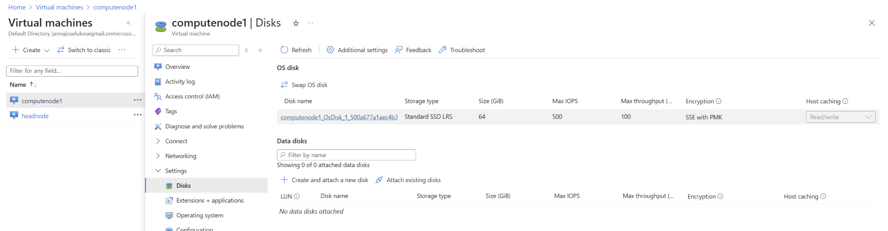

# Creating a Snapshot

At this point you are ready to run HPL on your cluster with two compute nodes. From your Virtual Machine dasboard on Azure, navigate to the node which you wish to create a snapshot of. Go to <b>`Disk -> Name of the actual Disk -> +Create Snapshot.`</b>

Once there, simply choose an adequate Name for the snapshot, ensure that the *Snapshot Type* is ‘Full’ and 
click **Review + Create.**

>[!TIP]
> A suitable name for the snapshot would be <b>computenode2</b>

Creating the actual VM from the snapshot requires two steps. First navigate to the snapshot and click **`+ Create Disk.`**

>[!TIP]
>Simply choose an adequate name (no other changes need to be made) when creating the disk. 

Then navigate to the newly created disk and click **`+ Create VM.`** Ensure that everything is set up as in Tutorial 1, choosing an adequate name once again, and then *Review + Create.*

Navigate back to the Virtual Machine dashboard and your second compute node should be <b>deployed and running.</b> 

