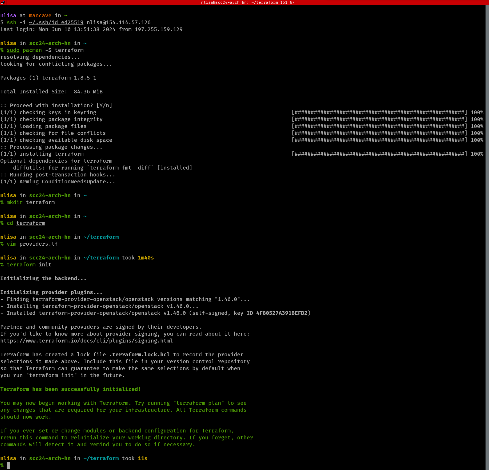
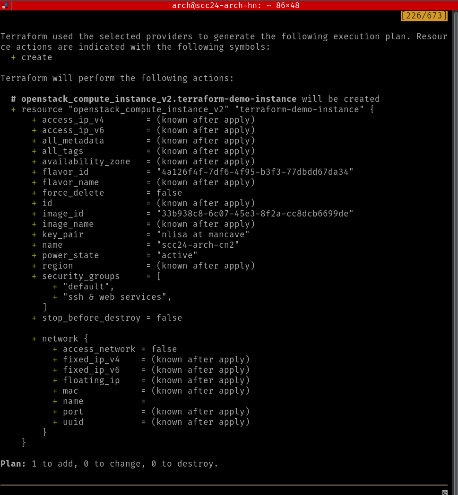

# Student Cluster Compeititon - Tutorial 4

## Table of Contents
<!-- markdown-toc start - Don't edit this section. Run M-x markdown-toc-refresh-toc -->

- [Student Cluster Compeititon - Tutorial 4](#student-cluster-compeititon---tutorial-4)
  - [Table of Contents](#table-of-contents)
- [Checklist](#checklist)
  - [(Delete) - Remote Web Service Access](#delete---remote-web-service-access)
- [Prometheus](#prometheus)
  - [Prometheus](#prometheus-1)
  - [Node Exporter](#node-exporter)
  - [Grafana](#grafana)
- [Slurm Scheduler and Workload Manager](#slurm-scheduler-and-workload-manager)
  - [Prerequisites](#prerequisites)
  - [Head Node Configuration (Server)](#head-node-configuration-server)
  - [Compute Node Configuration (Clients)](#compute-node-configuration-clients)
  - [Configure Grafana Dashboard for Slurm](#configure-grafana-dashboard-for-slurm)
- [GROMACS Protein Visualisation](#gromacs-protein-visualisation)
- [Running Qiskit from a Remote Jupyter Notebook Server](#running-qiskit-from-a-remote-jupyter-notebook-server)
- [Automating the Deployment of your OpenStack Instances Using Terraform](#automating-the-deployment-of-your-openstack-instances-using-terraform)
- [Continuous Integration Using CircleCI](#continuous-integration-using-circleci)
- [Automating the Configuration of your VMs Using Ansible](#automating-the-configuration-of-your-vms-using-ansible)

<!-- markdown-toc end -->

# Checklist

This tutorial demonstrates _cluster monitoring_ and _workload scheduling_. These two components are critical to a typical HPC environment. Monitoring is a widely used component in system administration (including enterprise datacentres and corporate networks). Monitoring allows administrators to be aware of what is happening on any system that is being monitored and is useful to proactively identify where any potential issues may be. A workload scheduler ensures that users' jobs are handled properly to fairly balance all scheduled jobs with the resources available at any time.

In this tutorial you will:

- [ ] Install Prometheus on your head node.
- [ ] Install Node Exporter on your compute node(s).
- [ ] Install and configure Grafana on your headnode.
- [ ] Install the Slurm workload manager across your cluster.
- [ ] Submit a test job to run on your cluster through the newly-configured workload manager.

<div style="page-break-after: always;"></div>

In this tutorial you will:

- [ ] Create Slurm batch scripts to submit jobs for your benchmark runs.
- [ ] Optimise HPL.
- [ ] Download and compile the High Performance Computing Challenge (HPCC) benchmark.

> [!TIP]
> You're going to be manipulating both your headnode, as well as your compute node(s) in this tutorial.
>
> You are *strongly* advised to make use of a terminal multiplexer, such as `tmux` before making a connection to your VMs.
>
>```bash
>$ tmux
>```
>
> Split the window into two separate panes with `ctrl + b |`.
> SSH into your headnode, on the one pane, and ssh into your compute node with a hop over your headnode, recall the jumpbox directive.
>
> **************Insert image of terminal here***************

<div style="page-break-after: always;"></div>

## (Delete) - Remote Web Service Access

During the course of the competition, you will set up services on your head node that you need to access via a web browser. Considering that your cluster is not directly accessible from the internet, you will need to create an **SSH tunnel** (utilising port forwarding) between your local machine and your head node to access these webpages.

> **! >>> Please read and familiarise yourself with the concept of a _port_ before continuing:**
> - **[Dummies.com - Network Basics: TCP/UDP Socker and Port Overview](https://www.dummies.com/programming/networking/cisco/network-basics-tcpudp-socket-and-port-overview/)**
> - **[Wikipedia - Port (computer networking)](https://en.wikipedia.org/wiki/Port_(computer_networking))**

We'll demonstrate how this is done. First, let's create a simple web page that you can serve from your head node. To do this, you need to install a web server. [Apache](https://httpd.apache.org/) is a standard and widely used open-source web server. To install it:

```bash
~$ dnf install httpd
```

You'll then need to enable and start the web server service.

```bash
~$ systemctl start httpd   # Starts the service
~$ systemctl enable httpd  # Sets service to start on reboot automatically
```
Confirm that it's up and running with the following:

```bash
~$ systemctl status httpd
```

You now have a running web server. Apache has a default available test-page, but since **the networks for your cluster aren't available outside the ACE Lab private network**, you **can't** simply type the IP address of the head node into your local web browser to access it. To access the test-page (served by your head node) you must establish a tunnel between your local machine and the head node, using the ACE Lab login node (ssh.ace.chpc.ac.za) as a middle-man. This is done using `ssh`.

You need to establish a specific SSH tunnel to achieve this. The specific tunnel demonstrated below is known as an SSH forward tunnel, or SSH local port forwarding. To achieve this, you must tell the `ssh` client on your **local machine (computer at home)** that you will be sending and receiving data to and from a specific port on the **target machine (your head node in this case)** via a specific port on your **local machine**.

Once this tunnel is established, you will be able to open your **local web browser** and access the **local port (the one that you configured to have data forwarded to from the head node)** to see the data forwarded from the target port. Connecting to the local port will request that the data be sent from the target machine - showing you the web page as if you were on the same network as the head node.

Web traffic is by default served on **port 80**. This is thus chosen as the **target port on the head node**, as you want to be able to view this web traffic on your local computer. For the **local port**, we can choose **any port number greater than 1000**, as anything over 1000 is non-system and non-privileged (doesn't require root access).

> **! >>> Please note that the IP address used below is an example.**
> **! >>> The IP address to use instead of 192.168.0.xx is your HEADNODE public IP.**

<span id="fig1.1" class="img_container center" style="font-size:8px;margin-bottom:0px; display: block;">
    
    <span class="img_caption" style="display: block; text-align: center;margin-left: auto;
    margin-right: auto; width: 50%;"><i>Figure 1.1: SSH -L tunnel as described below.</i></span>
</span>

1. Firstly, let us allow web traffic through the head node firewall (this is done on the **head node**):

    ```bash
    ~$ firewall-cmd --zone=external --add-service=http --permanent
    ~$ firewall-cmd --reload
    ```

2. On your **local machine**, open up the tunnel from the head node's port 80 to your machine's port 8080 ([Figure 1.1](#fig1.1)):

    ```bash
    ~$ ssh -L 8080:10.128.24.XX:80 <team_name>@ssh.ace.chpc.ac.za
    ```

    This command uses the following syntax:

    ```
    ssh -L <localhost_port:target_host:target_host_port> <username>@<remote_host>
    ```

    The `-L` specifies that you want to create a port forward to/from your `<localhost_port>` to the `<target_host_port>` of the `<target_host>`.

3. Open up your browser and visit:

    ```bash
    http://127.0.0.1:8080 # 127.0.0.1 is a reference to your own machine, you could also say http://localhost:8080
    ```

If it is up and running correctly, you should see the default test-page for your Apache server ([Figure 1.2](#fig1.2)).

<span id="fig1.2" class="img_container center" style="font-size:8px;margin-bottom:0px; display: block;">
    
    <span class="img_caption" style="display: block; text-align: center;margin-left: auto;
    margin-right: auto; width: 50%;"><i>Figure 1.2: The default page for the Apache web server seen through the local browser.</i></span>
</span>

**Windows users with PuTTY, please follow this guide: [https://stackoverflow.com/questions/4974131/how-to-create-ssh-tunnel-using-putty-in-windows/29168936#29168936](https://stackoverflow.com/questions/4974131/how-to-create-ssh-tunnel-using-putty-in-windows/29168936#29168936).**

To clarify, what the `ssh` command above does is the following:

The `-L 8080:10.128.24.XX:80` tells the `ssh` client that you want to map your local machine port `8080` to the head node's port `80`. However, your local machine can't reach the head node directly since you're not on the same network. In order to know how to get to the head node, you still connect to the login node for the ACE Lab, which is why you specify the `<team_name>@ssh.ace.chpc.ac.za`. The `ssh` client will know to map your port `8080` to the head node's port `80` **via** `ssh.ace.chpc.ac.za`.


<div style="page-break-after: always;"></div>


# Prometheus
Prometheus is an open-source monitoring and alerting toolkit designed for reliability and scalability. It collects metrics from various endpoints at specified intervals, storing the data in a time-series database. With its powerful query language, PromQL, Prometheus enables the analysis of these metrics. Additionally, Prometheus can trigger alerts based on predefined conditions using its Alertmanager component. This makes it a comprehensive tool for monitoring and alerting, suitable for various environments and applications. Prometheus can be [installed](https://prometheus.io/docs/prometheus/latest/installation/) using either pre-compiled binaries, source, docker containers or from configuration management systems such as Ansible or Puppet.

For this tutorial we will install from pre-complied binaries.

## Prometheus
The installation and the configuration of Prometheus should be done on your headnode.

1. Create a Prometheus user without login access, this will be done manually as shown below:
 ```bash
    sudo useradd --no-create-home --shell /sbin/nologin prometheus
 ```
2. Download the latest stable version of Prometheus from the official site using `wget`
 ```bash
  wget https://github.com/prometheus/prometheus/releases/download/v2.33.1/prometheus-2.33.1.linux-amd64.tar.gz 
 ```
3. Long list file to verify Prometheus was downloaded 
 ```bash
    ll
 ```
4. Extract the downloaded archive and move prometheus binaries to the /usr/local/bin directory.
 [Unit] 
Description=Prometheus Monitoring 
Wants=network-online.target 
After=network-online.target 
[Service] 
User=prometheus 
Group=prometheus 
Type=simple 
ExecStart=/usr/local/bin/prometheus \ 
  --config.file=/etc/prometheus/prometheus.yml \ 
  --storage.tsdb.path=/var/lib/prometheus/ \ 
  --web.console.templates=/etc/prometheus/consoles \ 
  --web.console.libraries=/etc/prometheus/console_libraries 
[Install] 
WantedBy=multi-user.target
5. Move back to the home directory, create directorise for prometheus.
 ```bash
    cd ~
    sudo mkdir /etc/prometheus 
    sudo mkdir /var/lib/prometheus 
 ```
6. Set the correct ownership for the prometheus directories
 ```bash
    sudo chown prometheus:prometheus /etc/prometheus/ 
    sudo chown prometheus:prometheus /var/lib/prometheus
 ```
7. Move the configuration file and set the correct permissions 
 ```bash
    cd prometheus-2.33.1.linux-amd64 
    sudo mv consoles/ console_libraries/ prometheus.yml /etc/prometheus/ 
    sudo chown -R prometheus:prometheus /etc/prometheus/ 
 ```
8. Configure Prometheus
  Edit the `/etc/prometheus/prometheus.yml` file to configure your targets (compute node):
```yaml
global:
  scrape_interval: 15s

scrape_configs:
  - job_name: 'prometheus'
    static_configs:
      - targets: ['localhost:9090']
  - job_name: 'compute_node'
    static_configs:
      - targets: ['<compute_node_ip>:9100']
```
9.  Create a service file to manage Prometheus with `systemctl`, the file can be created with the text editor `vim` (Can use any text editor of your choice)
 ```bash
    sudo vim /etc/systemd/system/prometheus.service
 ```
 ```plaintext
  [Unit] 
  Description=Prometheus Monitoring 
  Wants=network-online.target 
  After=network-online.target 

  [Service] 
  User=prometheus 
  Group=prometheus 
  Type=simple 
  Restart=on-failure 
  RestartSec=5s
  ExecStart=/usr/local/bin/prometheus \ 
    --config.file=/etc/prometheus/prometheus.yml \ 
    --storage.tsdb.path=/var/lib/prometheus/ \ 
    --web.console.templates=/etc/prometheus/consoles \ 
    --web.console.libraries=/etc/prometheus/console_libraries
    --web.listen-address=0.0.0.0:9090 \ 
    --web.enable-lifecycle \ 
    --log.level=info

  [Install] 
  WantedBy=multi-user.target
```
10. Reload the systemd daemon, start and enable the service
 ```bash
  sudo systemctl deamon-reload
  sudo systemctl enable prometheus 
  sudo systemctl start prometheus
 ```

11. Check that your service is active by checking the status
  ```bash
  sudo systemctl status prometheus
  ``` 

> [!TIP]
> If when you check the status and find that the service is not running, ensure SELinux or AppArmor is not restricting Prometheus from running. Try disabling SELinux/AppArmor temporarily to see if it resolves the issue:
> 
> ```bash
> sudo setenforce 0
> ```
> 
> Then repeat steps 10 and 11.
>
> If the prometheus service still fails to start properly, run the command journalctl –u 	prometheus -f --no-pager and review the output for errors.

## Node Exporter
Node Exporter is a Prometheus exporter specifically designed for hardware and OS metrics exposed by Unix-like kernels. It collects detailed system metrics such as CPU usage, memory usage, disk I/O, and network statistics. These metrics are exposed via an HTTP endpoint, typically accessible at `<node_ip>:9100/metrics`. The primary role of Node Exporter is to provide a source of system-level metrics that Prometheus can scrape and store. This exporter is crucial for gaining insights into the health and performance of individual nodes within a network.

The installation and the configuration node exporter will be done on the compute node/s

1. Create a Node Exporter User
 ```bash
  sudo useradd --no-create-home --shell /bin/false node_exporter
```
2. Download and Install Node Exporter, this is done using `wget` as done before
 ```bash
  cd /tmp
  wget https://github.com/prometheus/node_exporter/releases/download/v1.6.1/node_exporter-1.6.1.linux-amd64.tar.gz
  tar xvf node_exporter-1.6.1.linux-amd64.tar.gz
```
3. Copy the installation file to the correct location and create the onwership of the file
```bash
  sudo cp node_exporter-1.6.1.linux-amd64/node_exporter /usr/local/bin/
  sudo chown node_exporter:node_exporter /usr/local/bin/node_exporter
``` 
4.  Create a service file to manage Node Exporter with `systemctl`, the file can be created with the text editor `vim` (Can use any text editor of your choice)
 ```bash
    sudo vim /etc/systemd/system/node_exporter.service
 ```
 ```plaintext
  [Unit] 
  Description=Node Exporter
  Wants=network-online.target
  After=network-online.target

  [Service] 
  User=node_exporter
  Group=node_exporter
  Type=simple
  ExecStart=/usr/bin/node_exporter \ 
  --web.listen-address=:9100

  [Install] 
  WantedBy=multi-user.target
```
> [!IMPORTANT]
> If firewalld is enabled and running, add a rule for port 9100 
> 
> ```bash
> sudo firewall-cmd --permanent --zone=public --add-port=9100/tcp
> sudo firewall-cmd --reload 
> ```

5.  Reload the systemd daemon, start and enable the service
 ```bash
  sudo systemctl deamon-reload
  sudo systemctl enable node_exporter 
  sudo systemctl start node_exporter
 ```
6. Check that your service is active by checking the status
  ```bash
  sudo systemctl status node_exporter
  ``` 


## Grafana
Grafana is an open-source platform for monitoring and observability, known for its capability to create interactive and customizable dashboards. It integrates seamlessly with various data sources, including Prometheus. Through its user-friendly interface, Grafana allows users to build and execute queries to visualize data effectively. Beyond visualization, Grafana also supports alerting based on the visualized data, enabling users to set up notifications for specific conditions. This makes Grafana a powerful tool for both real-time monitoring and historical analysis of system performance.

Now we go back to the headnode for the installation and the configuration of Grafana
 1. Add the Grafana Repository, by adding the following directives in this file:
```bash
  sudo vim /etc/yum.repos.d/grafana.repo
```
 ```plaintext
  [grafana] 
  name=grafana 
  baseurl=https://rpm.grafana.com 
  repo_gpgcheck=1 
  enabled=1 
  gpgcheck=1 
  gpgkey=https://rpm.grafana.com/gpg.key 
  sslverify=1 
  sslcacert=/etc/pki/tls/certs/ca-bundle.crt 
  exclude=*beta*
```

2. Install Grafana
 ```bash
   sudo dnf install grafana -y 
```

3. Start and Enable Grafana 
 ```bash
  sudo systemctl start grafana-server
  sudo systemctl enable grafana-server
```

# Slurm Scheduler and Workload Manager

The Slurm Workload Manager (formerly known as Simple Linux Utility for Resource Management), is a free and open-source job scheduler for Linux, used by many of the world's supercomputers/computer clusters. It allows you to manage the resources of a cluster by deciding how users get access for some duration of time so they can perform work. To find out more, please visit the [Slurm Website](https://slurm.schedmd.com/documentation.html).

## Prerequisites

1. Make sure the clocks, i.e. chrony daemons, are synchronized across the cluster.

2. Generate a **SLURM** and **MUNGE** user on all of your nodes:

    - **If you have Ansible User Module working**
        - Create the users as shown in tutorial 2 **Do NOT add them to the sysadmin group**.
    - **If you do NOT have your Ansible User Module working**
       - `useradd slurm`
       - Ensure that users and groups (UIDs and GIDs) are synchronized across the cluster. Read up on the appropriate [/etc/shadow](https://linuxize.com/post/etc-shadow-file/) and [/etc/password](https://www.cyberciti.biz/faq/understanding-etcpasswd-file-format/) files.

## Head Node Configuration (Server) 


1. Install the [MUNGE](https://dun.github.io/munge/) package. MUNGE is an authentication service that makes sure user credentials are valid and is specifically designed for HPC use.

    First, we will enable the **EPEL** _(Extra Packages for Enterprise Linux)_ repository for `dnf`, which contains extra software that we require for MUNGE and Slurm:

    ```bash
      sudo dnf install epel-release
    ```

    Then we can install MUNGE, pulling the development source code from the `crb` "CodeReady Builder" repository:

    ```bash
      sudo dnf config-manager --set-enabled crb
      sudo dnf install munge munge-libs munge-devel
    ```

2. Generate a MUNGE key for client authentication:

    ```bash
      sudo /usr/sbin/create-munge-key -r
      sudo chown munge:munge /etc/munge/munge.key
      sudo chmod 600 /etc/munge/munge.key
    ```

3. Using `scp`, copy the MUNGE key to your compute node to allow it to authenticate:

    1. SSH into your compute node and create the directory `/etc/munge`. Then exit back to the head node.
   
    2. Since, munge has not yet been installed on your compute node, first transfer the file to a temporary location
    ```bash
      sudo cp /etc/munge/munge.key /tmp/munge.key && sudo chown user:user /tmp/munge.key
    ```
    **Replace user with the name of the user that you are running these commands as**

    3. Move the file to your compute node
    ```bash
      scp /etc/munge/munge.key <compute_node_name_or_ip>:/etc/tmp/munge.key
    ```

    4. Move the file to the correct location
    ```bash
      ssh <computenode hostname or ip> 'sudo mv /tmp/munge.key /etc/munge/munge.key' 
    ```

4. **Start** and **enable** the `munge` service

5. Install dependency packages:

    ```bash
    sudo dnf install gcc openssl openssl-devel pam-devel numactl numactl-devel hwloc lua readline-devel ncurses-devel man2html libibmad libibumad rpm-build perl-Switch libssh2-devel mariadb-devel perl-ExtUtils-MakeMaker rrdtool-devel lua-devel hwloc-devel
    ```

6. Download the 20.11.9 version of the Slurm source code tarball (.tar.bz2) from https://download.schedmd.com/slurm/. Copy the URL for `slurm-20.11.9.tar.bz2` from your browser and use the `wget` command to easily download files directly to your VM.

7. Environment variables are a convenient way to store a name and value for easier recovery when they're needed. Export the version of the tarball you downloaded to the environment variable VERSION. This will make installation easier as you will see how we reference the environment variable instead of typing out the version number at every instance.

    ```bash
      export VERSION=20.11.9
    ```

8. Build RPM packages for Slurm for installation

    ```bash
      sudo rpmbuild -ta slurm-$VERSION.tar.bz2
    ```

    This should successfully generate Slurm RPMs in the directory that you invoked the `rpmbuild` command from.
    
9.  Copy these RPMs to your compute node to install later, using `scp`.

10. Install Slurm server

    ```bash
      sudo dnf localinstall ~/rpmbuild/RPMS/x86_64/slurm-$VERSION*.rpm \
                            ~/rpmbuild/RPMS/x86_64/slurm-devel-$VERSION*.rpm \
                            ~/rpmbuild/RPMS/x86_64/slurm-example-configs-$VERSION*.rpm \
                            ~/rpmbuild/RPMS/x86_64/slurm-perlapi-$VERSION*.rpm \
                            ~/rpmbuild/RPMS/x86_64/slurm-slurmctld-$VERSION*.rpm
    ```

11. Setup Slurm server

    ```bash
      sudo cp /etc/slurm/slurm.conf.example /etc/slurm/slurm.conf
    ```

    Edit this file (`/etc/slurm/slurm.conf`) and set appropriate values for:

    ```conf
    ClusterName=      #Name of your cluster (whatever you want)
    ControlMachine=   #DNS name of the head node
    ```

    Populate the nodes and partitions at the bottom with the following two lines:

    ```conf
    NodeName=<computenode> Sockets=<num_sockets> CoresPerSocket=<num_cpu_cores> \ 
    ThreadsPerCore=<num_threads_per_core> State=UNKNOWN
    ```

    ```conf
    PartitionName=debug Nodes=ALL Default=YES MaxTime=INFINITE State=UP
    ```

    **To check how many cores your compute node has, run `lscpu` on the compute node.** You will get output including `CPU(s)`, `Thread(s) per core`, `Core(s) per socket` and more that will help you determine what to use for the Slurm configuration.

    **Hint: if you overspec your compute resources in the definition file then Slurm will not be able to use the nodes.**

12. Create Necessary Directories and Set Permissions:
  ```bash
    sudo mkdir -p /var/spool/slurm/ctld /var/spool/slurm/d /var/log/slurm
    sudo chown -R slurm:slurm /var/spool/slurm/ctld /var/spool/slurm/d /var/log/slurm
  ```

13. **Start** and **enable** the `slurmctld` service on the head node.

## Compute Node Configuration (Clients)

1. Setup MUNGE:

    ```bash
     sudo dnf install munge munge-libs
      sudo scp /etc/munge/munge.key <compute_node_name_or_ip>:/etc/munge/munge.key
      sudo chown munge:munge /etc/munge/munge.key
      sudo chmod 400 /etc/munge/munge.key
     ```

2. Install Slurm Client
  ```bash
    sudo dnf localinstall ~/rpmbuild/RPMS/x86_64/slurm-$VERSION*.rpm \
                     ~/rpmbuild/RPMS/x86_64/slurm-slurmd-$VERSION*.rpm \
                     ~/rpmbuild/RPMS/x86_64/slurm-pam_slurm-$VERSION*.rpm
  ```

3. Copy `/etc/slurm/slurm.conf` from head node to compute node.

4. Create necessary directories:
    ```bash
    sudo mkdir -p /var/spool/slurm/d
    sudo chown slurm:slurm /var/spool/slurm/d
    ```

5. **Start** and **enable** the `slurmd` service.

Return to your head node. To demonstrate that your scheduler is working you can run the following command as your normal user:

```bash
  sinfo 
```

You should see your compute node in an idle state.

Slurm allows for jobs to be submitted in _batch_ (set-and-forget) or _interactive_ (real-time response to the user) modes. Start an interactive session on your compute node via the scheduler with

```bash
  srun -N 1 --pty bash 
```

You should automatically be logged into your compute node. This is done via Slurm. Re-run `sinfo` now and also run the command `squeue`. Here you will see that your compute node is now allocated to this job.

To finish, type `exit` and you'll be placed back on your head node. If you run `squeue` again, you will now see that the list is empty.

<div style="page-break-after: always;"></div>

To confirm that your node configuration is correct, you can run the following command on the head node:

```bash
[...@headnode ~]$ sinfo -alN
```

The `S:C:T` column means "sockets, cores, threads" and your numbers for your compute node should match the settings that you made in the `slurm.conf` file.

## Configure Grafana Dashboard for Slurm

# GROMACS Protein Visualisation

> **! >>> You will need to work on your personal computer (or laptop) to complete this section.**

You are able to score bonus points for this tutorial by submitting a visualisation of your **adh_cubic** benchmark run. Follow the instructions below to accomplish this and upload the visualisation.

Download and install the VMD visualization tool by selecting the correct version for your operating system. For example, for a Windows machine with an Nvidia GPU select the “Windows OpenGL, CUDA” option. You may need to register on the website.

```http
https://www.ks.uiuc.edu/Development/Download/download.cgi?PackageName=VMD
```

Use the `WinSCP` application for Windows, or the `scp` command for Linux to copy the output file `confout.gro` of the **adh_cubic** benchmark from your cluster to your PC. Attempting to visualise the larger "1.5M_water" simulation is not necessary and not recommended due to memory limitations of most PCs.

1. Open VMD, select **File** then **New Module...**, click **Browse...** and select your `.gro` file.

2. Ensure the filetype was detected as **Gromacs GRO** then click **Load**. In the main VMD window you will see that 134177 particles have been loaded. You should also see the display window has been populated with your simulation particle data.

    You can manipulate the data with your mouse cursor: zoom with the mouse wheel or rotate it by dragging with the left mouse button held down. This visualisation presents a naturally occurring protein (blue/green) found in the human body, suspended in a solution of water molecules (red/white).

3. From the main VMD window, select **Graphics** then **Representations..**.

4. Under **Selected Atoms**, replace **all** with **not resname SOL** and click **apply**. You will notice the water solution around your protein has been removed, allowing you to better examine the protein.

5. In the same window, select the dropdown **Drawing Method** and try out a few different options. Select **New Cartoon** before moving on.

6. From the main VMD window, once again select **Graphics** then **Colors**. Under **Categories**, select **Display**, then **Background**, followed by **8 white**.

7. Finally, you are ready to render a snapshot of your visualisation. From the main window, select **File** then **Render...**, ensure **Snapshot...** is selected and enter an appropriate filename. Click **Start Rendering**.

Simulations like this are used to to develop and prototype experimental pharmaceutical drug designs. By visualising the output, researchers are able to better interpret simulation results.

<span style="color: #800000">
  > Copy the resulting `.bmp` file(s) from yout cluster to your local computer or laptop and demonstrate this to your instructors for bonus points.
</span>

# Running Qiskit from a Remote Jupyter Notebook Server


# Automating the Deployment of your OpenStack Instances Using Terraform

Terraform is a piece of software that allows one to write out their cloud infrastructure and deployments as code, [IaC](https://en.wikipedia.org/wiki/Infrastructure_as_code). This allows the deployments of your cloud virtual machine instances to be shared, iterated, automated as needed and for software development practices to be applied to your infrastructure.

In this section of the tutorial, you will be deploying an additional compute node from your `head node` using Terraform.

1. Use your operating system's package manager to install Terraform
   This could be your workstation or one of your VMs. The machine must be connected to the internet and have access to your
   ```bash
   sudo pacman -S terraform
   ```

1. Create a Terraform directory, descend into it and Edit the `providers.tf` file
   In order to efficiently manage your
   ```bash
   mkdir terraform
   cd terraform
   vim providers.tf
   ```

1. You must specify a [Terraform Provider](https://registry.terraform.io/browse/providers)
   These can vary from MS Azure, AWS, Google, Kubernetes etc... We will be implementing an OpenStack provider as this is what is implemented on the Sebowa cloud platform. Add the following to the `providers.tf` file.
   ```conf
   terraform {
     required_providers {
       openstack = {
         source = "terraform-provider-openstack/openstack"
         version = "1.46.0"
       g}
     }
   }
   ```
1. Initialize Terraform
   From the folder with your provider definition, execute the following command:
   ```bash
   terraform init
   ```

   <p align="center"></p>
   
1. Generate OpenStack API Credentials
   From _your_ team's Sebowa workspace, navigate to `Identity` &rarr; `Application Credentials`, and generate a set of OpenStack credentials in order to allow you to access and authenticate against your workspace.
   
   <p align="center"></p>
   
1. Download and Copy the `clouds.yml` File
   Copy the `clouds.yml` file to the folder where you initialized terraform. The contents of the of which, should be _similar_ to:
   ```config
   # This is a clouds.yaml file, which can be used by OpenStack tools as a source
   # of configuration on how to connect to a cloud. If this is your only cloud,
   # just put this file in ~/.config/openstack/clouds.yaml and tools like
   # python-openstackclient will just work with no further config. (You will need
   # to add your password to the auth section)
   # If you have more than one cloud account, add the cloud entry to the clouds
   # section of your existing file and you can refer to them by name with
   # OS_CLOUD=openstack or --os-cloud=openstack
   clouds:
     openstack:
       auth:
         auth_url: https://sebowa.nicis.ac.za:5000
         application_credential_id: "<YOUR TEAM's APPLICATION CREDENTIAL ID"
         application_credential_secret: "<YOUR TEAM's APPLICATION CREDENTIAL SECRET>"
       region_name: "RegionOne"
       interface: "public"
       identity_api_version: 3
       auth_type: "v3applicationcredential"
   ```
1. Create `main.tf` Terraform File
   Inside your `terraform` folder, you must define a `main.tf` file. This file is used to identify the provider to be implemented as well as the compute resource configuration details of the instance we would like to launch.
   
   You will need to define your own `main.tf` file, but below is an example of one such definition:
   ```config
   provider "openstack" {
     cloud = "openstack"
   }
   resource "openstack_compute_instance_v2" "terraform-demo-instance" {
     name = "scc24-arch-cn2"
     image_id = "33b938c8-6c07-45e3-8f2a-cc8dcb6699de"
     flavor_id = "4a126f4f-7df6-4f95-b3f3-77dbdd67da34"
     key_pair = "nlisa at mancave"
     security_groups = ["default", "ssh & web services"]
   
     network {
       name = "nlisa-vxlan"
     }
   }
   ```
   
> [!NOTE]
> You must specify your own variables for `name`, `image_id`, `flavor_id`, `key_pair` and `network.name`.

1. Generate and Deploy Terraform Plan
   Create a Terraform plan based on the current configuration. This plan will be used to implement changes to your Sebowa OpenStack cloud workspace, and can be reviewed before applying those changes.
   Generate a plan and write it to disk:
   ```bash
   terraform plan -out ~/terraform/plan
   ```
   
   <p align="center"></p>
   
   Once you are satisfied with the proposed changes, deploy the terraform plan:
   ```bash
   terraform apply ~terraform/plan
   ```
   
   <p align="center"></p>
   
1. Verify New Instance Successfully Created by Terraform
   Finally confirm that your new instance has been successfully created. On your Sebowa OpenStack workspace, navigate to `Project` &rarr; `Compute` &rarr; `Instances`.

> [!TIP]
> To avoid losing your team's progress, it would be a good idea to create a GitHub repo in order for you to commit and push your changes.

# Continuous Integration Using CircleCI

Circle CI is a Continuous Integration and Continuous Delivery platform that can be utilized to implement DevOps practices.

In this section of the tutorials you're going to be expanding on the OpenStack instance automation with CircleCI `Workflows` and `Pipelines`. For this tutorial you will be using your GitHub account which will integrate directly into CircleCI.

1. Create GitHub Repository
   If you haven't already done so, sign up for a [GitHub Account](https://github.com/). Then create an empty private repository with a suitable name, i.e. `deploy_compute_node`:
   
   <p align="center"></p>
   
   Add your team members to the repository to provide them with access:
   <p align="center"></p>
   
   If you haven't already done so, add your SSH key to your GitHub account by following the instructions from [Steps to follow when editing existing content](../README.md#steps-to-follow-when-editing-existing-content).
   
> [!TIP]
> You will be using your head node to orchestrate and configure your infrastructure. Pay careful attention to ensure that you copy over your **head node**'s public SSH key. Administrating and managing your compute nodes in this manner requires you to think about them as "cattle" and not "pets".

1. Reuse `providers.tf` and `main.tf` Terraform Configurations
   
   On your head node, create a folder that is going to be used to initialize the GitHub repository:
   ```bash
   mkdir ~/deploy_compute_node
   cd ~/deploy_compute_node
   ```
   
   Copy the `providers.tf` and `main.tf` files you had previously generated:
   
   ```bash
   cp ~/terraform/providers.tf ./
   cp ~/terraform/main.tf ./
   vim main.tf
   ```
   
1. Create `.circleci/config.yml` File
   
   The `.circle/config.yml` configuration file is where you define your build, test and deployment process. From your head node, you are going to be `pushing` your Infrastructure as Code to your private GitHub repository. This will then automatically trigger the CircleCI deployment of a Docker container which has been tailored for Terraform operations and instructions that will deploy your Sebowa OpenStack compute node instance.
   
   Create and edit `.circleci/config.yml`:
   ```bash
   mkdir .circleci
   vim .circleci/config.yml # Remember that if you are not comfortable using Vim, install and make use of Nano
   ```
   
   Copy the following configuration into `.circle/config.yml`:
   ```conf
   version: 2.1

   jobs:
     deploy:
       docker:
         - image: hashicorp/terraform:latest
       steps:
         - checkout
   
         - run:
             name: Create clouds.yaml
             command: |
               mkdir -p ~/.config/openstack
               echo "clouds:
                 openstack:
                   auth:
                     auth_url: https://sebowa.nicis.ac.za:5000
                     application_credential_id: ${application_credential_id}
                     application_credential_secret: ${application_credential_secret}
                   region_name: "RegionOne"
                   interface: "public"
                   identity_api_version: 3
                   auth_type: "v3applicationcredential"" > ~/.config/openstack/clouds.yaml
   
         - run:
             name: Terraform Init
             command: terraform init
   
         - run:
             name: Terraform Apply
             command: terraform apply -auto-approve
             
   workflows:
     version: 2
     deploy_workflow:
     jobs:
       - deploy

   ```
     - **Version**: Specifies the configuration version.
     - **Jobs**: Defines the individual steps in the build process, where we've defined a `build` job that runs inside the latest Terraform Docker container from Hashicorp.
     - **Steps**: The steps to execute within the job:
       * `checkout`: Clone and checkout the code from the repository.
       * `run`: Executes a number of shell commands to create the `clouds.yaml` file, then initialize and apply the Terraform configuration.
     - **Workflows**: Defines the workflow(s) that CircleCI will follow, where in this instance there is a single workflow specified `deploy_workflow`, that runs the `deploy` job.
   
1. `Init`ialize the Git Repository, `add` the files you've just created and `push` to GitHub:
   Following the instructions from the previous section where you created a new GitHub repo, execute the following commands from your head node, inside the `deploy_compute_node` folder:
   ```bash
   cd ~/deploy_compute_node
   git init
   git add .
   git commit -m "Initial Commit." # You may be asked to configure you Name and Email. Follow the instructions on the screen before proceeding.
   git branch -M main
   git remote add origin git@github.com:<TEAM_NAME>/deploy_compute_node.git
   git push -u origin main
   ```
   The new files should now be available on GitHub.

1. Create a CircleCI Account and Add a Project
   Navigate to [CircleCI.com](https://circleci.com)
   
   <p align="center"></p>
   <p align="center"></p>
   <p align="center"></p>
   <p align="center"></p>
   <p align="center"></p>
   <p align="center"></p>

# Automating the Configuration of your VMs Using Ansible
Use Ansible to install and configure NTP Client

1. Edit your `main.tf` File

   Add the following configuration to the end of the `main.tf` file, that generates a variable to store the IP address of the newly created instance:
   ```conf
   output "instance_ip" {
     value = openstack_compute_instance_v2.terraform-demo-instance.network.0.fixed_ip_v4
   }

   ```
