# Student Cluster Competition - Tutorial 4

## Table of Contents

<!-- markdown-toc start - Don't edit this section. Run M-x markdown-toc-refresh-toc -->

1. [Checklist](#checklist)
1. [Cluster Monitoring](#cluster-monitoring)
   1. [Install Docker Engine, Containerd and Docker Compose](#install-docker-engine-containerd-and-docker-compose)
   1. [Installing your Monitoring Stack](#installing-your-monitoring-stack)
   1. [Startup and Test the Monitoring Services](#startup-and-test-the-monitoring-services)
   1. [SSH Port Local Forwarding Tunnel](#ssh-port-local-forwarding-tunnel)
   1. [Create a Dashboard in Grafana](#create-a-dashboard-in-grafana)
   1. [Success State, Next Steps and Troubleshooting](#success-state-next-steps-and-troubleshooting)
1. [Configuring and Connecting to your Remote JupyterLab Server](#configuring-and-connecting-to-your-remote-jupyterlab-server)
   1. [Visualize Your HPL Benchmark Results](#visualize-your-hpl-benchmark-results)
   1. [Visualize Your Qiskit Results](#visualize-your-qiskit-results)
1. [Automating the Deployment of your OpenStack Instances Using Terraform](#automating-the-deployment-of-your-openstack-instances-using-terraform)
   1. [Install and Initialize Terraform](#install-and-initialize-terraform)
   1. [Generate `clouds.yml` and `main.tf` Files](#generate-cloudsyml-and-maintf-files)
   1. [Generate, Deploy and Apply Terraform Plan](#generate-deploy-and-apply-terraform-plan)
1. [Continuous Integration Using CircleCI](#continuous-integration-using-circleci)
   1. [Prepare GitHub Repository](#prepare-github-repository)
   1. [Reuse `providers.tf` and `main.tf` Terraform Configurations](#reuse-providerstf-and-maintf-terraform-configurations)
   1. [Create `.circleci/config.yml` File and `push` Project to GitHub](#create-circleciconfigyml-file-and-push-project-to-github)
   1. [Create CircleCI Account and Add Project](#create-circleci-account-and-add-project)
1. [Automating HPL Runs Using Ansible Playbooks and CircleCI](#automating-hpl-runs-using-ansible-playbooks-and-circleci)
   1. [Installing Ansible](#installing-ansible)
   1. [Setting Up the Ansible Playbook](#setting-up-the-ansible-playbook)
      1. [ansible.cfg](#ansiblecfg)
      1. [inventory.yml](#inventoryyml)
      1. [install_hpl.yml](#install_hplyml)
      1. [install_deps](#install_deps)
      1. [install_blas](#install_blas)
      1. [install_mpi](#install_mpi)
      1. [install_hpl](#install_hpl)
      1. [run_hpl](#run_hpl)
   1. [CircleCI Integration](#circleci-integration)
      1. [main.tf](#maintf)
      1. [config.yml](#configyml)
      1. [Set Up SSH Key](#set-up-ssh-key)
      1. [fix_apt.sh](#fix_aptsh)
      1. [setup_nfs.sh](#setup_nfssh)
1. [Slurm Scheduler and Workload Manager](#slurm-scheduler-and-workload-manager)
   1. [Prerequisites](#prerequisites)
   1. [Head Node Configuration (Server)](#head-node-configuration-server)
   1. [Compute Node Configuration (Clients)](#compute-node-configuration-clients)
1. [GROMACS Application Benchmark](#gromacs-application-benchmark)
   1. [Protein Visualization](#protein-visualization)
   1. [Benchmark 2 (1.5M Water)](#benchmark-2-15m-water)

<!-- markdown-toc end -->

# Checklist

This tutorial demonstrates _cluster monitoring_, _data visualization_, _automated infrastructure as code deployment_ and _workload scheduling_. These components are critical to a typical HPC environment.

Monitoring is a widely used component in system administration (including enterprise datacentres and corporate networks). Monitoring allows administrators to be aware of what is happening on any system that is being monitored and is useful to proactively identify where any potential issues may be.

Interpreting and understanding your results and data, is vital to making meaning implementations of said data. You will also automate the provisioning and deployment of your _"experimental"_, change management compute node. Lastly, a workload scheduler ensures that users' jobs are handled properly to fairly balance all scheduled jobs with the resources available at any time.

You will also cover data interpretation and visualization for previously run benchmark applications.

In this tutorial you will:

- [ ] Setup a monitoring stack using Docker Compose
  - [ ] Install and setup the pre-requisites
  - [ ] Create all the files required for configuring the 3 containers to be launched
    - [ ] The docker-compose.yml file describing the Node-Exporter, Prometheus and Grafana services
    - [ ] The prometheus.yml file describing the metrics to be scraped for each host involved
    - [ ] The prometheus-datasource.yaml file describing the Prometheus datasource for Grafana
  - [ ] Start the services
    - [ ] Verify that they are running and accessible (locally, and externally)
  - [ ] Create a dashboard in Grafana
    - [ ] Login to the Grafana endpoint (via your browser)
    - [ ] Import the appropriate Node-Exporter dashboard
    - [ ] Check that the dashboard is working as expected
- [ ] Prepare, install and configure remote JupyterLab server
  - [ ] Connect to JupyterLab and visualize benchmarking results
- [ ] Automate the provisioning and deployment of your Sebowa OpenStack infrastructure
- [ ] Install the Slurm workload manager across your cluster.
- [ ] Submit a test job to run on your cluster through the newly-configured workload manager.

> [!TIP]
> You're going to be manipulating both your headnode, as well as your compute node(s) in this tutorial.
>
> You are **strongly** advised to make use of a terminal multiplexer, such as `tmux` before making a connection to your VMs. Once you're logged into your head node, initiate a `tmux` session:
>
> ```bash
> tmux
> ```
>
> Then split the window into two separate panes with `ctrl + b %`.
> SSH into your compute node on the other pane.

# Cluster Monitoring

Cluster monitoring is crucial for managing Linux machines. Effective monitoring helps detect and resolve issues promptly, provides insights into resource usage (CPU, memory, disk, network), aids in capacity planning, and ensures infrastructure scales with workload demands. By monitoring system performance and health, administrators can prevent downtime, reduce costs, and improve efficiency.


- **Traditional Approach Using `top` or `htop`**

  Traditionally, Linux system monitoring involves command-line tools like `top` or `htop`. These tools offer real-time system performance insights, displaying active processes, resource usage, and system load. While invaluable for monitoring individual machines, they lack the ability to aggregate and visualize data across multiple nodes in a cluster, which is essential for comprehensive monitoring in larger environments.

  

- **Using Grafana, Prometheus, and Node Exporter**

  Modern solutions use Grafana, Prometheus, and Node Exporter for robust and scalable monitoring. Prometheus collects and stores metrics, Node Exporter provides system-level metrics, and Grafana visualizes this data. This combination enables comprehensive cluster monitoring with historical data analysis, alerting capabilities, and customizable visualizations, facilitating better decision-making and faster issue resolution.

  

- **What is Docker and Docker Compose and How We Will Use It**

  Docker is a platform for creating, deploying, and managing containerized applications. Docker Compose defines and manages multi-container applications using a YAML file. For cluster monitoring on a Rocky Linux head node, we will use Docker and Docker Compose to bundle Grafana, Prometheus, and Node Exporter into deployable containers. This approach simplifies installation and configuration, ensuring all components are up and running quickly and consistently, streamlining the deployment of the monitoring stack.

> [!NOTE]
> When the word **Input:** is mentioned, excpect the next line to have commands that you need to copy and paste into your own terminal.
>
> Whenever the word **Output:** is mentioned **DON'T** copy and paste anything below this word as this is just the expected output.
>
> The following configuration is for your **head node**. You will be advised of the steps you need to take to monitor your **compute node(s)** at the end.

## Install Docker Engine, Containerd and Docker Compose

You will need to have `docker`, `containerd` and `docker-compose` installed on all the nodes that you want to eventually monitor, i.e. your head node and compute node(s).

1. Prerequisites and dependencies

   Refer to the following [RHEL Guide](https://docs.docker.com/engine/install/rhel/#install-using-the-repository)

   - DNF / YUM

   ```bash
   # The yum-utils package which provides the yum-config-manager utility
   sudo yum install -y yum-utils

   # Add and set up the repository for use.
   sudo yum-config-manager --add-repo https://download.docker.com/linux/rhel/docker-ce.repo
   ```

   - APT

   ```bash
   # Install required package dependencies
   sudo apt install apt-transport-https ca-certificates curl software-properties-common -y

   # Add the Docker repository
   curl -fsSL https://download.docker.com/linux/ubuntu/gpg | sudo apt-key add -
   sudo add-apt-repository "deb [arch=amd64] https://download.docker.com/linux/ubuntu $(lsb_release -cs) stable"

   ```

1. Installation

   - DNF / YUM

   ```bash
   # If prompted to accept the GPG key, verify that the fingerprint matches, accept it.
   sudo yum install docker-ce docker-ce-cli containerd.io docker-buildx-plugin docker-compose-plugin
   ```

   - APT

   ```bash
   sudo apt update
   sudo apt install docker-ce docker-ce-cli containerd.io -y
   ```

   - Arch

   ```bash
   sudo pacman -S docker

   # You need to start and enable docker, prior to installing containerd and docker-compose
   sudo pacman -S containerd docker-compose
   ```

1. Start and Enable Docker:
   ```bash
   sudo systemctl start docker
   sudo systemctl enable docker
   ```
1. Install Docker-Compose on Ubuntu
   - APT
   ```bash
   sudo curl -L "https://github.com/docker/compose/releases/download/$(curl -s https://api.github.com/repos/docker/compose/releases/latest | grep -Po '"tag_name": "\K.*\d')/docker-compose-$(uname -s)-$(uname -m)" -o /usr/local/bin/docker-compose
   sudo chmod +x /usr/local/bin/docker-compose
   ```
1. Verify that the Docker Engine installation was successful by running the `hello-world` image

   Download and deploy a test image and run it inside a container. When the container runs, it prints a confirmation message and exits.

   ```bash
   # Check the verions of Docker
   docker --version

   # Download and deplpoy a test image
   sudo docker run hello-world

   # Check your version of Docker Compose
   docker-compose --version
   ```

   You have now successfully installed and started Docker Engine.

## Installing your Monitoring Stack

1. Create a suitable directory, e.g. `/opt/monitoring_stack`

   This which you’ll keep a number of important configuration files.

   ```bash
   sudo mkdir /opt/monitoring_stack/
   cd /opt/monitoring_stack/
   ```

1. Create and edit your monitoring configurations files
   ```bash
   sudo nano /opt/monitoring_stack/docker-compose.yml
   ```
1. Add the following to the `docker-compose.yml` YAML file

   ```conf
   version: '3'
   services:
     node-exporter:
       image: prom/node-exporter
       ports:
         - "9100:9100"
       restart: always
       networks:
         - monitoring-network

     prometheus:
       image: prom/prometheus
       ports:
         - "9090:9090"
       restart: always
       volumes:
         - /opt/monitoring_stack/prometheus.yml:/etc/prometheus/prometheus.yml
       networks:
         - monitoring-network

     grafana:
       image: grafana/grafana
       ports:
         - "3000:3000"
       restart: always
       environment:
         GF_SECURITY_ADMIN_PASSWORD: <SET_YOUR_GRAFANA_PASSWORD>
       volumes:
         - /opt/monitoring_stack/prometheus-datasource.yaml:/etc/grafana/provisioning/datasources/prometheus-datasource.yaml
       networks:
         - monitoring-network

   networks:
     monitoring-network:
       driver: bridge
   ```

1. Create and edit your Prometheus configuration files

   ```bash
     sudo nano /opt/monitoring_stack/prometheus.yml
   ```

1. Add the following to your `prometheus.yml` YAML file

   ```conf
   global:
     scrape_interval: 15s

   scrape_configs:
     - job_name: 'node-exporter'
       static_configs:
         - targets: ['node-exporter:9100']
   ```

1. Configure you Promeheus Data Sources
   ```bash
   sudo nano /opt/monitoring_stack/prometheus-datasource.yaml
   ```
1. Add the following to your `prometheus-datasource.yaml`.
   ```conf
   apiVersion: 1
   datasources:
     - name: Prometheus
       type: prometheus
       access: proxy
       url: http://prometheus:9090
   ```

## Startup and Test the Monitoring Services

> [!TIP]
> If you've successfully configured nftables, you will be required to open the following TCP ports 3000, 9090, 9100.

Bring up your monitoring stack and verify that the have been correctly configured

- Bring up your monitoring stack

  ```bash
  sudo docker compose up -d
  ```

- Confirm the status of your Docker Containers

  ```bash
  sudo docker ps
  ```

- Dump the metrics that are being monitored from your services

  ```bash
  # Prometheus
  curl -s localhost:9090/metrics | head

  # Node Exporter
  curl -s localhost:9100/metrics | head

  # Grafana
  curl -s localhost:3000 | head
  ```

Post the output of the above commands as comments to the [Discussion](https://github.com/chpc-tech-eval/chpc24-scc-nmu/discussions/158) on GitHub.

Congratulations on correctly configuring your monitoring services!

## SSH Port Local Forwarding Tunnel

SSH port forwarding, also known as SSH tunneling, is a method of creating a secure connection between a local computer and a remote machine through an SSH (Secure Shell) connection. Local port forwarding allows you to forward a port on your local machine to a port on a remote machine. It is commonly used to access services behind a firewall or NAT.

> [!IMPORTANT]
> The following is included to demonstrate the concept of TCP Port Forwarding. In the next section, your are:
>
> - Opening a TCP Forwarding Port and listening on Port 3000 on your **workstation**, i.e. http://localhost:3000
> - You are then binding this **_SOCKET_** to TCP Port 3000 on your **head node**.
>
> The following diagram may facilitate the discussion and illustrate the scenario:
>
> ```css
> [workstation:3000] ---- SSH Forwarding Tunnel ----> [head node:3000] ---- Grafana Service on head node
>
> # Connect to Grafana's (head node) service directly from your workstation
> [http://localhost:3000] ---- SSH Forwarding Tunnel ----> [Grafana (head node)]
> ```
>
> Make sure that you understand the above concepts, as it will facilitate your understanding of the following considerations:
>
> - If you have successfully configured [WireGuard](../tutorial2/README.md#wirguard-vpn-cluster-access)
>
> ```css
> [workstation:3000] ---- WireGuard VPN ----> [head node:3000] ---- Grafana Service on head node
>
> # Connect to Grafana's (head node) service directly from your workstation
> [http://<head node (private wiregaurd ip)>:3000] ---- WireGuard VPN ----> [Grafana (head node)]
>
> ```
>
> - And / or if you have successfully configured [ZeroTier](../tutorial2/README.md#zerotier)
>
> ```css
> [workstation:3000] ---- ZeroTier VPN ----> [head node:3000] ---- Grafana Service on head node
>
> # Connect to Grafana's (head node) service directly from your workstation
> [http://<head node (private zerotier ip)>:3000] ---- ZeroTier VPN ----> [Grafana (head node)]
> ```

> [!CAUTION]
> You need to ensure that you have understood the above discussions. This section on port forwarding, is included for situations where you do know have `sudo` rights on the machine your are working on and cannot open ports or install applications via `sudo`, then you can forward ports over SSH.
>
> Take the time now however, to ensure that all of your team members understand that there are a number of methods with which you can access remote services on your head node:
>
> - http://154.114.57.x:3000
> - http://localhost:3000
> - http://`<headnode wireguard ip>`:3000
> - http://`<headnode zerotier ip>`:3000

Once you have understood the above considerations, you may proceed to create a TCP Port Forwarding tunnel, to connect your workstation's port, directly to your head node's, over a tunnel.

1. Create SSH Port Forwarding Tunnel on your local workstation

   Open a new terminal and run the tunnel command (replace 157.114.57.x with your unique IP):

   ```
   ssh -L 3000:localhost:3000 rocky@157.114.57.x
   ```

## Create a Dashboard in Grafana

1. From a browser on your **workstation** navigate to the Grafana dashboard on your head node

1. Go to a browser and login to Grafana:

   

1. Login to you Grafana dashboards

   ```
   username: admin
   password: <YOUR_GRAFANA_PASSWORD>
   ```

   

1. Go to Dashboards

   

1. Click on New then Import

   

1. Input: 1860 and click Load

   

1. Click on source: "Prometheus"

   

1. Click on Import:

   

## Success State, Next Steps and Troubleshooting

Congratulations on successfully deploying your monitoring stack and adding Grafana Dashboards to visualize this.


If you've managed to successfully configure your dash boards for your head node, repeat the steps for deploying **Node Exporter** on your compute node(s).

> [!NOTE]
> Should you have any difficulties running the above configuration, use the alternative process below to deploy your monitoring stack. Click on the heading to reveal content.

<details>
<summary>Installing your monitoring stack from pre-compiled binaries</summary>
For this tutorial we will install from pre-complied binaries.

### Prometheus

The installation and the configuration of Prometheus should be done on your headnode.

1. Create a Prometheus user without login access, this will be done manually as shown below:

```bash
sudo useradd --no-create-home --shell /sbin/nologin prometheus
```

2. Download the latest stable version of Prometheus from the official site using `wget`

```bash
wget https://github.com/prometheus/prometheus/releases/download/v2.33.1/prometheus-2.33.1.linux-amd64.tar.gz
```

3. Long list file to verify Prometheus was downloaded

```bash
ll
```

4. Extract the downloaded archive and move prometheus binaries to the /usr/local/bin directory.

```bash
tar -xvzf prometheus-2.33.1.linux-amd64.tar.gz
cd prometheus-2.33.1.linux-amd64
sudo mv prometheus promtool /usr/local/bin/
```

5. Move back to the home directory, create directorise for prometheus.

```bash
cd ~
sudo mkdir /etc/prometheus
sudo mkdir /var/lib/prometheus
```

6. Set the correct ownership for the prometheus directories

```bash
sudo chown prometheus:prometheus /etc/prometheus/
sudo chown prometheus:prometheus /var/lib/prometheus
```

7. Move the configuration file and set the correct permissions

```bash
cd prometheus-2.33.1.linux-amd64
sudo mv consoles/ console_libraries/ prometheus.yml /etc/prometheus/
sudo chown -R prometheus:prometheus /etc/prometheus/
```

8. Configure Prometheus \
   Edit the `/etc/prometheus/prometheus.yml` file to configure your targets(compute node)

   _Hint : Add the job configuration for the compute_node in the scrape_configs section of your Prometheus YAML configuration file. Ensure that all necessary configurations for this job are correctly placed within the relevant sections of the YAML file._:

```yaml
global:
  scrape_interval: 15s

scrape_configs:
  - job_name: "prometheus"
    static_configs:
      - targets: ["localhost:9090"]
  - job_name: "compute_node"
    static_configs:
      - targets: ["<compute_node_ip>:9100"]
```

9. Create a service file to manage Prometheus with `systemctl`, the file can be created with the text editor `nano` (Can use any text editor of your choice)

```bash
sudo nano /etc/systemd/system/prometheus.service
```

```plaintext
[Unit]
Description=Prometheus
Wants=network-online.target
After=network-online.target

[Service]
User=prometheus
Group=prometheus
Type=simple
Restart=on-failure
RestartSec=5s
ExecStart=/usr/local/bin/prometheus \
 --config.file=/etc/prometheus/prometheus.yml \
 --storage.tsdb.path=/var/lib/prometheus/ \
 --web.console.templates=/etc/prometheus/consoles \
 --web.console.libraries=/etc/prometheus/console_libraries

[Install]
WantedBy=multi-user.target
```

10. Reload the systemd daemon, start and enable the service

```bash
sudo systemctl daemon-reload
sudo systemctl enable prometheus
sudo systemctl start prometheus
```

11. Check that your service is active by checking the status

```bash
sudo systemctl status prometheus
```

> [!TIP]
> If when you check the status and find that the service is not running, ensure SELinux or AppArmor is not restricting Prometheus from running. Try disabling SELinux/AppArmor temporarily to see if it resolves the issue:
>
> ```bash
> sudo setenforce 0
> ```
>
> Then repeat steps 10 and 11.
>
> If the prometheus service still fails to start properly, run the command `journalctl –u prometheus -f --no-pager` and review the output for errors.

> [!IMPORTANT]
> If you have a firewall running, add a TCP rule for port 9090

Verify that your prometheus configuration is working navigating to `http://<headnode_ip>:9090` in your web browser, access prometheus web interface. Ensure that the `headnode_ip` is the public facing ip.

### Node Exporter

Node Exporter is a Prometheus exporter specifically designed for hardware and OS metrics exposed by Unix-like kernels. It collects detailed system metrics such as CPU usage, memory usage, disk I/O, and network statistics. These metrics are exposed via an HTTP endpoint, typically accessible at `<node_ip>:9100/metrics`. The primary role of Node Exporter is to provide a source of system-level metrics that Prometheus can scrape and store. This exporter is crucial for gaining insights into the health and performance of individual nodes within a network.

The installation and the configuration node exporter will be done on the **compute node/s**

1. Create a Node Exporter User

```bash
sudo adduser -M -r -s /sbin/nologin node_exporter
```

2. Download and Install Node Exporter, this is done using `wget` as done before

```bash
cd /usr/src/

sudo wget https://github.com/prometheus/node_exporter/releases/download/v1.6.1/node_exporter-1.6.1.linux-amd64.tar.gz

sudo tar xvf node_exporter-1.6.1.linux-amd64.tar.gz
```

3. Next, move the node exporter binary file to the directory '/usr/local/bin' using the following command

```bash
mv node_exporter-*/node_exporter /usr/local/bin
```

4.  Create a service file to manage Node Exporter with `systemctl`, the file can be created with the text editor `nano` (Can use any text editor of your choice)

```bash
sudo nano /etc/systemd/system/node_exporter.service
```

```plaintext
[Unit]
Description=Node Exporter
After=network.target

[Service]
User=node_exporter
Group=node_exporter
Type=simple
ExecStart=/usr/local/bin/node_exporter

[Install]
WantedBy=multi-user.target
```

> [!IMPORTANT]
> If firewalld is enabled and running, add a rule for port 9100
>
> ```bash
> sudo firewall-cmd --permanent --zone=public --add-port=9100/tcp
> sudo firewall-cmd --reload
> ```

5.  Reload the systemd daemon, start and enable the service

```bash
sudo systemctl daemon-reload
sudo systemctl enable node_exporter
sudo systemctl start node_exporter
```

6. Check that your service is active by checking the status

```bash
sudo systemctl status node_exporter
```

#### SSH Tunneling

In order to verify that node exporter is set up correctly we need to access `<node_ip>:9100/metrics`. This can only been done by simply going to your broswer and putting it in as we did with Prometheus, we need to use a SSH tunnel.

**What is SSH Tunneling?** \
SSH tunneling, also known as SSH port forwarding, is a method of securely forwarding network traffic from one network node to another via an encrypted SSH connection. It allows you to securely transmit data over untrusted networks by encrypting the traffic.

**Why Use SSH Tunneling in This Scenario?** \
In this setup, the compute node has only a private IP and is not directly accessible from the internet. The headnode, however, has both a public IP (accessible from the internet) and a private IP (in the same network as the compute node).

Using SSH tunneling allows us to:

- Access Restricted Nodes: Since the compute node is only reachable from the headnode, we can create an SSH tunnel through the headnode to access the compute node.
- Secure Transmission: The tunnel encrypts the traffic between your local machine and the compute node, ensuring that any data sent through this tunnel is secure.
- Simplify Access: By tunneling the Node Exporter port (9100) from the compute node to your local machine, you can access the metrics as if they were running locally, making it easier to monitor and manage the compute node.

  1. Set Up SSH Tunnel on Your Local Machine

```bash
ssh -L 9100:compute_node_ip:9100 user@headnode_ip -N
```

- ssh -L: This option specifies local port forwarding. It maps a port on your local machine (first 9100) to a port on a remote machine (second 9100 on compute_node_ip) via the SSH server (headnode).
- compute_node_ip:9100: The target address and port on the compute node where Node Exporter is running.
  user@headnode_ip: The SSH connection details for the headnode.
- -N: Tells SSH to not execute any commands, just set up the tunnel.

  2. By navigating to http://localhost:9100/metrics in your web browser, you can access the Node Exporter metrics from the compute node as if the service were running locally on your machine.

### Grafana

Grafana is an open-source platform for monitoring and observability, known for its capability to create interactive and customizable dashboards. It integrates seamlessly with various data sources, including Prometheus. Through its user-friendly interface, Grafana allows users to build and execute queries to visualize data effectively. Beyond visualization, Grafana also supports alerting based on the visualized data, enabling users to set up notifications for specific conditions. This makes Grafana a powerful tool for both real-time monitoring and historical analysis of system performance.

Now we go back to the headnode for the installation and the configuration of Grafana

1.  Add the Grafana Repository, by adding the following directives in this file:

```bash
sudo nano /etc/yum.repos.d/grafana.repo
```

```plaintext
 [grafana]
 name=grafana
 baseurl=https://rpm.grafana.com
 repo_gpgcheck=1
 enabled=1
 gpgcheck=1
 gpgkey=https://rpm.grafana.com/gpg.key
 sslverify=1
 sslcacert=/etc/pki/tls/certs/ca-bundle.crt
 exclude=*beta*
```

2. Install Grafana

```bash
sudo dnf install grafana -y
```

3. Start and Enable Grafana

```bash
sudo systemctl start grafana-server
sudo systemctl enable grafana-server
```

4. Check the status of grafana-server

```bash
sudo systemctl status grafana-server
```

> [!IMPORTANT]
> If firewalld is enabled and running, add a rule for port 9100
>
> ```bash
> sudo firewall-cmd --permanent --zone=public --add-port=3000/tcp
> sudo firewall-cmd --reload
> ```

</details>

# Configuring and Connecting to your Remote JupyterLab Server

[Project Jupyter](https://jupyter.org/) provides powerful tools for scientific investigations due to their interactive and flexible nature. Here are some key reasons why they are favored in scientific research.

- Interactive Computing and Immediate Feedback

  Run code snippets and see the results immediately, which helps in quick iterations and testing of hypotheses. Directly plot graphs and visualize data within the notebook, which is crucial for data analysis.

- Documentation and Rich Narrative Text

  Combine code with Markdown text to explain the methodology, document findings, and write detailed notes. Embed images, videos, and LaTeX equations to enhance documentation and understanding.

- Reproducibility

  Share notebooks with others to ensure that they can reproduce the results by running the same code. Use tools like Git to version control the notebooks, ensuring a record of changes and collaborative development.

- Data Analysis and Visualization

  Utilize a wide range of Python libraries such as NumPy, Pandas, Matplotlib, and Seaborn for data manipulation and visualization. Perform exploratory data analysis (EDA) seamlessly with powerful plotting libraries.

Jupyter Notebooks provide a versatile and powerful environment for conducting scientific investigations, facilitating both the analysis and the clear communication of results.

1. Start by installing all the prerequisites

   You would have already installed most these from [Qiskit Benchmark](../tutorial3/README.md##qiskit-quantum-volume) in tutorial 3.

   - DNF / YUM
     ```bash
     # RHEL, Rocky, Alma, CentOS Stream
     sudo dnf install python python-pip
     ```
   - APT
     ```bash
     # Ubuntu
     sudo apt install python python-pip
     ```
   - Pacman
     ```bash
     # Arch
     sudo pacman -S python python-pip
     ```

1. Open TCP port 8889 on your nftables firewall, and restart the service
   ```bash
   sudo nano /etc/nftables/hn.nft
   sudo systemctl restart nftables
   ```

> [!TIP]
> There are a number of plotting utilities available in Python. Each with their own advantages and disadvantages. You will be using [Plotly](https://plotly.com/python/ipython-notebook-tutorial/) in the following exercises.

## Visualize Your HPL Benchmark Results

You will now visualize the results from the [table you prepared of Rmax (GFlops/s)](../tutorial3/README.md#top500-list) scores for different configurations of HPL.

1. Create and Activate a New Python Virtual Environment

   Separate your python projects and ensure that they exist in their own, clean environments:

   ```bash
   python -m venv hplScores
   source hplScores/bin/activate
   ```

1. Install Project Jupyter and Plotly plotting utilities and dependencies
   ```bash
   pip install jupyterlab ipywidgets plotly jupyter-dash
   ```
1. Start the JupyterLab server
   ```bash
   jupyter lab --ip 0.0.0.0 --port 8889 --no-browser
   ```
   - `--ip` binds to all interfaces on your head node, including the public facing address
   - `--port` bind to the port that you granted access to in `nftables`
   - --no-browser, do not try to launch a browser directly on your head node.
1. Carefully copy your `<TOKEN>` from the command line after successfully launching your JupyterLab server.
   ```bash
   # Look for a line similar to the one below, and carefully copy your <TOKEN>
   http://127.0.0.1:8889/lab?token=<TOKEN>
   ```
1. Open a browser on you workstation and navigate to your JupyterLab server on your headnode:
   ```bash
   http://<headnode_public_ip>:8889
   ```
1. Login to your JupyterLab server using your `<TOKEN>`.
1. Create a new Python Notebook and plot your HPL results:
   ```python
   import plotly.express as px
   x=["Head [<treads>]", "Compute Repo MPI and BLAS [<threads>]", "Compute Compiled MPI and BLAS [<threads>]", "Compute Intel oneAPI Toolkits", "Two Compute Nodes", "etc..."]
   y=[<gflops_headnode>, <gflops_compute>, <gflops_compute_compiled_mpi_blas>, <gflops_compute_intel_oneapi>, <gflops_two_compute>, <etc..>]
   fig = px.bar(x, y)
   fig.show()
   ```
1. Click on the camera icon to download and save your image.
   Post your results as a comment, replying to this [GitHub discussion thread](https://github.com/chpc-tech-eval/chpc24-scc-nmu/discussions/114).

## Visualize Your Qiskit Results

You are now going to extend your `qv_experiment` and plot your results, by drawing a graph of _"Number of Qubits vs Simulation time to Solution"_:

1. Create and Activate a New Python Virtual Environment

   Separate your python projects and ensure that they exist in their own, clean environments:

   ```bash
   python -m venv
   source QiskitAer/bin/activate
   ```

1. You may need to install additional dependencies

   ```bash
   pip install matplotlib jupyterlab
   ```

1. Append the following to your `qv_experiment.py` script:

   ```python
   # number of qubits, for your system see how much higher that 30 your can go...
   num_qubits = np.arrange(2, 10)

   # QV Depth
   qv_depth = 5

   # For bonus points submit results with up to 20 or even 30 shots
   # Note that this will be more demanding on your system
   num_shots = 10

   # Array for storing the output results
   result_array = [[], []]

   # iterate over qv depth and number of qubits
   for i in num_qubits:
     result_array[i] = quant_vol(qubits=i, shots=num_shots, depth=qv_depth)
     # for debugging purposes you can optionally print the output
     print(i, result_array[i])

   import matplotlib.pyplot as plt
   plt.xlabel('Number of qubits')
   plt.ylabel('Time (sec)')
   plt.plot(num_qubits, results_array)
   plt.title('Quantum Volume Experiment with depth=' + str(qv_depth))
   plt.savefig('qv_experiment.png')
   ```

1. Run the benchmark by executing the script you've just written:
   ```bash
   python qv_experiment.py
   ```

# Automating the Deployment of your OpenStack Instances Using Terraform

Terraform is a piece of software that allows one to write out their cloud infrastructure and deployments as code, [IaC](https://en.wikipedia.org/wiki/Infrastructure_as_code). This allows the deployments of your cloud virtual machine instances to be shared, iterated, automated as needed and for software development practices to be applied to your infrastructure.

In this section of the tutorial, you will be deploying an additional compute node from your `head node` using Terraform.

> [!CAUTION]
> In the following section, **you must request additional resources from the instructors**. This additional node will be experimental for testing your changes to your cluster before committing them to your active compute nodes. You will be deleting and reinitializing this instance often. Make sure you understand how to [Delete Instance](../tutorial1/README.md#troubleshooting).

## Install and Initialize Terraform

You will now prepare, install and initialize Terraform on your head node. You will define and configure a `providers.tf` file, to configure OpenStack instances (as Sebowa is an OpenStack based cloud).

1. Use your operating system's package manager to install Terraform

   This could be your workstation or one of your VMs. The machine must be connected to the internet and have access to your OpenStack workspace, i.e. https://sebowa.nicis.ac.za

   - DNF / YUM

   ```bash
   sudo yum update -y

   # Install package to manage repository configurations
   sudo yum install -y dnf-plugins-core

   # Add the HashiCorp Repo
   sudo dnf config-manager --add-repo https://rpm.releases.hashicorp.com/RHEL/hashicorp.repo

   sudo dnf install -y terraform
   ```

   - APT

   ```bash
   # Update package repository
   sudo apt-get update
   sudo apt-get install -y gnupg software-properties-common

   # Add HashiCorp GPG Keys
   wget -O- https://apt.releases.hashicorp.com/gpg | gpg --dearmor | sudo tee /usr/share/keyrings/hashicorp-archive-keyring.gpg

   # Add the official HashiCorp Linux Repo
   echo "deb [signed-by=/usr/share/keyrings/hashicorp-archive-keyring.gpg] https://apt.releases.hashicorp.com $(lsb_release -cs) main" | sudo tee /etc/apt/sources.list.d/hashicorp.list

   ```

   - Pacman

   ```bash
   # Arch
   sudo pacman -S terraform
   ```

1. Create a Terraform directory, descend into it and Edit the `providers.tf` file

   ```bash
   mkdir terraform
   cd terraform
   vim providers.tf
   ```

1. You must specify a [Terraform Provider](https://registry.terraform.io/browse/providers)

   These can vary from MS Azure, AWS, Google, Kubernetes etc... We will be implementing an OpenStack provider as this is what is implemented on the Sebowa cloud platform. Add the following to the `providers.tf` file.

   ```conf
   terraform {
     required_providers {
       openstack = {
         source = "terraform-provider-openstack/openstack"
         version = "1.46.0"
       }
     }
   }
   ```

1. Initialize Terraform

   From the folder with your provider definition, execute the following command:

   ```bash
   terraform init
   ```

## Generate `clouds.yml` and `main.tf` Files

Generate and configure the `cloud.yml` file that will authenticate you against your Sebowa OpenStack workspace, and the `main.tf`files that will define how your infrastructure should be provisioned.

1. Generate OpenStack API Credentials

   From _your_ team's Sebowa workspace, navigate to `Identity` &rarr; `Application Credentials`, and generate a set of OpenStack credentials in order to allow you to access and authenticate against your workspace.

   <p align="center">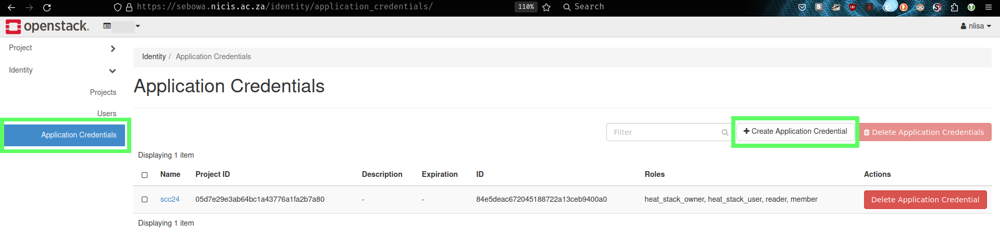</p>

1. Download and Copy the `clouds.yml` File

   Copy the `clouds.yml` file to the folder where you initialized terraform. The contents of the of which, should be _similar_ to:

   ```config
   # This is a clouds.yaml file, which can be used by OpenStack tools as a source
   # of configuration on how to connect to a cloud. If this is your only cloud,
   # just put this file in ~/.config/openstack/clouds.yaml and tools like
   # python-openstackclient will just work with no further config. (You will need
   # to add your password to the auth section)
   # If you have more than one cloud account, add the cloud entry to the clouds
   # section of your existing file and you can refer to them by name with
   # OS_CLOUD=openstack or --os-cloud=openstack
   clouds:
     openstack:
       auth:
         auth_url: https://sebowa.nicis.ac.za:5000
         application_credential_id: "<YOUR TEAM's APPLICATION CREDENTIAL ID"
         application_credential_secret: "<YOUR TEAM's APPLICATION CREDENTIAL SECRET>"
       region_name: "RegionOne"
       interface: "public"
       identity_api_version: 3
       auth_type: "v3applicationcredential"
   ```

1. Create `main.tf` Terraform File
   Inside your `terraform` folder, you must define a `main.tf` file. This file is used to identify the provider to be implemented as well as the compute resource configuration details of the instance we would like to launch.

   You will need to define your own `main.tf` file, but below is an example of one such definition:

   ```config
   provider "openstack" {
     cloud = "openstack"
   }
   resource "openstack_compute_instance_v2" "terraform-demo-instance" {
     name = "scc24-arch-cn03"
     image_id = "33b938c8-6c07-45e3-8f2a-cc8dcb6699de"
     flavor_id = "4a126f4f-7df6-4f95-b3f3-77dbdd67da34"
     key_pair = "nlisa at mancave"
     security_groups = ["default", "ssc24_sq"]

     network {
       name = "nlisa-vxlan"
     }
   }
   ```

> [!NOTE]
> You must specify your own variables for `name`, `image_id`, `flavor_id`, `key_pair` and `network.name`.

## Generate, Deploy and Apply Terraform Plan

1. Generate and Deploy Terraform Plan
   Create a Terraform plan based on the current configuration. This plan will be used to implement changes to your Sebowa OpenStack cloud workspace, and can be reviewed before applying those changes.
   Generate a plan and write it to disk:

   ```bash
   terraform plan -out ~/terraform/plan
   ```

1. Once you are satisfied with the proposed changes, deploy the terraform plan:

   ```bash
   terraform apply ~terraform/plan
   ```

1. Verify New Instance Successfully Created by Terraform
   Finally confirm that your new instance has been successfully created. On your Sebowa OpenStack workspace, navigate to `Project` &rarr; `Compute` &rarr; `Instances`.

> [!TIP]
> To avoid losing your team's progress, it would be a good idea to create a GitHub repo in order for you to commit and push your various scripts and configuration files.

# Continuous Integration Using CircleCI

Circle CI is a Continuous Integration and Continuous Delivery platform that can be utilized to implement DevOps practices. It helps teams build, test, and deploy applications quickly and reliably.

In this section of the tutorials you're going to be expanding on the OpenStack instance automation with CircleCI `Workflows` and `Pipelines`. For this tutorial you will be using your GitHub account which will integrate directly into CircleCI.

## Prepare GitHub Repository

You will be integration GitHub into CircleCI workflows, wherein every time you commit changes to your `deploy_compute` GitHub repository, CircleCI will instantiate and trigger Terraform, to create a new compute node VM on Sebowa.

1. Create GitHub Repository
   If you haven't already done so, sign up for a [GitHub Account](https://github.com/). Then create an empty private repository with a suitable name, i.e. `deploy_compute_node`:

   <p align="center">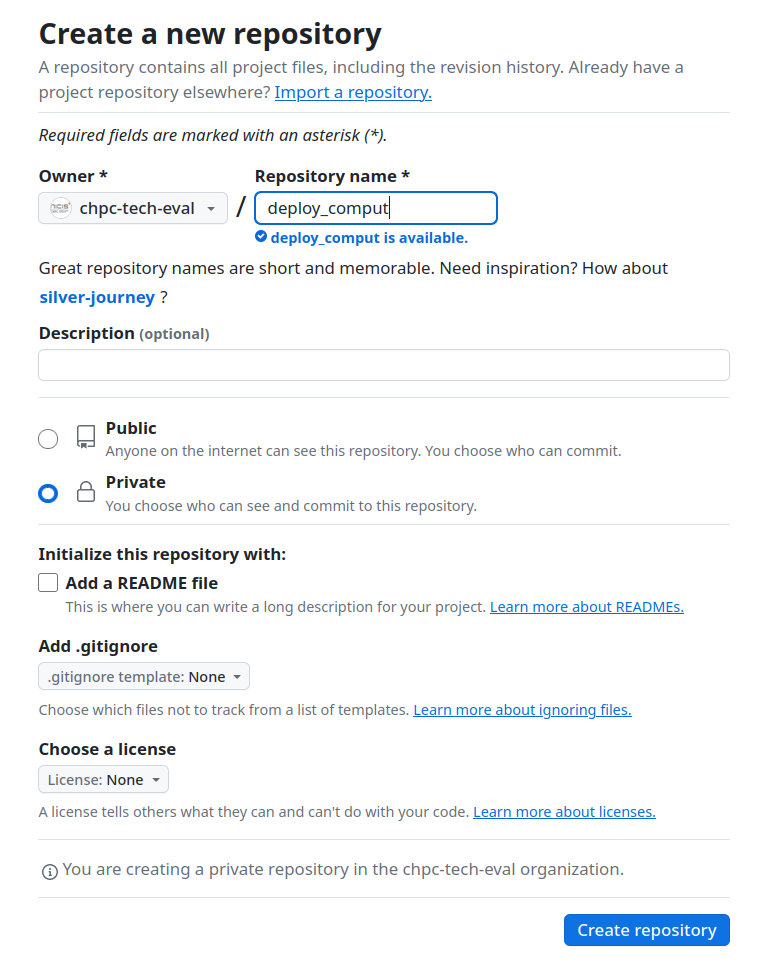</p>

1. Add your team members to the repository to provide them with access:
   <p align="center">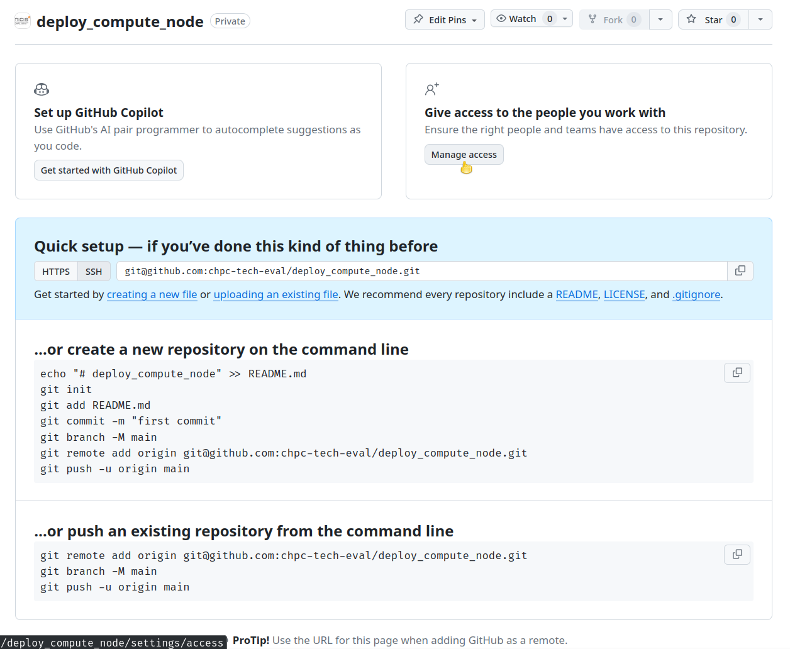</p>

1. If you haven't already done so, add your SSH key to your GitHub account by following the instructions from [Steps to follow when editing existing content](../README.md#steps-to-follow-when-editing-existing-content).

> [!TIP]
> You will be using your head node to orchestrate and configure your infrastructure. Pay careful attention to ensure that you copy over your **head node**'s public SSH key. Administrating and managing your compute nodes in this manner requires you to think about them as "cattle" and not "pets".

## Reuse `providers.tf` and `main.tf` Terraform Configurations

1. On your head node, create a folder that is going to be used to initialize the GitHub repository:

   ```bash
   mkdir ~/deploy_compute_node
   cd ~/deploy_compute_node
   ```

1. Copy the `providers.tf` and `main.tf` files you had previously generated:

   ```bash
   cp ~/terraform/providers.tf ./
   cp ~/terraform/main.tf ./
   vim main.tf
   ```

## Create `.circleci/config.yml` File and `push` Project to GitHub

The `.circle/config.yml` configuration file is where you define your build, test and deployment process. From your head node, you are going to be `pushing` your Infrastructure as Code to your private GitHub repository. This will then automatically trigger the CircleCI deployment of a Docker container which has been tailored for Terraform operations and instructions that will deploy your Sebowa OpenStack compute node instance.

1. Create and edit `.circleci/config.yml`:

   ```bash
   mkdir .circleci
   vim .circleci/config.yml # Remember that if you are not comfortable using Vim, install and make use of Nano
   ```

1. Copy the following configuration into `.circle/config.yml`:

   ```conf
   version: 2.1

   jobs:
     deploy:
       docker:
         - image: hashicorp/terraform:latest
       steps:
         - checkout

         - run:
             name: Create clouds.yaml
             command: |
               mkdir -p ~/.config/openstack
               echo "clouds:
                 openstack:
                   auth:
                     auth_url: https://sebowa.nicis.ac.za:5000
                     application_credential_id: ${application_credential_id}
                     application_credential_secret: ${application_credential_secret}
                   region_name: "RegionOne"
                   interface: "public"
                   identity_api_version: 3
                   auth_type: "v3applicationcredential"" > ~/.config/openstack/clouds.yaml

         - run:
             name: Terraform Init
             command: terraform init

         - run:
             name: Terraform Apply
             command: terraform apply -auto-approve

   workflows:
     version: 2
     deploy_workflow:
     jobs:
       - deploy

   ```

   - **Version**: Specifies the configuration version.
   - **Jobs**: Defines the individual steps in the build process, where we've defined a `build` job that runs inside the latest Terraform Docker container from Hashicorp.
   - **Steps**: The steps to execute within the job:
     - `checkout`: Clone and checkout the code from the repository.
     - `run`: Executes a number of shell commands to create the `clouds.yaml` file, then initialize and apply the Terraform configuration.
   - **Workflows**: Defines the workflow(s) that CircleCI will follow, where in this instance there is a single workflow specified `deploy_workflow`, that runs the `deploy` job.

1. `Init`ialize the Git Repository, `add` the files you've just created and `push` to GitHub:
   Following the instructions from the previous section where you created a new GitHub repo, execute the following commands from your head node, inside the `deploy_compute_node` folder:
   ```bash
   cd ~/deploy_compute_node
   git init
   git add .
   git commit -m "Initial Commit." # You may be asked to configure you Name and Email. Follow the instructions on the screen before proceeding.
   git branch -M main
   git remote add origin git@github.com:<TEAM_NAME>/deploy_compute_node.git
   git push -u origin main
   ```
   The new files should now be available on GitHub.

## Create CircleCI Account and Add Project

Navigate to [CircleCI.com](https://circleci.com) to create an account, link and add a new GitHub project.

1. Create a new organization and give it a suitable name
   <p align="center">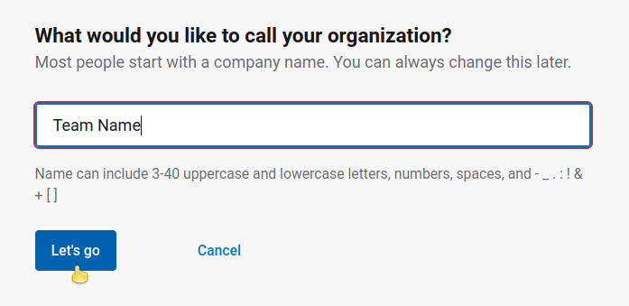</p>
1. Once you've logged into your workspace, go to projects and create a new project
   <p align="center">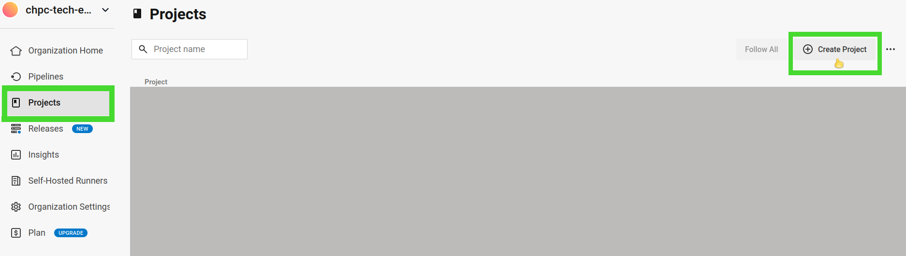</p>
1. Create a new IaC Project
   <p align="center">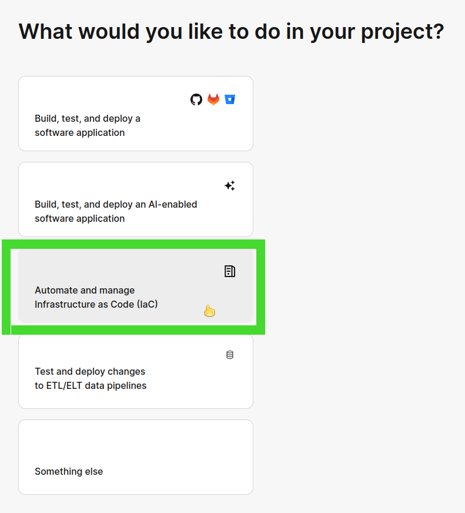</p>
1. If your repository is on GitHub, create a corresponding project
   <p align="center">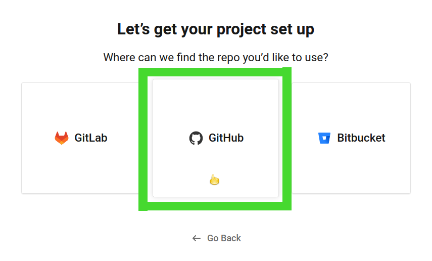</p>
1. Pick a project name and a repository to associate it to
   <p align="center">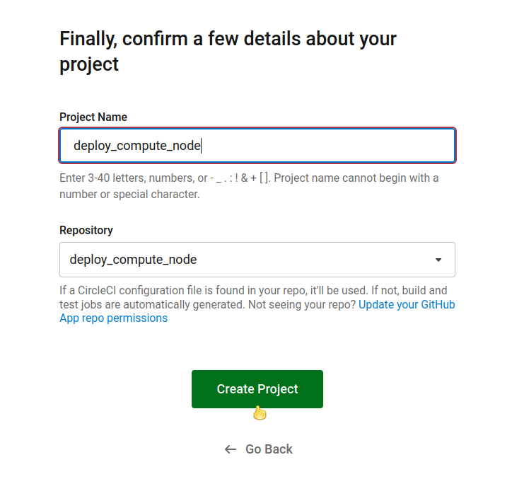</p>
1. Push the configuration to GitHub to trigger workflow
   <p align="center">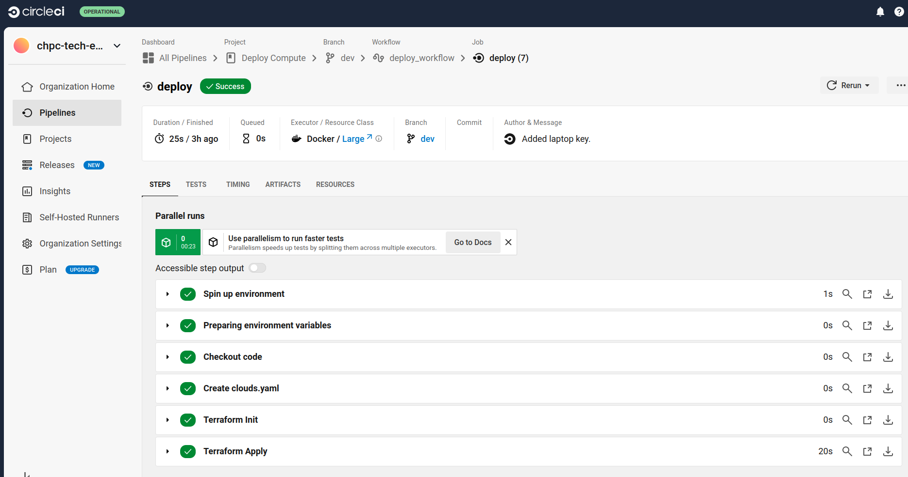</p>

> [!IMPORTANT]
> You're going to need to delete your experimental compute node instance on your Sebowa OpenStack workspace, each time you want to test or run the CircleCI integration. It has been included here for demonstration purposes, so that you may begin to see the power and utility of CI/CD and automation.
>
> Navigate to your Sebowa OpenStack workspace to ensure that they deployment was successful.
>
> Consider how you could streamline this process even further using preconfigured instance snapshots, as well as Ansible after your instances have been deployed.

# Automating HPL Runs Using Ansible Playbooks and CircleCI

## Installing Ansible

Ansible is an agentless node manager, hence you will only need to install on your `headnode`. To set up your environment for Ansible, you need to install the following dependencies:

- DNF/YUM

```bash
# Enable the EPEL repository
sudo yum install -y epel-release

# Install Python, pip, and other dependencies
sudo yum install -y sshpass git

# Install Ansible
sudo yum install -y ansible
```

- APT

```bash
# Update package list and install dependencies
sudo apt update
sudo apt install -y sshpass git

# Install Ansible
sudo apt install -y ansible
```

- ARCH

```bash
# Update package database
sudo pacman -Syu

# Install Python, pip, and related tools
sudo pacman -S sshpass git

# Install Ansible
sudo pacman -S ansible
```

## Setting Up the Ansible Playbook

You need to push the Ansible playbook to the GitHub repository you linked to CircleCI in the previous section. There are two ways to do this:
- You can edit the files directly on GitHub
- Create them on the headnode and `git push` them to the repository linked to CircleCI.

You should set up your file structure as follows:
```
ansible/
├── ansible.cfg
├── inventory/
│   └── inventory.yml
├── playbooks/
│   └── install_hpl.yml
└── roles/
    ├── install_deps/
    │   ├── tasks/
    │   │   └── main.yml
    ├── install_blas/
    │   ├── tasks/
    │   │   └── main.yml
    ├── install_mpi/
    │   ├── tasks/
    │   │   └── main.yml
    ├── install_hpl/
    │   ├── tasks/
    │   │   └── main.yml
    └── run_hpl/
        ├── tasks/
        │   └── main.yml

```

It is structured into distinct roles for modularity and ease of maintenance, with each role handling specific tasks such as installing dependencies, BLAS, MPI, and HPL itself, as well as running the benchmark. The inventory defines the target hosts, and playbooks orchestrate the execution of these roles.

### ansible.cfg
The `ansible.cfg` file is a configuration file for Ansible and allows the user to set global and local configurations for how ansible is required to operate. You need to change `remote_user` to your user and `private_key_file` to point to your private key.

`ansible.cfg`:

```
[defaults]
inventory = inventory/inventory.yml
roles_path = roles
remote_user = <your_user>
private_key_file = </your/path/to/key>
```

### inventory.yml
The `inventory.yml` file is a file that defines the details of the nodes that Ansible will manage. This file should be adjusted to adhere to your cluster design. The IP address for the node that will be deployed using Terraform and CircleCI will be passed in as a variable on deployment. For a head node and two compute nodes design, it should be as follows:

```
all:
  hosts:
    headnode:
      ansible_host: <your_headnode_IP>
    compute1:
      ansible_host: <compute_node_IP>
    compute2:
      ansible_host: "{{ target_host }}"
  children:
    compute:
      hosts:
        compute1:
        compute2:
```

All the files after this point in the Ansible Playbook set-up should work across all systems without any changes. 

### install_hpl.yml
The `install_hpl.yml` file is an Ansible playbook that orchestrates the setup and execution of the HPL benchmark. It should be set up as follows:

```
---
- name: Install prerequisites on all nodes
  hosts: all
  become: yes
  roles:
    - install_deps

- name: Install OpenBLAS on compute nodes
  hosts: compute1
  gather_facts: yes
  roles:
    - install_blas

- name: Install OpenMPI on compute nodes
  hosts: compute1
  gather_facts: yes
  roles:
    - install_mpi

- name: Install HPL on the head node
  hosts: headnode
  gather_facts: yes
  roles:
    - install_hpl

- name: Run HPL benchmark
  hosts: headnode
  gather_facts: yes
  roles:
    - run_hpl
```
### install_deps
The `install_deps` role installs the prerequisite applications and compilers in order to compile and run HPL. The following file under `main.yml` in the `tasks` directory contains the necessary applications and compilers for a Debian-based system, a RedHat-based system and a Pacman-based system. They will skip over unnecessary steps.


```
- name: Install dependencies on Debian-based systems
  apt:
    name:
      - git
      - make
      - gcc
      - gfortran
      - build-essential
      - hwloc
      - libhwloc-dev
      - libevent-dev
      - wget
    state: present
    update_cache: yes
  when: ansible_os_family == "Debian"

- name: Install dependencies on RedHat-based systems
  dnf:
    name:
      - "@Development Tools"
      - git
      - make
      - gcc
      - gfortran
    state: present
    update_cache: yes
  when: ansible_os_family == "RedHat"

- name: Install dependencies on Pacman-based systems
  pacman:
    name:
      - base-devel
      - gfortran
      - git
      - gcc
      - wget
    state: present
    update_cache: yes
  when: ansible_os_family == "Archlinux"
```

### install_blas

The `install_blas` role defines a set of tasks to install OpenBLAS. The `main.yml` file in the `tasks` directory should be set up as follows:

```
- name: Check if OpenBLAS is already installed
  stat:
    path: "{{ ansible_env.HOME }}/opt/openblas"
  register: openblas_installed

- name: Clone OpenBLAS repository
  git:
    repo: "https://github.com/xianyi/OpenBLAS.git"
    dest: "{{ ansible_env.HOME }}/OpenBLAS"
    version: "v0.3.26"
  register: clone_result
  when: not openblas_installed.stat.exists

- name: Build OpenBLAS
  make:
    chdir: "{{ ansible_env.HOME }}/OpenBLAS"
    target: all
  when: clone_result.changed

- name: Install OpenBLAS to custom directory
  make:
    chdir: "{{ ansible_env.HOME }}/OpenBLAS"
    target: install
    params:
      PREFIX: "{{ ansible_env.HOME }}/opt/openblas"
  when: clone_result.changed
```
### install_mpi
The `install_mpi` role defines the tasks to download, build and install OpenMPI. In the `tasks` directory, the `main.yml` file should be set up as follows:

```
- name: Check if OpenMPI is already installed
  stat:
    path: "{{ ansible_env.HOME }}/opt/openmpi/bin"
  register: openmpi_installed

- name: Download OpenMPI source files if not installed
  get_url:
    url: "https://download.open-mpi.org/release/open-mpi/v4.1/openmpi-4.1.4.tar.gz"
    dest: "{{ ansible_env.HOME }}/openmpi-4.1.4.tar.gz"
    mode: '0755'
  when: not openmpi_installed.stat.exists

- name: Create destination directory for unzipping
  file:
    path: "{{ ansible_env.HOME }}/openmpi-4.1.4"
    state: directory
    mode: '0755'
  when: not openmpi_installed.stat.exists

- name: Unzip the downloaded OpenMPI tarball
  unarchive:
    src: "{{ ansible_env.HOME }}/openmpi-4.1.4.tar.gz"
    dest: "{{ ansible_env.HOME }}"
    remote_src: yes
  when: not openmpi_installed.stat.exists

- name: Configure OpenMPI with CFLAGS
  command: "./configure --prefix={{ ansible_env.HOME }}/opt/openmpi"
  args:
    chdir: "{{ ansible_env.HOME }}/openmpi-4.1.4"
  environment:
    CFLAGS: "-Ofast -march=native -mtune=native"
  when: not openmpi_installed.stat.exists

- name: Compile OpenMPI
  make:
    chdir: "{{ ansible_env.HOME }}/openmpi-4.1.4"
    jobs: "{{ ansible_processor_cores | default(6) }}"
  when: not openmpi_installed.stat.exists

- name: Install OpenMPI
  make:
    chdir: "{{ ansible_env.HOME }}/openmpi-4.1.4"
    target: install
  when: not openmpi_installed.stat.exists
```

### install_hpl
The `install_hpl` role defines the tasks to automate the downloading, configuring and compiling HPL. This YAML file makes all the necessary changes to the makefile. The `main.yml` file in the `tasks` directory should look like the following:

```
# roles/install_hpl/tasks/main.yml
---
- name: Remove hpl and hpl-2.3 directories
  ansible.builtin.file:
    path: "{{ ansible_env.HOME }}/{{ item }}"
    state: absent
  loop:
    - hpl
    - hpl-2.3

- name: Download HPL source files
  get_url:
    url: "http://www.netlib.org/benchmark/hpl/hpl-2.3.tar.gz"
    dest: "{{ ansible_env.HOME }}/hpl-2.3.tar.gz"
    mode: '0755'

- name: Create destination directory for unzipping
  file:
    path: "{{ ansible_env.HOME }}/hpl-2.3"
    state: directory
    mode: '0755'

- name: Unzip the downloaded file
  unarchive:
    src: "{{ ansible_env.HOME }}/hpl-2.3.tar.gz"
    dest: "{{ ansible_env.HOME }}"
    remote_src: yes

- name: Rename folder using mv command
  command: mv "{{ ansible_env.HOME }}/hpl-2.3" "{{ ansible_env.HOME }}/hpl"

- name: Copy Makefile template
  copy:
    src: "{{ ansible_env.HOME }}/hpl/setup/Make.Linux_PII_CBLAS_gm"  # Path to the Makefile on the head node
    dest: "{{ ansible_env.HOME }}/hpl/Make.compile_BLAS_MPI"  # Destination path where you want to copy it
    mode: '0644'

- name: Configure Makefile ARCH variable
  replace:
    path: "{{ ansible_env.HOME }}/hpl/Make.compile_BLAS_MPI"
    regexp: '^ARCH\s*=\s*.*'
    replace: 'ARCH = compile_BLAS_MPI'

- name: Set MPdir variable
  replace:
    path: "{{ ansible_env.HOME }}/hpl/Make.compile_BLAS_MPI"
    regexp: '^MPdir\s*=.*'
    replace: 'MPdir        = $(HOME)/opt/openmpi'

- name: Set MPinc variable
  replace:
    path: "{{ ansible_env.HOME }}/hpl/Make.compile_BLAS_MPI"
    regexp: '^MPinc\s*=.*'
    replace: 'MPinc        = -I$(MPdir)/include'

- name: Set MPlib variable
  replace:
    path: "{{ ansible_env.HOME }}/hpl/Make.compile_BLAS_MPI"
    regexp: '^MPlib\s*=.*'
    replace: 'MPlib        = $(MPdir)/lib/libmpi.so'

- name: Set LAdir variable
  replace:
    path: "{{ ansible_env.HOME }}/hpl/Make.compile_BLAS_MPI"
    regexp: '^LAdir\s*=.*'
    replace: 'LAdir        = $(HOME)/opt/openblas'

- name: Set LAinc variable
  replace:
    path: "{{ ansible_env.HOME }}/hpl/Make.compile_BLAS_MPI"
    regexp: '^LAinc\s*=.*'
    replace: 'LAinc        ='

- name: Set LAlib variable
  replace:
    path: "{{ ansible_env.HOME }}/hpl/Make.compile_BLAS_MPI"
    regexp: '^LAlib\s*=.*'
    replace: 'LAlib        = $(LAdir)/lib/libopenblas.a -lm'

- name: Set CC variable
  replace:
    path: "{{ ansible_env.HOME }}/hpl/Make.compile_BLAS_MPI"
    regexp: '^CC\s*=.*'
    replace: 'CC           = mpicc'

- name: Set CCFLAGS variable
  replace:
    path: "{{ ansible_env.HOME }}/hpl/Make.compile_BLAS_MPI"
    regexp: '^CCFLAGS\s*=.*'
    replace: 'CCFLAGS      = $(HPL_DEFS) -O3 -march=native -mtune=native -fopenmp -fomit-frame-pointer -funroll-loops -W -Wall'

- name: Set LDFLAGS variable
  replace:
    path: "{{ ansible_env.HOME }}/hpl/Make.compile_BLAS_MPI"
    regexp: '^LDFLAGS\s*=.*'
    replace: 'LDFLAGS      = -O3 -fopenmp'

- name: Set LINKER variable
  replace:
    path: "{{ ansible_env.HOME }}/hpl/Make.compile_BLAS_MPI"
    regexp: '^LINKER\s*=.*'
    replace: 'LINKER       = $(CC)'

- name: Compile HPL
  shell: |
    export PATH=~/opt/openmpi/bin:~/opt/openblas:$PATH
    export LD_LIBRARY_PATH=~/opt/openmpi/lib:~/opt/openblas/lib:$LD_LIBRARY_PATH
    export MPI_HOME=~/opt/openmpi
    make arch=compile_BLAS_MPI
  args:
    chdir: "{{ ansible_env.HOME }}/hpl"  # Directory containing the Makefile
```
### run_hpl
The `run_hpl` role automates the execution of the HPL benchmark across the cluster and the `main.yml` file in `tasks` should be as follows:

```
# roles/install_hpl/tasks/main.yml
---
- name: Create HPL.dat file with specific content
  copy:
    dest: "{{ ansible_env.HOME }}/hpl/bin/compile_BLAS_MPI/HPL.dat"
    content: |
      HPLinpack benchmark input file
      Innovative Computing Laboratory, University of Tennessee
      HPL.out      output file name (if any)
      6            device out (6=stdout,7=stderr,file)
      1            # of problems sizes (N)
      21976         Ns
      1            # of NBs
      164           NBs
      0            PMAP process mapping (0=Row-,1=Column-major)
      1            # of process grids (P x Q)
      3            Ps
      6            Qs
      16.0         threshold
      1            # of panel fact
      2            PFACTs (0=left, 1=Crout, 2=Right)
      1            # of recursive stopping criterium
      4            NBMINs (>= 1)
      1            # of panels in recursion
      2            NDIVs
      1            # of recursive panel fact.
      1            RFACTs (0=left, 1=Crout, 2=Right)
      1            # of broadcast
      1            BCASTs (0=1rg,1=1rM,2=2rg,3=2rM,4=Lng,5=LnM)
      1            # of lookahead depth
      1            DEPTHs (>=0)
      2            SWAP (0=bin-exch,1=long,2=mix)
      64           swapping threshold
      0            L1 in (0=transposed,1=no-transposed) form
      0            U  in (0=transposed,1=no-transposed) form
      1            Equilibration (0=no,1=yes)
      8            memory ment in double (> 0)

- name: Create a hostfile for mpirun
  copy:
    dest: "{{ ansible_env.HOME }}/hpl/bin/compile_BLAS_MPI/hostfile"
    content: |
      # Headnode included in the hostfile with its cores 
      {{ ansible_host }} slots={{ ansible_facts.processor_count | default(2) }}

      # Compute nodes included dynamically 
      
      {{ hostvars[host]['ansible_host'] }} slots={{ hostvars[host]['ansible_facts']['processor_count'] | default(6) }}
      
  delegate_to: localhost

- name: Execute HPL benchmark across nodes
  shell: |
    export PATH=~/opt/openmpi/bin:~/opt/openblas:$PATH
    export LD_LIBRARY_PATH=~/opt/openmpi/lib:~/opt/openblas/lib:$LD_LIBRARY_PATH
    export MPI_HOME=~/opt/openmpi
    mpirun -np 18 --hostfile ~/hpl/bin/compile_BLAS_MPI/hostfile --prefix ~/opt/openmpi ~/hpl/bin/compile_BLAS_MPI/xhpl
  args:
    executable: /bin/bash
    chdir: "{{ ansible_env.HOME }}/hpl/bin/compile_BLAS_MPI"
  register: hpl_result

- name: Display HPL output
  debug:
    var: hpl_result.stdout

- name: Save HPL result to a file
  copy:
    dest: "{{ ansible_env.HOME }}/hpl/bin/compile_BLAS_MPI/hpl_output.txt"
    content: "{{ hpl_result.stdout }}"
  delegate_to: localhost
```

You can push the `ansible` folder to the GitHub repository after all of these files are set up. 

## CircleCI Integration

The general structure of the CircleCI `config.yml` and Terraform files can be kept the same. Some changes do need to be made so that it works with the Ansible playbook.

After these changes the file structure will look something like this:
```
.circleci/
    └── config.yml
ansible/
    └── ansible.cfg
    └── inventory/
    └── playbooks/
    └── roles/
├── scripts
    └── fix_apt.sh
    └── setup_nfs.sh
├── terrafrom
    └── clouds.yaml
    └── main.tf
    └── providers.tf
```

The files we need to change are as follows.

### main.tf
The `main.tf` needs to be updated to retrieve the IP address from the deployed instance so that we can pass it into our `inventory.yml`. You need to speficiy your new nodes`name`, `image_id`(eg. 97991be4-1df0-4502-9370-55e9b624592e), `flavour_id` (eg. 35617c38-b1ce-4d49-894e-74ce7ddcdc26) and `key_pair`.

```provider "openstack" {
  cloud = "openstack"
}
resource "openstack_compute_instance_v2" "terraform-demo-instance" {
  name = "<instance_name>"
  image_id = "your_image_id"
  flavor_id = "<your_flavour_id"
  key_pair = "<your_key>"
  security_groups = ["default", "scc24_sg"]

  network {
    name = "<team name>-vxlan"
  }
}


output "instance_ip" {
  value       = openstack_compute_instance_v2.terraform-demo-instance.access_ip_v4
  description = "The public IP address of the instance"
}
```

### config.yml

The `config.yml` needs to be updated to include:
- 2 workflows - one to deploy the new instance using Terraform and one to run the HPL Ansible Playbook
- Retrieve the instances IP from `main.tf`
- Set up a workspace so we can share this information across workflows
- NFS is set up so that the playbook runs seamlessly across nodes

We also need to set up an SSH fingerprint on CircleCI to `ssh` seamlessly between nodes.

#### Set Up SSH Key
Go to your workflow and go to Project Settings.  


<p align="center">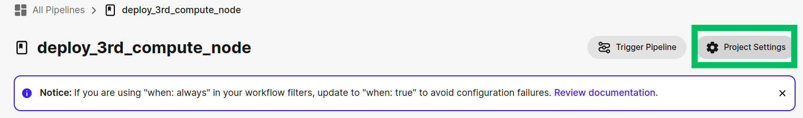</p>


In project settings go to SSH Keys and click the Add Key button.  


<p align="center">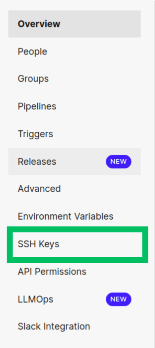 </p>


Login to the cluster. Type this command to get your Private Key.


```
cat ~/.ssh/<your private ssh key>
```  


<p align="center">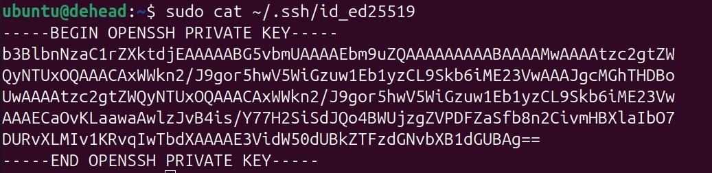</p>  


Copy and paste these contents into the CircleCI Private Key. 


<p align="center">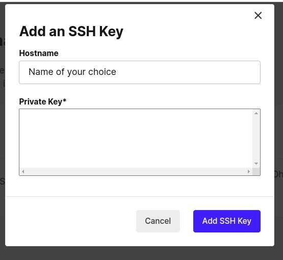</p> 


Your SSH fingerprint will now be set up. 


<p align="center"></p>


`config.yml`:

In `config.yml` make sure to change the variables under environment: `SSH_USER`, `SSH_HOST`, `NFS_SERVER_IP` and `<your_fingerprint_from_CircleCI>`(eg. SHA256:SHIa6LYWWEELTDhxKtNh5rv53Zx+8hj4y/kGipCJ0Yg).  
This `config.yml` is specifically for Unbuntu. You can find the one for DNF/YUM [here](resources/config.yml). The `fix_apt.sh` can also be skipped over and instances of it in `config.yml` can be removed. 

```
version: 2.1

jobs:
  deploy-infrastructure:
    docker:
      - image: hashicorp/terraform:latest  # Official Terraform Docker image
    steps:
      - checkout  # Checks out your repository

      # Initialize Terraform
      - run:
          name: Terraform Init
          command: terraform init

      # Apply Terraform Configuration
      - run:
          name: Terraform Apply
          command: terraform apply -auto-approve

      - run:
          name: Get Instance IP Address
          command: |
            INSTANCE_IP=$(terraform output -raw instance_ip)
            echo "Instance IP Address: $INSTANCE_IP"
            echo "$INSTANCE_IP" > instance_ip.txt

      - persist_to_workspace:
          root: ./
          paths:
            - instance_ip.txt

  deploy-ansible-playbook:
    docker:
      - image: circleci/python:3.9  # Python image with necessary tools
    environment:
      SSH_USER: "<your_user>"
      SSH_HOST: "<public_facing_headnode_IP>"
      PLAYBOOK_FILE: "install_hpl.yml"   # Ansible playbook file
      INVENTORY_FILE: "inventory.yml"     # Ansible inventory file
      NFS_SERVER_IP: "<headnode_IP>"
    steps:
      - checkout

      - attach_workspace:
          at: ./

      - run:
          name: Read and Verify Instance IP
          command: |
            export INSTANCE_IP=$(cat instance_ip.txt)
            echo "INSTANCE_IP=$INSTANCE_IP" > $BASH_ENV
            echo "Using Instance IP Address: ${INSTANCE_IP}"

      # Add SSH keys managed by CircleCI
      - add_ssh_keys:
          fingerprints:
            - "<your_fingerprint_from_CircleCI>"

      # Install Dependencies
      - run:
          name: Install Dependencies
          command: |
            sudo apt-get update
            sudo apt-get install -y python3-openstackclient openssh-client ansible

      # Setup SSH
      - run:
          name: Setup SSH
          command: |
            mkdir -p ~/.ssh
            chmod 700 ~/.ssh
            ssh-keyscan -H ${SSH_HOST} >> ~/.ssh/known_hosts
            ssh ${SSH_USER}@${SSH_HOST} "ssh-keyscan -H ${INSTANCE_IP} >> ~/.ssh/known_hosts"


      # Transfer Ansible Directory to Head Node
      - run:
          name: Transfer Ansible Directory
          command: |
            scp -r ./ansible ${SSH_USER}@${SSH_HOST}:~/ || { echo "SCP failed"; exit 1; }

      - run:
          name: Transfer fix_apt.sh and setup_nfs.sh to Head Node
          command: |
            scp fix_apt.sh setup_nfs.sh ${SSH_USER}@${SSH_HOST}:~/ || { echo "SCP to head node failed"; exit 1; }

      - run:
          name: Transfer fix_apt.sh and setup_nfs.sh to Compute Node
          command: |
            ssh ${SSH_USER}@${SSH_HOST} "scp ~/fix_apt.sh ~/setup_nfs.sh ${SSH_USER}@${INSTANCE_IP}:~/" || { echo "SCP to compute node failed"; exit 1; }

      - run:
          name: Execute fix_apt.sh on Remote Instance
          command: |
            ssh ${SSH_USER}@${SSH_HOST} "ssh ${SSH_USER}@${INSTANCE_IP} 'sudo bash ~/fix_apt.sh'" || { echo "Execution of script failed"; exit 1; }

      - run:
          name: Execute setup_nfs.sh on Remote Instance
          command: |
            ssh ${SSH_USER}@${SSH_HOST} "ssh ${SSH_USER}@${INSTANCE_IP} 'sudo bash ~/setup_nfs.sh ${NFS_SERVER_IP}'" || { echo "Execution of script failed"; exit 1; }

      # Deploy and Run Ansible Playbook
      - run:
          name: Deploy and Run Ansible Playbook
          command: |
            ssh ${SSH_USER}@${SSH_HOST} "cd ~/ansible && ansible-playbook playbooks/${PLAYBOOK_FILE} --extra-vars "target_host="${INSTANCE_IP}" || { echo "Ansible playbook failed"; exit 1; }

```

### fix_apt.sh

This file fixes the APT for certain versions of Ubuntu.

```#!/bin/bash

# Fix NeedRestart behaviour to automatically restart services
echo "Changing NeedRestart behavior..."
sudo sed -i 's/#\$nrconf{restart} = "i";/\$nrconf{restart} = "a";/' /etc/needrestart/needrestart.conf

# Update the apt sources list for the Mantic repository
echo "Updating apt sources..."
sudo rm -f /etc/apt/sources.list

sudo tee /etc/apt/sources.list <<EOF
deb http://old-releases.ubuntu.com/ubuntu mantic main restricted universe multiverse
deb http://old-releases.ubuntu.com/ubuntu mantic-security main restricted universe multiverse
deb http://old-releases.ubuntu.com/ubuntu mantic-updates main restricted universe multiverse
deb http://old-releases.ubuntu.com/ubuntu mantic-backports main restricted universe multiverse
EOF

# Update and upgrade the system
echo "Updating and upgrading the system..."
sudo apt-get update
sudo NEEDRESTART_MODE=a apt-get dist-upgrade --yes

echo "System fix completed."

```
### setup_nfs.sh
This file sets up NFS on the newly deployed node. Itis for Ubuntu specifically, you can find the RHEL one [here](resources/setup_nfs.sh).

```
#!/bin/bash

# Ensure an NFS IP is provided
if [ -z "$1" ]; then
  echo "Usage: $0 <NFS_SERVER_IP>"
  exit 1
fi

NFS_SERVER_IP="$1"

# Install NFS common utilities
echo "Installing NFS utilities..."
sudo apt update
sudo NEEDRESTART_MODE=a apt install nfs-common --yes

# Mount the NFS share
echo "Mounting NFS share from $NFS_SERVER_IP..."
sudo mount -t nfs ${NFS_SERVER_IP}:/home /home

if [ $? -eq 0 ]; then
  echo "NFS setup completed successfully."
else
  echo "NFS setup failed."
  exit 1
fi
```


When you push all these files to the repository linked to CircleCI it will redeploy the node and then run the Ansible playbook which will run HPL. You can view the run of HPL by using `btop` on all the nodes.  


<p align="center">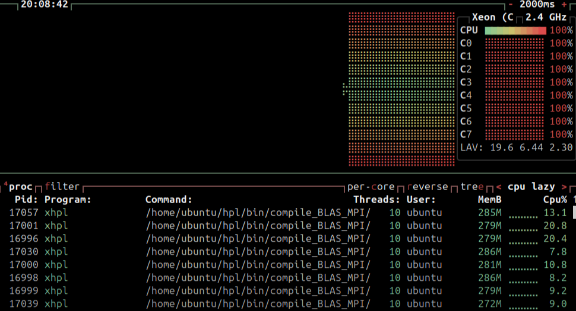</p>


> Remember you need to delete the instance before you can redeploy the node using CircleCI


# Slurm Scheduler and Workload Manager

The Slurm Workload Manager (formerly known as Simple Linux Utility for Resource Management), is a free and open-source job scheduler for Linux, used by many of the world's supercomputers/computer clusters. It allows you to manage the resources of a cluster by deciding how users get access for some duration of time so they can perform work. To find out more, please visit the [Slurm Website](https://slurm.schedmd.com/documentation.html).

## Prerequisites

1. Make sure the clocks, i.e. chrony daemons, are synchronized across the cluster.

2. Generate a **SLURM** and **MUNGE** user on all of your nodes:

   - **If you have Ansible User Module working**
     - Create the users as shown in tutorial 2 **Do NOT add them to the sysadmin group**.
   - **If you do NOT have your Ansible User Module working**
     - `useradd slurm`
     - Ensure that users and groups (UIDs and GIDs) are synchronized across the cluster. Read up on the appropriate [/etc/shadow](https://linuxize.com/post/etc-shadow-file/) and [/etc/password](https://www.cyberciti.biz/faq/understanding-etcpasswd-file-format/) files.

## Head Node Configuration (Server)

1. Install the [MUNGE](https://dun.github.io/munge/) package. MUNGE is an authentication service that makes sure user credentials are valid and is specifically designed for HPC use.

   First, we will enable the **EPEL** _(Extra Packages for Enterprise Linux)_ repository for `dnf`, which contains extra software that we require for MUNGE and Slurm:

   ```bash
     sudo dnf install epel-release
   ```

   Then we can install MUNGE, pulling the development source code from the `crb` "CodeReady Builder" repository:

   ```bash
     sudo dnf config-manager --set-enabled crb
     sudo dnf install munge munge-libs munge-devel
   ```

2. Generate a MUNGE key for client authentication:

   ```bash
     sudo /usr/sbin/create-munge-key -r
     sudo chown munge:munge /etc/munge/munge.key
     sudo chmod 600 /etc/munge/munge.key
   ```

3. Using `scp`, copy the MUNGE key to your compute node to allow it to authenticate:

   1. SSH into your compute node and create the directory `/etc/munge`. Then exit back to the head node.

   2. Since, munge has not yet been installed on your compute node, first transfer the file to a temporary location

   ```bash
     sudo cp /etc/munge/munge.key /tmp/munge.key && sudo chown user:user /tmp/munge.key
   ```

   **Replace user with the name of the user that you are running these commands as**

   3. Move the file to your compute node

   ```bash
     scp /etc/munge/munge.key <compute_node_name_or_ip>:/etc/tmp/munge.key
   ```

   4. Move the file to the correct location

   ```bash
     ssh <computenode hostname or ip> 'sudo mv /tmp/munge.key /etc/munge/munge.key'
   ```

4. **Start** and **enable** the `munge` service

5. Install dependency packages:

   ```bash
   sudo dnf install gcc openssl openssl-devel pam-devel numactl numactl-devel hwloc lua readline-devel ncurses-devel man2html libibmad libibumad rpm-build perl-Switch libssh2-devel mariadb-devel perl-ExtUtils-MakeMaker rrdtool-devel lua-devel hwloc-devel
   ```

6. Download the 20.11.9 version of the Slurm source code tarball (.tar.bz2) from https://download.schedmd.com/slurm/. Copy the URL for `slurm-20.11.9.tar.bz2` from your browser and use the `wget` command to easily download files directly to your VM.

7. Environment variables are a convenient way to store a name and value for easier recovery when they're needed. Export the version of the tarball you downloaded to the environment variable VERSION. This will make installation easier as you will see how we reference the environment variable instead of typing out the version number at every instance.

   ```bash
     export VERSION=20.11.9
   ```

8. Build RPM packages for Slurm for installation

   ```bash
     sudo rpmbuild -ta slurm-$VERSION.tar.bz2
   ```

   This should successfully generate Slurm RPMs in the directory that you invoked the `rpmbuild` command from.

9. Copy these RPMs to your compute node to install later, using `scp`.

10. Install Slurm server

    ```bash
      sudo dnf localinstall ~/rpmbuild/RPMS/x86_64/slurm-$VERSION*.rpm \
                            ~/rpmbuild/RPMS/x86_64/slurm-devel-$VERSION*.rpm \
                            ~/rpmbuild/RPMS/x86_64/slurm-example-configs-$VERSION*.rpm \
                            ~/rpmbuild/RPMS/x86_64/slurm-perlapi-$VERSION*.rpm \
                            ~/rpmbuild/RPMS/x86_64/slurm-slurmctld-$VERSION*.rpm
    ```

11. Setup Slurm server

    ```bash
      sudo cp /etc/slurm/slurm.conf.example /etc/slurm/slurm.conf
    ```

    Edit this file (`/etc/slurm/slurm.conf`) and set appropriate values for:

    ```conf
    ClusterName=      #Name of your cluster (whatever you want)
    ControlMachine=   #DNS name of the head node
    ```

    Populate the nodes and partitions at the bottom with the following two lines:

    ```conf
    NodeName=<computenode> Sockets=<num_sockets> CoresPerSocket=<num_cpu_cores> \
    ThreadsPerCore=<num_threads_per_core> State=UNKNOWN
    ```

    ```conf
    PartitionName=debug Nodes=ALL Default=YES MaxTime=INFINITE State=UP
    ```

    **To check how many cores your compute node has, run `lscpu` on the compute node.** You will get output including `CPU(s)`, `Thread(s) per core`, `Core(s) per socket` and more that will help you determine what to use for the Slurm configuration.

    **Hint: if you overspec your compute resources in the definition file then Slurm will not be able to use the nodes.**

12. Create Necessary Directories and Set Permissions:

```bash
  sudo mkdir -p /var/spool/slurm/ctld /var/spool/slurm/d /var/log/slurm
  sudo chown -R slurm:slurm /var/spool/slurm/ctld /var/spool/slurm/d /var/log/slurm
```

13. **Start** and **enable** the `slurmctld` service on the head node.

## Compute Node Configuration (Clients)

1. Setup MUNGE:

   ```bash
    sudo dnf install munge munge-libs
     sudo scp /etc/munge/munge.key <compute_node_name_or_ip>:/etc/munge/munge.key
     sudo chown munge:munge /etc/munge/munge.key
     sudo chmod 400 /etc/munge/munge.key
   ```

2. Install Slurm Client

```bash
  sudo dnf localinstall ~/rpmbuild/RPMS/x86_64/slurm-$VERSION*.rpm \
                   ~/rpmbuild/RPMS/x86_64/slurm-slurmd-$VERSION*.rpm \
                   ~/rpmbuild/RPMS/x86_64/slurm-pam_slurm-$VERSION*.rpm
```

3. Copy `/etc/slurm/slurm.conf` from head node to compute node.

4. Create necessary directories:

   ```bash
   sudo mkdir -p /var/spool/slurm/d
   sudo chown slurm:slurm /var/spool/slurm/d
   ```

5. **Start** and **enable** the `slurmd` service.

Return to your head node. To demonstrate that your scheduler is working you can run the following command as your normal user:

```bash
  sinfo
```

You should see your compute node in an idle state.

Slurm allows for jobs to be submitted in _batch_ (set-and-forget) or _interactive_ (real-time response to the user) modes. Start an interactive session on your compute node via the scheduler with

```bash
  srun -N 1 --pty bash
```

You should automatically be logged into your compute node. This is done via Slurm. Re-run `sinfo` now and also run the command `squeue`. Here you will see that your compute node is now allocated to this job.

To finish, type `exit` and you'll be placed back on your head node. If you run `squeue` again, you will now see that the list is empty.

<div style="page-break-after: always;"></div>

To confirm that your node configuration is correct, you can run the following command on the head node:

```bash
sinfo -alN
```

The `S:C:T` column means "sockets, cores, threads" and your numbers for your compute node should match the settings that you made in the `slurm.conf` file.

# GROMACS Application Benchmark

You will now be extending some of your earlier work from [Tutorial 3](../tutorial3/README.md#gromacs-adh-cubic).

## Protein Visualization

> [!NOTE] You will need to work on your or laptop to complete this section, not on your head node nor compute node.

You are able to score bonus points for this tutorial by submitting a visualisation of your **adh_cubic** benchmark run. Follow the instructions below to accomplish this and upload the visualisation.

Download and install the VMD visualization tool by selecting the correct version for your operating system. For example, for a Windows machine with an Nvidia GPU select the “Windows OpenGL, CUDA” option. You may need to register on the website.

```http
https://www.ks.uiuc.edu/Development/Download/download.cgi?PackageName=VMD
```

Use the `WinSCP` application for Windows, or the `scp` command for Linux to copy the output file `confout.gro` of the **adh_cubic** benchmark from your cluster to your PC. Attempting to visualise the larger "1.5M_water" simulation is not necessary and not recommended due to memory limitations of most PCs.

1. Open VMD, select **File** then **New Module...**, click **Browse...** and select your `.gro` file.

2. Ensure the filetype was detected as **Gromacs GRO** then click **Load**. In the main VMD window you will see that 134177 particles have been loaded. You should also see the display window has been populated with your simulation particle data.

   You can manipulate the data with your mouse cursor: zoom with the mouse wheel or rotate it by dragging with the left mouse button held down. This visualisation presents a naturally occurring protein (blue/green) found in the human body, suspended in a solution of water molecules (red/white).

3. From the main VMD window, select **Graphics** then **Representations..**.

4. Under **Selected Atoms**, replace **all** with **not resname SOL** and click **apply**. You will notice the water solution around your protein has been removed, allowing you to better examine the protein.

5. In the same window, select the dropdown **Drawing Method** and try out a few different options. Select **New Cartoon** before moving on.

6. From the main VMD window, once again select **Graphics** then **Colors**. Under **Categories**, select **Display**, then **Background**, followed by **8 white**.

7. Finally, you are ready to render a snapshot of your visualisation. From the main window, select **File** then **Render...**, ensure **Snapshot...** is selected and enter an appropriate filename. Click **Start Rendering**.

Simulations like this are used to to develop and prototype experimental pharmaceutical drug designs. By visualising the output, researchers are able to better interpret simulation results.

[!TIP]

> Copy the resulting `.bmp` file(s) from yout cluster to your local computer or laptop and demonstrate this to your instructors for bonus points.

## Benchmark 2 (1.5M Water)

> [!CAUTION]
> This is a large benchmark and can possibly take some time. Complete the next sections and come back to this if you feel as though your time is limited.

Pre-process the input data using the `grompp` command

```bash
gmx_mpi grompp -f pme_verlet.mdp -c out.gro -p topol.top -o md_0_1.tpr
```

Using a batch script similar to the one above, run the benchmark. You may modify the mpirun command to optimise performance (significantly) but in order to produce a valid result, the simulation must run for 5,000 steps. Quoted in the output as:

```text
"5000 steps,     10.0 ps."
```

> [!NOTE]
> Please be ready to present the `gromacs_log` files for the **1.5M_water** benchmark to the instructors.
