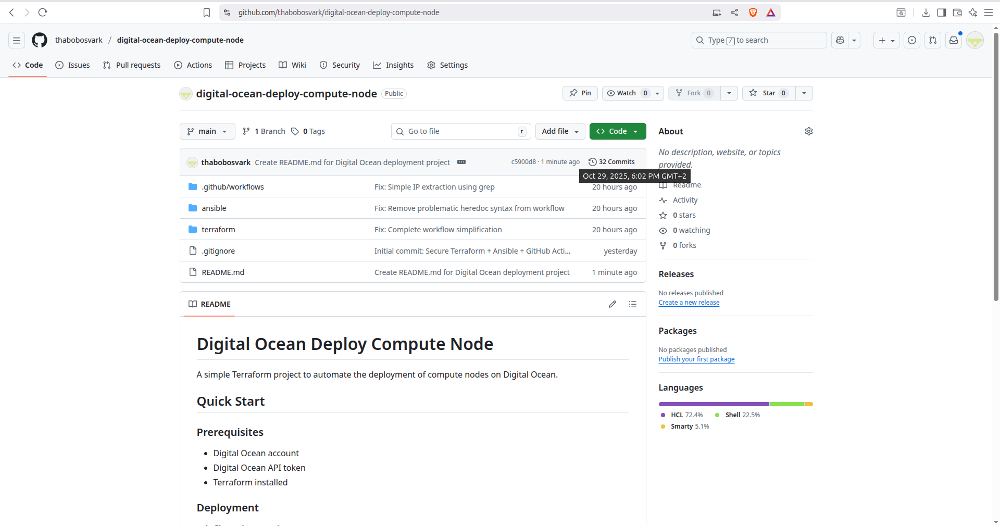
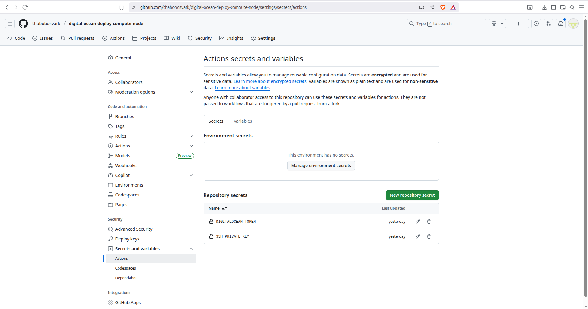
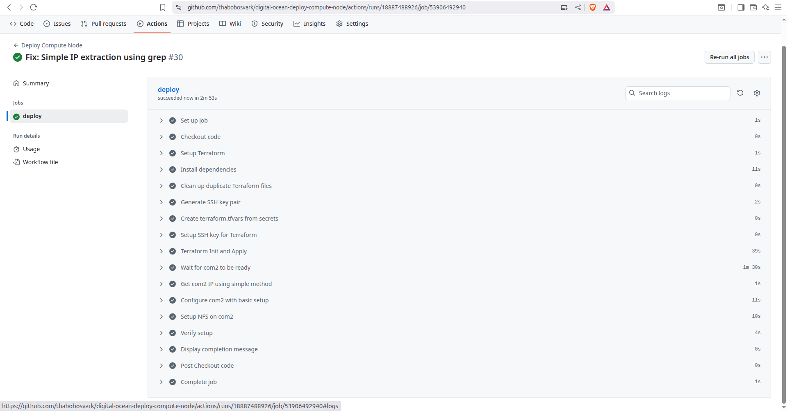
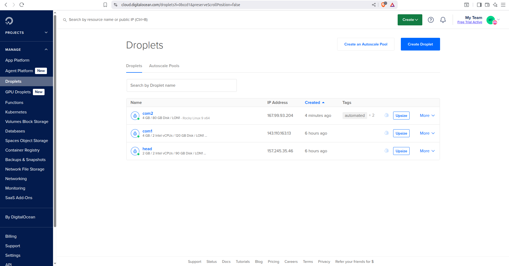
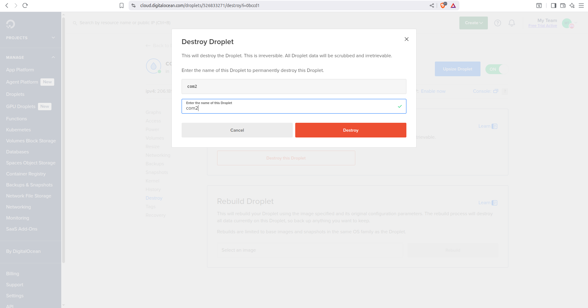

# Student Cluster Competition - Tutorial 4

## Table of Contents
<!-- markdown-toc start - Don't edit this section. Run M-x markdown-toc-refresh-toc -->

1. [Checklist](#checklist)
1. [Cluster Monitoring](#cluster-monitoring)
    1. [Install Docker Engine, Containerd and Docker Compose](#install-docker-engine-containerd-and-docker-compose)
    1. [Installing your Monitoring Stack](#installing-your-monitoring-stack)
    1. [Startup and Test the Monitoring Services](#startup-and-test-the-monitoring-services)
    1. [SSH Port Local Forwarding Tunnel](#ssh-port-local-forwarding-tunnel)
    1. [Create a Dashboard in Grafana](#create-a-dashboard-in-grafana)
    1. [Success State, Next Steps and Troubleshooting](#success-state-next-steps-and-troubleshooting)
1. [Configuring and Connecting to your Remote JupyterLab Server](#configuring-and-connecting-to-your-remote-jupyterlab-server)
    1. [Visualize Your HPL Benchmark Results](#visualize-your-hpl-benchmark-results)
    1. [Visualize Your Qiskit Results](#visualize-your-qiskit-results)
1. [Automating the Deployment of your DigitalOcean Instances Using Terraform](#automating-the-deployment-of-your-DigitalOcean-instances-using-terraform)
    1. [Install and Initialize Terraform](#install-and-initialize-terraform)
    1. [Generate `clouds.yml` and `main.tf` Files](#generate-cloudsyml-and-maintf-files)
    1. [Generate, Deploy and Apply Terraform Plan](#generate-deploy-and-apply-terraform-plan)
1. [Continuous Integration Using CircleCI](#continuous-integration-using-circleci)
    1. [Prepare GitHub Repository](#prepare-github-repository)
    1. [Reuse `providers.tf` and `main.tf` Terraform Configurations](#reuse-providerstf-and-maintf-terraform-configurations)
    1. [Create `.circleci/config.yml` File and `push` Project to GitHub](#create-circleciconfigyml-file-and-push-project-to-github)
    1. [Create CircleCI Account and Add Project](#create-circleci-account-and-add-project)
1. [Slurm Scheduler and Workload Manager](#slurm-scheduler-and-workload-manager)
    1. [Prerequisites](#prerequisites)
    1. [Head Node Configuration (Server)](#head-node-configuration-server)
    1. [Compute Node Configuration (Clients)](#compute-node-configuration-clients)
1. [GROMACS Application Benchmark](#gromacs-application-benchmark)
    1. [Protein Visualization](#protein-visualization)
    1. [Benchmark 2 (1.5M Water)](#benchmark-2-15m-water)

<!-- markdown-toc end -->

# Checklist

This tutorial demonstrates _cluster monitoring_, _data visualization_, _automated infrastructure as code deployment_ and _workload scheduling_. These components are critical to a typical HPC environment.

Monitoring is a widely used component in system administration (including enterprise datacentres and corporate networks). Monitoring allows administrators to be aware of what is happening on any system that is being monitored and is useful to proactively identify where any potential issues may be.

Interpreting and understanding your results and data, is vital to making meaning implementations of said data. You will also automate the provisioning and deployment of your *"experimental"*, change management compute node. Lastly, a workload scheduler ensures that users' jobs are handled properly to fairly balance all scheduled jobs with the resources available at any time.

You will also cover data interpretation and visualization for previously run benchmark applications.

In this tutorial you will:

- [ ] Setup a monitoring stack using Docker Compose
  - [ ] Install and setup the pre-requisites
  - [ ] Create all the files required for configuring the 3 containers to be launched
    - [ ] The docker-compose.yml file describing the Node-Exporter, Prometheus and Grafana services
    - [ ] The prometheus.yml file describing the metrics to be scraped for each host involved
    - [ ] The prometheus-datasource.yaml file describing the Prometheus datasource for Grafana
  - [ ] Start the services
    - [ ] Verify that they are running and accessible (locally, and externally)
  - [ ] Create a dashboard in Grafana
    - [ ] Login to the Grafana endpoint (via your browser)
    - [ ] Import the appropriate Node-Exporter dashboard
    - [ ] Check that the dashboard is working as expected
- [ ] Prepare, install and configure remote JupyterLab server
  - [ ] Connect to JupyterLab and visualize benchmarking results
- [ ] Automate the provisioning and deployment of your Sebowa DigitalOcean infrastructure
- [ ] Install the Slurm workload manager across your cluster.
- [ ] Submit a test job to run on your cluster through the newly-configured workload manager.

> [!TIP]
> You're going to be manipulating both your headnode, as well as your compute node(s) in this tutorial.
>
> You are **strongly** advised to make use of a terminal multiplexer, such as `tmux` before making a connection to your VMs. Once you're logged into your head node, initiate a `tmux` session:
>```bash
>tmux
>```
> Then split the window into two separate panes with `ctrl + b %`.
> SSH into your compute node on the other pane.

# Cluster Monitoring

Cluster monitoring is crucial for managing Linux machines. Effective monitoring helps detect and resolve issues promptly, provides insights into resource usage (CPU, memory, disk, network), aids in capacity planning, and ensures infrastructure scales with workload demands. By monitoring system performance and health, administrators can prevent downtime, reduce costs, and improve efficiency.


* **Traditional Approach Using `top` or `htop`**

  Traditionally, Linux system monitoring involves command-line tools like `top` or `htop`. These tools offer real-time system performance insights, displaying active processes, resource usage, and system load. While invaluable for monitoring individual machines, they lack the ability to aggregate and visualize data across multiple nodes in a cluster, which is essential for comprehensive monitoring in larger environments.

  

* **Using Grafana, Prometheus, and Node Exporter**

  Modern solutions use Grafana, Prometheus, and Node Exporter for robust and scalable monitoring. Prometheus collects and stores metrics, Node Exporter provides system-level metrics, and Grafana visualizes this data. This combination enables comprehensive cluster monitoring with historical data analysis, alerting capabilities, and customizable visualizations, facilitating better decision-making and faster issue resolution.

  

* **What is Docker and Docker Compose and How We Will Use It**

  Docker is a platform for creating, deploying, and managing containerized applications. Docker Compose defines and manages multi-container applications using a YAML file. For cluster monitoring on a Rocky Linux head node, we will use Docker and Docker Compose to bundle Grafana, Prometheus, and Node Exporter into deployable containers. This approach simplifies installation and configuration, ensuring all components are up and running quickly and consistently, streamlining the deployment of the monitoring stack.

> [!NOTE]
> When the word **Input:** is mentioned, excpect the next line to have commands that you need to copy and paste into your own terminal.
>
> Whenever the word **Output:** is mentioned **DON'T** copy and paste anything below this word as this is just the expected output.
>
> The following configuration is for your **head node**. You will be advised of the steps you need to take to monitor your **compute node(s)** at the end.

## Install Docker Engine, Containerd and Docker Compose

You will need to have `docker`, `containerd` and `docker-compose` installed on all the nodes that you want to eventually monitor, i.e. your head node and compute node(s).

1. Prerequisites and dependencies

   Refer to the following [RHEL Guide](https://docs.docker.com/engine/install/rhel/#install-using-the-repository)

   * DNF / YUM
   ```bash
   # The yum-utils package which provides the yum-config-manager utility
   sudo yum install -y yum-utils

   # Add and set up the repository for use.
   sudo yum-config-manager --add-repo https://download.docker.com/linux/rhel/docker-ce.repo
   ```
   * APT
   ```bash
   # Install required package dependencies
   sudo apt install apt-transport-https ca-certificates curl software-properties-common -y

   # Add the Docker repository
   curl -fsSL https://download.docker.com/linux/ubuntu/gpg | sudo apt-key add -
   sudo add-apt-repository "deb [arch=amd64] https://download.docker.com/linux/ubuntu $(lsb_release -cs) stable"

   ```

1. Installation

   * DNF / YUM
   ```bash
   # If prompted to accept the GPG key, verify that the fingerprint matches, accept it.
   sudo yum install docker-ce docker-ce-cli containerd.io docker-buildx-plugin docker-compose-plugin
   ```
   * APT
   ```bash
   sudo apt update
   sudo apt install docker-ce docker-ce-cli containerd.io -y
   ```
   * Arch
   ```bash
   sudo pacman -S docker

   # You need to start and enable docker, prior to installing containerd and docker-compose
   sudo pacman -S containerd docker-compose
   ```

1. Start and Enable Docker:
   ```bash
   sudo systemctl start docker
   sudo systemctl enable docker
   ```
1. Install Docker-Compose on Ubuntu
   * APT
   ```bash
   sudo curl -L "https://github.com/docker/compose/releases/download/$(curl -s https://api.github.com/repos/docker/compose/releases/latest | grep -Po '"tag_name": "\K.*\d')/docker-compose-$(uname -s)-$(uname -m)" -o /usr/local/bin/docker-compose
   sudo chmod +x /usr/local/bin/docker-compose
   ```
1. Verify that the Docker Engine installation was successful by running the `hello-world` image

   Download and deploy a test image and run it inside a container. When the container runs, it prints a confirmation message and exits.
   ```bash
   # Check the verions of Docker
   docker --version

   # Download and deplpoy a test image
   sudo docker run hello-world

   # Check your version of Docker Compose
   docker-compose --version
   ```
   You have now successfully installed and started Docker Engine.

## Installing your Monitoring Stack

1. Create a suitable directory, e.g. `/opt/monitoring_stack`

   This which you’ll keep a number of important configuration files.

   ```bash
   sudo mkdir /opt/monitoring_stack/
   cd /opt/monitoring_stack/
   ```
1. Create and edit your monitoring configurations files
   ```bash
   sudo nano /opt/monitoring_stack/docker-compose.yml
   ```
1. Add the following to the `docker-compose.yml` YAML file
   ```conf
   version: '3'
   services:
     node-exporter:
       image: prom/node-exporter
       ports:
         - "9100:9100"
       restart: always
       networks:
         - monitoring-network

     prometheus:
       image: prom/prometheus
       ports:
         - "9090:9090"
       restart: always
       volumes:
         - /opt/monitoring_stack/prometheus.yml:/etc/prometheus/prometheus.yml
       networks:
         - monitoring-network

     grafana:
       image: grafana/grafana
       ports:
         - "3000:3000"
       restart: always
       environment:
         GF_SECURITY_ADMIN_PASSWORD: <SET_YOUR_GRAFANA_PASSWORD>
       volumes:
         - /opt/monitoring_stack/prometheus-datasource.yaml:/etc/grafana/provisioning/datasources/prometheus-datasource.yaml
       networks:
         - monitoring-network

   networks:
     monitoring-network:
       driver: bridge
   ```
1. Create and edit your Prometheus configuration files

   ```bash
     sudo nano /opt/monitoring_stack/prometheus.yml
   ```
1. Add the following to your `prometheus.yml` YAML file
   ```conf
   global:
     scrape_interval: 15s

   scrape_configs:
     - job_name: 'node-exporter'
       static_configs:
         - targets: ['node-exporter:9100']
   ```
1. Configure you Promeheus Data Sources
   ```bash
   sudo nano /opt/monitoring_stack/prometheus-datasource.yaml
   ```
1. Add the following to your `prometheus-datasource.yaml`.
   ```conf
   apiVersion: 1
   datasources:
     - name: Prometheus
       type: prometheus
       access: proxy
       url: http://prometheus:9090
   ```

## Startup and Test the Monitoring Services

> [!TIP]
> If you've successfully configured nftables, you will be required to open the following TCP ports 3000, 9090, 9100.

Bring up your monitoring stack and verify that the have been correctly configured

* Bring up your monitoring stack
  ```bash
  sudo docker compose up -d
  ```

* Confirm the status of your Docker Containers
  ```bash
  sudo docker ps
  ```

* Dump the metrics that are being monitored from your services
  ```bash
  # Prometheus
  curl -s localhost:9090/metrics | head

  # Node Exporter
  curl -s localhost:9100/metrics | head

  # Grafana
  curl -s localhost:3000 | head
  ```

Post the output of the above commands as comments to the [Discussion](https://github.com/chpc-tech-eval/chpc24-scc-nmu/discussions/158) on GitHub.

Congratulations on correctly configuring your monitoring services!

## SSH Port Local Forwarding Tunnel

SSH port forwarding, also known as SSH tunneling, is a method of creating a secure connection between a local computer and a remote machine through an SSH (Secure Shell) connection. Local port forwarding allows you to forward a port on your local machine to a port on a remote machine. It is commonly used to access services behind a firewall or NAT.

> [!IMPORTANT]
> The following is included to demonstrate the concept of TCP Port Forwarding. In the next section, your are:
> * Opening a TCP Forwarding Port and listening on Port 3000 on your **workstation**, i.e. http://localhost:3000
> * You are then binding this ***SOCKET*** to TCP Port 3000 on your **head node**.
>
> The following diagram may facilitate the discussion and illustrate the scenario:
> ```css
> [workstation:3000] ---- SSH Forwarding Tunnel ----> [head node:3000] ---- Grafana Service on head node
>
> # Connect to Grafana's (head node) service directly from your workstation
> [http://localhost:3000] ---- SSH Forwarding Tunnel ----> [Grafana (head node)]
> ```
>
> Make sure that you understand the above concepts, as it will facilitate your understanding of the following considerations:
> * If you have successfully configured [WireGuard](../tutorial2/README.md#wirguard-vpn-cluster-access)
> ```css
> [workstation:3000] ---- WireGuard VPN ----> [head node:3000] ---- Grafana Service on head node
>
> # Connect to Grafana's (head node) service directly from your workstation
> [http://<head node (private wiregaurd ip)>:3000] ---- WireGuard VPN ----> [Grafana (head node)]
>
> ```
> * And / or if you have successfully configured [ZeroTier](../tutorial2/README.md#zerotier)
> ```css
> [workstation:3000] ---- ZeroTier VPN ----> [head node:3000] ---- Grafana Service on head node
>
> # Connect to Grafana's (head node) service directly from your workstation
> [http://<head node (private zerotier ip)>:3000] ---- ZeroTier VPN ----> [Grafana (head node)]
> ```

> [!CAUTION]
> You need to ensure that you have understood the above discussions. This section on port forwarding, is included for situations where you do know have `sudo` rights on the machine your are working on and cannot open ports or install applications via `sudo`, then you can forward ports over SSH.
>
> Take the time now however, to ensure that all of your team members understand that there are a number of methods with which you can access remote services on your head node:
> * http://154.114.57.x:3000
> * http://localhost:3000
> * http://`<headnode wireguard ip>`:3000
> * http://`<headnode zerotier ip>`:3000

Once you have understood the above considerations, you may proceed to create a TCP Port Forwarding tunnel, to connect your workstation's port, directly to your head node's, over a tunnel.

1. Create SSH Port Forwarding Tunnel on your local workstation

   Open a new terminal and run the tunnel command (replace 157.114.57.x with your unique IP):

   ```
   ssh -L 3000:localhost:3000 rocky@157.114.57.x
   ```
## Create a Dashboard in Grafana

1. From a browser on your **workstation** navigate to the Grafana dashboard on your head node

1. Go to a browser and login to Grafana:

   

1. Login to you Grafana dashboards
   ```
   username: admin
   password: <YOUR_GRAFANA_PASSWORD>
   ```

   

1. Go to Dashboards

   

1. Click on New then Import

   

1. Input: 1860 and click Load

   

1. Click on source: "Prometheus"

   

1. Click on Import:

   

## Success State, Next Steps and Troubleshooting

Congratulations on successfully deploying your monitoring stack and adding Grafana Dashboards to visualize this.


If you've managed to successfully configure your dash boards for your head node, repeat the steps for deploying **Node Exporter** on your compute node(s).

> [!NOTE]
> Should you have any difficulties running the above configuration, use the alternative process below to deploy your monitoring stack. Click on the heading to reveal content.
<details>
<summary>Installing your monitoring stack from pre-compiled binaries</summary>
For this tutorial we will install from pre-complied binaries.

### Prometheus
The installation and the configuration of Prometheus should be done on your headnode.

1. Create a Prometheus user without login access, this will be done manually as shown below:
 ```bash
sudo useradd --no-create-home --shell /sbin/nologin prometheus
 ```
2. Download the latest stable version of Prometheus from the official site using `wget`
 ```bash
wget https://github.com/prometheus/prometheus/releases/download/v2.33.1/prometheus-2.33.1.linux-amd64.tar.gz
 ```
3. Long list file to verify Prometheus was downloaded
 ```bash
ll
 ```
4. Extract the downloaded archive and move prometheus binaries to the /usr/local/bin directory.
```bash
tar -xvzf prometheus-2.33.1.linux-amd64.tar.gz
cd prometheus-2.33.1.linux-amd64
sudo mv prometheus promtool /usr/local/bin/
```
5. Move back to the home directory, create directorise for prometheus.
 ```bash
cd ~
sudo mkdir /etc/prometheus
sudo mkdir /var/lib/prometheus
 ```
6. Set the correct ownership for the prometheus directories
 ```bash
sudo chown prometheus:prometheus /etc/prometheus/
sudo chown prometheus:prometheus /var/lib/prometheus
 ```
7. Move the configuration file and set the correct permissions
 ```bash
cd prometheus-2.33.1.linux-amd64
sudo mv consoles/ console_libraries/ prometheus.yml /etc/prometheus/
sudo chown -R prometheus:prometheus /etc/prometheus/
 ```
8. Configure Prometheus \
  Edit the `/etc/prometheus/prometheus.yml` file to configure your targets(compute node)

    *Hint : Add the job configuration for the compute_node in the scrape_configs section of your Prometheus YAML configuration file. Ensure that all necessary configurations for this job are correctly placed within the relevant sections of the YAML file.*:

```yaml
global:
  scrape_interval: 15s

scrape_configs:
  - job_name: "prometheus"
    static_configs:
      - targets: ["localhost:9090"]
  - job_name: "compute_node"
    static_configs:
      - targets: ["<compute_node_ip>:9100"]
```
9. Create a service file to manage Prometheus with `systemctl`, the file can be created with the text editor `nano` (Can use any text editor of your choice)
 ```bash
sudo nano /etc/systemd/system/prometheus.service
 ```
 ```plaintext
[Unit]
Description=Prometheus
Wants=network-online.target
After=network-online.target

[Service]
User=prometheus
Group=prometheus
Type=simple
Restart=on-failure
RestartSec=5s
ExecStart=/usr/local/bin/prometheus \
  --config.file=/etc/prometheus/prometheus.yml \
  --storage.tsdb.path=/var/lib/prometheus/ \
  --web.console.templates=/etc/prometheus/consoles \
  --web.console.libraries=/etc/prometheus/console_libraries

[Install]
WantedBy=multi-user.target
```
10. Reload the systemd daemon, start and enable the service
 ```bash
sudo systemctl daemon-reload
sudo systemctl enable prometheus
sudo systemctl start prometheus
 ```

11. Check that your service is active by checking the status
  ```bash
  sudo systemctl status prometheus
  ```

> [!TIP]
> If when you check the status and find that the service is not running, ensure SELinux or AppArmor is not restricting Prometheus from running. Try disabling SELinux/AppArmor temporarily to see if it resolves the issue:
>
> ```bash
> sudo setenforce 0
> ```
>
> Then repeat steps 10 and 11.
>
> If the prometheus service still fails to start properly, run the command `journalctl –u prometheus -f --no-pager` and review the output for errors.

> [!IMPORTANT]
> If you have a firewall running, add a TCP rule for port 9090

Verify that your prometheus configuration is working navigating to `http://<headnode_ip>:9090` in your web browser, access prometheus web interface. Ensure that the `headnode_ip` is the public facing ip.

### Node Exporter
Node Exporter is a Prometheus exporter specifically designed for hardware and OS metrics exposed by Unix-like kernels. It collects detailed system metrics such as CPU usage, memory usage, disk I/O, and network statistics. These metrics are exposed via an HTTP endpoint, typically accessible at `<node_ip>:9100/metrics`. The primary role of Node Exporter is to provide a source of system-level metrics that Prometheus can scrape and store. This exporter is crucial for gaining insights into the health and performance of individual nodes within a network.

The installation and the configuration node exporter will be done on the **compute node/s**

1. Create a Node Exporter User
 ```bash
sudo adduser -M -r -s /sbin/nologin node_exporter
```
2. Download and Install Node Exporter, this is done using `wget` as done before
 ```bash
cd /usr/src/

sudo wget https://github.com/prometheus/node_exporter/releases/download/v1.6.1/node_exporter-1.6.1.linux-amd64.tar.gz

sudo tar xvf node_exporter-1.6.1.linux-amd64.tar.gz
```
3. Next, move the node exporter binary file to the directory '/usr/local/bin' using the following command
```bash
mv node_exporter-*/node_exporter /usr/local/bin
```
4.  Create a service file to manage Node Exporter with `systemctl`, the file can be created with the text editor `nano` (Can use any text editor of your choice)
 ```bash
sudo nano /etc/systemd/system/node_exporter.service
 ```
 ```plaintext
[Unit]
Description=Node Exporter
After=network.target

[Service]
User=node_exporter
Group=node_exporter
Type=simple
ExecStart=/usr/local/bin/node_exporter

[Install]
WantedBy=multi-user.target
```
> [!IMPORTANT]
> If firewalld is enabled and running, add a rule for port 9100 
> 
> ```bash
> sudo firewall-cmd --permanent --zone=public --add-port=9100/tcp
> sudo firewall-cmd --reload 
> ```

5.  Reload the systemd daemon, start and enable the service
 ```bash
sudo systemctl daemon-reload
sudo systemctl enable node_exporter 
sudo systemctl start node_exporter
 ```
6. Check that your service is active by checking the status
  ```bash
  sudo systemctl status node_exporter
  ``` 
#### SSH Tunneling
In order to verify that node exporter is set up correctly we need to access `<node_ip>:9100/metrics`. This can only been done by simply going to your broswer and putting it in as we did with Prometheus, we need to use a SSH tunnel.

**What is SSH Tunneling?** \
SSH tunneling, also known as SSH port forwarding, is a method of securely forwarding network traffic from one network node to another via an encrypted SSH connection. It allows you to securely transmit data over untrusted networks by encrypting the traffic.

**Why Use SSH Tunneling in This Scenario?** \
In this setup, the compute node has only a private IP and is not directly accessible from the internet. The headnode, however, has both a public IP (accessible from the internet) and a private IP (in the same network as the compute node).

Using SSH tunneling allows us to:

- Access Restricted Nodes: Since the compute node is only reachable from the headnode, we can create an SSH tunnel through the headnode to access the compute node.
- Secure Transmission: The tunnel encrypts the traffic between your local machine and the compute node, ensuring that any data sent through this tunnel is secure.
- Simplify Access: By tunneling the Node Exporter port (9100) from the compute node to your local machine, you can access the metrics as if they were running locally, making it easier to monitor and manage the compute node.

  1. Set Up SSH Tunnel on Your Local Machine
```bash
ssh -L 9100:compute_node_ip:9100 user@headnode_ip -N
```
- ssh -L: This option specifies local port forwarding. It maps a port on your local machine (first 9100) to a port on a remote machine (second 9100 on compute_node_ip) via the SSH server (headnode).
- compute_node_ip:9100: The target address and port on the compute node where Node Exporter is running.
user@headnode_ip: The SSH connection details for the headnode.
- -N: Tells SSH to not execute any commands, just set up the tunnel.

  2. By navigating to http://localhost:9100/metrics in your web browser, you can access the Node Exporter metrics from the compute node as if the service were running locally on your machine.

### Grafana
Grafana is an open-source platform for monitoring and observability, known for its capability to create interactive and customizable dashboards. It integrates seamlessly with various data sources, including Prometheus. Through its user-friendly interface, Grafana allows users to build and execute queries to visualize data effectively. Beyond visualization, Grafana also supports alerting based on the visualized data, enabling users to set up notifications for specific conditions. This makes Grafana a powerful tool for both real-time monitoring and historical analysis of system performance.

Now we go back to the headnode for the installation and the configuration of Grafana
 1. Add the Grafana Repository, by adding the following directives in this file:
```bash
sudo nano /etc/yum.repos.d/grafana.repo
```
 ```plaintext
  [grafana] 
  name=grafana 
  baseurl=https://rpm.grafana.com 
  repo_gpgcheck=1 
  enabled=1 
  gpgcheck=1 
  gpgkey=https://rpm.grafana.com/gpg.key 
  sslverify=1 
  sslcacert=/etc/pki/tls/certs/ca-bundle.crt 
  exclude=*beta*
```

2. Install Grafana
 ```bash
sudo dnf install grafana -y 
```

3. Start and Enable Grafana 
 ```bash
sudo systemctl start grafana-server
sudo systemctl enable grafana-server
```

4. Check the status of grafana-server
```bash
sudo systemctl status grafana-server
```
> [!IMPORTANT]
> If firewalld is enabled and running, add a rule for port 9100 
> 
> ```bash
> sudo firewall-cmd --permanent --zone=public --add-port=3000/tcp
> sudo firewall-cmd --reload 

</details>

# Configuring and Connecting to your Remote JupyterLab Server

[Project Jupyter](https://jupyter.org/) provides powerful tools for scientific investigations due to their interactive and flexible nature. Here are some key reasons why they are favored in scientific research.

* Interactive Computing and Immediate Feedback

  Run code snippets and see the results immediately, which helps in quick iterations and testing of hypotheses.  Directly plot graphs and visualize data within the notebook, which is crucial for data analysis.

* Documentation and Rich Narrative Text

  Combine code with Markdown text to explain the methodology, document findings, and write detailed notes. Embed images, videos, and LaTeX equations to enhance documentation and understanding.

* Reproducibility

  Share notebooks with others to ensure that they can reproduce the results by running the same code. Use tools like Git to version control the notebooks, ensuring a record of changes and collaborative development.

* Data Analysis and Visualization

  Utilize a wide range of Python libraries such as NumPy, Pandas, Matplotlib, and Seaborn for data manipulation and visualization. Perform exploratory data analysis (EDA) seamlessly with powerful plotting libraries.

Jupyter Notebooks provide a versatile and powerful environment for conducting scientific investigations, facilitating both the analysis and the clear communication of results.

1. Start by installing all the prerequisites

   You would have already installed most these from [Qiskit Benchmark](../tutorial3/README.md##qiskit-quantum-volume) in tutorial 3.
   * DNF / YUM
     ```bash
     # RHEL, Rocky, Alma, CentOS Stream
     sudo dnf install python python-pip
     ```
   * APT
     ```bash
     # Ubuntu
     sudo apt install python python-pip
     ```
   * Pacman
     ```bash
     # Arch
     sudo pacman -S python python-pip
     ```
1. Open TCP port 8889 on your nftables firewall, and restart the service
   ```bash
   sudo nano /etc/nftables/hn.nft
   sudo systemctl restart nftables
   ```

> [!TIP]
> There are a number of plotting utilities available in Python. Each with their own advantages and disadvantages. You will be using [Plotly](https://plotly.com/python/ipython-notebook-tutorial/) in the following exercises.

## Visualize Your HPL Benchmark Results

You will now visualize the results from the [table you prepared of Rmax (GFlops/s)](../tutorial3/README.md#top500-list) scores for different configurations of HPL.

1. Create and Activate a New Python Virtual Environment

   Separate your python projects and ensure that they exist in their own, clean environments:

   ```bash
   python -m venv hplScores
   source hplScores/bin/activate
   ```
1. Install Project Jupyter and Plotly plotting utilities and dependencies
   ```bash
   pip install jupyterlab ipywidgets plotly jupyter-dash
   ```
1. Start the JupyterLab server
   ```bash
   jupyter lab --ip 0.0.0.0 --port 8889 --no-browser
   ```
   * `--ip` binds to all interfaces on your head node, including the public facing address
   * `--port` bind to the port that you granted access to in `nftables`
   * --no-browser, do not try to launch a browser directly on your head node.
1. Carefully copy your `<TOKEN>` from the command line after successfully launching your JupyterLab server.
   ```bash
   # Look for a line similar to the one below, and carefully copy your <TOKEN>
   http://127.0.0.1:8889/lab?token=<TOKEN>
   ```
1. Open a browser on you workstation and navigate to your JupyterLab server on your headnode:
   ```bash
   http://<headnode_public_ip>:8889
   ```
1. Login to your JupyterLab server using your `<TOKEN>`.
1. Create a new Python Notebook and plot your HPL results:
   ```python
   import plotly.express as px
   x=["Head [<treads>]", "Compute Repo MPI and BLAS [<threads>]", "Compute Compiled MPI and BLAS [<threads>]", "Compute Intel oneAPI Toolkits", "Two Compute Nodes", "etc..."]
   y=[<gflops_headnode>, <gflops_compute>, <gflops_compute_compiled_mpi_blas>, <gflops_compute_intel_oneapi>, <gflops_two_compute>, <etc..>]
   fig = px.bar(x, y)
   fig.show()
   ```
1. Click on the camera icon to download and save your image.
   Post your results as a comment, replying to this [GitHub discussion thread](https://github.com/chpc-tech-eval/chpc24-scc-nmu/discussions/114).

## Visualize Your Qiskit Results

You are now going to extend your `qv_experiment` and plot your results, by drawing a graph of *"Number of Qubits vs Simulation time to Solution"*:

1. Create and Activate a New Python Virtual Environment

   Separate your python projects and ensure that they exist in their own, clean environments:

   ```bash
   python -m venv
   source QiskitAer/bin/activate
   ```
1. You may need to install additional dependencies
   ```bash
   pip install matplotlib jupyterlab
   ```

1. Append the following to your `qv_experiment.py` script:

   ```python
   # number of qubits, for your system see how much higher that 30 your can go...
   num_qubits = np.arrange(2, 10)

   # QV Depth
   qv_depth = 5

   # For bonus points submit results with up to 20 or even 30 shots
   # Note that this will be more demanding on your system
   num_shots = 10

   # Array for storing the output results
   result_array = [[], []]

   # iterate over qv depth and number of qubits
   for i in num_qubits:
     result_array[i] = quant_vol(qubits=i, shots=num_shots, depth=qv_depth)
     # for debugging purposes you can optionally print the output
     print(i, result_array[i])

   import matplotlib.pyplot as plt
   plt.xlabel('Number of qubits')
   plt.ylabel('Time (sec)')
   plt.plot(num_qubits, results_array)
   plt.title('Quantum Volume Experiment with depth=' + str(qv_depth))
   plt.savefig('qv_experiment.png')
   ```

1. Run the benchmark by executing the script you've just written:
   ```bash
   python qv_experiment.py
   ```

# Automating the Deployment of your DigitalOcean Instances Using Terraform and GitHub Actions

This section guides you through setting up a complete Infrastructure as Code (IaC) pipeline using Terraform and GitHub Actions to automate the deployment of compute nodes on DigitalOcean.

## Architecture Overview
```
GitHub Repository → GitHub Actions → Terraform → DigitalOcean API → New Droplet
```

## Prerequisites
- DigitalOcean account with API token
- Existing `head` and `com1` droplets running
- GitHub account
- Basic familiarity with Terraform and YAML

## Step 1: Repository Structure Setup

### Create Project Directory
```bash
mkdir digital-ocean-deploy-compute-node-clean
cd digital-ocean-deploy-compute-node-clean
```

### Project Structure
```
digital-ocean-deploy-compute-node-clean/
├── terraform/
│   ├── main.tf
│   ├── variables.tf
│   ├── terraform.tfvars
│   ├── terraform.tfvars.example
│   ├── inventory.tpl
│   └── ssh_key.pub
├── ansible/
│   ├── playbook-com2.yml
│   ├── setup-com2-first.yml
│   ├── fix-nfs-mount.yml
│   ├── fix-final.yml
│   ├── inventory.ini
│   ├── inventory_static.ini
│   ├── group_vars/all.yml
│   └── ci-verification.sh
└── .github/workflows/
    └── deploy-compute-node.yml
```

## Step 2: Terraform Configuration

### Create Terraform Variables (variables.tf)
```hcl
variable "do_token" {
  description = "DigitalOcean API token"
  type        = string
  sensitive   = true
}

variable "region" {
  description = "DigitalOcean region"
  type        = string
  default     = "lon1"
}

variable "cluster_name" {
  description = "Name of the cluster"
  type        = string
  default     = "student-cluster"
}

variable "com2_size" {
  description = "Size for com2 node"
  type        = string
  default     = "s-2vcpu-4gb"
}

variable "image" {
  description = "Droplet image"
  type        = string
  default     = "rockylinux-9-x64"
}

variable "private_key_path" {
  description = "Path to the private key file"
  type        = string
}

variable "tags" {
  description = "Tags for droplets"
  type        = list(string)
  default     = ["github-actions", "hpc-cluster", "automated"]
}

variable "existing_droplet_names" {
  description = "Names of existing droplets (head and com1)"
  type        = list(string)
  default     = ["head", "com1"]
}
```

### Create Main Terraform Configuration (main.tf)
```hcl
terraform {
  required_providers {
    digitalocean = {
      source = "digitalocean/digitalocean"
      version = "~> 2.0"
    }
    local = {
      source = "hashicorp/local"
      version = "~> 2.0"
    }
  }
}

provider "digitalocean" {
  token = var.do_token
}

# Data sources to get existing droplets
data "digitalocean_droplet" "existing_nodes" {
  count = length(var.existing_droplet_names)
  name  = var.existing_droplet_names[count.index]
}

# SSH key resource
resource "digitalocean_ssh_key" "cluster_key" {
  name       = "${var.cluster_name}-key"
  public_key = file("${var.private_key_path}.pub")
}

# Create com2 droplet only
resource "digitalocean_droplet" "com2" {
  image    = var.image
  name     = "com2"
  region   = var.region
  size     = var.com2_size
  ssh_keys = [digitalocean_ssh_key.cluster_key.fingerprint]
  tags     = var.tags
}

# Generate Ansible inventory
resource "local_file" "ansible_inventory" {
  filename = "../ansible/inventory.ini"
  content = templatefile("${path.module}/inventory.tpl", {
    head_ip = data.digitalocean_droplet.existing_nodes[0].ipv4_address
    com1_ip = data.digitalocean_droplet.existing_nodes[1].ipv4_address
    com2_ip = digitalocean_droplet.com2.ipv4_address
  })
  depends_on = [digitalocean_droplet.com2]
}

output "head_ip" {
  value = data.digitalocean_droplet.existing_nodes[0].ipv4_address
}

output "com1_ip" {
  value = data.digitalocean_droplet.existing_nodes[1].ipv4_address
}

output "com2_ip" {
  value = digitalocean_droplet.com2.ipv4_address
}
```

### Create Inventory Template (inventory.tpl)
```ini
[head]
${head_ip}

[com1]
${com1_ip}

[com2]
${com2_ip}

[compute_nodes]
${com1_ip}
${com2_ip}

[all:vars]
ansible_user=root
ansible_ssh_private_key_file=/tmp/ssh_key
ansible_ssh_common_args='-o StrictHostKeyChecking=no'
```

## Step 3: Ansible Configuration

### Create Initial Setup Playbook (ansible/setup-com2-first.yml)
```yaml
---
- name: Initial setup for com2
  hosts: compute_new
  gather_facts: yes
  become: yes

  tasks:
    - name: Wait for system to be fully ready
      wait_for_connection:
        timeout: 300

    - name: Create clusteradmin user
      user:
        name: clusteradmin
        state: present
        groups: wheel
        append: yes
        create_home: yes
        shell: /bin/bash

    - name: Set password for clusteradmin
      user:
        name: clusteradmin
        password: "{{ 'clusteradmin123' | password_hash('sha512') }}"

    - name: Configure sudo for clusteradmin
      copy:
        content: "clusteradmin ALL=(ALL) NOPASSWD:ALL"
        dest: /etc/sudoers.d/clusteradmin
        mode: 0440

    - name: Create .ssh directory for clusteradmin
      file:
        path: /home/clusteradmin/.ssh
        state: directory
        owner: clusteradmin
        group: clusteradmin
        mode: 0700

    - name: Setup SSH key for clusteradmin
      copy:
        content: "{{ lookup('file', '/tmp/ssh_key.pub') }}"
        dest: /home/clusteradmin/.ssh/authorized_keys
        owner: clusteradmin
        group: clusteradmin
        mode: 0600

    - name: Configure /etc/hosts for cluster
      blockinfile:
        path: /etc/hosts
        block: |
          10.106.0.5 head
          10.106.0.4 com1
          {{ ansible_default_ipv4.address }} com2
        marker: "# {mark} ANSIBLE MANAGED BLOCK - CLUSTER NODES"

    - name: Set hostname to com2
      hostname:
        name: com2

    - name: Ensure SSH service is running
      systemd:
        name: sshd
        state: started
        enabled: yes
```

### Create Main Configuration Playbook (ansible/playbook-com2.yml)
```yaml
---
- name: Configure com2 node and integrate with cluster
  hosts: compute
  gather_facts: yes
  become: yes
  vars:
    cluster_user: "clusteradmin"

  tasks:
    - name: Wait for connection
      wait_for_connection:
        timeout: 60

    - name: Configure /etc/hosts for cluster
      blockinfile:
        path: /etc/hosts
        block: |
          10.106.0.5 head
          10.106.0.4 com1
          10.106.0.3 com2
        marker: "# {mark} ANSIBLE MANAGED BLOCK - CLUSTER NODES"

    - name: Install base packages
      package:
        name:
          - nftables
          - nfs-utils
          - chrony
          - openssh-clients
        state: present

    - name: Stop and mask firewalld
      systemd:
        name: firewalld
        state: stopped
        enabled: no
        masked: yes
      ignore_errors: yes

    - name: Set SELinux boolean for NFS home dirs
      seboolean:
        name: use_nfs_home_dirs
        state: yes
        persistent: yes

    - name: Configure NFS client
      block:
        - name: Mount NFS home directory
          mount:
            path: /home
            src: "head:/home"
            fstype: nfs
            state: mounted
            opts: defaults,_netdev
```

## Step 4: GitHub Actions Workflow

### Create Deployment Workflow (.github/workflows/deploy-compute-node.yml)
```yaml
name: Deploy Compute Node

on:
  push:
    branches: [ main ]

env:
  TERRAFORM_VERSION: 1.5.7

jobs:
  deploy:
    runs-on: ubuntu-22.04

    steps:
    - name: Checkout code
      uses: actions/checkout@v4

    - name: Setup Terraform
      uses: hashicorp/setup-terraform@v2
      with:
        terraform_version: ${{ env.TERRAFORM_VERSION }}

    - name: Install dependencies
      run: |
        sudo apt-get update
        sudo apt-get install -y sshpass

    - name: Generate SSH key pair
      run: |
        mkdir -p /tmp/.ssh
        ssh-keygen -t rsa -b 4096 -f /tmp/ssh_key -N "" -C "github-actions-cluster"

    - name: Create terraform.tfvars from secrets
      run: |
        echo 'do_token = "${{ secrets.DIGITALOCEAN_TOKEN }}"' > terraform/terraform.tfvars
        echo 'region = "lon1"' >> terraform/terraform.tfvars
        echo 'cluster_name = "student-cluster"' >> terraform/terraform.tfvars
        echo 'com2_size = "s-2vcpu-4gb"' >> terraform/terraform.tfvars
        echo 'image = "rockylinux-9-x64"' >> terraform/terraform.tfvars
        echo 'private_key_path = "/tmp/ssh_key"' >> terraform/terraform.tfvars
        echo 'tags = ["github-actions", "hpc-cluster", "automated"]' >> terraform/terraform.tfvars
        echo 'existing_droplet_names = ["head", "com1"]' >> terraform/terraform.tfvars

    - name: Setup SSH key for Terraform
      run: |
        cp /tmp/ssh_key.pub terraform/ssh_key.pub
        chmod 600 /tmp/ssh_key

    - name: Terraform Init and Apply
      run: |
        cd terraform
        terraform init
        terraform plan
        timeout 180s terraform apply -auto-approve

    - name: Wait for com2 to be ready
      run: |
        echo "Waiting for com2 droplet to be fully provisioned..."
        sleep 90

    - name: Get com2 IP using simple method
      run: |
        cd terraform
        terraform output com2_ip > ip.txt
        COM2_IP=$(grep -o '[0-9]\+\.[0-9]\+\.[0-9]\+\.[0-9]\+' ip.txt | head -1)
        echo "COM2_IP=$COM2_IP" >> $GITHUB_ENV
        echo "Com2 IP: $COM2_IP"

    - name: Configure com2 with basic setup
      run: |
        echo "Configuring com2 at $COM2_IP"
        ssh -o StrictHostKeyChecking=no -o ConnectTimeout=30 -i /tmp/ssh_key root@$COM2_IP "adduser clusteradmin"
        ssh -o StrictHostKeyChecking=no -i /tmp/ssh_key root@$COM2_IP "echo '!Super@4' | passwd --stdin clusteradmin"
        ssh -o StrictHostKeyChecking=no -i /tmp/ssh_key root@$COM2_IP "dnf install sudo -y"
        ssh -o StrictHostKeyChecking=no -i /tmp/ssh_key root@$COM2_IP "usermod -aG wheel clusteradmin"
        ssh -o StrictHostKeyChecking=no -i /tmp/ssh_key root@$COM2_IP "echo 'clusteradmin ALL=(ALL) NOPASSWD:ALL' | tee /etc/sudoers.d/clusteradmin"

    - name: Setup NFS on com2
      run: |
        echo "Setting up NFS on com2 at $COM2_IP"
        ssh -o StrictHostKeyChecking=no -i /tmp/ssh_key root@$COM2_IP "dnf install nfs-utils -y"
        ssh -o StrictHostKeyChecking=no -i /tmp/ssh_key root@$COM2_IP "mount -t nfs 10.106.0.5:/home /home"
        ssh -o StrictHostKeyChecking=no -i /tmp/ssh_key root@$COM2_IP "echo '10.106.0.5:/home /home nfs defaults 0 0' >> /etc/fstab"
        ssh -o StrictHostKeyChecking=no -i /tmp/ssh_key root@$COM2_IP "setsebool -P use_nfs_home_dirs 1"

    - name: Display completion message
      run: |
        echo "=========================================="
        echo "✅ DEPLOYMENT COMPLETE"
        echo "=========================================="
        echo "com2 node: $COM2_IP"
        echo "User: clusteradmin"
        echo "Password: !Super@4"
        echo "NFS: Mounted /home from head node"
        echo ""
        echo "To connect: ssh clusteradmin@$COM2_IP"
        echo "=========================================="
```

## Step 5: GitHub Repository Setup

### Create Private Repository
1. Go to GitHub.com and create a new private repository
2. Name it `digital-ocean-deploy-compute-node`
3. Add team members as collaborators

<p align="center"></p>

### Initialize and Push Code
```bash
git init
git add .
git commit -m "Initial commit: Terraform + Ansible + GitHub Actions deployment"
git branch -M main
git remote add origin git@github.com:your-username/digital-ocean-deploy-compute-node.git
git push -u origin main
```

## Step 6: Configure GitHub Secrets

### Add Required Secrets
1. **DIGITALOCEAN_TOKEN**: Your DigitalOcean API token
2. **SSH_PRIVATE_KEY**: The private key for cluster access

**Steps to add secrets:**
1. Go to your GitHub repository
2. Navigate to **Settings** → **Secrets and variables** → **Actions**
3. Click **New repository secret**

<p align="center"></p>

## Step 7: Trigger Deployment

### Manual Trigger
1. Make a small change to any file (e.g., update README.md)
2. Commit and push changes:
```bash
git add .
git commit -m "Trigger deployment"
git push origin main
```

### Monitor Deployment
1. Go to your GitHub repository
2. Click on **Actions** tab
3. Monitor the workflow execution

<p align="center"></p>

### Verify Deployment
Once the GitHub Actions workflow completes successfully, verify that your new com2 node has been deployed:

<p align="center"></p>

> [!TIP]
> If you need to test the deployment process again, you can destroy the existing com2 node first:

<p align="center"></p>  

# Slurm Scheduler and Workload Manager

The Slurm Workload Manager (formerly known as Simple Linux Utility for Resource Management), is a free and open-source job scheduler for Linux, used by many of the world's supercomputers/computer clusters. It allows you to manage the resources of a cluster by deciding how users get access for some duration of time so they can perform work. To find out more, please visit the [Slurm Website](https://slurm.schedmd.com/documentation.html).

## Prerequisites

1. Make sure the clocks, i.e. chrony daemons, are synchronized across the cluster.

2. Generate a **SLURM** and **MUNGE** user on all of your nodes:

    - **If you have Ansible User Module working**
        - Create the users as shown in tutorial 2 **Do NOT add them to the sysadmin group**.
    - **If you do NOT have your Ansible User Module working**
       - `useradd slurm`
       - Ensure that users and groups (UIDs and GIDs) are synchronized across the cluster. Read up on the appropriate [/etc/shadow](https://linuxize.com/post/etc-shadow-file/) and [/etc/password](https://www.cyberciti.biz/faq/understanding-etcpasswd-file-format/) files.

## Head Node Configuration (Server)


1. Install the [MUNGE](https://dun.github.io/munge/) package. MUNGE is an authentication service that makes sure user credentials are valid and is specifically designed for HPC use.

    First, we will enable the **EPEL** _(Extra Packages for Enterprise Linux)_ repository for `dnf`, which contains extra software that we require for MUNGE and Slurm:

    ```bash
      sudo dnf install epel-release
    ```

    Then we can install MUNGE, pulling the development source code from the `crb` "CodeReady Builder" repository:

    ```bash
      sudo dnf config-manager --set-enabled crb
      sudo dnf install munge munge-libs munge-devel
    ```

2. Generate a MUNGE key for client authentication:

    ```bash
      sudo /usr/sbin/create-munge-key -r
      sudo chown munge:munge /etc/munge/munge.key
      sudo chmod 600 /etc/munge/munge.key
    ```

3. Using `scp`, copy the MUNGE key to your compute node to allow it to authenticate:

    1. SSH into your compute node and create the directory `/etc/munge`. Then exit back to the head node.

    2. Since, munge has not yet been installed on your compute node, first transfer the file to a temporary location
    ```bash
      sudo cp /etc/munge/munge.key /tmp/munge.key && sudo chown user:user /tmp/munge.key
    ```
    **Replace user with the name of the user that you are running these commands as**

    3. Move the file to your compute node
    ```bash
      scp /etc/munge/munge.key <compute_node_name_or_ip>:/etc/tmp/munge.key
    ```

    4. Move the file to the correct location
    ```bash
      ssh <computenode hostname or ip> 'sudo mv /tmp/munge.key /etc/munge/munge.key'
    ```

4. **Start** and **enable** the `munge` service

5. Install dependency packages:

    ```bash
    sudo dnf install gcc openssl openssl-devel pam-devel numactl numactl-devel hwloc lua readline-devel ncurses-devel man2html libibmad libibumad rpm-build perl-Switch libssh2-devel mariadb-devel perl-ExtUtils-MakeMaker rrdtool-devel lua-devel hwloc-devel
    ```

6. Download the 20.11.9 version of the Slurm source code tarball (.tar.bz2) from https://download.schedmd.com/slurm/. Copy the URL for `slurm-20.11.9.tar.bz2` from your browser and use the `wget` command to easily download files directly to your VM.

7. Environment variables are a convenient way to store a name and value for easier recovery when they're needed. Export the version of the tarball you downloaded to the environment variable VERSION. This will make installation easier as you will see how we reference the environment variable instead of typing out the version number at every instance.

    ```bash
      export VERSION=20.11.9
    ```

8. Build RPM packages for Slurm for installation

    ```bash
      sudo rpmbuild -ta slurm-$VERSION.tar.bz2
    ```

    This should successfully generate Slurm RPMs in the directory that you invoked the `rpmbuild` command from.

9.  Copy these RPMs to your compute node to install later, using `scp`.

10. Install Slurm server

    ```bash
      sudo dnf localinstall ~/rpmbuild/RPMS/x86_64/slurm-$VERSION*.rpm \
                            ~/rpmbuild/RPMS/x86_64/slurm-devel-$VERSION*.rpm \
                            ~/rpmbuild/RPMS/x86_64/slurm-example-configs-$VERSION*.rpm \
                            ~/rpmbuild/RPMS/x86_64/slurm-perlapi-$VERSION*.rpm \
                            ~/rpmbuild/RPMS/x86_64/slurm-slurmctld-$VERSION*.rpm
    ```

11. Setup Slurm server

    ```bash
      sudo cp /etc/slurm/slurm.conf.example /etc/slurm/slurm.conf
    ```

    Edit this file (`/etc/slurm/slurm.conf`) and set appropriate values for:

    ```conf
    ClusterName=      #Name of your cluster (whatever you want)
    ControlMachine=   #DNS name of the head node
    ```

    Populate the nodes and partitions at the bottom with the following two lines:

    ```conf
    NodeName=<computenode> Sockets=<num_sockets> CoresPerSocket=<num_cpu_cores> \
    ThreadsPerCore=<num_threads_per_core> State=UNKNOWN
    ```

    ```conf
    PartitionName=debug Nodes=ALL Default=YES MaxTime=INFINITE State=UP
    ```

    **To check how many cores your compute node has, run `lscpu` on the compute node.** You will get output including `CPU(s)`, `Thread(s) per core`, `Core(s) per socket` and more that will help you determine what to use for the Slurm configuration.

    **Hint: if you overspec your compute resources in the definition file then Slurm will not be able to use the nodes.**

12. Create Necessary Directories and Set Permissions:
  ```bash
    sudo mkdir -p /var/spool/slurm/ctld /var/spool/slurm/d /var/log/slurm
    sudo chown -R slurm:slurm /var/spool/slurm/ctld /var/spool/slurm/d /var/log/slurm
  ```

13. **Start** and **enable** the `slurmctld` service on the head node.

## Compute Node Configuration (Clients)

1. Setup MUNGE:

    ```bash
     sudo dnf install munge munge-libs
      sudo scp /etc/munge/munge.key <compute_node_name_or_ip>:/etc/munge/munge.key
      sudo chown munge:munge /etc/munge/munge.key
      sudo chmod 400 /etc/munge/munge.key
     ```

2. Install Slurm Client
  ```bash
    sudo dnf localinstall ~/rpmbuild/RPMS/x86_64/slurm-$VERSION*.rpm \
                     ~/rpmbuild/RPMS/x86_64/slurm-slurmd-$VERSION*.rpm \
                     ~/rpmbuild/RPMS/x86_64/slurm-pam_slurm-$VERSION*.rpm
  ```

3. Copy `/etc/slurm/slurm.conf` from head node to compute node.

4. Create necessary directories:
    ```bash
    sudo mkdir -p /var/spool/slurm/d
    sudo chown slurm:slurm /var/spool/slurm/d
    ```

5. **Start** and **enable** the `slurmd` service.

Return to your head node. To demonstrate that your scheduler is working you can run the following command as your normal user:

```bash
  sinfo
```

You should see your compute node in an idle state.

Slurm allows for jobs to be submitted in _batch_ (set-and-forget) or _interactive_ (real-time response to the user) modes. Start an interactive session on your compute node via the scheduler with

```bash
  srun -N 1 --pty bash
```

You should automatically be logged into your compute node. This is done via Slurm. Re-run `sinfo` now and also run the command `squeue`. Here you will see that your compute node is now allocated to this job.

To finish, type `exit` and you'll be placed back on your head node. If you run `squeue` again, you will now see that the list is empty.

<div style="page-break-after: always;"></div>

To confirm that your node configuration is correct, you can run the following command on the head node:

```bash
sinfo -alN
```

The `S:C:T` column means "sockets, cores, threads" and your numbers for your compute node should match the settings that you made in the `slurm.conf` file.

# GROMACS Application Benchmark

You will now be extending some of your earlier work from [Tutorial 3](../tutorial3/README.md#gromacs-adh-cubic).

## Protein Visualization

> [!NOTE] You will need to work on your or laptop to complete this section, not on your head node nor compute node.

You are able to score bonus points for this tutorial by submitting a visualisation of your **adh_cubic** benchmark run. Follow the instructions below to accomplish this and upload the visualisation.

Download and install the VMD visualization tool by selecting the correct version for your operating system. For example, for a Windows machine with an Nvidia GPU select the “Windows OpenGL, CUDA” option. You may need to register on the website.

```http
https://www.ks.uiuc.edu/Development/Download/download.cgi?PackageName=VMD
```

Use the `WinSCP` application for Windows, or the `scp` command for Linux to copy the output file `confout.gro` of the **adh_cubic** benchmark from your cluster to your PC. Attempting to visualise the larger "1.5M_water" simulation is not necessary and not recommended due to memory limitations of most PCs.

1. Open VMD, select **File** then **New Module...**, click **Browse...** and select your `.gro` file.

2. Ensure the filetype was detected as **Gromacs GRO** then click **Load**. In the main VMD window you will see that 134177 particles have been loaded. You should also see the display window has been populated with your simulation particle data.

    You can manipulate the data with your mouse cursor: zoom with the mouse wheel or rotate it by dragging with the left mouse button held down. This visualisation presents a naturally occurring protein (blue/green) found in the human body, suspended in a solution of water molecules (red/white).

3. From the main VMD window, select **Graphics** then **Representations..**.

4. Under **Selected Atoms**, replace **all** with **not resname SOL** and click **apply**. You will notice the water solution around your protein has been removed, allowing you to better examine the protein.

5. In the same window, select the dropdown **Drawing Method** and try out a few different options. Select **New Cartoon** before moving on.

6. From the main VMD window, once again select **Graphics** then **Colors**. Under **Categories**, select **Display**, then **Background**, followed by **8 white**.

7. Finally, you are ready to render a snapshot of your visualisation. From the main window, select **File** then **Render...**, ensure **Snapshot...** is selected and enter an appropriate filename. Click **Start Rendering**.

Simulations like this are used to to develop and prototype experimental pharmaceutical drug designs. By visualising the output, researchers are able to better interpret simulation results.

[!TIP]
> Copy the resulting `.bmp` file(s) from yout cluster to your local computer or laptop and demonstrate this to your instructors for bonus points.

## Benchmark 2 (1.5M Water)

> [!CAUTION]
> This is a large benchmark and can possibly take some time. Complete the next sections and come back to this if you feel as though your time is limited.

Pre-process the input data using the `grompp` command

```bash
gmx_mpi grompp -f pme_verlet.mdp -c out.gro -p topol.top -o md_0_1.tpr
```

Using a batch script similar to the one above, run the benchmark. You may modify the mpirun command to optimise performance (significantly) but in order to produce a valid result, the simulation must run for 5,000 steps. Quoted in the output as:

```text
"5000 steps,     10.0 ps."
```

> [!NOTE]
> Please be ready to present the `gromacs_log` files for the **1.5M_water** benchmark to the instructors.
