# Student Cluster Competition - Tutorial 4

## Table of Contents
<!-- markdown-toc start - Don't edit this section. Run M-x markdown-toc-refresh-toc -->

1. [Checklist](#checklist)
1. [Cluster Monitoring](#cluster-monitoring)
    1. [Install Docker Engine, Containerd and Docker Compose](#install-docker-engine-containerd-and-docker-compose)
    1. [Installing your Monitoring Stack](#installing-your-monitoring-stack)
    1. [Startup and Test the Monitoring Services](#startup-and-test-the-monitoring-services)
    1. [SSH Port Local Forwarding Tunnel](#ssh-port-local-forwarding-tunnel)
    1. [Create a Dashboard in Grafana](#create-a-dashboard-in-grafana)
    1. [Success State, Next Steps and Troubleshooting](#success-state-next-steps-and-troubleshooting)
1. [Configuring and Connecting to your Remote JupyterLab Server](#configuring-and-connecting-to-your-remote-jupyterlab-server)
    1. [Visualize Your HPL Benchmark Results](#visualize-your-hpl-benchmark-results)
    1. [Visualize Your Qiskit Results](#visualize-your-qiskit-results)
1. [Automating the Deployment of your OpenStack Instances Using Terraform](#automating-the-deployment-of-your-openstack-instances-using-terraform)
    1. [Install and Initialize Terraform](#install-and-initialize-terraform)
    1. [Generate `clouds.yml` and `main.tf` Files](#generate-cloudsyml-and-maintf-files)
    1. [Generate, Deploy and Apply Terraform Plan](#generate-deploy-and-apply-terraform-plan)
1. [Continuous Integration Using CircleCI](#continuous-integration-using-circleci)
    1. [Prepare GitHub Repository](#prepare-github-repository)
    1. [Reuse `providers.tf` and `main.tf` Terraform Configurations](#reuse-providerstf-and-maintf-terraform-configurations)
    1. [Create `.circleci/config.yml` File and `push` Project to GitHub](#create-circleciconfigyml-file-and-push-project-to-github)
    1. [Create CircleCI Account and Add Project](#create-circleci-account-and-add-project)
    1. [How to use Ansible and GitHub Actions to run HPL](#how-to-use-ansible-and-github-actions-to-run-hpl)
1. [Slurm Scheduler and Workload Manager](#slurm-scheduler-and-workload-manager)
    1. [Prerequisites](#prerequisites)
    1. [Head Node Configuration (Server)](#head-node-configuration-server)
    1. [Compute Node Configuration (Clients)](#compute-node-configuration-clients)
1. [Integration of Slurm Cluster Monitoring with Grafana](#integration-of-slurm-cluster-monitoring-with-grafana)
    1. [Weekly Implementation Plan](#weekly-implementation-plan)
    1. [Cluster Architecture](#cluster-architecture)
    1. [Prerequisites & Dependencies](#prerequisites--dependencies)
    1. [Week 1: Cluster Foundation](#week-1-cluster-foundation)
    1. [Week 2: Slurm Cluster Setup](#week-2-slurm-cluster-setup)
    1. [Week 3: Monitoring Stack](#week-3-monitoring-stack)
    1. [Week 4: Slurm Exporter & Integration](#week-4-slurm-exporter--integration)
    1. [Week 5: Grafana Dashboards and Alerts](#week-5-grafana-dashboards-and-alerts)
    1. [Troubleshooting Guide](#troubleshooting-guide)
1. [GROMACS Application Benchmark](#gromacs-application-benchmark)
    1. [Protein Visualization](#protein-visualization)
    1. [Benchmark 2 (1.5M Water)](#benchmark-2-15m-water)
1. [OpenMX Application Benchmark](#openmx-application-benchmark)
    1. [Pre-Requisite](#pre-requisite)
    1. [Setup](#setup)
        1. [Modify makefile](#modify-makefile)
            1. [A. Intel (easy difficulty)](#a-intel-easy-difficulty)
            1. [B. Mix IntelMKL + openMPI + GCC (medium difficulty)](#b-mix-intelmkl--openmpi--gcc-medium-difficulty)
            1. [C. Own high performace libraries (complex difficulty)](#c-own-high-performace-libraries-complex-difficulty)
                1. [Build FFTW](#build-fftw)
                1. [Build OpenBLAS](#build-openblas)
                1. [ScaLAPACK (Scalable Linear Algebra PACKage)](#scalapackscalable-linear-algebra-package)
                1. [Setup makefile](#setup-makefile)
    1. [Tasks](#tasks)
        1. [Optimization](#optimization)
1. [OpenFOAM Application Benchmark](#openfoam-application-benchmark)
   
		   

<!-- markdown-toc end -->

# Checklist

This tutorial demonstrates _cluster monitoring_, _data visualization_, _automated infrastructure as code deployment_ and _workload scheduling_. These components are critical to a typical HPC environment.

Monitoring is a widely used component in system administration (including enterprise datacentres and corporate networks). Monitoring allows administrators to be aware of what is happening on any system that is being monitored and is useful to proactively identify where any potential issues may be.

Interpreting and understanding your results and data, is vital to making meaning implementations of said data. You will also automate the provisioning and deployment of your *"experimental"*, change management compute node. Lastly, a workload scheduler ensures that users' jobs are handled properly to fairly balance all scheduled jobs with the resources available at any time.

You will also cover data interpretation and visualization for previously run benchmark applications.

In this tutorial you will:

- [ ] Setup a monitoring stack using Docker Compose
  - [ ] Install and setup the pre-requisites
  - [ ] Create all the files required for configuring the 3 containers to be launched
    - [ ] The docker-compose.yml file describing the Node-Exporter, Prometheus and Grafana services
    - [ ] The prometheus.yml file describing the metrics to be scraped for each host involved
    - [ ] The prometheus-datasource.yaml file describing the Prometheus datasource for Grafana
  - [ ] Start the services
    - [ ] Verify that they are running and accessible (locally, and externally)
  - [ ] Create a dashboard in Grafana
    - [ ] Login to the Grafana endpoint (via your browser)
    - [ ] Import the appropriate Node-Exporter dashboard
    - [ ] Check that the dashboard is working as expected
- [ ] Prepare, install and configure remote JupyterLab server
  - [ ] Connect to JupyterLab and visualize benchmarking results
- [ ] Automate the provisioning and deployment of your Sebowa OpenStack infrastructure
- [ ] Install the Slurm workload manager across your cluster.
- [ ] Submit a test job to run on your cluster through the newly-configured workload manager.

> [!TIP]
> You're going to be manipulating both your headnode, as well as your compute node(s) in this tutorial.
>
> You are **strongly** advised to make use of a terminal multiplexer, such as `tmux` before making a connection to your VMs. Once you're logged into your head node, initiate a `tmux` session:
>```bash
>tmux
>```
> Then split the window into two separate panes with `ctrl + b %`.
> SSH into your compute node on the other pane.

# Cluster Monitoring

Cluster monitoring is crucial for managing Linux machines. Effective monitoring helps detect and resolve issues promptly, provides insights into resource usage (CPU, memory, disk, network), aids in capacity planning, and ensures infrastructure scales with workload demands. By monitoring system performance and health, administrators can prevent downtime, reduce costs, and improve efficiency.

* **Traditional Approach Using `top` or `htop`**

  Traditionally, Linux system monitoring involves command-line tools like `top` or `htop`. These tools offer real-time system performance insights, displaying active processes, resource usage, and system load. While invaluable for monitoring individual machines, they lack the ability to aggregate and visualize data across multiple nodes in a cluster, which is essential for comprehensive monitoring in larger environments.


* **Using Grafana, Prometheus, and Node Exporter**

  Modern solutions use Grafana, Prometheus, and Node Exporter for robust and scalable monitoring. Prometheus collects and stores metrics, Node Exporter provides system-level metrics, and Grafana visualizes this data. This combination enables comprehensive cluster monitoring with historical data analysis, alerting capabilities, and customizable visualizations, facilitating better decision-making and faster issue resolution.


* **What is Docker and Docker Compose and How We Will Use It**

  Docker is a platform for creating, deploying, and managing containerized applications. Docker Compose defines and manages multi-container applications using a YAML file. For cluster monitoring on a Rocky Linux head node, we will use Docker and Docker Compose to bundle Grafana, Prometheus, and Node Exporter into deployable containers. This approach simplifies installation and configuration, ensuring all components are up and running quickly and consistently, streamlining the deployment of the monitoring stack.

> [!NOTE]
> When the word **Input:** is mentioned, expect the next line to have commands that you need to copy and paste into your own terminal.
>
> Whenever the word **Output:** is mentioned **DON'T** copy and paste anything below this word as this is just the expected output.
>
> The following configuration is for your **head node**. You will be advised of the steps you need to take to monitor your **compute node(s)** at the end.

## Install Docker Engine, Containerd and Docker Compose

You will need to have `docker`, `containerd` and `docker-compose` installed on all the nodes that you want to eventually monitor, i.e. your head node and compute node(s).

1. Prerequisites and dependencies

   Refer to the following [RHEL Guide](https://docs.docker.com/engine/install/rhel/#install-using-the-repository)

   * DNF / YUM
   ```bash
   # The yum-utils package which provides the yum-config-manager utility
   sudo yum install -y yum-utils

   # Add and set up the repository for use.
   sudo yum-config-manager --add-repo https://download.docker.com/linux/rhel/docker-ce.repo
   ```
   * APT
   ```bash
   # Install required package dependencies
   sudo apt install apt-transport-https ca-certificates curl software-properties-common -y

   # Add the Docker repository
   curl -fsSL https://download.docker.com/linux/ubuntu/gpg | sudo apt-key add -
   sudo add-apt-repository "deb [arch=amd64] https://download.docker.com/linux/ubuntu $(lsb_release -cs) stable"

   ```

1. Installation

   * DNF / YUM
   ```bash
   # If prompted to accept the GPG key, verify that the fingerprint matches, accept it.
   sudo yum install docker-ce docker-ce-cli containerd.io docker-buildx-plugin docker-compose-plugin
   ```
   * APT
   ```bash
   sudo apt update
   sudo apt install docker-ce docker-ce-cli containerd.io -y
   ```
   * Arch
   ```bash
   sudo pacman -S docker

   # You need to start and enable docker, prior to installing containerd and docker-compose
   sudo pacman -S containerd docker-compose
   ```

1. Start and Enable Docker:
   ```bash
   sudo systemctl start docker
   sudo systemctl enable docker
   ```
1. Install Docker-Compose on Ubuntu
   * APT
   ```bash
   sudo curl -L "https://github.com/docker/compose/releases/download/$(curl -s https://api.github.com/repos/docker/compose/releases/latest | grep -Po '"tag_name": "\K.*\d')/docker-compose-$(uname -s)-$(uname -m)" -o /usr/local/bin/docker-compose
   sudo chmod +x /usr/local/bin/docker-compose
   ```
1. Verify that the Docker Engine installation was successful by running the `hello-world` image

   Download and deploy a test image and run it inside a container. When the container runs, it prints a confirmation message and exits.
   ```bash
   # Check the versions of Docker
   docker --version

   # Download and deploy a test image
   sudo docker run hello-world

   # Check your version of Docker Compose
   docker-compose --version
   ```
   You have now successfully installed and started Docker Engine.

## Installing your Monitoring Stack

1. Create a suitable directory, e.g. `/opt/monitoring_stack`

   This is where you’ll keep a number of important configuration files.

   ```bash
   sudo mkdir /opt/monitoring_stack/
   cd /opt/monitoring_stack/
   ```
1. Create and edit your monitoring configuration files
   ```bash
   sudo nano /opt/monitoring_stack/docker-compose.yml
   ```
1. Add the following to the `docker-compose.yml` YAML file
   ```conf
   version: '3'
   services:
     node-exporter:
       image: prom/node-exporter
       ports:
         - "9100:9100"
       restart: always
       networks:
         - monitoring-network

     prometheus:
       image: prom/prometheus
       ports:
         - "9090:9090"
       restart: always
       volumes:
         - /opt/monitoring_stack/prometheus.yml:/etc/prometheus/prometheus.yml
       networks:
         - monitoring-network

     grafana:
       image: grafana/grafana
       ports:
         - "3000:3000"
       restart: always
       environment:
         GF_SECURITY_ADMIN_PASSWORD: <SET_YOUR_GRAFANA_PASSWORD>
       volumes:
         - /opt/monitoring_stack/prometheus-datasource.yaml:/etc/grafana/provisioning/datasources/prometheus-datasource.yaml
       networks:
         - monitoring-network

   networks:
     monitoring-network:
       driver: bridge
   ```
1. Create and edit your Prometheus configuration files

   ```bash
     sudo nano /opt/monitoring_stack/prometheus.yml
   ```
1. Add the following to your `prometheus.yml` YAML file
   ```conf
   global:
     scrape_interval: 15s

   scrape_configs:
     - job_name: 'node-exporter'
       static_configs:
         - targets: ['node-exporter:9100']
   ```
1. Configure your Prometheus data sources
   ```bash
   sudo nano /opt/monitoring_stack/prometheus-datasource.yaml
   ```
1. Add the following to your `prometheus-datasource.yaml`.
   ```conf
   apiVersion: 1
   datasources:
     - name: Prometheus
       type: prometheus
       access: proxy
       url: http://prometheus:9090
   ```

## Startup and Test the Monitoring Services

> [!TIP]
> If you've successfully configured nftables, you will be required to open the following TCP ports 3000, 9090, 9100.

Bring up your monitoring stack and verify that it has been configured correctly

* Bring up your monitoring stack
  ```bash
  sudo docker compose up -d
  ```

* Confirm the status of your Docker Containers
  ```bash
  sudo docker ps
  ```

* Dump the metrics that are being monitored from your services
  ```bash
  # Prometheus
  curl -s localhost:9090/metrics | head

  # Node Exporter
  curl -s localhost:9100/metrics | head

  # Grafana
  curl -s localhost:3000 | head
  ```

Post the output of the above commands as comments to the [Discussion](https://github.com/chpc-tech-eval/chpc24-scc-nmu/discussions/158) on GitHub.

Congratulations on correctly configuring your monitoring services!

## SSH Port Local Forwarding Tunnel

SSH port forwarding, also known as SSH tunneling, is a method of creating a secure connection between a local computer and a remote machine through an SSH (Secure Shell) connection. Local port forwarding allows you to forward a port on your local machine to a port on a remote machine. It is commonly used to access services behind a firewall or NAT.

> [!IMPORTANT]
> The following is included to demonstrate the concept of TCP Port Forwarding. In the next section, you are:
> * Opening a TCP Forwarding Port and listening on Port 3000 on your **workstation**, i.e. http://localhost:3000
> * You are then binding this ***SOCKET*** to TCP Port 3000 on your **head node**.
>
> The following diagram may facilitate the discussion and illustrate the scenario:
> ```css
> [workstation:3000] ---- SSH Forwarding Tunnel ----> [head node:3000] ---- Grafana Service on head node
>
> # Connect to Grafana's (head node) service directly from your workstation
> [http://localhost:3000] ---- SSH Forwarding Tunnel ----> [Grafana (head node)]
> ```
>
> Make sure that you understand the above concepts, as it will facilitate your understanding of the following considerations:
> * If you have successfully configured [WireGuard](../tutorial2/README.md#wirguard-vpn-cluster-access)
> ```css
> [workstation:3000] ---- WireGuard VPN ----> [head node:3000] ---- Grafana Service on head node
>
> # Connect to Grafana's (head node) service directly from your workstation
> [http://<head node (private wiregaurd ip)>:3000] ---- WireGuard VPN ----> [Grafana (head node)]
>
> ```
> * And / or if you have successfully configured [ZeroTier](../tutorial2/README.md#zerotier)
> ```css
> [workstation:3000] ---- ZeroTier VPN ----> [head node:3000] ---- Grafana Service on head node
>
> # Connect to Grafana's (head node) service directly from your workstation
> [http://<head node (private zerotier ip)>:3000] ---- ZeroTier VPN ----> [Grafana (head node)]
> ```

> [!CAUTION]
> You need to ensure that you have understood the above discussions. This section on port forwarding is included for situations where you do not have `sudo` rights on the machine you are working on and cannot open ports or install applications via `sudo`; in those cases, you can forward ports over SSH.
>
> Take the time now however, to ensure that all of your team members understand that there are a number of methods with which you can access remote services on your head node:
> * http://154.114.57.x:3000
> * http://localhost:3000
> * http://`<headnode wireguard ip>`:3000
> * http://`<headnode zerotier ip>`:3000

Once you have understood the above considerations, you may proceed to create a TCP Port Forwarding tunnel, to connect your workstation's port, directly to your head node's, over a tunnel.

1. Create SSH Port Forwarding Tunnel on your local workstation

   Open a new terminal and run the tunnel command (replace 157.114.57.x with your unique IP):

   ```
   ssh -L 3000:localhost:3000 rocky@157.114.57.x
   ```
## Create a Dashboard in Grafana

1. From a browser on your **workstation** navigate to the Grafana dashboard on your head node

2. Go to a browser and login to Grafana:

   <p align="center"></p>

3. Login to your Grafana dashboards
   ```
   username: admin
   password: <YOUR_GRAFANA_PASSWORD>
   ```

  <p align="center"></p>

4. Go to Dashboards

  <p align="center">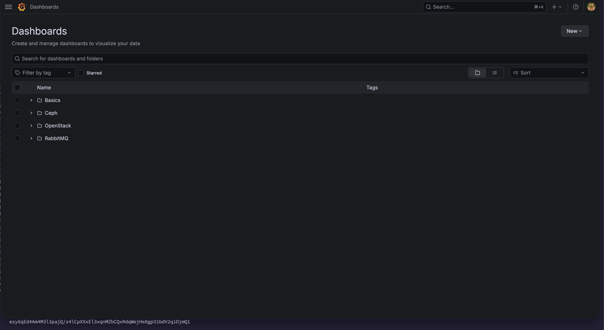</p>

5. Click on New then Import

  <p align="center">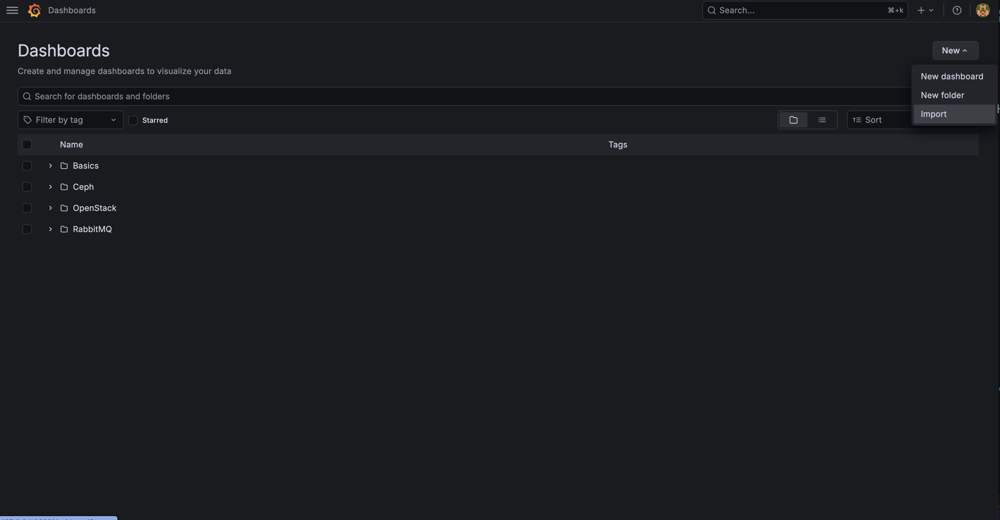</p>

6. Input: 1860 and click Load

   <p align="center">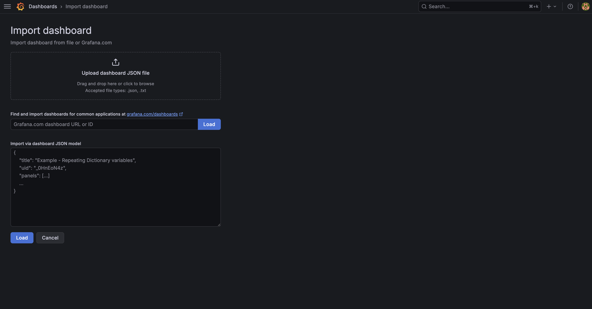</p>

7. Click on source: "Prometheus"

8. Click on Import:

## Success State, Next Steps and Troubleshooting

Congratulations on successfully deploying your monitoring stack and adding Grafana Dashboards to visualize this.

<p align="center">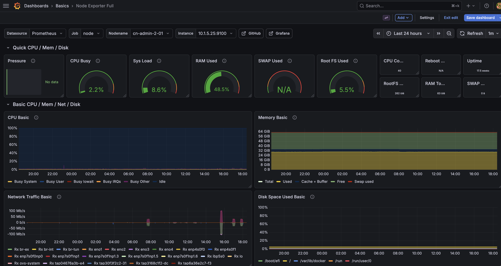</p>

If you've managed to successfully configure your dashboards for your head node, repeat the steps for deploying **Node Exporter** on your compute node(s).

> [!NOTE]
> Should you have any difficulties running the above configuration, use the alternative process below to deploy your monitoring stack. Click on the heading to reveal content.
<details>
<summary>Installing your monitoring stack from pre-compiled binaries</summary>
For this tutorial we will install from precompiled binaries.

### Prometheus
The installation and configuration of Prometheus should be done on your head node.

1. Create a Prometheus user without login access, this will be done manually as shown below:
 ```bash
sudo useradd --no-create-home --shell /sbin/nologin prometheus
 ```
2. Download the latest stable version of Prometheus from the official site using `wget`
 ```bash
wget https://github.com/prometheus/prometheus/releases/download/v2.33.1/prometheus-2.33.1.linux-amd64.tar.gz
 ```
3. List the files to verify Prometheus was downloaded
 ```bash
ll
 ```
4. Extract the downloaded archive and move prometheus binaries to the /usr/local/bin directory.
```bash
tar -xvzf prometheus-2.33.1.linux-amd64.tar.gz
cd prometheus-2.33.1.linux-amd64
sudo mv prometheus promtool /usr/local/bin/
```
5. Move back to the home directory and create directories for Prometheus.
 ```bash
cd ~
sudo mkdir /etc/prometheus
sudo mkdir /var/lib/prometheus
 ```
6. Set the correct ownership for the prometheus directories
 ```bash
sudo chown prometheus:prometheus /etc/prometheus/
sudo chown prometheus:prometheus /var/lib/prometheus
 ```
7. Move the configuration file and set the correct permissions
 ```bash
cd prometheus-2.33.1.linux-amd64
sudo mv consoles/ console_libraries/ prometheus.yml /etc/prometheus/
sudo chown -R prometheus:prometheus /etc/prometheus/
 ```
8. Configure Prometheus \
  Edit the `/etc/prometheus/prometheus.yml` file to configure your targets (compute node)

    *Hint : Add the job configuration for the compute_node in the scrape_configs section of your Prometheus YAML configuration file. Ensure that all necessary configurations for this job are correctly placed within the relevant sections of the YAML file.*:

```yaml
global:
  scrape_interval: 15s

scrape_configs:
  - job_name: "prometheus"
    static_configs:
      - targets: ["localhost:9090"]
  - job_name: "compute_node"
    static_configs:
      - targets: ["<compute_node_ip>:9100"]
```
9. Create a service file to manage Prometheus with `systemctl`, the file can be created with the text editor `nano` (Can use any text editor of your choice)
 ```bash
sudo nano /etc/systemd/system/prometheus.service
 ```
 ```plaintext
[Unit]
Description=Prometheus
Wants=network-online.target
After=network-online.target

[Service]
User=prometheus
Group=prometheus
Type=simple
Restart=on-failure
RestartSec=5s
ExecStart=/usr/local/bin/prometheus \
  --config.file=/etc/prometheus/prometheus.yml \
  --storage.tsdb.path=/var/lib/prometheus/ \
  --web.console.templates=/etc/prometheus/consoles \
  --web.console.libraries=/etc/prometheus/console_libraries

[Install]
WantedBy=multi-user.target
```
10. Reload the systemd daemon, start and enable the service
 ```bash
sudo systemctl daemon-reload
sudo systemctl enable prometheus
sudo systemctl start prometheus
 ```

11. Check that your service is active by checking the status
  ```bash
  sudo systemctl status prometheus
  ```

> [!TIP]
> If when you check the status and find that the service is not running, ensure SELinux or AppArmor is not restricting Prometheus from running. Try disabling SELinux/AppArmor temporarily to see if it resolves the issue:
>
> ```bash
> sudo setenforce 0
> ```
>
> Then repeat steps 10 and 11.
>
> If the prometheus service still fails to start properly, run the command `journalctl –u prometheus -f --no-pager` and review the output for errors.

> [!IMPORTANT]
> If you have a firewall running, add a TCP rule for port 9090

Verify that your Prometheus configuration is working by navigating to `http://<headnode_ip>:9090` in your web browser to access the Prometheus web interface. Ensure that the `headnode_ip` is the public-facing IP.

### Node Exporter
Node Exporter is a Prometheus exporter specifically designed for hardware and OS metrics exposed by Unix-like kernels. It collects detailed system metrics such as CPU usage, memory usage, disk I/O, and network statistics. These metrics are exposed via an HTTP endpoint, typically accessible at `<node_ip>:9100/metrics`. The primary role of Node Exporter is to provide a source of system-level metrics that Prometheus can scrape and store. This exporter is crucial for gaining insights into the health and performance of individual nodes within a network.

The installation and configuration of Node Exporter will be done on the **compute node(s)**.

1. Create a Node Exporter User
 ```bash
sudo adduser -M -r -s /sbin/nologin node_exporter
```
2. Download and install Node Exporter; this is done using `wget` as before
 ```bash
cd /usr/src/

sudo wget https://github.com/prometheus/node_exporter/releases/download/v1.6.1/node_exporter-1.6.1.linux-amd64.tar.gz

sudo tar xvf node_exporter-1.6.1.linux-amd64.tar.gz
```
3. Next, move the node exporter binary file to the directory '/usr/local/bin' using the following command
```bash
mv node_exporter-*/node_exporter /usr/local/bin
```
4. Create a service file to manage Node Exporter with `systemctl`; the file can be created with the text editor `nano` (or any text editor of your choice)
 ```bash
sudo nano /etc/systemd/system/node_exporter.service
 ```
 ```plaintext
[Unit]
Description=Node Exporter
After=network.target

[Service]
User=node_exporter
Group=node_exporter
Type=simple
ExecStart=/usr/local/bin/node_exporter

[Install]
WantedBy=multi-user.target
```
> [!IMPORTANT]
> If firewalld is enabled and running, add a rule for port 9100 
> 
> ```bash
> sudo firewall-cmd --permanent --zone=public --add-port=9100/tcp
> sudo firewall-cmd --reload 
> ```

5.  Reload the systemd daemon, start and enable the service
 ```bash
sudo systemctl daemon-reload
sudo systemctl enable node_exporter 
sudo systemctl start node_exporter
 ```
6. Check that your service is active by checking the status
  ```bash
  sudo systemctl status node_exporter
  ``` 
#### SSH Tunneling
In order to verify that Node Exporter is set up correctly, we need to access `<node_ip>:9100/metrics`. This can only be done through an SSH tunnel.

**What is SSH Tunneling?** \
SSH tunneling, also known as SSH port forwarding, is a method of securely forwarding network traffic from one network node to another via an encrypted SSH connection. It allows you to securely transmit data over untrusted networks by encrypting the traffic.

**Why Use SSH Tunneling in This Scenario?** \
In this setup, the compute node has only a private IP and is not directly accessible from the internet. The headnode, however, has both a public IP (accessible from the internet) and a private IP (in the same network as the compute node).

Using SSH tunneling allows us to:

- Access Restricted Nodes: Since the compute node is only reachable from the headnode, we can create an SSH tunnel through the headnode to access the compute node.
- Secure Transmission: The tunnel encrypts the traffic between your local machine and the compute node, ensuring that any data sent through this tunnel is secure.
- Simplify Access: By tunneling the Node Exporter port (9100) from the compute node to your local machine, you can access the metrics as if they were running locally, making it easier to monitor and manage the compute node.

  1. Set Up SSH Tunnel on Your Local Machine
```bash
ssh -L 9100:compute_node_ip:9100 user@headnode_ip -N
```
- ssh -L: This option specifies local port forwarding. It maps a port on your local machine (first 9100) to a port on a remote machine (second 9100 on compute_node_ip) via the SSH server (headnode).
- compute_node_ip:9100: The target address and port on the compute node where Node Exporter is running.
user@headnode_ip: The SSH connection details for the headnode.
- -N: Tells SSH to not execute any commands, just set up the tunnel.

  2. By navigating to http://localhost:9100/metrics in your web browser, you can access the Node Exporter metrics from the compute node as if the service were running locally on your machine.

### Grafana
Grafana is an open-source platform for monitoring and observability, known for its capability to create interactive and customizable dashboards. It integrates seamlessly with various data sources, including Prometheus. Through its user-friendly interface, Grafana allows users to build and execute queries to visualize data effectively. Beyond visualization, Grafana also supports alerting based on the visualized data, enabling users to set up notifications for specific conditions. This makes Grafana a powerful tool for both real-time monitoring and historical analysis of system performance.

Now we return to the head node for the installation and configuration of Grafana
 1. Add the Grafana repository by adding the following directives to this file:
```bash
sudo nano /etc/yum.repos.d/grafana.repo
```
 ```plaintext
  [grafana] 
  name=grafana 
  baseurl=https://rpm.grafana.com 
  repo_gpgcheck=1 
  enabled=1 
  gpgcheck=1 
  gpgkey=https://rpm.grafana.com/gpg.key 
  sslverify=1 
  sslcacert=/etc/pki/tls/certs/ca-bundle.crt 
  exclude=*beta*
```

2. Install Grafana
 ```bash
sudo dnf install grafana -y 
```

3. Start and Enable Grafana 
 ```bash
sudo systemctl start grafana-server
sudo systemctl enable grafana-server
```

4. Check the status of grafana-server
```bash
sudo systemctl status grafana-server
```
> [!IMPORTANT]
> If firewalld is enabled and running, add a rule for port 9100 
> 
> ```bash
> sudo firewall-cmd --permanent --zone=public --add-port=3000/tcp
> sudo firewall-cmd --reload 

</details>

# Configuring and Connecting to your Remote JupyterLab Server

[Project Jupyter](https://jupyter.org/) provides powerful tools for scientific investigations due to their interactive and flexible nature. Here are some key reasons why they are favored in scientific research.

* Interactive Computing and Immediate Feedback

  Run code snippets and see the results immediately, which helps in quick iterations and testing of hypotheses.  Directly plot graphs and visualize data within the notebook, which is crucial for data analysis.

* Documentation and Rich Narrative Text

  Combine code with Markdown text to explain the methodology, document findings, and write detailed notes. Embed images, videos, and LaTeX equations to enhance documentation and understanding.

* Reproducibility

  Share notebooks with others to ensure that they can reproduce the results by running the same code. Use tools like Git to version control the notebooks, ensuring a record of changes and collaborative development.

* Data Analysis and Visualization

  Utilize a wide range of Python libraries such as NumPy, Pandas, Matplotlib, and Seaborn for data manipulation and visualization. Perform exploratory data analysis (EDA) seamlessly with powerful plotting libraries.

Jupyter Notebooks provide a versatile and powerful environment for conducting scientific investigations, facilitating both the analysis and the clear communication of results.

1. Start by installing all the prerequisites

   You would have already installed most of these from [Qiskit Benchmark](../tutorial3/README.md##qiskit-quantum-volume) in tutorial 3.
   * DNF / YUM
     ```bash
     # RHEL, Rocky, Alma, CentOS Stream
     sudo dnf install python python-pip
     ```
   * APT
     ```bash
     # Ubuntu
     sudo apt install python python-pip
     ```
   * Pacman
     ```bash
     # Arch
     sudo pacman -S python python-pip
     ```
1. Open TCP port 8889 on your nftables firewall, and restart the service
   ```bash
   sudo nano /etc/nftables/hn.nft
   sudo systemctl restart nftables
   ```

> [!TIP]
> There are a number of plotting utilities available in Python. Each with their own advantages and disadvantages. You will be using [Plotly](https://plotly.com/python/ipython-notebook-tutorial/) in the following exercises.

## Visualize Your HPL Benchmark Results

You will now visualize the results from the [table you prepared of Rmax (GFlops/s)](../tutorial3/README.md#top500-list) scores for different configurations of HPL.

1. Create and Activate a New Python Virtual Environment

   Separate your python projects and ensure that they exist in their own, clean environments:

   ```bash
   python -m venv hplScores
   source hplScores/bin/activate
   ```
1. Install Project Jupyter and Plotly plotting utilities and dependencies
   ```bash
   pip install jupyterlab ipywidgets plotly jupyter-dash
   ```
1. Start the JupyterLab server
   ```bash
   jupyter lab --ip 0.0.0.0 --port 8889 --no-browser
   ```
   * `--ip` binds to all interfaces on your head node, including the public facing address
   * `--port` bind to the port that you granted access to in `nftables`
   * --no-browser, do not try to launch a browser directly on your head node.
1. Carefully copy your `<TOKEN>` from the command line after successfully launching your JupyterLab server.
   ```bash
   # Look for a line similar to the one below, and carefully copy your <TOKEN>
   http://127.0.0.1:8889/lab?token=<TOKEN>
   ```
1. Open a browser on your workstation and navigate to your JupyterLab server on your head node:
   ```bash
   http://<headnode_public_ip>:8889
   ```
1. Login to your JupyterLab server using your `<TOKEN>`.
1. Create a new Python Notebook and plot your HPL results:
   ```python
   import plotly.express as px
   x=["Head [<treads>]", "Compute Repo MPI and BLAS [<threads>]", "Compute Compiled MPI and BLAS [<threads>]", "Compute Intel oneAPI Toolkits", "Two Compute Nodes", "etc..."]
   y=[<gflops_headnode>, <gflops_compute>, <gflops_compute_compiled_mpi_blas>, <gflops_compute_intel_oneapi>, <gflops_two_compute>, <etc..>]
   fig = px.bar(x, y)
   fig.show()
   ```
1. Click on the camera icon to download and save your image.
   Post your results as a comment, replying to this [GitHub discussion thread](https://github.com/chpc-tech-eval/chpc24-scc-nmu/discussions/114).

## Visualize Your Qiskit Results

You are now going to extend your `qv_experiment` and plot your results by drawing a graph of *"Number of Qubits vs Simulation Time to Solution"*:

1. Create and Activate a New Python Virtual Environment

   Separate your python projects and ensure that they exist in their own, clean environments:

   ```bash
   python -m venv
   source QiskitAer/bin/activate
   ```
1. You may need to install additional dependencies
   ```bash
   pip install matplotlib jupyterlab
   ```

1. Append the following to your `qv_experiment.py` script:

   ```python
   # number of qubits, for your system see how much higher that 30 your can go...
   num_qubits = np.arrange(2, 10)

   # QV Depth
   qv_depth = 5

   # For bonus points submit results with up to 20 or even 30 shots
   # Note that this will be more demanding on your system
   num_shots = 10

   # Array for storing the output results
   result_array = [[], []]

   # iterate over qv depth and number of qubits
   for i in num_qubits:
     result_array[i] = quant_vol(qubits=i, shots=num_shots, depth=qv_depth)
     # for debugging purposes you can optionally print the output
     print(i, result_array[i])

   import matplotlib.pyplot as plt
   plt.xlabel('Number of qubits')
   plt.ylabel('Time (sec)')
   plt.plot(num_qubits, results_array)
   plt.title('Quantum Volume Experiment with depth=' + str(qv_depth))
   plt.savefig('qv_experiment.png')
   ```

1. Run the benchmark by executing the script you've just written:
   ```bash
   python qv_experiment.py
   ```

# Automating the Deployment of your OpenStack Instances Using Terraform

Terraform is a piece of software that allows one to write out their cloud infrastructure and deployments as code, [IaC](https://en.wikipedia.org/wiki/Infrastructure_as_code). This allows the deployments of your cloud virtual machine instances to be shared, iterated, automated as needed and for software development practices to be applied to your infrastructure.

In this section of the tutorial, you will be deploying an additional compute node from your `head node` using Terraform.

> [!CAUTION]
> In the following section, **you must request additional resources from the instructors**. This additional node will be experimental for testing your changes to your cluster before committing them to your active compute nodes. You will be deleting and reinitializing this instance often. Make sure you understand how to [Delete Instance](../tutorial1/README.md#troubleshooting).

## Install and Initialize Terraform

You will now prepare, install and initialize Terraform on your head node. You will define and configure a `providers.tf` file, to configure OpenStack instances (as Sebowa is an OpenStack based cloud).

1. Use your operating system's package manager to install Terraform

   This could be your workstation or one of your VMs. The machine must be connected to the internet and have access to your OpenStack workspace, i.e. https://sebowa.nicis.ac.za
   * DNF / YUM
   ```bash
   sudo yum update -y

   # Install package to manage repository configurations
   sudo yum install -y dnf-plugins-core

   # Add the HashiCorp Repo
   sudo dnf config-manager --add-repo https://rpm.releases.hashicorp.com/RHEL/hashicorp.repo

   sudo dnf install -y terraform
   ```
   * APT
   ```bash
   # Update package repository
   sudo apt-get update
   sudo apt-get install -y gnupg software-properties-common

   # Add HashiCorp GPG Keys
   wget -O- https://apt.releases.hashicorp.com/gpg | gpg --dearmor | sudo tee /usr/share/keyrings/hashicorp-archive-keyring.gpg

   # Add the official HashiCorp Linux Repo
   echo "deb [signed-by=/usr/share/keyrings/hashicorp-archive-keyring.gpg] https://apt.releases.hashicorp.com $(lsb_release -cs) main" | sudo tee /etc/apt/sources.list.d/hashicorp.list

   ```
   * Pacman
   ```bash
   # Arch
   sudo pacman -S terraform
   ```

1. Create a Terraform directory, descend into it and Edit the `providers.tf` file

   ```bash
   mkdir terraform
   cd terraform
   vim providers.tf
   ```

1. You must specify a [Terraform Provider](https://registry.terraform.io/browse/providers)

   These can vary from MS Azure, AWS, Google, Kubernetes etc... We will be implementing an OpenStack provider as this is what is implemented on the Sebowa cloud platform. Add the following to the `providers.tf` file.
   ```conf
   terraform {
     required_providers {
       openstack = {
         source = "terraform-provider-openstack/openstack"
         version = "1.46.0"
       }
     }
   }
   ```
1. Initialize Terraform

   From the folder with your provider definition, execute the following command:
   ```bash
   terraform init
   ```

## Generate `clouds.yml` and `main.tf` Files

Generate and configure the `cloud.yml` file that will authenticate you against your Sebowa OpenStack workspace, and the `main.tf`files that will define how your infrastructure should be provisioned.

1. Generate OpenStack API Credentials

   From _your_ team's Sebowa workspace, navigate to `Identity` &rarr; `Application Credentials`, and generate a set of OpenStack credentials in order to allow you to access and authenticate against your workspace.

   <p align="center">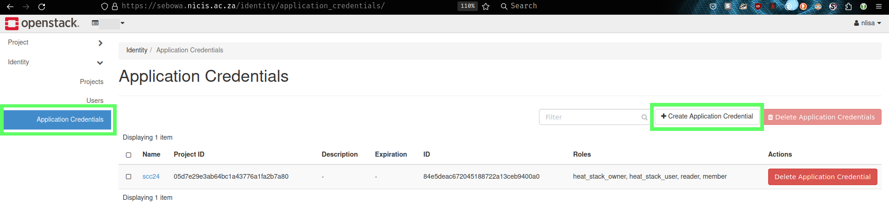</p>

1. Download and Copy the `clouds.yml` File

   Copy the `clouds.yml` file to the folder where you initialized terraform. The contents of the of which, should be _similar_ to:
   ```config
   # This is a clouds.yaml file, which can be used by OpenStack tools as a source
   # of configuration on how to connect to a cloud. If this is your only cloud,
   # just put this file in ~/.config/openstack/clouds.yaml and tools like
   # python-openstackclient will just work with no further config. (You will need
   # to add your password to the auth section)
   # If you have more than one cloud account, add the cloud entry to the clouds
   # section of your existing file and you can refer to them by name with
   # OS_CLOUD=openstack or --os-cloud=openstack
   clouds:
     openstack:
       auth:
         auth_url: https://sebowa.nicis.ac.za:5000
         application_credential_id: "<YOUR TEAM's APPLICATION CREDENTIAL ID"
         application_credential_secret: "<YOUR TEAM's APPLICATION CREDENTIAL SECRET>"
       region_name: "RegionOne"
       interface: "public"
       identity_api_version: 3
       auth_type: "v3applicationcredential"
   ```
1. Create `main.tf` Terraform File
   Inside your `terraform` folder, you must define a `main.tf` file. This file is used to identify the provider to be implemented as well as the compute resource configuration details of the instance we would like to launch.

   You will need to define your own `main.tf` file, but below is an example of one such definition:
   ```config
   provider "openstack" {
     cloud = "openstack"
   }
   resource "openstack_compute_instance_v2" "terraform-demo-instance" {
     name = "scc24-arch-cn03"
     image_id = "33b938c8-6c07-45e3-8f2a-cc8dcb6699de"
     flavor_id = "4a126f4f-7df6-4f95-b3f3-77dbdd67da34"
     key_pair = "nlisa at mancave"
     security_groups = ["default", "ssc24_sq"]

     network {
       name = "nlisa-vxlan"
     }
   }
   ```

> [!NOTE]
> You must specify your own variables for `name`, `image_id`, `flavor_id`, `key_pair` and `network.name`.

## Generate, Deploy and Apply Terraform Plan

1. Generate and Deploy Terraform Plan
   Create a Terraform plan based on the current configuration. This plan will be used to implement changes to your Sebowa OpenStack cloud workspace, and can be reviewed before applying those changes.
   Generate a plan and write it to disk:
   ```bash
   terraform plan -out ~/terraform/plan
   ```

1. Once you are satisfied with the proposed changes, deploy the terraform plan:
   ```bash
   terraform apply ~terraform/plan
   ```

1. Verify New Instance Successfully Created by Terraform
   Finally confirm that your new instance has been successfully created. On your Sebowa OpenStack workspace, navigate to `Project` &rarr; `Compute` &rarr; `Instances`.

> [!TIP]
> To avoid losing your team's progress, it would be a good idea to create a GitHub repo in order for you to commit and push your various scripts and configuration files.

# Continuous Integration Using CircleCI

Circle CI is a Continuous Integration and Continuous Delivery platform that can be utilized to implement DevOps practices. It helps teams build, test, and deploy applications quickly and reliably.

In this section of the tutorial, you're going to expand on OpenStack instance automation with CircleCI `Workflows` and `Pipelines`. For this tutorial, you will use your GitHub account to integrate directly with CircleCI.

## Prepare GitHub Repository

   You will be integrating GitHub into CircleCI workflows, wherein every time you commit changes to your `deploy_compute` GitHub repository, CircleCI will instantiate and trigger Terraform to create a new compute node VM on Sebowa.

1. Create GitHub Repository
   If you haven't already done so, sign up for a [GitHub Account](https://github.com/). Then create an empty private repository with a suitable name, i.e. `deploy_compute_node`:

   <p align="center">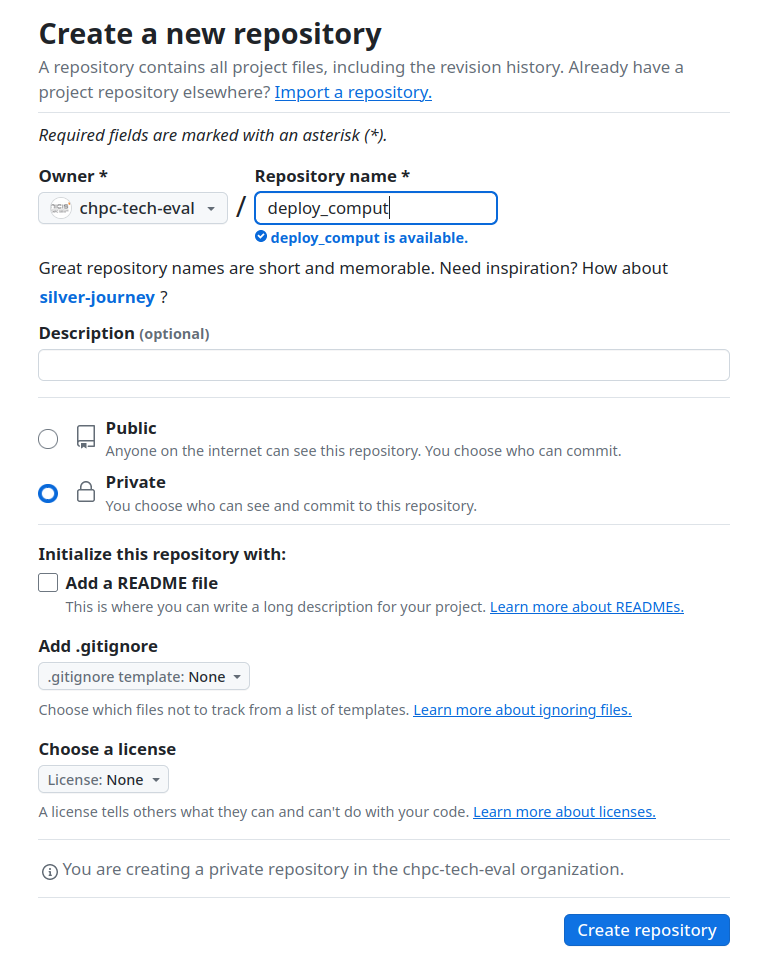</p>

1. Add your team members to the repository to provide them with access:
   <p align="center">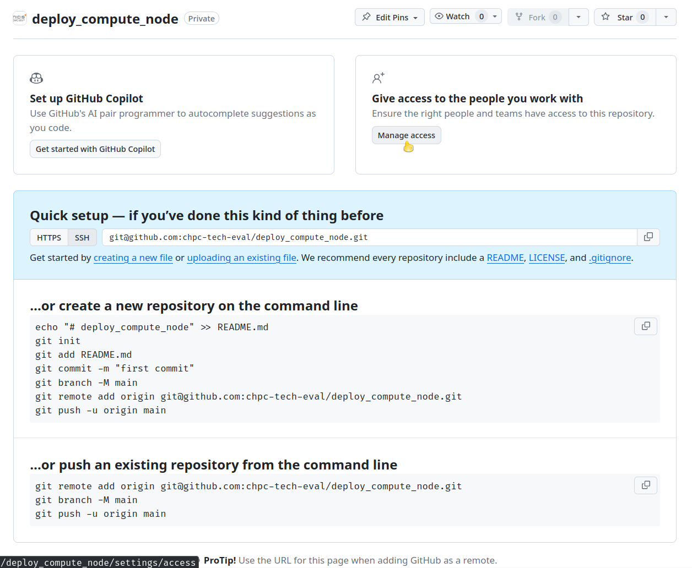</p>

1. If you haven't already done so, add your SSH key to your GitHub account by following the instructions from [Steps to follow when editing existing content](../README.md#steps-to-follow-when-editing-existing-content).

> [!TIP]
> You will be using your head node to orchestrate and configure your infrastructure. Pay careful attention to ensure that you copy over your **head node**'s public SSH key. Administrating and managing your compute nodes in this manner requires you to think about them as "cattle" and not "pets".

## Reuse `providers.tf` and `main.tf` Terraform Configurations

1. On your head node, create a folder that is going to be used to initialize the GitHub repository:
   ```bash
   mkdir ~/deploy_compute_node
   cd ~/deploy_compute_node
   ```

1. Copy the `providers.tf` and `main.tf` files you had previously generated:

   ```bash
   cp ~/terraform/providers.tf ./
   cp ~/terraform/main.tf ./
   vim main.tf
   ```

## Create `.circleci/config.yml` File and `push` Project to GitHub

   The `.circle/config.yml` configuration file is where you define your build, test and deployment process. From your head node, you are going to be `pushing` your Infrastructure as Code to your private GitHub repository. This will then automatically trigger the CircleCI deployment of a Docker container which has been tailored for Terraform operations and instructions that will deploy your Sebowa OpenStack compute node instance.

1. Create and edit `.circleci/config.yml`:
   ```bash
   mkdir .circleci
   vim .circleci/config.yml # Remember that if you are not comfortable using Vim, install and make use of Nano
   ```

1. Copy the following configuration into `.circle/config.yml`:
   ```conf
   version: 2.1

   jobs:
     deploy:
       docker:
         - image: hashicorp/terraform:latest
       steps:
         - checkout

         - run:
             name: Create clouds.yaml
             command: |
               mkdir -p ~/.config/openstack
               echo "clouds:
                 openstack:
                   auth:
                     auth_url: https://sebowa.nicis.ac.za:5000
                     application_credential_id: ${application_credential_id}
                     application_credential_secret: ${application_credential_secret}
                   region_name: "RegionOne"
                   interface: "public"
                   identity_api_version: 3
                   auth_type: "v3applicationcredential"" > ~/.config/openstack/clouds.yaml

         - run:
             name: Terraform Init
             command: terraform init

         - run:
             name: Terraform Apply
             command: terraform apply -auto-approve

   workflows:
     version: 2
     deploy_workflow:
     jobs:
       - deploy

   ```
     - **Version**: Specifies the configuration version.
     - **Jobs**: Defines the individual steps in the build process, where we've defined a `build` job that runs inside the latest Terraform Docker container from Hashicorp.
     - **Steps**: The steps to execute within the job:
       * `checkout`: Clone and checkout the code from the repository.
       * `run`: Executes a number of shell commands to create the `clouds.yaml` file, then initialize and apply the Terraform configuration.
     - **Workflows**: Defines the workflow(s) that CircleCI will follow, where in this instance there is a single workflow specified `deploy_workflow`, that runs the `deploy` job.

1. `Init`ialize the Git Repository, `add` the files you've just created and `push` to GitHub:
   Following the instructions from the previous section where you created a new GitHub repo, execute the following commands from your head node, inside the `deploy_compute_node` folder:
   ```bash
   cd ~/deploy_compute_node
   git init
   git add .
   git commit -m "Initial Commit." # You may be asked to configure you Name and Email. Follow the instructions on the screen before proceeding.
   git branch -M main
   git remote add origin git@github.com:<TEAM_NAME>/deploy_compute_node.git
   git push -u origin main
   ```
   The new files should now be available on GitHub.

## Create CircleCI Account and Add Project

   Navigate to [CircleCI.com](https://circleci.com) to create an account, link and add a new GitHub project.
1. Create a new organization and give it a suitable name
   <p align="center"></p>
1. Once you've logged into your workspace, go to projects and create a new project
   <p align="center">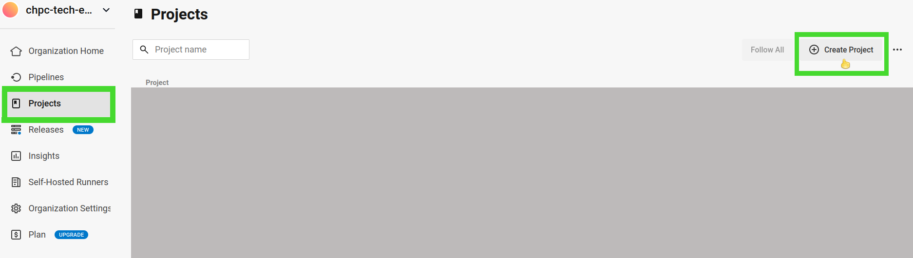</p>
1. Create a new IaC Project
   <p align="center">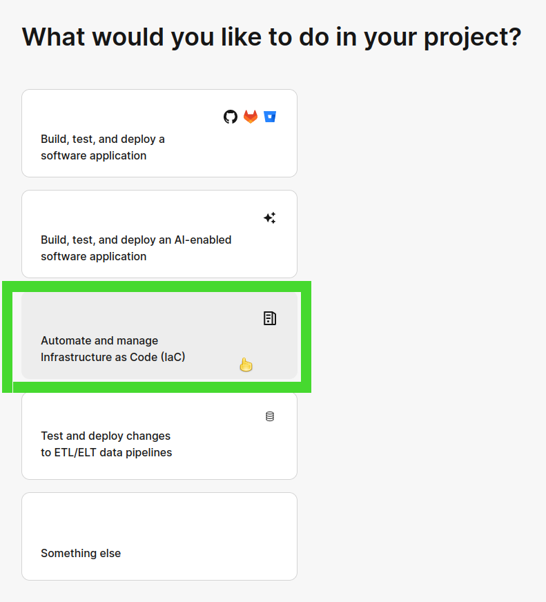</p>
1. If your repository is on GitHub, create a corresponding project
   <p align="center">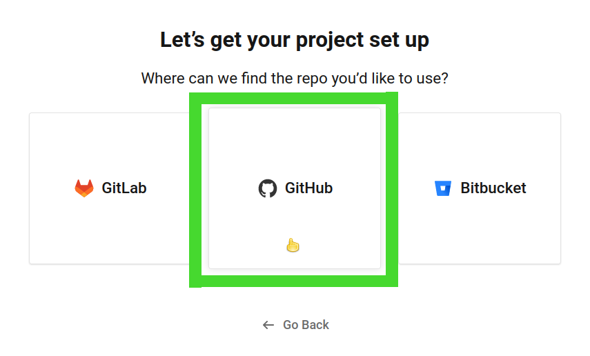</p>
1. Pick a project name and a repository to associate it to
   <p align="center">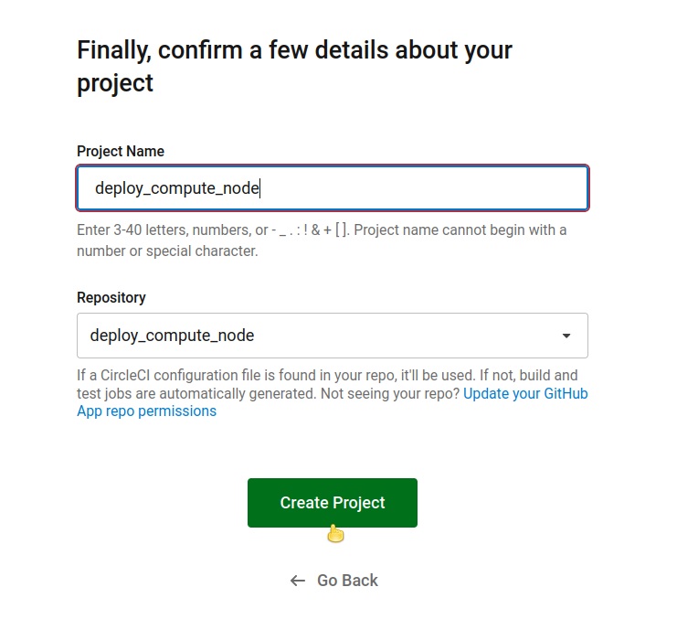</p>
1. Push the configuration to GitHub to trigger workflow
   <p align="center">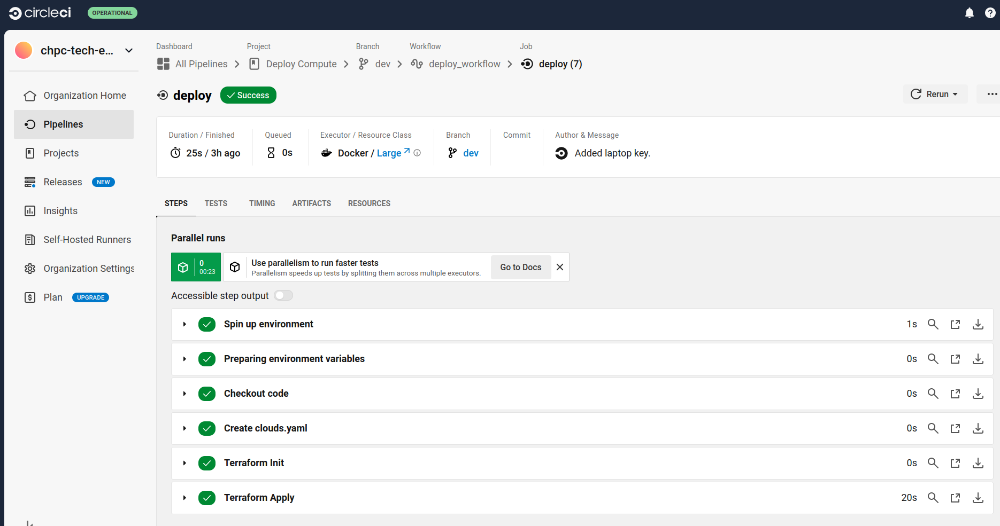</p>

> [!IMPORTANT]
> You're going to need to delete your experimental compute node instance on your Sebowa OpenStack workspace, each time you want to test or run the CircleCI integration. It has been included here for demonstration purposes, so that you may begin to see the power and utility of CI/CD and automation.
>
> Navigate to your Sebowa OpenStack workspace to ensure that they deployment was successful.
>
> Consider how you could streamline this process even further using preconfigured instance snapshots, as well as  Ansible after your instances have been deployed.

# How to use Ansible and GitHub Actions to run HPL

To run the High-Performance Linpack (HPL) benchmark using Ansible and GitHub Actions, you can follow these steps:

## **Step 1: Set up a GitHub Repo**
1. Create a GitHub repository or navigate to an existing repository.

2. In your repo, navigate to **Settings** → **Security** → **Secrets and variables** → **Actions**.

3. Click on **New repository secret**. For the title, enter `SSH_PRIVATE_KEY`, and for the secret, paste the private key you use to connect to the cluster.

<p align="center">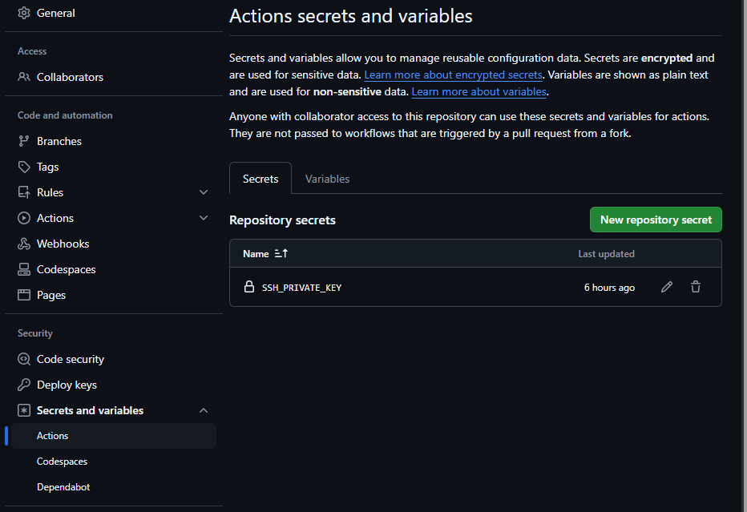</p>


## **Step 2: Create a Bash script, Ansible playbook and an Inventory file**
 Click on **<>Code** in the navigation bar on top of the page.

### Bash script ###
1. Create a file called : `ansible/run_hpl.sh`

2. Example of file contents: 
```bash
#!/bin/bash

# Navigate to the directory that contains your hpl binary file
cd /home/rocky/hpl/bin/compile_BLAS_MPI/

# Run the HPL benchmark with srun
srun -n16 ./xhpl
```
### Ansible playbook ###
1. Create a file called `ansible/playbook.yml`

2. Example of file contents: 
```yaml
- name: Run HPL benchmark
  hosts: all
  tasks:
    - name: Copy the run_hpl.sh script to remote machine
      copy:
        src: run_hpl.sh  # Path to the script in the repo
        dest: /home/rocky/run_hpl.sh  # Destination path on the remote machine
        mode: '0755'  # Make the script executable

    - name: Run HPL benchmark
      shell: |
        source /home/rocky/.profile
        /home/rocky/run_hpl.sh
      become: yes
```
### Ansible Inventory File ###
1. Create a file called `ansible/inventory`

2. Example of file contents:
```yaml
[headnode]
# Only the head node's IP
154.114.57.146 ansible_user=rocky
```

## **Step 3: Create a Github Actions Workflow**
1. Click on **<>Code** in the navigation bar on top of the page.

2. Create a file called:  `.github/workflows/run_hpl.yml`

3. Example of file contents:
```yaml
name: Run Ansible Playbook

on:
  push:
    branches:
      - main

jobs:
  ansible:
    runs-on: ubuntu-latest

    steps:
    - name: Checkout repository
      uses: actions/checkout@v3

    - name: Set up SSH
      run: |
        # Ensure the .ssh directory exists
        mkdir -p ~/.ssh
        chmod 700 ~/.ssh

        # Write the private key to the correct location
        echo "${{ secrets.SSH_PRIVATE_KEY }}" > ~/.ssh/id_rsa
        chmod 600 ~/.ssh/id_rsa

        # Add known hosts to the .ssh directory
        echo "${{ secrets.KNOWN_HOSTS }}" > ~/.ssh/known_hosts
        chmod 644 ~/.ssh/known_hosts

    - name: Test SSH Connection
      run: |
        ssh -i ~/.ssh/id_rsa -o StrictHostKeyChecking=no rocky@154.114.57.146 "echo Connected!"

    - name: Run Ansible Playbook
      run: ansible-playbook ansible/playbook.yml -i ansible/inventory
```
5. **Commit changes** and push.

## **Final Remarks**

After pushing the workflow file, the HPL benchmark will run on all nodes if Slurm and OpenMPI are configured correctly. To confirm that the benchmark is running, check your cluster monitoring software (Grafana) or use `htop`/`btop` on the compute nodes.

The GitHub Actions workflow is triggered on push events, which means that if any code is pushed to the repository, the HPL benchmark will run.


# Slurm Scheduler and Workload Manager

The Slurm Workload Manager (formerly known as Simple Linux Utility for Resource Management), is a free and open-source job scheduler for Linux, used by many of the world's supercomputers/computer clusters. It allows you to manage the resources of a cluster by deciding how users get access for some duration of time so they can perform work. To find out more, please visit the [Slurm Website](https://slurm.schedmd.com/documentation.html).

## Prerequisites

1. Make sure the clocks, i.e. chrony daemons, are synchronized across the cluster.

2. Generate a **SLURM** and **MUNGE** user on all of your nodes:

    - **If you have Ansible User Module working**
        - Create the users as shown in tutorial 2 **Do NOT add them to the sysadmin group**.
    - **If you do NOT have your Ansible User Module working**
       - `useradd slurm`
       - Ensure that users and groups (UIDs and GIDs) are synchronized across the cluster. Read up on the appropriate [/etc/shadow](https://linuxize.com/post/etc-shadow-file/) and [/etc/password](https://www.cyberciti.biz/faq/understanding-etcpasswd-file-format/) files.

## Head Node Configuration (Server)


1. Install the [MUNGE](https://dun.github.io/munge/) package. MUNGE is an authentication service that makes sure user credentials are valid and is specifically designed for HPC use.

    First, we will enable the **EPEL** _(Extra Packages for Enterprise Linux)_ repository for `dnf`, which contains extra software that we require for MUNGE and Slurm:

    ```bash
      sudo dnf install epel-release
    ```

    Then we can install MUNGE, pulling the development source code from the `crb` "CodeReady Builder" repository:

    ```bash
      sudo dnf config-manager --set-enabled crb
      sudo dnf install munge munge-libs munge-devel
    ```

2. Generate a MUNGE key for client authentication:

    ```bash
      sudo /usr/sbin/create-munge-key -r
      sudo chown munge:munge /etc/munge/munge.key
      sudo chmod 600 /etc/munge/munge.key
    ```

3. Using `scp`, copy the MUNGE key to your compute node to allow it to authenticate:

    1. SSH into your compute node and create the directory `/etc/munge`. Then exit back to the head node.

    2. Since, munge has not yet been installed on your compute node, first transfer the file to a temporary location
    ```bash
      sudo cp /etc/munge/munge.key /tmp/munge.key && sudo chown user:user /tmp/munge.key
    ```
    **Replace user with the name of the user that you are running these commands as**

    3. Move the file to your compute node
    ```bash
      scp /etc/munge/munge.key <compute_node_name_or_ip>:/etc/tmp/munge.key
    ```

    4. Move the file to the correct location
    ```bash
      ssh <computenode hostname or ip> 'sudo mv /tmp/munge.key /etc/munge/munge.key'
    ```

4. **Start** and **enable** the `munge` service

   Test munge encryption/decryption between the current node and a different node
    ```bash
      munge -n | ssh <different node hostname or ip> unmunge
    ```

5. Install dependency packages:

    ```bash
    sudo dnf install gcc openssl openssl-devel pam-devel numactl numactl-devel hwloc lua readline-devel ncurses-devel man2html libibmad libibumad rpm-build perl-Switch libssh2-devel mariadb-devel perl-ExtUtils-MakeMaker rrdtool-devel lua-devel hwloc-devel pmix pmix-devel dbus-devel
    ```

6. Download the 25.11.6 version of the Slurm source code tarball (.tar.bz2) from https://download.schedmd.com/slurm/. Copy the URL for `slurm-25.11.6.bz2` from your browser and use the `wget` command to easily download files directly to your VM.

7. Environment variables are a convenient way to store a name and value for easier recovery when they're needed. Export the version of the tarball you downloaded to the environment variable VERSION. This will make installation easier as you will see how we reference the environment variable instead of typing out the version number at every instance.

    ```bash
      export VERSION=25.11.6
    ```

8. Build RPM packages for Slurm for installation

    ```bash
      rpmbuild --define "_annobin_gcc_plugin %{nil}" --define "_with_pmix --with-pmix=/usr" -ta slurm-$VERSION.tar.bz2
    ```

    This should successfully generate Slurm RPMs in the `~/rpmbuild/RPMS/x86_64` directory.

9.  Copy these RPMs to your compute node to install later, using `scp`.

10. Install Slurm server

    ```bash
      sudo dnf localinstall ~/rpmbuild/RPMS/x86_64/slurm-$VERSION*.rpm \
                            ~/rpmbuild/RPMS/x86_64/slurm-devel-$VERSION*.rpm \
                            ~/rpmbuild/RPMS/x86_64/slurm-example-configs-$VERSION*.rpm \
                            ~/rpmbuild/RPMS/x86_64/slurm-perlapi-$VERSION*.rpm \
                            ~/rpmbuild/RPMS/x86_64/slurm-slurmctld-$VERSION*.rpm
    ```

11. Setup Slurm server

    ```bash
      sudo cp /etc/slurm/slurm.conf.example /etc/slurm/slurm.conf
    ```

    Edit this file (`/etc/slurm/slurm.conf`) and set appropriate values for:

    ```conf
    ClusterName=      #Name of your cluster (whatever you want)
    ControlMachine=   #DNS name of the head node
    ```

    Populate the node's specification at the bottom with the following lines:

    ```conf
    NodeName=<computenode> Sockets=<num_sockets> CoresPerSocket=<num_cpu_cores> ThreadsPerCore=<num_threads_per_core> State=UNKNOWN
    ```

    The `<computenode>` value needs to be replaced with the DNS names of your compute nodes. This can either be a comma-seperated list (e.g. `compute_node_1,compute_node_2,compute_node_3`), a hostlist expression (e.g. `compute_node_[1-3]`), or individual specification lines per compute node.

    Compute nodes then need to be grouped into partitions:

    ```conf
    PartitionName=debug Nodes=ALL Default=YES MaxTime=INFINITE State=UP
    ```

    **To check how many cores your compute node has, run `lscpu` on the compute node.** You will get output including `CPU(s)`, `Thread(s) per core`, `Core(s) per socket` and more that will help you determine what to use for the Slurm configuration. Use `free -m` to get details on the amount of memory in MiB available on your compute node.

    **Hint: if you overspec your compute resources in the definition file then Slurm will not be able to use the nodes.**

12. Create Necessary Directories and Set Permissions:
    ```bash
    sudo mkdir -p /var/spool/slurm/ctld /var/spool/slurm/d /var/log/slurm
    sudo chown -R slurm:slurm /var/spool/slurm/ctld /var/spool/slurm/d /var/log/slurm
    ```

13. **Start** and **enable** the `slurmctld` service on the head node.

## Compute Node Configuration (Clients)

1. Setup MUNGE:

    ```bash
     sudo dnf install munge munge-libs
      sudo scp /etc/munge/munge.key <compute_node_name_or_ip>:/etc/munge/munge.key
      sudo chown munge:munge /etc/munge/munge.key
      sudo chmod 400 /etc/munge/munge.key
     ```

2. Install Slurm Client
  ```bash
    sudo dnf localinstall ~/rpmbuild/RPMS/x86_64/slurm-$VERSION*.rpm \
                     ~/rpmbuild/RPMS/x86_64/slurm-slurmd-$VERSION*.rpm \
                     ~/rpmbuild/RPMS/x86_64/slurm-pam_slurm-$VERSION*.rpm
  ```

3. Copy `/etc/slurm/slurm.conf` from head node to compute node.

4. Create necessary directories:
    ```bash
    sudo mkdir -p /var/spool/slurm/d
    sudo chown slurm:slurm /var/spool/slurm/d
    ```

5. **Start** and **enable** the `slurmd` service.

Return to your head node. To demonstrate that your scheduler is working you can run the following command as your normal user:

```bash
  sinfo
```

You should see your compute node in an idle state.

Slurm allows for jobs to be submitted in _batch_ (set-and-forget) or _interactive_ (real-time response to the user) modes. Start an interactive session on your compute node via the scheduler with

```bash
  srun -N 1 --pty bash
```

You should automatically be logged into your compute node. This is done via Slurm. Re-run `sinfo` now and also run the command `squeue`. Here you will see that your compute node is now allocated to this job.

To finish, type `exit` and you'll be placed back on your head node. If you run `squeue` again, you will now see that the list is empty.

<div style="page-break-after: always;"></div>

To confirm that your node configuration is correct, you can run the following command on the head node:

```bash
sinfo -alN
```

The `S:C:T` column means "sockets, cores, threads" and your numbers for your compute node should match the settings that you made in the `slurm.conf` file.

# Integration of Slurm Cluster Monitoring with Grafana
Document Purpose & Scope
This document provides a complete, step-by-step guide for setting up a Slurm HPC cluster with Prometheus monitoring, organized by weekly milestones and based on real-world deployment experiences across Rocky Linux and Ubuntu environments.

This guide is designed for system administrators and HPC practitioners who need to deploy a production-ready High Performance Computing cluster with comprehensive monitoring capabilities. It combines theoretical best practices with hard-earned practical knowledge from actual deployments.

### Weekly Implementation Plan
Weekly Breakdown & Strategic Approach
This section outlines a phased 4-week implementation strategy to systematically build your HPC cluster, ensuring each layer is properly tested before proceeding to the next.

Week 1: Cluster Foundation - Establishes the basic operational environment including time synchronization, secure communication, and user management

Week 2: Slurm Cluster Setup - Implements the job scheduling system with proper authentication and resource management

Week 3: Monitoring Stack - Deploys the core monitoring infrastructure for system-level metrics

Week 4: Slurm Exporter & Integration - Adds HPC-specific monitoring and completes the full integration
This phased approach minimizes complexity and ensures each component is validated before integration, reducing troubleshooting overhead.

## Cluster Architecture

### System Design & Component Relationships
**This section defines the physical and logical layout of your HPC cluster, showing how different components interact and communicate.**

### Final System Architecture (Sebowa OpenStack Example)
This table represents a typical production deployment showing service distribution and network configuration:

| **Role** | **VM Hostname** | **IP Address** | **Ports** | **Services** |
|----------|-----------------|----------------|-----------|--------------|
| **Prometheus Server** | head-node | localhost | 9090 | prometheus.service |
| **Slurm Exporter** | head-node | localhost | 9341 | prometheus-slurm-exporter.service |
| **Node Exporter (Host)** | head-node | localhost | 9100 | node_exporter.service |
| **Compute Node 1** | rocky-com-node | - | 9100 | node_exporter.service |
| **Compute Node 2** | ubuntu-com-node | - | 9100 | node_exporter.service |
| **Compute Node 3** | arch-com-node | - | 9100 | node_exporter.service |


Key Architecture Notes:
- Prometheus and Slurm Exporter co-located on the head node for simplified management
- Node Exporters deployed on all systems for comprehensive hardware monitoring
- Standardized ports ensure consistent firewall and security configurations
- Head-node configurations is the same for all Distros

---

## Prerequisites & Dependencies

### Software Requirements & Package Management
This section covers all required software packages and dependencies for both Rocky Linux and Ubuntu environments, ensuring compatibility and proper functionality.

### Essential Packages
These packages form the foundation of your HPC cluster and must be installed before proceeding:

**Rocky Linux:**
```bash
sudo dnf install epel-release -y
sudo dnf install chrony pdsh pdsh-rcmd-ssh munge slurm-wlm slurmctld slurmd wget -y
```

**Ubuntu:**
```bash
sudo apt update
sudo apt install -y chrony pdsh munge libmunge-dev slurm-wlm slurmctld slurmd golang-go git make build-essential libssl-dev libpam0g-dev python3  apt-transport-https software-properties-common wget
```

**Arch Linux**
```bash
sudo pacman -Syu --noconfirm
sudo pacman -Sy --noconfirm chrony pdsh munge go git make base-devel openssl pam python wget 
````
---

## Week 1: Cluster Foundation

### Core Infrastructure Establishment
This week focuses on building the fundamental cluster infrastructure that enables reliable communication, synchronization, and management across all nodes.

### Time Synchronization (Chrony)
Time synchronization is CRITICAL for Slurm operation - mismatched clocks cause job failures and authentication issues.

#### Enable chrony before configuration
```bash
sudo systemctl enable chronyd --now
```

#### Configuration (Master Node - node1)
The head node serves as the time source for the entire cluster:
Edit /etc/chrony.conf:
```bash
allow 192.168.1.0/24        # Permit cluster subnet to sync
bindaddress 192.168.1.10    # Bind to cluster network interface
server 0.centos.pool.ntp.org iburst  # External time sources
server 1.centos.pool.ntp.org iburst
```

#### Client Configuration (node2, node3)
Compute nodes synchronize with the head node:
Edit /etc/chrony.conf:
```bash
server node1 iburst  # Use head node as primary time source
```

#### Verification
```bash
sudo systemctl restart chronyd
chronyc tracking      # Check synchronization status
chronyc sources -v    # Verify time sources
```

### Parallel Command Execution (pdsh)
Enables simultaneous command execution across multiple nodes, essential for efficient cluster management.

#### Configure PDSH
```bash
# Set SSH as default transport (secure alternative to rsh)
pdsh -w com[1-2] -R ssh getent passwd munge
echo 'export PDSH_RCMD_TYPE=ssh' >> ~/.bashrc
source ~/.bashrc
```

#### SSH Key Setup
Establish passwordless SSH for automated cluster management:
```bash
ssh-keygen -t rsa                    # Generate key pair
ssh-copy-id node1                    # Distribute to head node
ssh-copy-id node2                    # Distribute to compute nodes
ssh-copy-id node3
```

#### Usage Examples
```bash
pdsh hostname                        # Check node connectivity
pdsh uptime                          # System status across cluster
pdsh "sudo systemctl restart chronyd" # Service management
pdcp myfile /tmp/                    # Distributed file copy
```

### User & Permission Management
**Consistent user and permission configuration is ESSENTIAL for proper Slurm and filesystem operation.**

#### Critical Requirements
- **Consistent UID/GID across all nodes** - Slurm and shared filesystems use numeric IDs, not usernames
- **Strict SSH permissions** - Required for passwordless authentication and security

#### SSH Permission Fix
SSH requires specific permissions for security:
```bash
# On remote nodes
chmod go-w ~                         # Home directory not world-writable
chmod 700 ~/.ssh                     # SSH directory owner-only access
chmod 600 ~/.ssh/authorized_keys     # Keys file owner read/write only

# SELinux fix (Rocky/RHEL)
sudo restorecon -R -v ~/.ssh         # Reset SELinux contexts
```

#### Passwordless Sudo
Required for pdsh to execute privileged commands:
On all compute nodes, run sudo visudo and add:
```bash
username ALL=(ALL) NOPASSWD: ALL
```
## NFS Server Setup Summary

### Installation & Service Management
```bash
sudo pacman -Syu nfs-utils  ## all arch nodes
sudo dnf install nfs-utils  ## all rocky nodes
sudo apt install nfs-kernel-server ## ubuntu headnode
sudo apt install nfs-common  ## ubuntu comnodes
sudo systemctl enable nfs-server ## arch & rocky headnode
sudo systemctl start nfs-server

sudo systemctl enable nfs-kernel-server ## ubuntu
sudo systemctl start nfs-kernel-server 

```

### NFS Export Configuration
The `/etc/exports` configuration (replace 192.168.0.0/28 with your private network address):
```
/home	192.168.0.0/28(rw,async,no_subtree_check,no_root_squash)
```

**Options explained:**
- `rw`: Read-write access
- `async`: Better performance but slightly less safe
- `no_subtree_check`: Improves reliability
- `no_root_squash`: Allows root user access (use with caution)

### Applying Changes
```bash
sudo exportfs -ra  # Re-export all
sudo exportfs -v   # Verify exports
```

## Mounting NFS Shares
```bash
sudo mount -t nfs 192.168.0.12:/home /home
```

## SSH Configuration

### Hosts File (/etc/hosts) Option 1
```
192.168.0.12 headnode
192.168.0.13 com1
```

### SSH Config (~/.ssh/config) Option 2
```ssh-config
Host headnode
    Hostname 192.168.0.12
    User arch
    IdentityFile ~/.ssh/id_ed25519

Host com1
    Hostname 192.168.0.13
    User arch
    IdentityFile ~/.ssh/id_ed25519
```

## Persistent Mounts
For automatic mounting at boot, add to `/etc/fstab`:
```
192.168.0.12:/home /home nfs defaults 0 0
```

This setup creates a seamless distributed environment where the home directory is shared across all nodes, and SSH access is simplified through the shared configuration.

## Firewall Configuration

**This is the configuration for Arch Linux and a similar software configuration was done for all other nodes**
### Improved iptables Configuration Script
This script opens the ports for the following services: ssh,icmp,nfs,ntp
```bash
#!/bin/bash

# Flush existing rules
sudo iptables -F

# Set default policies
sudo iptables -P INPUT DROP
sudo iptables -P FORWARD DROP
sudo iptables -P OUTPUT ACCEPT

# Allow loopback
sudo iptables -A INPUT -i lo -j ACCEPT

# Allow established connections
sudo iptables -A INPUT -m conntrack --ctstate ESTABLISHED,RELATED -j ACCEPT

# Allow ICMP (ping)
sudo iptables -A INPUT -p icmp --icmp-type echo-request -j ACCEPT

# SSH with rate limiting
sudo iptables -A INPUT -p tcp --dport 22 -m conntrack --ctstate NEW -m limit --limit 3/min --limit-burst 3 -j ACCEPT
sudo iptables -A INPUT -p tcp --dport 22 -m conntrack --ctstate NEW -j DROP

# NFS ports
sudo iptables -A INPUT -p tcp --dport 111 -j ACCEPT
sudo iptables -A INPUT -p udp --dport 111 -j ACCEPT
sudo iptables -A INPUT -p tcp --dport 2049 -j ACCEPT
sudo iptables -A INPUT -p udp --dport 2049 -j ACCEPT
sudo iptables -A INPUT -p tcp --dport 20048 -j ACCEPT
sudo iptables -A INPUT -p udp --dport 20048 -j ACCEPT

# NTP
sudo iptables -A INPUT -p udp --dport 123 -j ACCEPT

# Save rules
sudo mkdir -p /etc/iptables
sudo iptables-save > /etc/iptables/iptables.rules
```

### Verification Commands
```bash
# Check current rules
sudo iptables -L -v

# Check with line numbers (for management)
sudo iptables -L -v --line-numbers

# Test NFS connectivity from compute nodes
showmount -e headnode
```
## 5. Verification Commands

After configuration, verify with:
```bash
# Check current rules
sudo iptables -L -v

# Check with line numbers (for management)
sudo iptables -L -v --line-numbers

# Test NFS connectivity from compute nodes
showmount -e headnode
```

## 6. Management Tips

### To insert a rule at specific position:
```bash
sudo iptables -I INPUT 5 -p tcp --dport 80 -j ACCEPT
```

### To delete a rule:
```bash
sudo iptables -D INPUT 3
```

### Temporary disable:
```bash
sudo systemctl stop iptables

```

## Week 2: Slurm Cluster Setup

### Job Scheduler Implementation
This week focuses on deploying Slurm, the workload manager that schedules and manages computational jobs across the cluster.

### MUNGE Authentication Setup
**MUNGE provides the authentication layer for Slurm - it MUST be perfectly configured across all nodes.**

#### User Synchronization
Munge user must have identical UID/GID on ALL nodes:

**Problem:** UID/GID mismatch across nodes causes authentication failures
```bash
# Stop service first (required for user modification)
sudo systemctl stop munged  # Rocky
sudo systemctl stop munge   # Ubuntu & Arch

# Standardize UID/GID to match head node
sudo usermod -uid 993 munge
sudo groupmod -gid 990 munge

# Fix conflicting groups if needed (common issue)
grep ':990:' /etc/group              #Get name of file
sudo groupmod -g 1500 fwupd-refresh  # Move conflicting group
sudo groupmod -g 990 munge           # Now assign to munge

# Reassign files with old IDs (CRITICAL step)
sudo find / -user 112 -exec chown -h munge {} \;
sudo find / -group 113 -exec chgrp -h munge {} \;
```

#### Key Distribution
Munge.key must be identical on all nodes - secure distribution method:
```bash
# Copy munge.key to all nodes using secure pipe method
sudo cat /etc/munge/munge.key | ssh rocky@com1 "sudo tee /etc/munge/munge.key > /dev/null"

# Fix ownership and permissions on remote node
ssh rocky@com1 "sudo chown munge:munge /etc/munge/munge.key && sudo chmod 400 /etc/munge/munge.key"
```

#### Verification
Test the complete MUNGE authentication chain:
```bash
# Start Munge(All Nodes)
sudo systemctl enable munge
sudo systemctl start munge

# Test Munge authentication between nodes
munge -n | ssh com2 unmunge

# Verify key consistency across cluster
sudo md5sum /etc/munge/munge.key
ssh com2 "sudo md5sum /etc/munge/munge.key"
```

#### Slurm Installation
Install Slurm components on appropriate nodes:
```bash
# Rocky Linux
sudo dnf install -y slurm-wlm slurmctld slurmd

# Ubuntu
sudo apt install -y slurm-wlm slurmctld slurmd

# Arch Linux (official repository)
sudo pacman -Syyu
sudo pacman -S slurm

# Create Slurm User(All nodes)
sudo useradd slurm

# Create Directories(All nodes)
sudo mkdir -p /var/spool/slurm/ctdl /var/spool/slurm/d /var/log/slurm
sudo cown -R slurm:slurm /var/spool/slurm/ctdl /var/spool/slurm/d /var/log/slurm
```

### Slurm Configuration

#### Example slurm.conf
Main Slurm configuration file - must be identical on all nodes:
```bash
ClusterName=ubuntu-hpc
SlurmctldHost=headnode              # Controller hostname
SlurmUser=slurm                     # Dedicated Slurm user
StateSaveLocation=/var/spool/slurmctld  # State persistence
SlurmdSpoolDir=/var/spool/slurmd    # Compute node spool

AuthType=auth/munge                 # MUNGE authentication
CryptoType=crypto/munge             # MUNGE encryption
MpiDefault=none                     # No MPI by default
ProctrackType=proctrack/cgroup      # Process tracking
ReturnToService=2                   # Error handling

SlurmctldPort=6817                  # Controller port
SlurmdPort=6818                     # Daemon port

# Logging
SlurmctldLogFile=/var/log/slurmctld.log
SlurmdLogFile=/var/log/slurmd.log
SlurmSchedLogFile=/var/log/slurm_sched.log

# Scheduler
SchedulerType=sched/backfill        # Backfill scheduling
SelectType=select/cons_tres         # Resource selection
SelectTypeParameters=CR_Core        # Core-based scheduling

# Nodes
NodeName=node[1-3] CPUs=8 State=UNKNOWN  # Compute node definitions
PartitionName=debug Nodes=node[1-3] Default=YES MaxTime=30 Walltime=00:30:00 State=UP
```

#### Service Management
Start and enable Slurm services:
```bash
# Head node (controller)
sudo systemctl enable slurmctld
sudo systemctl start slurmctld

# Compute nodes (daemons)
sudo systemctl enable slurmd
sudo systemctl start slurmd
```

#### Configuration Distribution
Distribute consistent configuration to all nodes:
```bash
# Copy slurm.conf to all nodes using secure method
sudo cat /etc/slurm/slurm.conf | ssh rocky@node1 "sudo tee /etc/slurm/slurm.conf > /dev/null"
```

### Verification
Comprehensive testing of Slurm functionality:
```bash
sinfo                    # View node states
scontrol show nodes      # Detailed node information
scontrol ping           # Test controller connectivity

# Test job submission
srun hostname           # Interactive job
sbatch test_job.sh      # Batch job
squeue                  # Check queue
```

---
## Week 3: Monitoring Stack

### Infrastructure Monitoring Deployment
This week implements the core monitoring infrastructure to track system health, resource utilization, and performance metrics.

### Prometheus Installation on the headnode
Prometheus serves as the central metrics collection and storage system

#### Create User & Directories
Dedicated user for security and proper directory structure:
```bash
sudo useradd --no-create-home --shell /bin/false prometheus
sudo mkdir /etc/prometheus /var/lib/prometheus
```

#### Download & Install
Install from official binaries for version control:
```bash
wget -O prometheus.tar.gz https://github.com/prometheus/prometheus/releases/latest/download/prometheus-2.37.0.linux-amd64.tar.gz
tar -xvf prometheus-2.37.0.linux-amd64.tar.gz
sudo cp prometheus-2.37.0.linux-amd64/prometheus /usr/local/bin/
sudo cp prometheus-2.37.0.linux-amd64/promtool /usr/local/bin/
```

#### Systemd Service
Create service file for proper process management:
Create /etc/systemd/system/prometheus.service:
```ini
[Unit]
Description=Prometheus
Wants=network-online.target
After=network-online.target

[Service]
User=prometheus
Group=prometheus
Type=simple
ExecStart=/usr/local/bin/prometheus \
    --config.file /etc/prometheus/prometheus.yml \
    --storage.tsdb.path /var/lib/prometheus/ \
    --web.console.templates=/etc/prometheus/consoles \
    --web.console.libraries=/etc/prometheus/console_libraries

[Install]
WantedBy=multi-user.target
```
#### Prometheus Config (/etc/prometheus/prometheus.yml)
Configure Prometheus to scrape metrics from all nodes:
```yaml
global:
  scrape_interval: 15s    # How often to scrape metrics

scrape_configs:
  - job_name: 'prometheus'
    static_configs:
      - targets: ['localhost:9090']  # Monitor itself

  - job_name: 'node_exporter'
    static_configs:
      - targets: ['node1:9100', 'node2:9100', 'node3:9100']  # All nodes
```
#### Start Prometheus
Enable and start the service:
```bash
sudo systemctl daemon-reload
sudo systemctl enable prometheus
sudo systemctl start prometheus
```


### Node Exporter Installation on the compute nodes
Node Exporter collects system-level metrics from each machine.
```bash
wget https://github.com/prometheus/node_exporter/releases/download/v1.3.1/node_exporter-1.3.1.linux-amd64.tar.gz
tar -xvf node_exporter-1.3.1.linux-amd64.tar.gz
sudo cp node_exporter-1.3.1.linux-amd64/node_exporter /usr/local/bin/
sudo systemctl enable node_exporter
sudo systemctl start node_exporter
```

### Grafana Installation on the headnode
Grafana provides the visualization interface for monitoring data.
```bash
#Ubuntu
wget -q -O - https://packages.grafana.com/gpg.key | sudo apt-key add -
sudo add-apt-repository "deb https://packages.grafana.com/oss/deb stable main"
sudo apt update
sudo apt install grafana
#Rocky
sudo dnf install grafana
#Arch
sudo pacman -Syu grafana

####Start grafana server
sudo systemctl enable grafana-server
sudo systemctl start grafana-server
```

#### Firewall Rules
Open required ports for monitoring services:
```bash
#Example for Ubuntu
sudo ufw allow 9090    # Prometheus web interface
sudo ufw allow 3000    # Grafana web interface
sudo ufw allow 9100    # Node Exporter metrics
```

#### Verification
Test the complete monitoring stack:
```bash
# Test Prometheus scraping
curl http://headnode:9090/targets

# Verify services are running
sudo systemctl status prometheus
sudo systemctl status node_exporter
sudo systemctl status grafana-server
```

---

## Week 4: Slurm Exporter & Integration 

### HPC-Specific Monitoring
This week adds Slurm-specific monitoring to track job statistics, queue states, and scheduler performance.

### Slurm Exporter Installation on the compute nodes
Slurm Exporter extracts metrics directly from Slurm utilities.

#### Build from Source
Compile from source for latest features and compatibility:
```bash
sudo apt install -y golang git make
git clone https://github.com/vpenso/prometheus-slurm-exporter.git
cd prometheus-slurm-exporter
make
sudo cp slurm_exporter /usr/local/bin/
```

#### Systemd Service
Create service with proper dependencies and environment:
Create /etc/systemd/system/slurm_exporter.service:
```ini
[Unit]
Description=Prometheus Slurm Exporter
Wants=network-online.target
After=network-online.target slurmctld.service  # Requires Slurm

[Service]
User=root
Group=root
Type=simple
ExecStart=/usr/local/bin/slurm_exporter
Restart=always
Environment="PATH=/usr/bin:/usr/local/bin:/opt/slurm/bin"  # Critical for Slurm binaries

[Install]
WantedBy=multi-user.target
```

#### Start Slurm Exporter
```bash
sudo systemctl daemon-reload
sudo systemctl enable slurm_exporter
sudo systemctl start slurm_exporter
```

### Configuration Updates

#### Updated Prometheus Config
Add Slurm exporter to Prometheus scraping:
Edit /etc/prometheus/prometheus.yml:
```yaml
global:
  scrape_interval: 15s

scrape_configs:
  - job_name: 'prometheus'
    static_configs:
      - targets: ['localhost:9090']

  - job_name: 'node_exporter'
    static_configs:
      - targets: ['node1:9100', 'node2:9100', 'node3:9100']

  - job_name: 'slurm_exporter'
    static_configs:
      - targets: ['headnode:8080']  # or 9341 based on actual port
```

#### Additional Firewall Rules
```bash
sudo ufw allow 9341    # Slurm Exporter port
```

### Verification

#### Verify Exporter Metrics
Test that Slurm Exporter is providing metrics:
```bash
curl http://localhost:8080/metrics
# or
curl http://localhost:9341/metrics
```

#### Test Prometheus Integration
Ensure Prometheus is scraping Slurm metrics:
```bash
# Restart Prometheus to load new config
sudo systemctl restart prometheus

# Check targets endpoint
curl http://localhost:9090/api/v1/targets

# Test Slurm metrics in Prometheus UI
http://headnode:9090/graph
```

#### Grafana Configuration
Connect Grafana to visualize Slurm metrics:
1. Access Grafana at http://headnode:3000
2. Add Prometheus as data source: http://localhost:9090
3. Import HPC monitoring dashboards
4. Verify Slurm metrics are visible

#### Final Integration Check
End-to-end validation of complete system:
```bash
# Complete cluster status
sinfo
scontrol show nodes

# Monitoring stack status
sudo systemctl status prometheus node_exporter slurm_exporter grafana-server

# Test end-to-end monitoring
srun hostname
# Verify job appears in Slurm exporter metrics
```

## Week 5: Grafana Dashboards and Alerts

### Project Overview
Integrate Prometheus data into Grafana and create comprehensive dashboards for SLURM cluster monitoring.


## SLURM Monitoring Dashboard Setup

### Overview
This guide walks you through setting up a Grafana dashboard for monitoring SLURM workload manager activity using Prometheus metrics.

### Prerequisites
- Grafana instance installed and running
- Prometheus data source configured in Grafana  
- SLURM metrics being exported to Prometheus

### Dashboard Installation

#### Step 1: Create New Dashboard
1. Navigate to the **Dashboards** section in Grafana
2. Click on **"New"** 
3. Select **"Import"** from the dropdown menu

#### Step 2: Import Dashboard
1. In the import screen, enter the Grafana dashboard ID: **`4323`**
2. Click **"Load"** to load the dashboard configuration

#### Step 3: Configure Data Source
1. Select **Prometheus** as your data source from the dropdown menu
2. Click **"Import"** to complete the installation

### Verification Steps
1. Execute SLURM jobs in your cluster
2. Monitor the dashboard graphs for spikes in activity
3. Refer to the images in the project folder for expected visualizations

### Dashboard Features
- Real-time monitoring of SLURM job activity
- Resource utilization metrics
- Queue status and job statistics
- Performance indicators and alerts

## Dashboard Visualizations

**Graph 1: Backfill Scheduler Cycles**  
Monitor backfill scheduler performance metrics  


**Graph 2: Job Status Overview**  
Track job states across the cluster  


**Graph 3: Scheduler Cycle Performance**  
Monitor overall scheduler performance  


**Graph 4: Detailed Job Statistics**  
Detailed view of job distribution and trends  


**Note**: Ensure your Prometheus instance is properly scraping SLURM metrics before expecting data in the dashboard.

# SMTP Setup with Gmail for Grafana Alerts

## Overview
Configure Gmail SMTP to enable email notifications for Grafana alerts in your SLURM monitoring setup.

## Prerequisites
- Gmail account created for the group
- 2-step verification enabled on Gmail account
- Grafana running in Docker container

## Gmail App Password Setup

### Step 1: Generate App Password
1. Navigate to: [Google App Passwords](https://support.google.com/accounts/answer/185833?hl=en)
2. Log into your Gmail account  

3. Provide an app name: **"Grafana"**  

4. Copy the generated 16-character password for later use

### Security Notes
- The Gmail app password is different from your account password
- Keep the app password secure and regenerate if compromised
- Regularly review active app passwords in Google Account settings

## Grafana SMTP Configuration

### Docker Environment Setup
Since Grafana runs in Docker, configure SMTP via the `grafana.ini` file:

1. **Access the configuration file**:
   ```bash
   nano /etc/grafana/grafana.ini
   ```

2. **Locate and configure the SMTP section**:  


   ```ini
   [smtp]
   enabled = true
   host = smtp.gmail.com:587
   user = your-email@gmail.com
   password = your-generated-app-password
   from_address = your-email@gmail.com
   from_name = Grafana Alerts
   startTLS_policy = OpportunisticStartTLS
   ```

## Grafana Alerting Configuration

### Step 1: Add Prometheus Data Source
1. Go to **Home** → **Connections** → **Data sources**
2. Click **"Add Data Source"**
3. Search for and select **Prometheus**
4. Configure connection:
   - **Prometheus server URL**: `http://localhost:9090`
5. Click **"Save & Test"** to verify successful connection

### Step 2: Create Contact Point

#### Add Email Contact Point
1. Navigate to **Alerting** → **Contact points**
2. Click **"Add contact point"**
3. Configure settings:
   - **Name**: `Node Down`
   - **Integration**: `Email`
   - **Addresses**: `dcdaggers01@gmail.com`

4. **Test the configuration**:
   - Click **"Test"** → **"Send test notification"**  
   
   - Verify receipt in your email inbox  
   
   - Click **"Save contact point"** after successful test

### Step 3: Create Alert Rule

#### Configure Alert Rule
1. **Basic Information**:
   - **Rule name**: `Node Down`

2. **Query Configuration**:  

   - **Query A**:
     ```promql
     up{job="node_exporter"} == 0
     ```
   - **Query B**:
     ```promql
     job_success{job="myjob"} == 0
     ```

3. **Evaluation Settings**:
   - **Evaluate every**: `1m`

4. **Organization**:
   - **Folder**: Create new folder `Node Down Alerts`
   - Configure appropriate labels  
   

5. **Evaluation Behavior**:  

   - **Evaluation group name**: `Evaluation Group`
   - **Pending period**: `1m`

6. **Notifications**:
   - Add the previously created contact point as recipient

7. **Notification Message** (Optional):
   ```text
   Node {{ $labels.instance }} is DOWN
   ```

8. **Save** the alert rule


## Additional Grafana Management Tips

### Check current config paths:
```bash
grafana-server -h
```

### View all Grafana paths:
```bash
sudo -u grafana grafana-server config paths
```

### Useful Grafana commands:
```bash
# Enable auto-start on boot
sudo systemctl enable grafana

# View logs for debugging
sudo journalctl -u grafana -f

# Test configuration
sudo -u grafana grafana-server -config /etc/grafana/grafana.ini cfg:default.paths.logs=/var/log/grafana
```


---

**Next Steps**: Monitor alert triggers and refine notification messages based on your SLURM cluster's specific requirements.

### Final Notes & Best Practices

- **Time Synchronization:** Critical for Slurm operation - use Chrony exclusively on Rocky Linux
- **UID/GID Consistency:** Essential for shared filesystems and Munge authentication
- **Firewall Configuration:** Ensure all required ports are open across nodes
- **Regular Verification:** Use the weekly checklists to ensure progress
- **Documentation:** Keep configuration files and procedures documented for future maintenance

**This comprehensive weekly guide combines lessons learned from multiple real-world deployments and provides a structured approach to building a fully monitored HPC cluster with Slurm.**

## Troubleshooting Guide

### Problem Resolution Reference
This section provides solutions to common issues encountered during HPC cluster deployment, based on real-world troubleshooting experiences.

### Common Issues & Solutions

#### 1. Prometheus Service Fails to Start
**Symptom:** Connection refused on port 9090

**Solution:**
```bash
# Check YAML syntax using official tool
/opt/prometheus/promtool check config /etc/prometheus/prometheus.yml

# Fix indentation errors in prometheus.yml
sudo systemctl restart prometheus
```

#### 2. Slurm Exporter Port Issues
**Symptom:** Slurm job in Prometheus shows "down"

**Solution:**
```bash
# Check actual port from service logs
sudo journalctl -u prometheus-slurm-exporter.service

# Update prometheus.yml with correct port (usually 9341, not 8080)
```

#### 3. Slurm Nodes Show as idle*
**Solution:**
```bash
sudo systemctl restart slurmd
scontrol ping
```

#### 4. Jobs Stuck in "Configuring" State
**Solution:**
```bash
sudo systemctl restart slurmctld
ping node1  # Ensure hostname resolution works
```

#### 5. Munge Authentication Failures
**Symptom:** unmunge: Error: Invalid credential

**Solution:**
- Verify consistent UID/GID for all users across nodes
- Check munge.key consistency with md5sum
- Ensure time synchronization
- Verify socket permissions in /run/munge/

#### 6. Slurmd Service Failures
**Common Errors & Fixes:**

**Directory missing:**
```bash
sudo mkdir -p /var/spool/slurm
sudo chown slurm:slurm /var/spool/slurm
```
### Get correct hardware config
slurmd -C

### Update slurm.conf with correct NodeName line
sudo nano /etc/slurm/slurm.conf

### Ensure slurm user exists on all nodes with identical UID/GID
sudo groupadd -g 64030 slurm
sudo useradd -u 64030 -g 64030 -r -c "Slurm User" -s /sbin/nologin slurm


#### 7. Node Exporters Not Scraping
**Symptom:** "context deadline exceeded" in Prometheus targets

**Solution:**
- Add inbound firewall rules for port 9100
- Verify security groups in OpenStack/cloud environment
- Test connectivity: curl http://node1:9100/metrics

#### 8. Slurm Exporter Shows No Metrics
**Solution:**

### Ensure Slurm binaries are in PATH
echo $PATH
which scontrol
which squeue

### Add to service file if needed
Environment="PATH=/usr/bin:/usr/local/bin:/opt/slurm/bin"

## Grafana Configuration Fix Summary

### The Problem
- Grafana was looking for config at `/etc/grafana.ini` by default
- Actual config file location: `/etc/grafana/grafana.ini`

### The Solution
Using systemd drop-in files to override the service configuration:

```bash
sudo systemctl edit grafana
```

**Content added:**
```ini
[Service]
ExecStart=
ExecStart=/usr/bin/grafana server --config=/etc/grafana/grafana.ini --homepath=/usr/share/grafana
```

### Verification Commands
```bash
# Reload systemd
sudo systemctl daemon-reload

# Restart Grafana
sudo systemctl restart grafana

# Verify the override
systemctl cat grafana

# Check service status
sudo systemctl status grafana
```

## Key Points Explained

### 1. **systemctl edit** Behavior
- Creates: `/etc/systemd/system/grafana.service.d/override.conf`
- This is the proper way to modify systemd services without editing original files

### 2. **ExecStart=** Clearing
- The empty `ExecStart=` line is crucial - it clears the existing command
- Without this, you'd get duplicate `ExecStart` directives error

### 3. **Alternative Approaches**

**Option A: Symlink (quick fix)**
```bash
sudo ln -s /etc/grafana/grafana.ini /etc/grafana.ini
```

**Option B: Environment variable**
```bash
sudo systemctl edit grafana
```
```ini
[Service]
Environment=GF_PATHS_CONFIG=/etc/grafana/grafana.ini
```
## Common Grafana Issues on Arch

1. **Permission issues**: Ensure `grafana` user owns data/log directories
2. **Database path**: Check `data` path in `grafana.ini`
3. **Port conflicts**: Default port 3000 might be in use

The solution is the recommended approach for Arch Linux, as it preserves the package manager's files while providing the necessary customization. The use of systemd drop-in files ensures your changes survive package updates.

## Other Grafana Issues

- **Gmail Authentication**: Ensure 2-step verification is enabled and app password is 16 characters
- **SMTP Issues**: Verify port 587 is open and credentials are correct
- **Prometheus Connection**: Confirm Prometheus is running on port 9090
- **Docker Network**: Ensure container can reach external SMTP servers


# GROMACS Application Benchmark

You will now be extending some of your earlier work from [Tutorial 3](../tutorial3/README.md#gromacs-adh-cubic).

## Protein Visualization

> [!NOTE]
> You will need to work on your or laptop to complete this section, not on your head node nor compute node.

You are able to score bonus points for this tutorial by submitting a visualisation of your **adh_cubic** benchmark run. Follow the instructions below to accomplish this and upload the visualization.

Download and install the VMD visualization tool by selecting the correct version for your operating system. For example, for a Windows machine with an Nvidia GPU select the “Windows OpenGL, CUDA” option. You may need to register on the website.

```http
https://www.ks.uiuc.edu/Development/Download/download.cgi?PackageName=VMD
```

Use the `WinSCP` application for Windows, or the `scp` command for Linux to copy the output file `confout.gro` of the **adh_cubic** benchmark from your cluster to your PC. Attempting to visualise the larger "1.5M_water" simulation is not necessary and not recommended due to memory limitations of most PCs.

1. Open VMD, select **File** then **New Module...**, click **Browse...** and select your `.gro` file.

2. Ensure the filetype was detected as **Gromacs GRO** then click **Load**. In the main VMD window you will see that 134177 particles have been loaded. You should also see the display window has been populated with your simulation particle data.

    You can manipulate the data with your mouse cursor: zoom with the mouse wheel or rotate it by dragging with the left mouse button held down. This visualisation presents a naturally occurring protein (blue/green) found in the human body, suspended in a solution of water molecules (red/white).

3. From the main VMD window, select **Graphics** then **Representations..**.

4. Under **Selected Atoms**, replace **all** with **not resname SOL** and click **apply**. You will notice the water solution around your protein has been removed, allowing you to better examine the protein.

5. In the same window, select the dropdown **Drawing Method** and try out a few different options. Select **New Cartoon** before moving on.

6. From the main VMD window, once again select **Graphics** then **Colors**. Under **Categories**, select **Display**, then **Background**, followed by **8 white**.

7. Finally, you are ready to render a snapshot of your visualisation. From the main window, select **File** then **Render...**, ensure **Snapshot...** is selected and enter an appropriate filename. Click **Start Rendering**.

Simulations like this are used to to develop and prototype experimental pharmaceutical drug designs. By visualising the output, researchers are able to better interpret simulation results.

> [!TIP]
> Copy the resulting `.bmp` file(s) from yout cluster to your local computer or laptop and demonstrate this to your instructors for bonus points.


[def]: ./resources/circleci_successful_deploy.png"

# OpenMX Application Benchmark

OpenMX (Open source package for Material eXplorer) is an open-source software package for first-principles electronic structure calculations of materials based on density functional theory. OpenMX implements functionalities frequently required in materials research, such as structural optimization, molecular dynamics, calculations under electric fields, charge doping, electrical transport calculations, core-level excitations, Wannier functions, and various charge and bonding analyses.

## Pre-Requisite

1. MPI - IntelMPI or openMPI or similar
2. Math Libraries	- choose one

	A. IntelMKL

	B. IntelMKL Mix

	C. OpenBLAS and FFTW and Scalapack

>[!TIP]
>IntelOneAPI includes everything needed for a complete build.

## Setup

```bash
# Download OpenMX4
wget https://www.openmx-square.org/openmx4.0.tar.gz

# Extract OpenMX4
tar zxvf openmx4.0.tar.gz
```

- Download `jobs` and `patch4.0.1` from the scc site. You can clone the ssc site and copy what you need, or just download the files and scp copy to your cluster.

```bash
# copy patch and jobs to source folder
cp ./patch4.0.1.tar.gz openmx4.0/source
cp ./jobs.tar.gz openmx4.0/work

# move to work
cd openmx4.0/work

# Extract jobs
tar zxvf jobs.tar.gz

# move to source
cd ../source

# Extract patch
tar zxvf patch4.0.1.tar.gz
```

>[!NOTE]
> Modify makefile according to selected tool-chain

### Modify makefile

```bash
vim makefile
```

#### A. Intel (easy difficulty)

Fix MKLROOT directory

```bash
# Before
MKLROOT = /opt/intel/oneapi/mkl/2025.3

# After
MKLROOT = /home/rocky/intel/oneapi/mkl/2026.0
```

Load OneAPI and build openmx

```
ml oneapi/2026.0.1

make install
```

** Test Run! **

```bash
cd ../work

mpiexec -n 2 ./openmx 1-Methane.dat
```

#### B. Mix IntelMKL + openMPI + GCC (medium difficulty)

Fix MKLROOT directory and select correct c and fortran compilers

```bash
# Before
MKLROOT = /opt/intel/oneapi/mkl/2025.3

# After
MKLROOT = /home/rocky/intel/oneapi/mkl/2026.0

# Replace CC , FC and LIB with
CC = mpicc -O3 -fopenmp -fcommon -Wno-error=implicit-function-declaration -I${MKLROOT}/include/fftw -I${MKLROOT}/include
FC = mpifort -O3 -fopenmp -fallow-argument-mismatch -I${MKLROOT}/include
LIB= -L${MKLROOT}/lib/intel64 -lmkl_scalapack_lp64 -lmkl_gf_lp64 -lmkl_gnu_thread -lmkl_core -lmkl_blacs_openmpi_lp64 -lmpi -lmpi_mpifh -lgfortran
```

Load mkl , openmpi and gcc and build openmx

```
ml compiler-rt tbb mkl
ml gcc openmpi

make install
```

** Test Run! **

```bash
cd ../work

mpirun -n 2 ./openmx 1-Methane.dat
```

#### C. Own high performance libraries (complex difficulty)

These next few steps are very involved and can be skipped, it was only added for completeness.

##### Build FFTW

More information can be found at :

> https://www.fftw.org/download.html

```bash
# Get FFTW
wget https://www.fftw.org/fftw-3.3.10.tar.gz
tar -xzf fftw-3.3.10.tar.gz
cd fftw-3.3.10

# Configure and install (more flags bellow)
./configure --prefix=/home/software/fftw3/3.3.10/gcc-14.2.1
make -j$(nproc)
sudo make -j$(nproc) install
```

##### Build OpenBLAS

Read the GitHub links below for optimization tips.

> https://github.com/OpenMathLib/OpenBLAS

```bash
# Fetch the source files from the GitHub repository
git clone https://github.com/xianyi/OpenBLAS.git
cd OpenBLAS

# Tested against version 0.3.26, you can try an build `develop` branch
# check branches here
# https://github.com/OpenMathLib/OpenBLAS/tags
# Favourites
# git checkout v0.3.26
# git checkout v0.3.28
# git checkout develop
git checkout v0.3.28

# Make sure correct gcc,g++ and gfortran is loaded
export CC=/home/software/gcc/8.2.0/bin/gcc
export CXX=/home/software/gcc/8.2.0/bin/g++
export FC=/home/software/gcc/8.2.0/bin/gfortran

# You can adjust the PREFIX to install to your preferred directory
make -j$(nproc)
sudo make -j$(nproc) PREFIX=/home/software/openblas/0.3.28/gcc-8.2.0 install
```

##### ScaLAPACK (Scalable Linear Algebra PACKage)

More infomation on scalapack :

> https://netlib.org/scalapack/

Scalapack REPO:

> https://github.com/Reference-ScaLAPACK/scalapack/

Download location :

> https://github.com/Reference-ScaLAPACK/scalapack/archive/refs/tags/v2.2.2.tar.gz

```bash
# Download ScaLAPACK
wget https://github.com/Reference-ScaLAPACK/scalapack/archive/refs/tags/v2.2.2.tar.gz

# Extract the archive
tar -xzvf v2.2.2.tar.gz
cd scalapack-2.2.2

# Create a build directory
mkdir build
cd build

####  ---- load modules !!!!!
# NEEDS openBLAS or ( Lapack and BLACs )
# NEEDS GCC and fortran
# NEEDS a mpi like openMPI
ml fftw3 gcc openBlas openmpi

cmake -DCMAKE_INSTALL_PREFIX=/home/software/scalapack/2.2.2/gcc-14.2.1/ ..

# Install scalapack
# before installing, make sure correct gcc and openblas is loaded !!
sudo cmake --build . -j --target install
```

##### Setup makefile

```bash
vim makefile
```

 - Recommended config

```bash
FFTROOT=home/rocky/software/fftw3/3.3.10/openmpi-5.0.10-gcc-15.2.0-vectorized
LBSROOT=home/rocky/software/openblas/0.3.28/openmpi-5.0.10-gcc-15.2.0-COOPERLAKE-vectorized
MPIROOT=home/rocky/software/openMPI/5.0.10/gcc-15.2.0-source-omp-no-pmix

CC = mpicc -O3 -ffast-math -fopenmp -fcommon -Wno-error=implicit-function-declaration -I/$(FFTROOT)/include -I/$(LBSROOT)/include -I/$(MPIROOT)/include
FC = mpifort -O3 -fopenmp -fallow-argument-mismatch
LIB= -lfftw3 -lmpi -lmpi_mpifh -lopenblas -lscalapack -lgfortran
```

Load gcc , openmpi , fftw , openblas , scalapack

```
# For the creator of the tutorial this loads everything, however you might have to load more modules.
ml gcc openmpi scalapack

make install
```


** Test Run! **

```bash
cd ../work

mpirun -n 2 ./openmx 1-Methane.dat
```

## Tasks

1. Run `1-Methane.dat` to make sure OpenMX build is working
2. Run `2-Si.dat` as the optimization benchmark to optimize OpenMX, and submit screenshots on [discussions page](https://github.com/chpc-tech-eval/scc/discussions/319).
3. Run `3-NVC.dat` as the final task, and upload a screenshot of your final output to the [discussions page](https://github.com/chpc-tech-eval/scc/discussions/319).
4. Visualize results using [viewer](https://www.openmx-square.org/viewer/) and ```nvc.sden.cube``` output file. Upload as very small video to twitter and tag `@chpc_scc` or show a mentor.

### Optimization

Make sure openMPI can use hyperthreading if it gives a performance bonus, otherwise disable hyperthreading.

**MPI Ranks**: These are individual processes that communicate with each other using MPI. Each rank typically runs on a separate core or processor. EACH `process` is assigned a unigue `rank number`.

**OpenMP Threads**: Within each MPI rank, you can use OpenMP to `create multiple threads`. These threads share the memory space of the MPI rank and can run concurrently on different cores.

By varying the number of `OpenMP threads` **per** `MPI rank`, you can optimize the performance of your application. This approach can be beneficial in several scenarios:

*Memory Bandwidth* and *Cache Efficiency*: On nodes with many cores, using multiple OpenMP threads per MPI rank can help alleviate memory bandwidth and cache size limitations.

**GPU** Utilization: When running applications on `GPUs`, using `fewer MPI ranks` and **more** `OpenMP threads` can better utilize the computational power of the CPU for tasks that still run on the CPU side.

To implement this, you can set the number of OpenMP threads using the `OMP_NUM_THREADS` environment variable and then run your application with mpirun. 

For example (bad, just for learning):

```bash
# This command sets 4 OpenMP threads per MPI rank and runs the application with 2 MPI ranks
export OMP_NUM_THREADS=4
mpirun -np 2 ./openmx Methane.dat

# Real example for 32 processes x 4 openMP threads per MPI = 128 processes for the 128 logical cores [hyper threading enabled]
export OMP_NUM_THREADS=4
mpirun -np 32 --map-by socket:PE=4 --bind-to hwthread --use-hwthread-cpus --oversubscribe --report-bindings ./openmx 2-Si.dat -nt 4

# Recommended add
export OMP_PROC_BIND=close

# It is clear from this what numbers is for what, just ignore the -nt 4 as this is specific to openmx to enable openMP for 4 parallel threads

# Use this for 128 core on 1 node
export OMP_PROC_BIND=close
export OMP_NUM_THREADS=4
mpirun -np 32 --map-by socket:PE=4 --bind-to hwthread --use-hwthread-cpus --oversubscribe --report-bindings ./openmx <another_input>.dat -nt 4
```

#### OpenMP vs MPI ranks

It all depends on the mpi you are using.

Use [openMPI manual](https://docs.open-mpi.org/en/v5.0.x/man-openmpi/man1/mpirun.1.html) for guidance on how to properly use `mpirun`

below is breakdown of keypoints

```bash
# Command use
mpirun [options] ./app [app input]

# [options]

-np X   # create X processes

--map-by [options]   # This is how processes are distributed through cluster/system

    # map options
    slot / core / numa / node / ppr:N
    # ppr:N   -> map N Processes Per Resource (core/slot/numa/node)
    pe=n
    # pe=n    -> n cpu's to each process, processing elements (cores)
    # slots   -> cpu's / cores

--bind-to [options]     # Bind processes to 

    # bind options
    none / package / numa / core
    :overload-allowed

--rank-by [options]     # How processes are place/ordered

    slot / node / fill / span

--report-bindings

-x OMP_NUM_THREADS=2 

# To pass lib to all hosts
-x LD_LIBRARY_PATH

-H host1,host2

--hostfile hosts.txt

    hosts.txt
    com1 slot=64
    com2 slot=64
```

##### openMPI example

```bash
# If 4 nodes with 256 total cores
# 4 openmp threads , 64 mpi ranks
# 16 processes per node , 4 cpu's pre process (processing elements)
export OMP_NUM_THREADS=4
mpirun -np 64 --map-by ppr:16:node:pe=4 ./openmx 2-Si.dat -nt 4
```

- Full Example

```bash
# Full example 

mpirun -np 128 -x OMP_NUM_THREADS=2 --hostfile hosts.txt -x LD_LIBRARY_PATH --map-by ppr:32:node:pe=2 ./openmx 2-Si.dat -nt 2
```

##### intelMPI example

```bash
# n    -> number of processes
# ppn  -> processes per node
# On 4 nodes with 256 total cores
# 4 openmp threads, 64 mpi ranks, 16 processes per node
mpiexec -n 64 -ppn 16 -genv OMP_NUM_THREADS=4 -genv I_MPI_PIN_DOMAIN=socket -genv I_MPI_PIN_ORDER=compact ./openmx 2-Si.dat -nt 4

```

### OpenMP flags

```
Intel = -openmp
Intel = -qopenmp
Intel = -fiopenmp          
GNU   = -fopenmp
CLANG = -fopenmp         
PGI = -mp -Dnosse
```

### Compiler Flags

#### Intel

```bash
# Min
-xHost
# Min++
-axAVX -axSSE4.2 -xSSE2
# Favourite
-mavx2 -mavx512bw -mavx512dq -mavx512vl -mavx512cd
# Others
-O3 -fopenmp -march=native -mtune=native
# Safe
-xHOST -fp-model precise

For AVX-512, here are some specific vectorization flags you can use when compiling programs:

-mavx512f: Enables the foundational AVX-512 instructions 1.
-mavx512bw: Enables AVX-512 byte and word instructions 1.
-mavx512dq: Enables AVX-512 doubleword and quadword instructions 1.
-mavx512vl: Enables AVX-512 vector length extensions for 128-bit and 256-bit vectors 1.
-mavx512cd: Enables AVX-512 conflict detection instructions 1.
-qopt-zmm-usage: Controls the usage of ZMM registers for AVX-512 2.
-mprefer-vector-width-512: Prefers 512-bit vector width for AVX-512 2.
```

# OpenFOAM Application Benchmark

Open-source Field Operation And Manipulation is a free, open source computational fluid dynamics (CFD) software package.

It solves the fundamental equations of fluid mechanics - the Navier-Stokes equations - numerically across a 3D mesh. Instead of doing a physical experiment, you can simulate how air, water or any fluid behaves around or through objects on a computer.


For this section, you will be using OpenFoam v2506 with the Intel oneAPI C++ Compiler and combine it with IntelMPI.


Detailed installation instructions and general guidance can be found at: https://gitlab.com/openfoam/core/openfoam, but here's a general installation overview for a RHEL based system and except for the different package managers eg. apt and yum, the instructions are the same.

 >[!WARNING]
 > Also note, you are NOT allowed to use precompiled binaries.


## Prerequisites
>[!NOTE]
> This step assumes you already have `lmod` installed.

Before compiling, load the following modules from lmod:

You can either use GCC + OpenMPI or InteloneAPI toolkit(intel compiler and intelMPI).

The instructions following are for the Intel toolchain:

```bash
ml oneapi/2026.1.0                    # Names are subject to your configuration, load the intel compiler
                                      # This will automatically load IntelMPI as well depending on your lmod setup

```


## Install System Dependencies

```bash
sudo dnf install -y \
    flex bison \
    fftw-devel \
    make cmake \
    wget git               #dnf, apt, yum packages according to your flavour of Linux
```

Packages might have different names depending on your linux distribution


## Download OpenFOAM and ThirdParty libraries

```bash
mkdir -p ~/OpenFOAM && cd ~/OpenFOAM

wget https://dl.openfoam.com/source/v2506/OpenFOAM-v2506.tgz
wget https://dl.openfoam.com/source/v2506/ThirdParty-v2506.tgz

tar -xzf OpenFOAM-v2506.tgz
tar -xzf ThirdParty-v2506.tgz
```


## Source OpenFOAM Environment and set Flags

> [!IMPORTANT]
> Always source the bashrc FIRST, then set WM_NCOMPROCS.
> Setting WM_NCOMPROCS before sourcing will cause it to be overwritten.

```bash
source ~/OpenFOAM/OpenFOAM-v2506/etc/bashrc

export WM_NCOMPROCS=$(nproc)
export PATH=~/bin:$PATH
```
> [!NOTE]
> You must re-source this file (`source ~/OpenFOAM/OpenFOAM-v2506/etc/bashrc`) every time you open a new terminal session — it does not persist automatically unless added to  ~/.bashrc.


Verify the environment loaded correctly:

```bash
echo $WM_PROJECT_DIR    # Points to OpenFOAM-v2506

```


## Build OpenFOAM

This step takes **2 to 3 hours** depending on available cores.

```bash
cd ~/OpenFOAM/OpenFOAM-v2506
./Allwmake -j$(nproc) 2>&1 | tee ~/openfoam_build.log
```

Check for errors when complete:

```bash
grep -c "Error" ~/openfoam_build.log   # ignore if ADIOS did not build 
                                       # but SCOTCH is needed and has to be built
```

It is heavily advised to make use of a multiplexer such as Tmux as the build will consume a heavy chunk of time and you do not want your build to fail because your laptop or PC went into sleep mode


### If the Build Fails

`Allwmake` is safe to re-run — it skips targets that already compiled successfully. If you hit an error:

1. Check `~/openfoam_build.log` for the specific error near the bottom of the file.
2. Fix the issue, then re-run `./Allwmake -j$(nproc)` from the same directory.

### Common Errors

- **Missing `flex`/`bison`** — mesh generation tools will fail to build.
- **`command not found: wmake`** — the environment wasn't sourced correctly in this terminal session.
- **Build seems "stuck" after re-opening a terminal** — you forgot to re-source `etc/bashrc`.


## Scotch Libraries

After OpenFOAM is built, check if scotch has built successfully.

Also note that OpenFoam can be installed successfully without Scotch, but Scotch is critical for running the solvers.

Verify:

```bash
ls $FOAM_LIBBIN/libscotchDecomp.so          # Serial Scotch decomposition
```


## Verify Installation

```bash
foamInstallationTest
```

Expected output should show:
- `Base configuration ok`
- `Critical systems ok`


##  Benchmark-ing Start

### How OpenFOAM Parallelisation Works

OpenFOAM uses an unconventional approach to parallelisation via **domain decomposition**.
Instead of running on a shared dataset, the mesh and fields are split into separate
subdirectories — one per MPI rank:

```
processor0/
processor1/
processor2/
...
processorN/
```

This applies to both the mesh generation tool (`snappyHexMesh`) and the flow solver (`simpleFoam`). After processing, the partitioned results can be reconstructed into a single dataset using `reconstructPar`.

The decomposition is controlled by `system/decomposeParDict`. The `numberOfSubdomains` in this file **must match** the number of MPI ranks passed to `mpirun`.


### Get the Case

First, download the Wind Around Buildings case:

```bash
wget https://github.com/chpc-tech-eval/chpc25-scc-nationals/raw/refs/heads/main/OpenFOAM/OpenFoam_cases.tgz
tar -xzf OpenFoam_cases.tgz
```

Use the **3.2 million cell** case from the extracted folder.


### Set Up the Case

Before running, edit the following:

- **`system/decomposeParDict`**
  - Set `numberOfSubdomains` to match the number of cores you are using.
  - Set `method` to `scotch`.
- **`system/controlDict`**
  - Set `endTime` to `50`.

The case is conveniently pre-configured for you otherwise — you shouldn't need to touch anything else.

Run the setup script, which handles decomposition and prepares reconstruction automatically:

```bash
./makeCase.sh
```


### Run the Case

> **Note:** This step assumes you already have `slurm` installed.

A Slurm script is also provided to run the case. You're not required to use it, but it's a helpful baseline:

```bash
sbatch runFoam.sh
```
If you do make use of slurm, direct simpleFoam to write to a .out so that results can be confirmed by the instructors.

# GROMACS Application Benchmark (Part 3)

> [!DANGER]
> Come back to this benchmark after you have completed OpenMX and OpenFOAM!
> The instructions for this part are highly subject to change.

## Benchmark 2 (1.5M Water)

> [!CAUTION]
> This is a large benchmark and can possibly take some time. Complete the next sections and come back to this if you feel as though your time is limited.

Pre-process the input data using the `grompp` command

```bash
gmx_mpi grompp -f pme_verlet.mdp -c out.gro -p topol.top -o md_0_1.tpr
```

Using a batch script similar to the one above, run the benchmark. You may modify the mpirun command to optimise performance (significantly) but in order to produce a valid result, the simulation must run for 5,000 steps. Quoted in the output as:

```text
"5000 steps,     10.0 ps."
```

> [!NOTE]
> Please be ready to present the `gromacs_log` files for the **1.5M_water** benchmark to the instructors.

